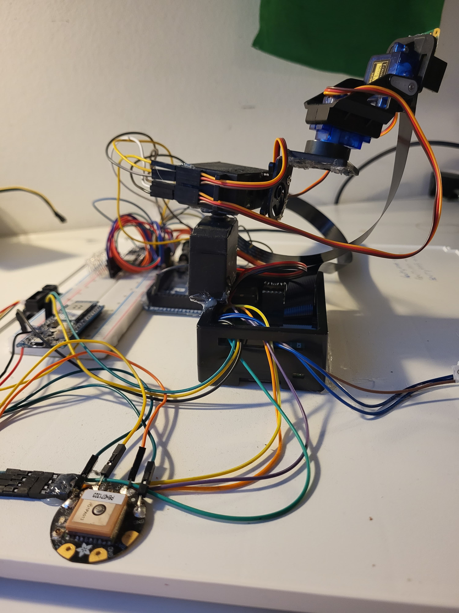
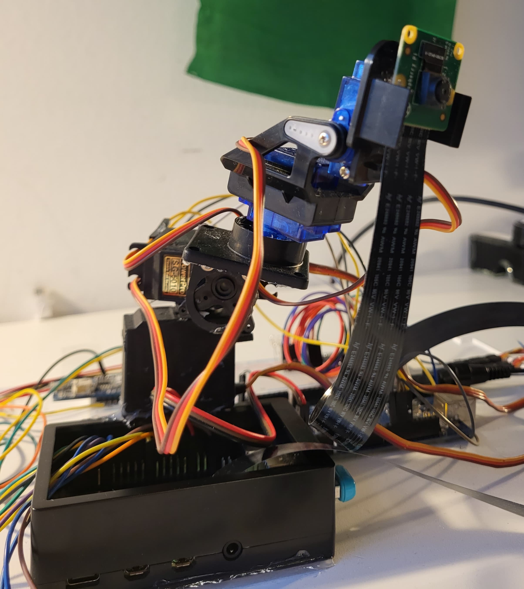
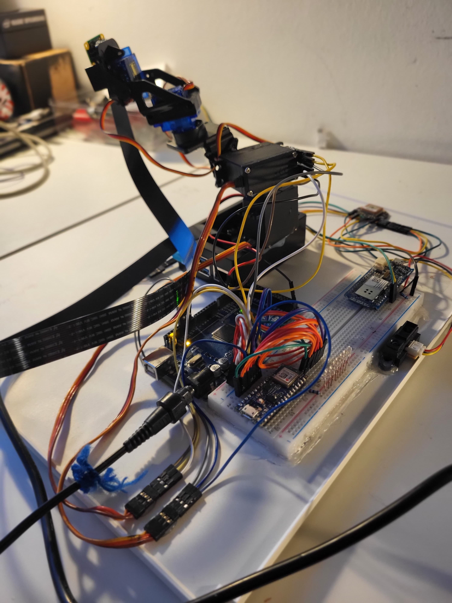
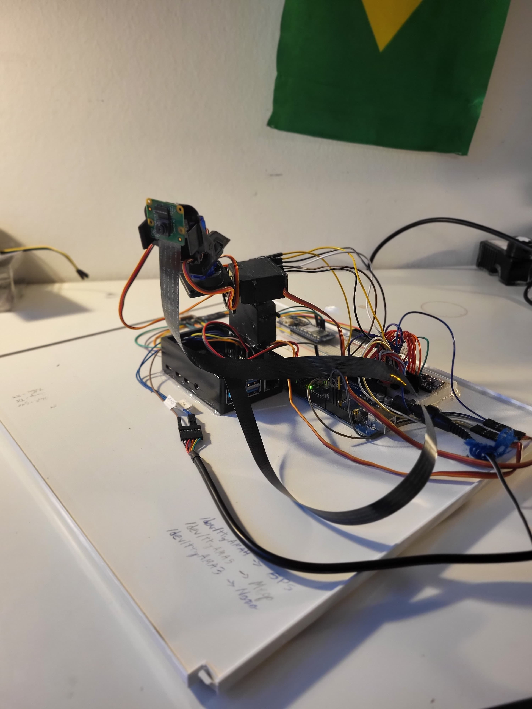
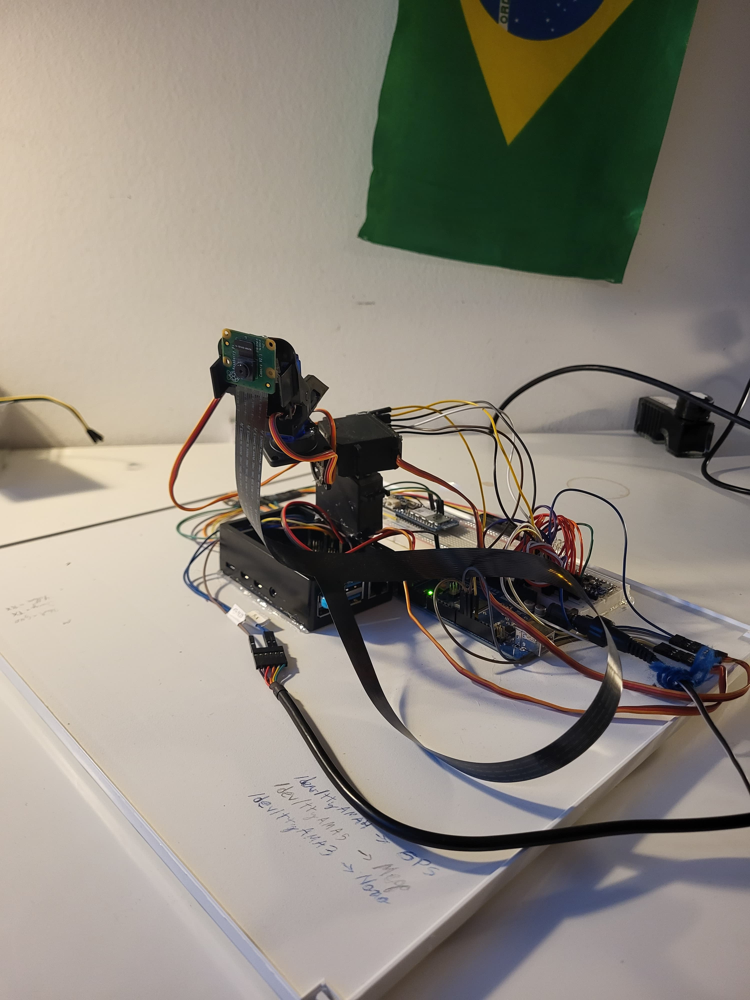
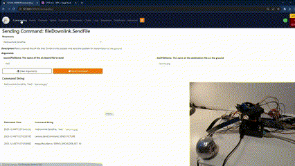

# MESMO 
## Modular Embedded Systems Management and Orchestration project

In the ever-evolving landscape of aerospace engineering and mission-critical operations, the MESMO (Modular Embedded Systems framework for Mission Operations) project stands as a robust and adaptable solution designed to address the complexities of orchestrating a multitude of subsystems. In the pursuit of streamlined communication, MESMO leverages the \textit{F’} (pronounced \textit{f prime}) software framework, a modular and scalable framework tailored for the harsh demands of space missions.

The Objective of this project is to study in depth the \textit{F'} framework and assess whether it could be used for real time embedded systems orchestration and management for ground applications. To do so, the MESMO project combines a diverse array of hardware components collaborates coherently, creating an integrated ecosystem. Arduino-based microcontrollers, GPS modules, imaging systems, and other specialized devices work in unison, forming a network orchestrated by a Raspberry Pi 4. This central processing unit serves as the nucleus, communicating with each subsystem through a combination of UART, I2C, and TCP protocols.

To comprehensively assess the MESMO project's performance and communication efficiency, a meticulously crafted testbench has been implemented. This testbench analysis various scenarios and subsystem configurations, particularly focusing on the time elapsed from message reception to command execution. 

[Functional Video](https://www.youtube.com/watch?v=4ISu5jYeB7Q&ab_channel=JoaquimSilveira)

<!--[if IE]><meta http-equiv="X-UA-Compatible" content="IE=5,IE=9" ><![endif]-->
<!DOCTYPE html>
<html>
<head>
<title>topology-RaspberryPiV2</title>
<meta charset="utf-8"/>
</head>
<body><div class="mxgraph" style="max-width:100%;border:1px solid transparent;" data-mxgraph="{&quot;highlight&quot;:&quot;#0000ff&quot;,&quot;nav&quot;:true,&quot;resize&quot;:true,&quot;toolbar&quot;:&quot;zoom tags lightbox&quot;,&quot;edit&quot;:&quot;_blank&quot;,&quot;xml&quot;:&quot;&lt;mxfile host=\&quot;Electron\&quot; modified=\&quot;2024-01-03T06:28:09.953Z\&quot; agent=\&quot;Mozilla/5.0 (Windows NT 10.0; Win64; x64) AppleWebKit/537.36 (KHTML, like Gecko) draw.io/22.1.16 Chrome/120.0.6099.109 Electron/28.1.0 Safari/537.36\&quot; etag=\&quot;8G1WdytMqifNedvf1Coa\&quot; version=\&quot;22.1.16\&quot; type=\&quot;device\&quot;&gt;\n  &lt;diagram name=\&quot;RaspberryPiV2\&quot; id=\&quot;FpVekzyZEMitet3_k8I4\&quot;&gt;\n    &lt;mxGraphModel dx=\&quot;5610\&quot; dy=\&quot;4727\&quot; grid=\&quot;1\&quot; gridSize=\&quot;10\&quot; guides=\&quot;1\&quot; tooltips=\&quot;1\&quot; connect=\&quot;1\&quot; arrows=\&quot;1\&quot; fold=\&quot;1\&quot; page=\&quot;1\&quot; pageScale=\&quot;1\&quot; pageWidth=\&quot;827\&quot; pageHeight=\&quot;1169\&quot; math=\&quot;0\&quot; shadow=\&quot;0\&quot;&gt;\n      &lt;root&gt;\n        &lt;mxCell id=\&quot;lXMkgM0szanX77xfMsIB-0\&quot; /&gt;\n        &lt;mxCell id=\&quot;lXMkgM0szanX77xfMsIB-1\&quot; parent=\&quot;lXMkgM0szanX77xfMsIB-0\&quot; /&gt;\n        &lt;mxCell id=\&quot;lXMkgM0szanX77xfMsIB-2\&quot; value=\&quot;\&quot; style=\&quot;rounded=0;whiteSpace=wrap;html=1;strokeWidth=9;dashed=1;fillColor=none;\&quot; parent=\&quot;lXMkgM0szanX77xfMsIB-1\&quot; vertex=\&quot;1\&quot;&gt;\n          &lt;mxGeometry x=\&quot;-620\&quot; y=\&quot;-2210\&quot; width=\&quot;2180\&quot; height=\&quot;1440\&quot; as=\&quot;geometry\&quot; /&gt;\n        &lt;/mxCell&gt;\n        &lt;mxCell id=\&quot;lXMkgM0szanX77xfMsIB-3\&quot; value=\&quot;\&quot; style=\&quot;group;strokeWidth=3;\&quot; parent=\&quot;lXMkgM0szanX77xfMsIB-1\&quot; vertex=\&quot;1\&quot; connectable=\&quot;0\&quot;&gt;\n          &lt;mxGeometry x=\&quot;710\&quot; y=\&quot;-760\&quot; width=\&quot;430\&quot; height=\&quot;430\&quot; as=\&quot;geometry\&quot; /&gt;\n        &lt;/mxCell&gt;\n        &lt;mxCell id=\&quot;lXMkgM0szanX77xfMsIB-4\&quot; value=\&quot;&amp;lt;font size=&amp;quot;3&amp;quot;&amp;gt;&amp;lt;b&amp;gt;cmdSeq&amp;lt;/b&amp;gt;&amp;lt;br&amp;gt;&amp;lt;br&amp;gt;Svc.CmdSequencer&amp;lt;br&amp;gt;&amp;lt;br&amp;gt;active&amp;lt;br&amp;gt;&amp;lt;/font&amp;gt;\&quot; style=\&quot;rounded=1;whiteSpace=wrap;html=1;fontSize=8;strokeColor=#3399FF;strokeWidth=3;\&quot; parent=\&quot;lXMkgM0szanX77xfMsIB-3\&quot; vertex=\&quot;1\&quot;&gt;\n          &lt;mxGeometry x=\&quot;50\&quot; width=\&quot;260\&quot; height=\&quot;430\&quot; as=\&quot;geometry\&quot; /&gt;\n        &lt;/mxCell&gt;\n        &lt;mxCell id=\&quot;lXMkgM0szanX77xfMsIB-5\&quot; value=\&quot;cmdIn\&quot; style=\&quot;rounded=1;whiteSpace=wrap;html=1;strokeColor=#000000;fontSize=12;strokeWidth=3;\&quot; parent=\&quot;lXMkgM0szanX77xfMsIB-3\&quot; vertex=\&quot;1\&quot;&gt;\n          &lt;mxGeometry y=\&quot;20\&quot; width=\&quot;80\&quot; height=\&quot;40\&quot; as=\&quot;geometry\&quot; /&gt;\n        &lt;/mxCell&gt;\n        &lt;mxCell id=\&quot;lXMkgM0szanX77xfMsIB-6\&quot; value=\&quot;cmdRegOut\&quot; style=\&quot;rounded=1;whiteSpace=wrap;html=1;strokeColor=#000000;fontSize=12;strokeWidth=3;\&quot; parent=\&quot;lXMkgM0szanX77xfMsIB-3\&quot; vertex=\&quot;1\&quot;&gt;\n          &lt;mxGeometry y=\&quot;70\&quot; width=\&quot;80\&quot; height=\&quot;40\&quot; as=\&quot;geometry\&quot; /&gt;\n        &lt;/mxCell&gt;\n        &lt;mxCell id=\&quot;lXMkgM0szanX77xfMsIB-7\&quot; value=\&quot;&amp;lt;b&amp;gt;seqCancelIn&amp;lt;/b&amp;gt;:&amp;amp;nbsp; Svc.CmdSeqCancel\&quot; style=\&quot;rounded=1;whiteSpace=wrap;html=1;strokeColor=#000000;fontSize=12;strokeWidth=3;\&quot; parent=\&quot;lXMkgM0szanX77xfMsIB-3\&quot; vertex=\&quot;1\&quot;&gt;\n          &lt;mxGeometry x=\&quot;275\&quot; y=\&quot;20\&quot; width=\&quot;155\&quot; height=\&quot;40\&quot; as=\&quot;geometry\&quot; /&gt;\n        &lt;/mxCell&gt;\n        &lt;mxCell id=\&quot;lXMkgM0szanX77xfMsIB-8\&quot; value=\&quot;&amp;lt;b&amp;gt;cmdResponsein: &amp;lt;/b&amp;gt;Fw.CmdResponse\&quot; style=\&quot;rounded=1;whiteSpace=wrap;html=1;strokeColor=#000000;fontSize=12;strokeWidth=3;\&quot; parent=\&quot;lXMkgM0szanX77xfMsIB-3\&quot; vertex=\&quot;1\&quot;&gt;\n          &lt;mxGeometry x=\&quot;275\&quot; y=\&quot;70\&quot; width=\&quot;155\&quot; height=\&quot;40\&quot; as=\&quot;geometry\&quot; /&gt;\n        &lt;/mxCell&gt;\n        &lt;mxCell id=\&quot;lXMkgM0szanX77xfMsIB-9\&quot; value=\&quot;logOut\&quot; style=\&quot;rounded=1;whiteSpace=wrap;html=1;strokeColor=#000000;fontSize=12;strokeWidth=3;\&quot; parent=\&quot;lXMkgM0szanX77xfMsIB-3\&quot; vertex=\&quot;1\&quot;&gt;\n          &lt;mxGeometry y=\&quot;170\&quot; width=\&quot;80\&quot; height=\&quot;40\&quot; as=\&quot;geometry\&quot; /&gt;\n        &lt;/mxCell&gt;\n        &lt;mxCell id=\&quot;lXMkgM0szanX77xfMsIB-10\&quot; value=\&quot;cmdResponseOut\&quot; style=\&quot;rounded=1;whiteSpace=wrap;html=1;strokeColor=#000000;fontSize=12;strokeWidth=3;\&quot; parent=\&quot;lXMkgM0szanX77xfMsIB-3\&quot; vertex=\&quot;1\&quot;&gt;\n          &lt;mxGeometry y=\&quot;120\&quot; width=\&quot;80\&quot; height=\&quot;40\&quot; as=\&quot;geometry\&quot; /&gt;\n        &lt;/mxCell&gt;\n        &lt;mxCell id=\&quot;lXMkgM0szanX77xfMsIB-11\&quot; value=\&quot;&amp;lt;b&amp;gt;seqDone:&amp;amp;nbsp;&amp;lt;br&amp;gt;&amp;lt;/b&amp;gt;Fw.CmdResponse\&quot; style=\&quot;rounded=1;whiteSpace=wrap;html=1;strokeColor=#000000;fontSize=12;strokeWidth=3;\&quot; parent=\&quot;lXMkgM0szanX77xfMsIB-3\&quot; vertex=\&quot;1\&quot;&gt;\n          &lt;mxGeometry x=\&quot;275\&quot; y=\&quot;120\&quot; width=\&quot;155\&quot; height=\&quot;40\&quot; as=\&quot;geometry\&quot; /&gt;\n        &lt;/mxCell&gt;\n        &lt;mxCell id=\&quot;lXMkgM0szanX77xfMsIB-12\&quot; value=\&quot;&amp;lt;b&amp;gt;seqRunIn: &amp;lt;/b&amp;gt;Fw.CmdSeqIn\&quot; style=\&quot;rounded=1;whiteSpace=wrap;html=1;strokeColor=#000000;fontSize=12;strokeWidth=3;\&quot; parent=\&quot;lXMkgM0szanX77xfMsIB-3\&quot; vertex=\&quot;1\&quot;&gt;\n          &lt;mxGeometry x=\&quot;275\&quot; y=\&quot;170\&quot; width=\&quot;155\&quot; height=\&quot;40\&quot; as=\&quot;geometry\&quot; /&gt;\n        &lt;/mxCell&gt;\n        &lt;mxCell id=\&quot;lXMkgM0szanX77xfMsIB-13\&quot; value=\&quot;&amp;lt;b&amp;gt;comCmdOut: &amp;lt;/b&amp;gt;Fw.Com\&quot; style=\&quot;rounded=1;whiteSpace=wrap;html=1;strokeColor=#000000;fontSize=12;strokeWidth=3;\&quot; parent=\&quot;lXMkgM0szanX77xfMsIB-3\&quot; vertex=\&quot;1\&quot;&gt;\n          &lt;mxGeometry x=\&quot;275\&quot; y=\&quot;220\&quot; width=\&quot;155\&quot; height=\&quot;40\&quot; as=\&quot;geometry\&quot; /&gt;\n        &lt;/mxCell&gt;\n        &lt;mxCell id=\&quot;lXMkgM0szanX77xfMsIB-14\&quot; value=\&quot;&amp;lt;b&amp;gt;pingIn: &amp;lt;/b&amp;gt;Svc.Ping\&quot; style=\&quot;rounded=1;whiteSpace=wrap;html=1;strokeColor=#000000;fontSize=12;strokeWidth=3;\&quot; parent=\&quot;lXMkgM0szanX77xfMsIB-3\&quot; vertex=\&quot;1\&quot;&gt;\n          &lt;mxGeometry x=\&quot;275\&quot; y=\&quot;320\&quot; width=\&quot;155\&quot; height=\&quot;40\&quot; as=\&quot;geometry\&quot; /&gt;\n        &lt;/mxCell&gt;\n        &lt;mxCell id=\&quot;lXMkgM0szanX77xfMsIB-15\&quot; value=\&quot;&amp;lt;b&amp;gt;pingOut: &amp;lt;/b&amp;gt;Svc.Ping\&quot; style=\&quot;rounded=1;whiteSpace=wrap;html=1;strokeColor=#000000;fontSize=12;strokeWidth=3;\&quot; parent=\&quot;lXMkgM0szanX77xfMsIB-3\&quot; vertex=\&quot;1\&quot;&gt;\n          &lt;mxGeometry x=\&quot;275\&quot; y=\&quot;370\&quot; width=\&quot;155\&quot; height=\&quot;40\&quot; as=\&quot;geometry\&quot; /&gt;\n        &lt;/mxCell&gt;\n        &lt;mxCell id=\&quot;lXMkgM0szanX77xfMsIB-16\&quot; value=\&quot;LogText\&quot; style=\&quot;rounded=1;whiteSpace=wrap;html=1;strokeColor=#000000;fontSize=12;strokeWidth=3;\&quot; parent=\&quot;lXMkgM0szanX77xfMsIB-3\&quot; vertex=\&quot;1\&quot;&gt;\n          &lt;mxGeometry y=\&quot;270\&quot; width=\&quot;80\&quot; height=\&quot;40\&quot; as=\&quot;geometry\&quot; /&gt;\n        &lt;/mxCell&gt;\n        &lt;mxCell id=\&quot;lXMkgM0szanX77xfMsIB-17\&quot; value=\&quot;tlmOut\&quot; style=\&quot;rounded=1;whiteSpace=wrap;html=1;strokeColor=#000000;fontSize=12;strokeWidth=3;\&quot; parent=\&quot;lXMkgM0szanX77xfMsIB-3\&quot; vertex=\&quot;1\&quot;&gt;\n          &lt;mxGeometry y=\&quot;220\&quot; width=\&quot;80\&quot; height=\&quot;40\&quot; as=\&quot;geometry\&quot; /&gt;\n        &lt;/mxCell&gt;\n        &lt;mxCell id=\&quot;lXMkgM0szanX77xfMsIB-18\&quot; value=\&quot;timeCaller\&quot; style=\&quot;rounded=1;whiteSpace=wrap;html=1;strokeColor=#000000;fontSize=12;strokeWidth=3;\&quot; parent=\&quot;lXMkgM0szanX77xfMsIB-3\&quot; vertex=\&quot;1\&quot;&gt;\n          &lt;mxGeometry y=\&quot;320\&quot; width=\&quot;80\&quot; height=\&quot;40\&quot; as=\&quot;geometry\&quot; /&gt;\n        &lt;/mxCell&gt;\n        &lt;mxCell id=\&quot;lXMkgM0szanX77xfMsIB-19\&quot; value=\&quot;&amp;lt;b&amp;gt;schedIn: &amp;lt;/b&amp;gt;Svc.Sched\&quot; style=\&quot;rounded=1;whiteSpace=wrap;html=1;strokeColor=#000000;fontSize=12;strokeWidth=3;\&quot; parent=\&quot;lXMkgM0szanX77xfMsIB-3\&quot; vertex=\&quot;1\&quot;&gt;\n          &lt;mxGeometry x=\&quot;275\&quot; y=\&quot;270\&quot; width=\&quot;155\&quot; height=\&quot;40\&quot; as=\&quot;geometry\&quot; /&gt;\n        &lt;/mxCell&gt;\n        &lt;mxCell id=\&quot;lXMkgM0szanX77xfMsIB-20\&quot; value=\&quot;\&quot; style=\&quot;group;strokeWidth=3;\&quot; parent=\&quot;lXMkgM0szanX77xfMsIB-1\&quot; vertex=\&quot;1\&quot; connectable=\&quot;0\&quot;&gt;\n          &lt;mxGeometry x=\&quot;-530\&quot; y=\&quot;320\&quot; width=\&quot;420\&quot; height=\&quot;330\&quot; as=\&quot;geometry\&quot; /&gt;\n        &lt;/mxCell&gt;\n        &lt;mxCell id=\&quot;lXMkgM0szanX77xfMsIB-21\&quot; value=\&quot;&amp;lt;font size=&amp;quot;3&amp;quot;&amp;gt;&amp;lt;b&amp;gt;fileManager&amp;lt;/b&amp;gt;&amp;lt;br&amp;gt;&amp;lt;br&amp;gt;Svc.FileManager&amp;lt;br&amp;gt;&amp;lt;br&amp;gt;active&amp;lt;br&amp;gt;&amp;lt;/font&amp;gt;\&quot; style=\&quot;rounded=1;whiteSpace=wrap;html=1;fontSize=8;strokeColor=#3399FF;strokeWidth=3;\&quot; parent=\&quot;lXMkgM0szanX77xfMsIB-20\&quot; vertex=\&quot;1\&quot;&gt;\n          &lt;mxGeometry x=\&quot;50\&quot; width=\&quot;260\&quot; height=\&quot;330\&quot; as=\&quot;geometry\&quot; /&gt;\n        &lt;/mxCell&gt;\n        &lt;mxCell id=\&quot;lXMkgM0szanX77xfMsIB-22\&quot; value=\&quot;timeCaller\&quot; style=\&quot;rounded=1;whiteSpace=wrap;html=1;strokeColor=#000000;fontSize=12;strokeWidth=3;\&quot; parent=\&quot;lXMkgM0szanX77xfMsIB-20\&quot; vertex=\&quot;1\&quot;&gt;\n          &lt;mxGeometry y=\&quot;20\&quot; width=\&quot;80\&quot; height=\&quot;40\&quot; as=\&quot;geometry\&quot; /&gt;\n        &lt;/mxCell&gt;\n        &lt;mxCell id=\&quot;lXMkgM0szanX77xfMsIB-23\&quot; value=\&quot;cmdRegOut\&quot; style=\&quot;rounded=1;whiteSpace=wrap;html=1;strokeColor=#000000;fontSize=12;strokeWidth=3;\&quot; parent=\&quot;lXMkgM0szanX77xfMsIB-20\&quot; vertex=\&quot;1\&quot;&gt;\n          &lt;mxGeometry y=\&quot;70\&quot; width=\&quot;80\&quot; height=\&quot;40\&quot; as=\&quot;geometry\&quot; /&gt;\n        &lt;/mxCell&gt;\n        &lt;mxCell id=\&quot;lXMkgM0szanX77xfMsIB-24\&quot; value=\&quot;cmdIn\&quot; style=\&quot;rounded=1;whiteSpace=wrap;html=1;strokeColor=#000000;fontSize=12;strokeWidth=3;\&quot; parent=\&quot;lXMkgM0szanX77xfMsIB-20\&quot; vertex=\&quot;1\&quot;&gt;\n          &lt;mxGeometry y=\&quot;120\&quot; width=\&quot;80\&quot; height=\&quot;40\&quot; as=\&quot;geometry\&quot; /&gt;\n        &lt;/mxCell&gt;\n        &lt;mxCell id=\&quot;lXMkgM0szanX77xfMsIB-25\&quot; value=\&quot;cmdResponseOut\&quot; style=\&quot;rounded=1;whiteSpace=wrap;html=1;strokeColor=#000000;fontSize=12;strokeWidth=3;\&quot; parent=\&quot;lXMkgM0szanX77xfMsIB-20\&quot; vertex=\&quot;1\&quot;&gt;\n          &lt;mxGeometry y=\&quot;170\&quot; width=\&quot;80\&quot; height=\&quot;40\&quot; as=\&quot;geometry\&quot; /&gt;\n        &lt;/mxCell&gt;\n        &lt;mxCell id=\&quot;lXMkgM0szanX77xfMsIB-26\&quot; value=\&quot;&amp;lt;b&amp;gt;PingIn: &amp;lt;br&amp;gt;&amp;lt;/b&amp;gt;Svc.Ping\&quot; style=\&quot;rounded=1;whiteSpace=wrap;html=1;strokeColor=#000000;fontSize=12;strokeWidth=3;\&quot; parent=\&quot;lXMkgM0szanX77xfMsIB-20\&quot; vertex=\&quot;1\&quot;&gt;\n          &lt;mxGeometry x=\&quot;265\&quot; y=\&quot;30\&quot; width=\&quot;155\&quot; height=\&quot;40\&quot; as=\&quot;geometry\&quot; /&gt;\n        &lt;/mxCell&gt;\n        &lt;mxCell id=\&quot;lXMkgM0szanX77xfMsIB-27\&quot; value=\&quot;&amp;lt;b&amp;gt;PingOut: &amp;lt;br&amp;gt;&amp;lt;/b&amp;gt;Svc.Ping\&quot; style=\&quot;rounded=1;whiteSpace=wrap;html=1;strokeColor=#000000;fontSize=12;strokeWidth=3;\&quot; parent=\&quot;lXMkgM0szanX77xfMsIB-20\&quot; vertex=\&quot;1\&quot;&gt;\n          &lt;mxGeometry x=\&quot;265\&quot; y=\&quot;80\&quot; width=\&quot;155\&quot; height=\&quot;40\&quot; as=\&quot;geometry\&quot; /&gt;\n        &lt;/mxCell&gt;\n        &lt;mxCell id=\&quot;lXMkgM0szanX77xfMsIB-28\&quot; value=\&quot;eventOut\&quot; style=\&quot;rounded=1;whiteSpace=wrap;html=1;strokeColor=#000000;fontSize=12;strokeWidth=3;\&quot; parent=\&quot;lXMkgM0szanX77xfMsIB-20\&quot; vertex=\&quot;1\&quot;&gt;\n          &lt;mxGeometry y=\&quot;220\&quot; width=\&quot;80\&quot; height=\&quot;40\&quot; as=\&quot;geometry\&quot; /&gt;\n        &lt;/mxCell&gt;\n        &lt;mxCell id=\&quot;lXMkgM0szanX77xfMsIB-29\&quot; value=\&quot;tlmOut\&quot; style=\&quot;rounded=1;whiteSpace=wrap;html=1;strokeColor=#000000;fontSize=12;strokeWidth=3;\&quot; parent=\&quot;lXMkgM0szanX77xfMsIB-20\&quot; vertex=\&quot;1\&quot;&gt;\n          &lt;mxGeometry y=\&quot;270\&quot; width=\&quot;80\&quot; height=\&quot;40\&quot; as=\&quot;geometry\&quot; /&gt;\n        &lt;/mxCell&gt;\n        &lt;mxCell id=\&quot;lXMkgM0szanX77xfMsIB-30\&quot; value=\&quot;\&quot; style=\&quot;group;strokeWidth=3;\&quot; parent=\&quot;lXMkgM0szanX77xfMsIB-1\&quot; vertex=\&quot;1\&quot; connectable=\&quot;0\&quot;&gt;\n          &lt;mxGeometry x=\&quot;-470\&quot; y=\&quot;-700\&quot; width=\&quot;233\&quot; height=\&quot;580\&quot; as=\&quot;geometry\&quot; /&gt;\n        &lt;/mxCell&gt;\n        &lt;mxCell id=\&quot;lXMkgM0szanX77xfMsIB-31\&quot; value=\&quot;\&quot; style=\&quot;rounded=0;whiteSpace=wrap;html=1;strokeColor=#000000;fontSize=12;strokeWidth=3;\&quot; parent=\&quot;lXMkgM0szanX77xfMsIB-30\&quot; vertex=\&quot;1\&quot;&gt;\n          &lt;mxGeometry x=\&quot;20\&quot; width=\&quot;213\&quot; height=\&quot;580\&quot; as=\&quot;geometry\&quot; /&gt;\n        &lt;/mxCell&gt;\n        &lt;mxCell id=\&quot;lXMkgM0szanX77xfMsIB-32\&quot; value=\&quot;Special ports\&quot; style=\&quot;rounded=1;whiteSpace=wrap;html=1;strokeWidth=3;\&quot; parent=\&quot;lXMkgM0szanX77xfMsIB-30\&quot; vertex=\&quot;1\&quot;&gt;\n          &lt;mxGeometry x=\&quot;90.87\&quot; y=\&quot;5\&quot; width=\&quot;74.55999999999999\&quot; height=\&quot;40\&quot; as=\&quot;geometry\&quot; /&gt;\n        &lt;/mxCell&gt;\n        &lt;mxCell id=\&quot;lXMkgM0szanX77xfMsIB-33\&quot; value=\&quot;General ports\&quot; style=\&quot;rounded=1;whiteSpace=wrap;html=1;strokeWidth=3;\&quot; parent=\&quot;lXMkgM0szanX77xfMsIB-30\&quot; vertex=\&quot;1\&quot;&gt;\n          &lt;mxGeometry x=\&quot;55.92\&quot; y=\&quot;55\&quot; width=\&quot;144.46\&quot; height=\&quot;40\&quot; as=\&quot;geometry\&quot; /&gt;\n        &lt;/mxCell&gt;\n        &lt;mxCell id=\&quot;lXMkgM0szanX77xfMsIB-34\&quot; value=\&quot;&amp;lt;font size=&amp;quot;3&amp;quot;&amp;gt;&amp;lt;b&amp;gt;fprime std component&amp;lt;/b&amp;gt;&amp;lt;br&amp;gt;&amp;lt;/font&amp;gt;\&quot; style=\&quot;rounded=1;whiteSpace=wrap;html=1;fontSize=8;strokeColor=#3399FF;strokeWidth=3;\&quot; parent=\&quot;lXMkgM0szanX77xfMsIB-30\&quot; vertex=\&quot;1\&quot;&gt;\n          &lt;mxGeometry x=\&quot;58.24999999999999\&quot; y=\&quot;105\&quot; width=\&quot;139.8\&quot; height=\&quot;130\&quot; as=\&quot;geometry\&quot; /&gt;\n        &lt;/mxCell&gt;\n        &lt;mxCell id=\&quot;lXMkgM0szanX77xfMsIB-35\&quot; value=\&quot;&amp;lt;font size=&amp;quot;3&amp;quot;&amp;gt;&amp;lt;b&amp;gt;fprime custom component&amp;lt;/b&amp;gt;&amp;lt;br&amp;gt;&amp;lt;/font&amp;gt;\&quot; style=\&quot;rounded=1;whiteSpace=wrap;html=1;fontSize=8;strokeColor=#6c8ebf;strokeWidth=3;fillColor=#dae8fc;\&quot; parent=\&quot;lXMkgM0szanX77xfMsIB-30\&quot; vertex=\&quot;1\&quot;&gt;\n          &lt;mxGeometry x=\&quot;60.58\&quot; y=\&quot;255\&quot; width=\&quot;139.8\&quot; height=\&quot;130\&quot; as=\&quot;geometry\&quot; /&gt;\n        &lt;/mxCell&gt;\n        &lt;mxCell id=\&quot;lXMkgM0szanX77xfMsIB-36\&quot; value=\&quot;&amp;lt;font size=&amp;quot;3&amp;quot;&amp;gt;&amp;lt;b&amp;gt;hardware or driver component&amp;lt;/b&amp;gt;&amp;lt;br&amp;gt;&amp;lt;/font&amp;gt;\&quot; style=\&quot;rounded=1;whiteSpace=wrap;html=1;fontSize=8;strokeColor=#b85450;strokeWidth=3;fillColor=#f8cecc;\&quot; parent=\&quot;lXMkgM0szanX77xfMsIB-30\&quot; vertex=\&quot;1\&quot;&gt;\n          &lt;mxGeometry x=\&quot;60.58\&quot; y=\&quot;410\&quot; width=\&quot;139.8\&quot; height=\&quot;130\&quot; as=\&quot;geometry\&quot; /&gt;\n        &lt;/mxCell&gt;\n        &lt;mxCell id=\&quot;lXMkgM0szanX77xfMsIB-37\&quot; value=\&quot;\&quot; style=\&quot;group;strokeWidth=3;\&quot; parent=\&quot;lXMkgM0szanX77xfMsIB-1\&quot; vertex=\&quot;1\&quot; connectable=\&quot;0\&quot;&gt;\n          &lt;mxGeometry x=\&quot;-560\&quot; y=\&quot;1220\&quot; width=\&quot;420\&quot; height=\&quot;380\&quot; as=\&quot;geometry\&quot; /&gt;\n        &lt;/mxCell&gt;\n        &lt;mxCell id=\&quot;lXMkgM0szanX77xfMsIB-38\&quot; value=\&quot;\&quot; style=\&quot;group;strokeWidth=3;\&quot; parent=\&quot;lXMkgM0szanX77xfMsIB-37\&quot; vertex=\&quot;1\&quot; connectable=\&quot;0\&quot;&gt;\n          &lt;mxGeometry width=\&quot;420\&quot; height=\&quot;380\&quot; as=\&quot;geometry\&quot; /&gt;\n        &lt;/mxCell&gt;\n        &lt;mxCell id=\&quot;lXMkgM0szanX77xfMsIB-39\&quot; value=\&quot;&amp;lt;font size=&amp;quot;3&amp;quot;&amp;gt;&amp;lt;b&amp;gt;health&amp;lt;/b&amp;gt;&amp;lt;br&amp;gt;&amp;lt;br&amp;gt;Svc.Health&amp;lt;br&amp;gt;&amp;lt;br&amp;gt;queued&amp;lt;br&amp;gt;&amp;lt;/font&amp;gt;\&quot; style=\&quot;rounded=1;whiteSpace=wrap;html=1;fontSize=8;strokeColor=#3399FF;strokeWidth=3;\&quot; parent=\&quot;lXMkgM0szanX77xfMsIB-38\&quot; vertex=\&quot;1\&quot;&gt;\n          &lt;mxGeometry x=\&quot;50\&quot; width=\&quot;260\&quot; height=\&quot;380\&quot; as=\&quot;geometry\&quot; /&gt;\n        &lt;/mxCell&gt;\n        &lt;mxCell id=\&quot;lXMkgM0szanX77xfMsIB-40\&quot; value=\&quot;CmdDisp\&quot; style=\&quot;rounded=1;whiteSpace=wrap;html=1;strokeColor=#000000;fontSize=12;strokeWidth=3;\&quot; parent=\&quot;lXMkgM0szanX77xfMsIB-38\&quot; vertex=\&quot;1\&quot;&gt;\n          &lt;mxGeometry y=\&quot;20\&quot; width=\&quot;80\&quot; height=\&quot;40\&quot; as=\&quot;geometry\&quot; /&gt;\n        &lt;/mxCell&gt;\n        &lt;mxCell id=\&quot;lXMkgM0szanX77xfMsIB-41\&quot; value=\&quot;&amp;lt;b&amp;gt;PingSend: &amp;lt;br&amp;gt;&amp;lt;/b&amp;gt;Svc.Ping\&quot; style=\&quot;rounded=1;whiteSpace=wrap;html=1;strokeColor=#000000;fontSize=12;strokeWidth=3;\&quot; parent=\&quot;lXMkgM0szanX77xfMsIB-38\&quot; vertex=\&quot;1\&quot;&gt;\n          &lt;mxGeometry x=\&quot;265\&quot; y=\&quot;30\&quot; width=\&quot;155\&quot; height=\&quot;40\&quot; as=\&quot;geometry\&quot; /&gt;\n        &lt;/mxCell&gt;\n        &lt;mxCell id=\&quot;lXMkgM0szanX77xfMsIB-42\&quot; value=\&quot;&amp;lt;b&amp;gt;PingReturn: &amp;lt;br&amp;gt;&amp;lt;/b&amp;gt;Svc.Ping\&quot; style=\&quot;rounded=1;whiteSpace=wrap;html=1;strokeColor=#000000;fontSize=12;strokeWidth=3;\&quot; parent=\&quot;lXMkgM0szanX77xfMsIB-38\&quot; vertex=\&quot;1\&quot;&gt;\n          &lt;mxGeometry x=\&quot;265\&quot; y=\&quot;80\&quot; width=\&quot;155\&quot; height=\&quot;40\&quot; as=\&quot;geometry\&quot; /&gt;\n        &lt;/mxCell&gt;\n        &lt;mxCell id=\&quot;lXMkgM0szanX77xfMsIB-43\&quot; value=\&quot;CmdStatus\&quot; style=\&quot;rounded=1;whiteSpace=wrap;html=1;strokeColor=#000000;fontSize=12;strokeWidth=3;\&quot; parent=\&quot;lXMkgM0szanX77xfMsIB-38\&quot; vertex=\&quot;1\&quot;&gt;\n          &lt;mxGeometry y=\&quot;120\&quot; width=\&quot;80\&quot; height=\&quot;40\&quot; as=\&quot;geometry\&quot; /&gt;\n        &lt;/mxCell&gt;\n        &lt;mxCell id=\&quot;lXMkgM0szanX77xfMsIB-44\&quot; value=\&quot;CmdReg\&quot; style=\&quot;rounded=1;whiteSpace=wrap;html=1;strokeColor=#000000;fontSize=12;strokeWidth=3;\&quot; parent=\&quot;lXMkgM0szanX77xfMsIB-38\&quot; vertex=\&quot;1\&quot;&gt;\n          &lt;mxGeometry y=\&quot;70\&quot; width=\&quot;80\&quot; height=\&quot;40\&quot; as=\&quot;geometry\&quot; /&gt;\n        &lt;/mxCell&gt;\n        &lt;mxCell id=\&quot;lXMkgM0szanX77xfMsIB-45\&quot; value=\&quot;&amp;lt;b&amp;gt;Run: &amp;lt;br&amp;gt;&amp;lt;/b&amp;gt;Svc.Sched\&quot; style=\&quot;rounded=1;whiteSpace=wrap;html=1;strokeColor=#000000;fontSize=12;strokeWidth=3;\&quot; parent=\&quot;lXMkgM0szanX77xfMsIB-38\&quot; vertex=\&quot;1\&quot;&gt;\n          &lt;mxGeometry x=\&quot;265\&quot; y=\&quot;130\&quot; width=\&quot;155\&quot; height=\&quot;40\&quot; as=\&quot;geometry\&quot; /&gt;\n        &lt;/mxCell&gt;\n        &lt;mxCell id=\&quot;lXMkgM0szanX77xfMsIB-46\&quot; value=\&quot;Log\&quot; style=\&quot;rounded=1;whiteSpace=wrap;html=1;strokeColor=#000000;fontSize=12;strokeWidth=3;\&quot; parent=\&quot;lXMkgM0szanX77xfMsIB-38\&quot; vertex=\&quot;1\&quot;&gt;\n          &lt;mxGeometry y=\&quot;170\&quot; width=\&quot;80\&quot; height=\&quot;40\&quot; as=\&quot;geometry\&quot; /&gt;\n        &lt;/mxCell&gt;\n        &lt;mxCell id=\&quot;lXMkgM0szanX77xfMsIB-47\&quot; value=\&quot;&amp;lt;b&amp;gt;WdogStroke: &amp;lt;/b&amp;gt;Svc.WatchDog\&quot; style=\&quot;rounded=1;whiteSpace=wrap;html=1;strokeColor=#000000;fontSize=12;strokeWidth=3;\&quot; parent=\&quot;lXMkgM0szanX77xfMsIB-38\&quot; vertex=\&quot;1\&quot;&gt;\n          &lt;mxGeometry x=\&quot;265\&quot; y=\&quot;180\&quot; width=\&quot;155\&quot; height=\&quot;40\&quot; as=\&quot;geometry\&quot; /&gt;\n        &lt;/mxCell&gt;\n        &lt;mxCell id=\&quot;lXMkgM0szanX77xfMsIB-48\&quot; value=\&quot;LogText\&quot; style=\&quot;rounded=1;whiteSpace=wrap;html=1;strokeColor=#000000;fontSize=12;strokeWidth=3;\&quot; parent=\&quot;lXMkgM0szanX77xfMsIB-38\&quot; vertex=\&quot;1\&quot;&gt;\n          &lt;mxGeometry y=\&quot;220\&quot; width=\&quot;80\&quot; height=\&quot;40\&quot; as=\&quot;geometry\&quot; /&gt;\n        &lt;/mxCell&gt;\n        &lt;mxCell id=\&quot;lXMkgM0szanX77xfMsIB-49\&quot; value=\&quot;Time\&quot; style=\&quot;rounded=1;whiteSpace=wrap;html=1;strokeColor=#000000;fontSize=12;strokeWidth=3;\&quot; parent=\&quot;lXMkgM0szanX77xfMsIB-38\&quot; vertex=\&quot;1\&quot;&gt;\n          &lt;mxGeometry y=\&quot;270\&quot; width=\&quot;80\&quot; height=\&quot;40\&quot; as=\&quot;geometry\&quot; /&gt;\n        &lt;/mxCell&gt;\n        &lt;mxCell id=\&quot;lXMkgM0szanX77xfMsIB-50\&quot; value=\&quot;Tlm\&quot; style=\&quot;rounded=1;whiteSpace=wrap;html=1;strokeColor=#000000;fontSize=12;strokeWidth=3;\&quot; parent=\&quot;lXMkgM0szanX77xfMsIB-37\&quot; vertex=\&quot;1\&quot;&gt;\n          &lt;mxGeometry y=\&quot;320\&quot; width=\&quot;80\&quot; height=\&quot;40\&quot; as=\&quot;geometry\&quot; /&gt;\n        &lt;/mxCell&gt;\n        &lt;mxCell id=\&quot;lXMkgM0szanX77xfMsIB-51\&quot; value=\&quot;\&quot; style=\&quot;group;strokeWidth=3;\&quot; parent=\&quot;lXMkgM0szanX77xfMsIB-1\&quot; vertex=\&quot;1\&quot; connectable=\&quot;0\&quot;&gt;\n          &lt;mxGeometry x=\&quot;-505\&quot; y=\&quot;850\&quot; width=\&quot;430\&quot; height=\&quot;230\&quot; as=\&quot;geometry\&quot; /&gt;\n        &lt;/mxCell&gt;\n        &lt;mxCell id=\&quot;lXMkgM0szanX77xfMsIB-52\&quot; value=\&quot;&amp;lt;font size=&amp;quot;3&amp;quot;&amp;gt;&amp;lt;b&amp;gt;linuxTime&amp;lt;/b&amp;gt;&amp;lt;br&amp;gt;&amp;lt;br&amp;gt;Svc.Time&amp;lt;br&amp;gt;&amp;lt;br&amp;gt;passive&amp;lt;br&amp;gt;&amp;lt;/font&amp;gt;\&quot; style=\&quot;rounded=1;whiteSpace=wrap;html=1;fontSize=8;strokeColor=#3399FF;strokeWidth=3;\&quot; parent=\&quot;lXMkgM0szanX77xfMsIB-51\&quot; vertex=\&quot;1\&quot;&gt;\n          &lt;mxGeometry x=\&quot;30\&quot; y=\&quot;40\&quot; width=\&quot;260\&quot; height=\&quot;130\&quot; as=\&quot;geometry\&quot; /&gt;\n        &lt;/mxCell&gt;\n        &lt;mxCell id=\&quot;lXMkgM0szanX77xfMsIB-53\&quot; value=\&quot;&amp;lt;b&amp;gt;timeGetPort: &amp;lt;br&amp;gt;&amp;lt;/b&amp;gt;Fw.Time\&quot; style=\&quot;rounded=1;whiteSpace=wrap;html=1;strokeColor=#000000;fontSize=12;strokeWidth=3;\&quot; parent=\&quot;lXMkgM0szanX77xfMsIB-51\&quot; vertex=\&quot;1\&quot;&gt;\n          &lt;mxGeometry x=\&quot;245\&quot; y=\&quot;70\&quot; width=\&quot;155\&quot; height=\&quot;40\&quot; as=\&quot;geometry\&quot; /&gt;\n        &lt;/mxCell&gt;\n        &lt;mxCell id=\&quot;lXMkgM0szanX77xfMsIB-54\&quot; value=\&quot;\&quot; style=\&quot;group;strokeWidth=3;\&quot; parent=\&quot;lXMkgM0szanX77xfMsIB-1\&quot; vertex=\&quot;1\&quot; connectable=\&quot;0\&quot;&gt;\n          &lt;mxGeometry x=\&quot;840\&quot; y=\&quot;1400\&quot; width=\&quot;420\&quot; height=\&quot;380\&quot; as=\&quot;geometry\&quot; /&gt;\n        &lt;/mxCell&gt;\n        &lt;mxCell id=\&quot;lXMkgM0szanX77xfMsIB-55\&quot; value=\&quot;\&quot; style=\&quot;group;strokeWidth=3;\&quot; parent=\&quot;lXMkgM0szanX77xfMsIB-54\&quot; vertex=\&quot;1\&quot; connectable=\&quot;0\&quot;&gt;\n          &lt;mxGeometry width=\&quot;420\&quot; height=\&quot;380\&quot; as=\&quot;geometry\&quot; /&gt;\n        &lt;/mxCell&gt;\n        &lt;mxCell id=\&quot;lXMkgM0szanX77xfMsIB-56\&quot; value=\&quot;&amp;lt;font size=&amp;quot;3&amp;quot;&amp;gt;&amp;lt;b&amp;gt;systemResources&amp;lt;/b&amp;gt;&amp;lt;br&amp;gt;&amp;lt;br&amp;gt;Svc.SystemResources&amp;lt;br&amp;gt;&amp;lt;br&amp;gt;passive&amp;lt;br&amp;gt;&amp;lt;/font&amp;gt;\&quot; style=\&quot;rounded=1;whiteSpace=wrap;html=1;fontSize=8;strokeColor=#3399FF;strokeWidth=3;\&quot; parent=\&quot;lXMkgM0szanX77xfMsIB-55\&quot; vertex=\&quot;1\&quot;&gt;\n          &lt;mxGeometry x=\&quot;50\&quot; width=\&quot;260\&quot; height=\&quot;380\&quot; as=\&quot;geometry\&quot; /&gt;\n        &lt;/mxCell&gt;\n        &lt;mxCell id=\&quot;lXMkgM0szanX77xfMsIB-57\&quot; value=\&quot;CmdDisp\&quot; style=\&quot;rounded=1;whiteSpace=wrap;html=1;strokeColor=#000000;fontSize=12;strokeWidth=3;\&quot; parent=\&quot;lXMkgM0szanX77xfMsIB-55\&quot; vertex=\&quot;1\&quot;&gt;\n          &lt;mxGeometry y=\&quot;20\&quot; width=\&quot;80\&quot; height=\&quot;40\&quot; as=\&quot;geometry\&quot; /&gt;\n        &lt;/mxCell&gt;\n        &lt;mxCell id=\&quot;lXMkgM0szanX77xfMsIB-58\&quot; value=\&quot;&amp;lt;b&amp;gt;run: &amp;lt;br&amp;gt;&amp;lt;/b&amp;gt;Svc.Sched\&quot; style=\&quot;rounded=1;whiteSpace=wrap;html=1;strokeColor=#000000;fontSize=12;strokeWidth=3;\&quot; parent=\&quot;lXMkgM0szanX77xfMsIB-55\&quot; vertex=\&quot;1\&quot;&gt;\n          &lt;mxGeometry x=\&quot;265\&quot; y=\&quot;30\&quot; width=\&quot;155\&quot; height=\&quot;40\&quot; as=\&quot;geometry\&quot; /&gt;\n        &lt;/mxCell&gt;\n        &lt;mxCell id=\&quot;lXMkgM0szanX77xfMsIB-59\&quot; value=\&quot;CmdStatus\&quot; style=\&quot;rounded=1;whiteSpace=wrap;html=1;strokeColor=#000000;fontSize=12;strokeWidth=3;\&quot; parent=\&quot;lXMkgM0szanX77xfMsIB-55\&quot; vertex=\&quot;1\&quot;&gt;\n          &lt;mxGeometry y=\&quot;120\&quot; width=\&quot;80\&quot; height=\&quot;40\&quot; as=\&quot;geometry\&quot; /&gt;\n        &lt;/mxCell&gt;\n        &lt;mxCell id=\&quot;lXMkgM0szanX77xfMsIB-60\&quot; value=\&quot;CmdReg\&quot; style=\&quot;rounded=1;whiteSpace=wrap;html=1;strokeColor=#000000;fontSize=12;strokeWidth=3;\&quot; parent=\&quot;lXMkgM0szanX77xfMsIB-55\&quot; vertex=\&quot;1\&quot;&gt;\n          &lt;mxGeometry y=\&quot;70\&quot; width=\&quot;80\&quot; height=\&quot;40\&quot; as=\&quot;geometry\&quot; /&gt;\n        &lt;/mxCell&gt;\n        &lt;mxCell id=\&quot;lXMkgM0szanX77xfMsIB-61\&quot; value=\&quot;Log\&quot; style=\&quot;rounded=1;whiteSpace=wrap;html=1;strokeColor=#000000;fontSize=12;strokeWidth=3;\&quot; parent=\&quot;lXMkgM0szanX77xfMsIB-55\&quot; vertex=\&quot;1\&quot;&gt;\n          &lt;mxGeometry y=\&quot;170\&quot; width=\&quot;80\&quot; height=\&quot;40\&quot; as=\&quot;geometry\&quot; /&gt;\n        &lt;/mxCell&gt;\n        &lt;mxCell id=\&quot;lXMkgM0szanX77xfMsIB-62\&quot; value=\&quot;LogText\&quot; style=\&quot;rounded=1;whiteSpace=wrap;html=1;strokeColor=#000000;fontSize=12;strokeWidth=3;\&quot; parent=\&quot;lXMkgM0szanX77xfMsIB-55\&quot; vertex=\&quot;1\&quot;&gt;\n          &lt;mxGeometry y=\&quot;220\&quot; width=\&quot;80\&quot; height=\&quot;40\&quot; as=\&quot;geometry\&quot; /&gt;\n        &lt;/mxCell&gt;\n        &lt;mxCell id=\&quot;lXMkgM0szanX77xfMsIB-63\&quot; value=\&quot;Time\&quot; style=\&quot;rounded=1;whiteSpace=wrap;html=1;strokeColor=#000000;fontSize=12;strokeWidth=3;\&quot; parent=\&quot;lXMkgM0szanX77xfMsIB-55\&quot; vertex=\&quot;1\&quot;&gt;\n          &lt;mxGeometry y=\&quot;270\&quot; width=\&quot;80\&quot; height=\&quot;40\&quot; as=\&quot;geometry\&quot; /&gt;\n        &lt;/mxCell&gt;\n        &lt;mxCell id=\&quot;lXMkgM0szanX77xfMsIB-64\&quot; value=\&quot;Tlm\&quot; style=\&quot;rounded=1;whiteSpace=wrap;html=1;strokeColor=#000000;fontSize=12;strokeWidth=3;\&quot; parent=\&quot;lXMkgM0szanX77xfMsIB-54\&quot; vertex=\&quot;1\&quot;&gt;\n          &lt;mxGeometry y=\&quot;320\&quot; width=\&quot;80\&quot; height=\&quot;40\&quot; as=\&quot;geometry\&quot; /&gt;\n        &lt;/mxCell&gt;\n        &lt;mxCell id=\&quot;lXMkgM0szanX77xfMsIB-65\&quot; value=\&quot;\&quot; style=\&quot;group;strokeWidth=3;\&quot; parent=\&quot;lXMkgM0szanX77xfMsIB-1\&quot; vertex=\&quot;1\&quot; connectable=\&quot;0\&quot;&gt;\n          &lt;mxGeometry x=\&quot;-480\&quot; y=\&quot;1070\&quot; width=\&quot;370\&quot; height=\&quot;130\&quot; as=\&quot;geometry\&quot; /&gt;\n        &lt;/mxCell&gt;\n        &lt;mxCell id=\&quot;lXMkgM0szanX77xfMsIB-66\&quot; value=\&quot;&amp;lt;font size=&amp;quot;3&amp;quot;&amp;gt;&amp;lt;b&amp;gt;textLogger&amp;lt;/b&amp;gt;&amp;lt;br&amp;gt;&amp;lt;br&amp;gt;Svc.PassiveTextLogger&amp;lt;br&amp;gt;&amp;lt;br&amp;gt;passive&amp;lt;br&amp;gt;&amp;lt;/font&amp;gt;\&quot; style=\&quot;rounded=1;whiteSpace=wrap;html=1;fontSize=8;strokeColor=#3399FF;strokeWidth=3;\&quot; parent=\&quot;lXMkgM0szanX77xfMsIB-65\&quot; vertex=\&quot;1\&quot;&gt;\n          &lt;mxGeometry width=\&quot;260\&quot; height=\&quot;130\&quot; as=\&quot;geometry\&quot; /&gt;\n        &lt;/mxCell&gt;\n        &lt;mxCell id=\&quot;lXMkgM0szanX77xfMsIB-67\&quot; value=\&quot;&amp;lt;b&amp;gt;TextLogger:&amp;lt;br&amp;gt;&amp;lt;/b&amp;gt;Svc.LogText\&quot; style=\&quot;rounded=1;whiteSpace=wrap;html=1;strokeColor=#000000;fontSize=12;strokeWidth=3;\&quot; parent=\&quot;lXMkgM0szanX77xfMsIB-65\&quot; vertex=\&quot;1\&quot;&gt;\n          &lt;mxGeometry x=\&quot;215\&quot; y=\&quot;30\&quot; width=\&quot;155\&quot; height=\&quot;40\&quot; as=\&quot;geometry\&quot; /&gt;\n        &lt;/mxCell&gt;\n        &lt;mxCell id=\&quot;lXMkgM0szanX77xfMsIB-68\&quot; value=\&quot;\&quot; style=\&quot;edgeStyle=elbowEdgeStyle;elbow=horizontal;endArrow=classic;html=1;curved=0;rounded=0;endSize=8;startSize=8;exitX=1;exitY=0.5;exitDx=0;exitDy=0;entryX=1;entryY=0.5;entryDx=0;entryDy=0;strokeWidth=3;jumpStyle=arc;\&quot; parent=\&quot;lXMkgM0szanX77xfMsIB-1\&quot; source=\&quot;lXMkgM0szanX77xfMsIB-143\&quot; target=\&quot;lXMkgM0szanX77xfMsIB-133\&quot; edge=\&quot;1\&quot;&gt;\n          &lt;mxGeometry width=\&quot;50\&quot; height=\&quot;50\&quot; relative=\&quot;1\&quot; as=\&quot;geometry\&quot;&gt;\n            &lt;mxPoint x=\&quot;550\&quot; y=\&quot;-250\&quot; as=\&quot;sourcePoint\&quot; /&gt;\n            &lt;mxPoint x=\&quot;600\&quot; y=\&quot;-300\&quot; as=\&quot;targetPoint\&quot; /&gt;\n            &lt;Array as=\&quot;points\&quot;&gt;\n              &lt;mxPoint x=\&quot;550\&quot; y=\&quot;-140\&quot; /&gt;\n            &lt;/Array&gt;\n          &lt;/mxGeometry&gt;\n        &lt;/mxCell&gt;\n        &lt;mxCell id=\&quot;lXMkgM0szanX77xfMsIB-69\&quot; value=\&quot;\&quot; style=\&quot;edgeStyle=elbowEdgeStyle;elbow=horizontal;endArrow=classic;html=1;curved=0;rounded=0;endSize=8;startSize=8;exitX=1;exitY=0.5;exitDx=0;exitDy=0;entryX=1;entryY=0.5;entryDx=0;entryDy=0;strokeWidth=3;jumpStyle=arc;\&quot; parent=\&quot;lXMkgM0szanX77xfMsIB-1\&quot; source=\&quot;lXMkgM0szanX77xfMsIB-134\&quot; target=\&quot;lXMkgM0szanX77xfMsIB-153\&quot; edge=\&quot;1\&quot;&gt;\n          &lt;mxGeometry width=\&quot;50\&quot; height=\&quot;50\&quot; relative=\&quot;1\&quot; as=\&quot;geometry\&quot;&gt;\n            &lt;mxPoint x=\&quot;580\&quot; y=\&quot;40\&quot; as=\&quot;sourcePoint\&quot; /&gt;\n            &lt;mxPoint x=\&quot;570\&quot; y=\&quot;320\&quot; as=\&quot;targetPoint\&quot; /&gt;\n            &lt;Array as=\&quot;points\&quot;&gt;\n              &lt;mxPoint x=\&quot;620\&quot; y=\&quot;130\&quot; /&gt;\n            &lt;/Array&gt;\n          &lt;/mxGeometry&gt;\n        &lt;/mxCell&gt;\n        &lt;mxCell id=\&quot;lXMkgM0szanX77xfMsIB-70\&quot; value=\&quot;\&quot; style=\&quot;edgeStyle=elbowEdgeStyle;elbow=horizontal;endArrow=classic;html=1;curved=0;rounded=0;endSize=8;startSize=8;exitX=1;exitY=0.5;exitDx=0;exitDy=0;entryX=1;entryY=0.5;entryDx=0;entryDy=0;strokeWidth=3;jumpStyle=arc;\&quot; parent=\&quot;lXMkgM0szanX77xfMsIB-1\&quot; source=\&quot;lXMkgM0szanX77xfMsIB-134\&quot; target=\&quot;lXMkgM0szanX77xfMsIB-163\&quot; edge=\&quot;1\&quot;&gt;\n          &lt;mxGeometry width=\&quot;50\&quot; height=\&quot;50\&quot; relative=\&quot;1\&quot; as=\&quot;geometry\&quot;&gt;\n            &lt;mxPoint x=\&quot;520\&quot; y=\&quot;60\&quot; as=\&quot;sourcePoint\&quot; /&gt;\n            &lt;mxPoint x=\&quot;550\&quot; y=\&quot;210\&quot; as=\&quot;targetPoint\&quot; /&gt;\n            &lt;Array as=\&quot;points\&quot;&gt;\n              &lt;mxPoint x=\&quot;620\&quot; y=\&quot;190\&quot; /&gt;\n            &lt;/Array&gt;\n          &lt;/mxGeometry&gt;\n        &lt;/mxCell&gt;\n        &lt;mxCell id=\&quot;lXMkgM0szanX77xfMsIB-71\&quot; value=\&quot;\&quot; style=\&quot;edgeStyle=elbowEdgeStyle;elbow=horizontal;endArrow=classic;html=1;curved=0;rounded=0;endSize=8;startSize=8;exitX=1;exitY=0.5;exitDx=0;exitDy=0;entryX=1;entryY=0.5;entryDx=0;entryDy=0;strokeWidth=3;jumpStyle=arc;\&quot; parent=\&quot;lXMkgM0szanX77xfMsIB-1\&quot; source=\&quot;lXMkgM0szanX77xfMsIB-134\&quot; target=\&quot;lXMkgM0szanX77xfMsIB-127\&quot; edge=\&quot;1\&quot;&gt;\n          &lt;mxGeometry width=\&quot;50\&quot; height=\&quot;50\&quot; relative=\&quot;1\&quot; as=\&quot;geometry\&quot;&gt;\n            &lt;mxPoint x=\&quot;530\&quot; y=\&quot;70\&quot; as=\&quot;sourcePoint\&quot; /&gt;\n            &lt;mxPoint x=\&quot;560\&quot; y=\&quot;580\&quot; as=\&quot;targetPoint\&quot; /&gt;\n            &lt;Array as=\&quot;points\&quot;&gt;\n              &lt;mxPoint x=\&quot;620\&quot; y=\&quot;400\&quot; /&gt;\n            &lt;/Array&gt;\n          &lt;/mxGeometry&gt;\n        &lt;/mxCell&gt;\n        &lt;mxCell id=\&quot;lXMkgM0szanX77xfMsIB-72\&quot; value=\&quot;\&quot; style=\&quot;edgeStyle=elbowEdgeStyle;elbow=horizontal;endArrow=classic;html=1;curved=0;rounded=0;endSize=8;startSize=8;exitX=1;exitY=0.5;exitDx=0;exitDy=0;entryX=1;entryY=0.25;entryDx=0;entryDy=0;strokeWidth=3;jumpStyle=arc;\&quot; parent=\&quot;lXMkgM0szanX77xfMsIB-1\&quot; source=\&quot;lXMkgM0szanX77xfMsIB-13\&quot; target=\&quot;lXMkgM0szanX77xfMsIB-101\&quot; edge=\&quot;1\&quot;&gt;\n          &lt;mxGeometry width=\&quot;50\&quot; height=\&quot;50\&quot; relative=\&quot;1\&quot; as=\&quot;geometry\&quot;&gt;\n            &lt;mxPoint x=\&quot;1800\&quot; y=\&quot;-320\&quot; as=\&quot;sourcePoint\&quot; /&gt;\n            &lt;mxPoint x=\&quot;1850\&quot; y=\&quot;-370\&quot; as=\&quot;targetPoint\&quot; /&gt;\n            &lt;Array as=\&quot;points\&quot;&gt;\n              &lt;mxPoint x=\&quot;1280\&quot; y=\&quot;-280\&quot; /&gt;\n            &lt;/Array&gt;\n          &lt;/mxGeometry&gt;\n        &lt;/mxCell&gt;\n        &lt;mxCell id=\&quot;lXMkgM0szanX77xfMsIB-73\&quot; value=\&quot;\&quot; style=\&quot;edgeStyle=elbowEdgeStyle;elbow=horizontal;endArrow=classic;html=1;curved=0;rounded=0;endSize=8;startSize=8;exitX=1;exitY=0.25;exitDx=0;exitDy=0;entryX=1;entryY=0.5;entryDx=0;entryDy=0;strokeWidth=3;jumpStyle=arc;strokeColor=#000000;\&quot; parent=\&quot;lXMkgM0szanX77xfMsIB-1\&quot; source=\&quot;lXMkgM0szanX77xfMsIB-100\&quot; target=\&quot;lXMkgM0szanX77xfMsIB-8\&quot; edge=\&quot;1\&quot;&gt;\n          &lt;mxGeometry width=\&quot;50\&quot; height=\&quot;50\&quot; relative=\&quot;1\&quot; as=\&quot;geometry\&quot;&gt;\n            &lt;mxPoint x=\&quot;1880\&quot; y=\&quot;-540\&quot; as=\&quot;sourcePoint\&quot; /&gt;\n            &lt;mxPoint x=\&quot;1880\&quot; y=\&quot;-80\&quot; as=\&quot;targetPoint\&quot; /&gt;\n            &lt;Array as=\&quot;points\&quot;&gt;\n              &lt;mxPoint x=\&quot;1300\&quot; y=\&quot;-390\&quot; /&gt;\n            &lt;/Array&gt;\n          &lt;/mxGeometry&gt;\n        &lt;/mxCell&gt;\n        &lt;mxCell id=\&quot;lXMkgM0szanX77xfMsIB-74\&quot; value=\&quot;\&quot; style=\&quot;group;strokeWidth=3;\&quot; parent=\&quot;lXMkgM0szanX77xfMsIB-1\&quot; vertex=\&quot;1\&quot; connectable=\&quot;0\&quot;&gt;\n          &lt;mxGeometry x=\&quot;-530\&quot; y=\&quot;680\&quot; width=\&quot;310\&quot; height=\&quot;180\&quot; as=\&quot;geometry\&quot; /&gt;\n        &lt;/mxCell&gt;\n        &lt;mxCell id=\&quot;lXMkgM0szanX77xfMsIB-75\&quot; value=\&quot;&amp;lt;font size=&amp;quot;3&amp;quot;&amp;gt;&amp;lt;b&amp;gt;fatalAdapter&amp;lt;/b&amp;gt;&amp;lt;br&amp;gt;&amp;lt;br&amp;gt;Svc.AssertFatalAdapter&amp;lt;br&amp;gt;&amp;lt;br&amp;gt;passive&amp;lt;br&amp;gt;&amp;lt;/font&amp;gt;\&quot; style=\&quot;rounded=1;whiteSpace=wrap;html=1;fontSize=8;strokeColor=#3399FF;strokeWidth=3;\&quot; parent=\&quot;lXMkgM0szanX77xfMsIB-74\&quot; vertex=\&quot;1\&quot;&gt;\n          &lt;mxGeometry x=\&quot;50\&quot; width=\&quot;260\&quot; height=\&quot;180\&quot; as=\&quot;geometry\&quot; /&gt;\n        &lt;/mxCell&gt;\n        &lt;mxCell id=\&quot;lXMkgM0szanX77xfMsIB-76\&quot; value=\&quot;Log\&quot; style=\&quot;rounded=1;whiteSpace=wrap;html=1;strokeColor=#000000;fontSize=12;strokeWidth=3;\&quot; parent=\&quot;lXMkgM0szanX77xfMsIB-74\&quot; vertex=\&quot;1\&quot;&gt;\n          &lt;mxGeometry y=\&quot;20\&quot; width=\&quot;80\&quot; height=\&quot;40\&quot; as=\&quot;geometry\&quot; /&gt;\n        &lt;/mxCell&gt;\n        &lt;mxCell id=\&quot;lXMkgM0szanX77xfMsIB-77\&quot; value=\&quot;Time\&quot; style=\&quot;rounded=1;whiteSpace=wrap;html=1;strokeColor=#000000;fontSize=12;strokeWidth=3;\&quot; parent=\&quot;lXMkgM0szanX77xfMsIB-74\&quot; vertex=\&quot;1\&quot;&gt;\n          &lt;mxGeometry y=\&quot;120\&quot; width=\&quot;80\&quot; height=\&quot;40\&quot; as=\&quot;geometry\&quot; /&gt;\n        &lt;/mxCell&gt;\n        &lt;mxCell id=\&quot;lXMkgM0szanX77xfMsIB-78\&quot; value=\&quot;LogText\&quot; style=\&quot;rounded=1;whiteSpace=wrap;html=1;strokeColor=#000000;fontSize=12;strokeWidth=3;\&quot; parent=\&quot;lXMkgM0szanX77xfMsIB-74\&quot; vertex=\&quot;1\&quot;&gt;\n          &lt;mxGeometry y=\&quot;70\&quot; width=\&quot;80\&quot; height=\&quot;40\&quot; as=\&quot;geometry\&quot; /&gt;\n        &lt;/mxCell&gt;\n        &lt;mxCell id=\&quot;lXMkgM0szanX77xfMsIB-79\&quot; value=\&quot;\&quot; style=\&quot;group;strokeWidth=3;\&quot; parent=\&quot;lXMkgM0szanX77xfMsIB-1\&quot; vertex=\&quot;1\&quot; connectable=\&quot;0\&quot;&gt;\n          &lt;mxGeometry x=\&quot;-530\&quot; y=\&quot;-60\&quot; width=\&quot;420\&quot; height=\&quot;330\&quot; as=\&quot;geometry\&quot; /&gt;\n        &lt;/mxCell&gt;\n        &lt;mxCell id=\&quot;lXMkgM0szanX77xfMsIB-80\&quot; value=\&quot;&amp;lt;font size=&amp;quot;3&amp;quot;&amp;gt;&amp;lt;b&amp;gt;prmDb&amp;lt;/b&amp;gt;&amp;lt;br&amp;gt;&amp;lt;br&amp;gt;Svc.PrmDb&amp;lt;br&amp;gt;&amp;lt;br&amp;gt;active&amp;lt;br&amp;gt;&amp;lt;/font&amp;gt;\&quot; style=\&quot;rounded=1;whiteSpace=wrap;html=1;fontSize=8;strokeColor=#3399FF;strokeWidth=3;\&quot; parent=\&quot;lXMkgM0szanX77xfMsIB-79\&quot; vertex=\&quot;1\&quot;&gt;\n          &lt;mxGeometry x=\&quot;50\&quot; width=\&quot;260\&quot; height=\&quot;330\&quot; as=\&quot;geometry\&quot; /&gt;\n        &lt;/mxCell&gt;\n        &lt;mxCell id=\&quot;lXMkgM0szanX77xfMsIB-81\&quot; value=\&quot;CmdDisp\&quot; style=\&quot;rounded=1;whiteSpace=wrap;html=1;strokeColor=#000000;fontSize=12;strokeWidth=3;\&quot; parent=\&quot;lXMkgM0szanX77xfMsIB-79\&quot; vertex=\&quot;1\&quot;&gt;\n          &lt;mxGeometry y=\&quot;20\&quot; width=\&quot;80\&quot; height=\&quot;40\&quot; as=\&quot;geometry\&quot; /&gt;\n        &lt;/mxCell&gt;\n        &lt;mxCell id=\&quot;lXMkgM0szanX77xfMsIB-82\&quot; value=\&quot;&amp;lt;b&amp;gt;getPrm: &amp;lt;br&amp;gt;&amp;lt;/b&amp;gt;Fw.PrmGet\&quot; style=\&quot;rounded=1;whiteSpace=wrap;html=1;strokeColor=#000000;fontSize=12;strokeWidth=3;\&quot; parent=\&quot;lXMkgM0szanX77xfMsIB-79\&quot; vertex=\&quot;1\&quot;&gt;\n          &lt;mxGeometry x=\&quot;265\&quot; y=\&quot;30\&quot; width=\&quot;155\&quot; height=\&quot;40\&quot; as=\&quot;geometry\&quot; /&gt;\n        &lt;/mxCell&gt;\n        &lt;mxCell id=\&quot;lXMkgM0szanX77xfMsIB-83\&quot; value=\&quot;&amp;lt;b&amp;gt;setPrm: &amp;lt;br&amp;gt;&amp;lt;/b&amp;gt;Fw.PrmSet\&quot; style=\&quot;rounded=1;whiteSpace=wrap;html=1;strokeColor=#000000;fontSize=12;strokeWidth=3;\&quot; parent=\&quot;lXMkgM0szanX77xfMsIB-79\&quot; vertex=\&quot;1\&quot;&gt;\n          &lt;mxGeometry x=\&quot;265\&quot; y=\&quot;80\&quot; width=\&quot;155\&quot; height=\&quot;40\&quot; as=\&quot;geometry\&quot; /&gt;\n        &lt;/mxCell&gt;\n        &lt;mxCell id=\&quot;lXMkgM0szanX77xfMsIB-84\&quot; value=\&quot;CmdStatus\&quot; style=\&quot;rounded=1;whiteSpace=wrap;html=1;strokeColor=#000000;fontSize=12;strokeWidth=3;\&quot; parent=\&quot;lXMkgM0szanX77xfMsIB-79\&quot; vertex=\&quot;1\&quot;&gt;\n          &lt;mxGeometry y=\&quot;120\&quot; width=\&quot;80\&quot; height=\&quot;40\&quot; as=\&quot;geometry\&quot; /&gt;\n        &lt;/mxCell&gt;\n        &lt;mxCell id=\&quot;lXMkgM0szanX77xfMsIB-85\&quot; value=\&quot;CmdReg\&quot; style=\&quot;rounded=1;whiteSpace=wrap;html=1;strokeColor=#000000;fontSize=12;strokeWidth=3;\&quot; parent=\&quot;lXMkgM0szanX77xfMsIB-79\&quot; vertex=\&quot;1\&quot;&gt;\n          &lt;mxGeometry y=\&quot;70\&quot; width=\&quot;80\&quot; height=\&quot;40\&quot; as=\&quot;geometry\&quot; /&gt;\n        &lt;/mxCell&gt;\n        &lt;mxCell id=\&quot;lXMkgM0szanX77xfMsIB-86\&quot; value=\&quot;&amp;lt;b&amp;gt;PingOut: &amp;lt;br&amp;gt;&amp;lt;/b&amp;gt;Svc.Ping\&quot; style=\&quot;rounded=1;whiteSpace=wrap;html=1;strokeColor=#000000;fontSize=12;strokeWidth=3;\&quot; parent=\&quot;lXMkgM0szanX77xfMsIB-79\&quot; vertex=\&quot;1\&quot;&gt;\n          &lt;mxGeometry x=\&quot;265\&quot; y=\&quot;130\&quot; width=\&quot;155\&quot; height=\&quot;40\&quot; as=\&quot;geometry\&quot; /&gt;\n        &lt;/mxCell&gt;\n        &lt;mxCell id=\&quot;lXMkgM0szanX77xfMsIB-87\&quot; value=\&quot;Log\&quot; style=\&quot;rounded=1;whiteSpace=wrap;html=1;strokeColor=#000000;fontSize=12;strokeWidth=3;\&quot; parent=\&quot;lXMkgM0szanX77xfMsIB-79\&quot; vertex=\&quot;1\&quot;&gt;\n          &lt;mxGeometry y=\&quot;170\&quot; width=\&quot;80\&quot; height=\&quot;40\&quot; as=\&quot;geometry\&quot; /&gt;\n        &lt;/mxCell&gt;\n        &lt;mxCell id=\&quot;lXMkgM0szanX77xfMsIB-88\&quot; value=\&quot;&amp;lt;b&amp;gt;PingIn: &amp;lt;br&amp;gt;&amp;lt;/b&amp;gt;Svc.Ping\&quot; style=\&quot;rounded=1;whiteSpace=wrap;html=1;strokeColor=#000000;fontSize=12;strokeWidth=3;\&quot; parent=\&quot;lXMkgM0szanX77xfMsIB-79\&quot; vertex=\&quot;1\&quot;&gt;\n          &lt;mxGeometry x=\&quot;265\&quot; y=\&quot;180\&quot; width=\&quot;155\&quot; height=\&quot;40\&quot; as=\&quot;geometry\&quot; /&gt;\n        &lt;/mxCell&gt;\n        &lt;mxCell id=\&quot;lXMkgM0szanX77xfMsIB-89\&quot; value=\&quot;LogText\&quot; style=\&quot;rounded=1;whiteSpace=wrap;html=1;strokeColor=#000000;fontSize=12;strokeWidth=3;\&quot; parent=\&quot;lXMkgM0szanX77xfMsIB-79\&quot; vertex=\&quot;1\&quot;&gt;\n          &lt;mxGeometry y=\&quot;220\&quot; width=\&quot;80\&quot; height=\&quot;40\&quot; as=\&quot;geometry\&quot; /&gt;\n        &lt;/mxCell&gt;\n        &lt;mxCell id=\&quot;lXMkgM0szanX77xfMsIB-90\&quot; value=\&quot;Time\&quot; style=\&quot;rounded=1;whiteSpace=wrap;html=1;strokeColor=#000000;fontSize=12;strokeWidth=3;\&quot; parent=\&quot;lXMkgM0szanX77xfMsIB-79\&quot; vertex=\&quot;1\&quot;&gt;\n          &lt;mxGeometry y=\&quot;270\&quot; width=\&quot;80\&quot; height=\&quot;40\&quot; as=\&quot;geometry\&quot; /&gt;\n        &lt;/mxCell&gt;\n        &lt;mxCell id=\&quot;lXMkgM0szanX77xfMsIB-91\&quot; value=\&quot;\&quot; style=\&quot;group;strokeWidth=3;\&quot; parent=\&quot;lXMkgM0szanX77xfMsIB-1\&quot; vertex=\&quot;1\&quot; connectable=\&quot;0\&quot;&gt;\n          &lt;mxGeometry x=\&quot;710\&quot; y=\&quot;-300\&quot; width=\&quot;430\&quot; height=\&quot;400\&quot; as=\&quot;geometry\&quot; /&gt;\n        &lt;/mxCell&gt;\n        &lt;mxCell id=\&quot;lXMkgM0szanX77xfMsIB-92\&quot; value=\&quot;&amp;lt;font size=&amp;quot;3&amp;quot;&amp;gt;&amp;lt;b&amp;gt;cmdDisp&amp;lt;/b&amp;gt;&amp;lt;br&amp;gt;&amp;lt;br&amp;gt;Svc.CommandDispatcher&amp;lt;br&amp;gt;&amp;lt;br&amp;gt;active&amp;lt;br&amp;gt;&amp;lt;/font&amp;gt;\&quot; style=\&quot;rounded=1;whiteSpace=wrap;html=1;fontSize=8;strokeColor=#3399FF;strokeWidth=3;\&quot; parent=\&quot;lXMkgM0szanX77xfMsIB-91\&quot; vertex=\&quot;1\&quot;&gt;\n          &lt;mxGeometry x=\&quot;50\&quot; width=\&quot;260\&quot; height=\&quot;400\&quot; as=\&quot;geometry\&quot; /&gt;\n        &lt;/mxCell&gt;\n        &lt;mxCell id=\&quot;lXMkgM0szanX77xfMsIB-93\&quot; value=\&quot;CmdDisp\&quot; style=\&quot;rounded=1;whiteSpace=wrap;html=1;strokeColor=#000000;fontSize=12;strokeWidth=3;\&quot; parent=\&quot;lXMkgM0szanX77xfMsIB-91\&quot; vertex=\&quot;1\&quot;&gt;\n          &lt;mxGeometry y=\&quot;20\&quot; width=\&quot;80\&quot; height=\&quot;40\&quot; as=\&quot;geometry\&quot; /&gt;\n        &lt;/mxCell&gt;\n        &lt;mxCell id=\&quot;lXMkgM0szanX77xfMsIB-94\&quot; value=\&quot;CmdReg\&quot; style=\&quot;rounded=1;whiteSpace=wrap;html=1;strokeColor=#000000;fontSize=12;strokeWidth=3;\&quot; parent=\&quot;lXMkgM0szanX77xfMsIB-91\&quot; vertex=\&quot;1\&quot;&gt;\n          &lt;mxGeometry y=\&quot;70\&quot; width=\&quot;80\&quot; height=\&quot;40\&quot; as=\&quot;geometry\&quot; /&gt;\n        &lt;/mxCell&gt;\n        &lt;mxCell id=\&quot;lXMkgM0szanX77xfMsIB-95\&quot; value=\&quot;&amp;lt;b&amp;gt;compCmdSend&amp;lt;/b&amp;gt;: &amp;lt;br&amp;gt;Fw.Cmd\&quot; style=\&quot;rounded=1;whiteSpace=wrap;html=1;strokeColor=#000000;fontSize=12;strokeWidth=3;\&quot; parent=\&quot;lXMkgM0szanX77xfMsIB-91\&quot; vertex=\&quot;1\&quot;&gt;\n          &lt;mxGeometry x=\&quot;275\&quot; y=\&quot;20\&quot; width=\&quot;155\&quot; height=\&quot;40\&quot; as=\&quot;geometry\&quot; /&gt;\n        &lt;/mxCell&gt;\n        &lt;mxCell id=\&quot;lXMkgM0szanX77xfMsIB-96\&quot; value=\&quot;&amp;lt;b&amp;gt;compCmdReg: &amp;lt;/b&amp;gt;Fw.CmdReg\&quot; style=\&quot;rounded=1;whiteSpace=wrap;html=1;strokeColor=#000000;fontSize=12;strokeWidth=3;\&quot; parent=\&quot;lXMkgM0szanX77xfMsIB-91\&quot; vertex=\&quot;1\&quot;&gt;\n          &lt;mxGeometry x=\&quot;275\&quot; y=\&quot;70\&quot; width=\&quot;155\&quot; height=\&quot;40\&quot; as=\&quot;geometry\&quot; /&gt;\n        &lt;/mxCell&gt;\n        &lt;mxCell id=\&quot;lXMkgM0szanX77xfMsIB-97\&quot; value=\&quot;Log\&quot; style=\&quot;rounded=1;whiteSpace=wrap;html=1;strokeColor=#000000;fontSize=12;strokeWidth=3;\&quot; parent=\&quot;lXMkgM0szanX77xfMsIB-91\&quot; vertex=\&quot;1\&quot;&gt;\n          &lt;mxGeometry y=\&quot;170\&quot; width=\&quot;80\&quot; height=\&quot;40\&quot; as=\&quot;geometry\&quot; /&gt;\n        &lt;/mxCell&gt;\n        &lt;mxCell id=\&quot;lXMkgM0szanX77xfMsIB-98\&quot; value=\&quot;CmdStatus\&quot; style=\&quot;rounded=1;whiteSpace=wrap;html=1;strokeColor=#000000;fontSize=12;strokeWidth=3;\&quot; parent=\&quot;lXMkgM0szanX77xfMsIB-91\&quot; vertex=\&quot;1\&quot;&gt;\n          &lt;mxGeometry y=\&quot;120\&quot; width=\&quot;80\&quot; height=\&quot;40\&quot; as=\&quot;geometry\&quot; /&gt;\n        &lt;/mxCell&gt;\n        &lt;mxCell id=\&quot;lXMkgM0szanX77xfMsIB-99\&quot; value=\&quot;&amp;lt;b&amp;gt;compCmdStat: &amp;lt;/b&amp;gt;Fw.CmdResponse\&quot; style=\&quot;rounded=1;whiteSpace=wrap;html=1;strokeColor=#000000;fontSize=12;strokeWidth=3;\&quot; parent=\&quot;lXMkgM0szanX77xfMsIB-91\&quot; vertex=\&quot;1\&quot;&gt;\n          &lt;mxGeometry x=\&quot;275\&quot; y=\&quot;120\&quot; width=\&quot;155\&quot; height=\&quot;40\&quot; as=\&quot;geometry\&quot; /&gt;\n        &lt;/mxCell&gt;\n        &lt;mxCell id=\&quot;lXMkgM0szanX77xfMsIB-100\&quot; value=\&quot;&amp;lt;b&amp;gt;seqCmdStatus: &amp;lt;/b&amp;gt;Fw.CmdResponse\&quot; style=\&quot;rounded=1;whiteSpace=wrap;html=1;strokeColor=#000000;fontSize=12;strokeWidth=3;\&quot; parent=\&quot;lXMkgM0szanX77xfMsIB-91\&quot; vertex=\&quot;1\&quot;&gt;\n          &lt;mxGeometry x=\&quot;275\&quot; y=\&quot;170\&quot; width=\&quot;155\&quot; height=\&quot;40\&quot; as=\&quot;geometry\&quot; /&gt;\n        &lt;/mxCell&gt;\n        &lt;mxCell id=\&quot;lXMkgM0szanX77xfMsIB-101\&quot; value=\&quot;&amp;lt;b&amp;gt;seqCmdBuff: &amp;lt;br&amp;gt;&amp;lt;/b&amp;gt;Fw.Com\&quot; style=\&quot;rounded=1;whiteSpace=wrap;html=1;strokeColor=#82b366;fontSize=12;strokeWidth=3;fillColor=#d5e8d4;\&quot; parent=\&quot;lXMkgM0szanX77xfMsIB-91\&quot; vertex=\&quot;1\&quot;&gt;\n          &lt;mxGeometry x=\&quot;275\&quot; y=\&quot;220\&quot; width=\&quot;155\&quot; height=\&quot;40\&quot; as=\&quot;geometry\&quot; /&gt;\n        &lt;/mxCell&gt;\n        &lt;mxCell id=\&quot;lXMkgM0szanX77xfMsIB-102\&quot; value=\&quot;&amp;lt;b&amp;gt;pingIn: &amp;lt;br&amp;gt;&amp;lt;/b&amp;gt;Svc.Ping\&quot; style=\&quot;rounded=1;whiteSpace=wrap;html=1;strokeColor=#000000;fontSize=12;strokeWidth=3;\&quot; parent=\&quot;lXMkgM0szanX77xfMsIB-91\&quot; vertex=\&quot;1\&quot;&gt;\n          &lt;mxGeometry x=\&quot;275\&quot; y=\&quot;270\&quot; width=\&quot;155\&quot; height=\&quot;40\&quot; as=\&quot;geometry\&quot; /&gt;\n        &lt;/mxCell&gt;\n        &lt;mxCell id=\&quot;lXMkgM0szanX77xfMsIB-103\&quot; value=\&quot;&amp;lt;b&amp;gt;pingOut: &amp;lt;br&amp;gt;&amp;lt;/b&amp;gt;Svc.Ping\&quot; style=\&quot;rounded=1;whiteSpace=wrap;html=1;strokeColor=#000000;fontSize=12;strokeWidth=3;\&quot; parent=\&quot;lXMkgM0szanX77xfMsIB-91\&quot; vertex=\&quot;1\&quot;&gt;\n          &lt;mxGeometry x=\&quot;275\&quot; y=\&quot;320\&quot; width=\&quot;155\&quot; height=\&quot;40\&quot; as=\&quot;geometry\&quot; /&gt;\n        &lt;/mxCell&gt;\n        &lt;mxCell id=\&quot;lXMkgM0szanX77xfMsIB-104\&quot; value=\&quot;Time\&quot; style=\&quot;rounded=1;whiteSpace=wrap;html=1;strokeColor=#000000;fontSize=12;strokeWidth=3;\&quot; parent=\&quot;lXMkgM0szanX77xfMsIB-91\&quot; vertex=\&quot;1\&quot;&gt;\n          &lt;mxGeometry y=\&quot;270\&quot; width=\&quot;80\&quot; height=\&quot;40\&quot; as=\&quot;geometry\&quot; /&gt;\n        &lt;/mxCell&gt;\n        &lt;mxCell id=\&quot;lXMkgM0szanX77xfMsIB-105\&quot; value=\&quot;LogText\&quot; style=\&quot;rounded=1;whiteSpace=wrap;html=1;strokeColor=#000000;fontSize=12;strokeWidth=3;\&quot; parent=\&quot;lXMkgM0szanX77xfMsIB-91\&quot; vertex=\&quot;1\&quot;&gt;\n          &lt;mxGeometry y=\&quot;220\&quot; width=\&quot;80\&quot; height=\&quot;40\&quot; as=\&quot;geometry\&quot; /&gt;\n        &lt;/mxCell&gt;\n        &lt;mxCell id=\&quot;lXMkgM0szanX77xfMsIB-106\&quot; value=\&quot;Tlm\&quot; style=\&quot;rounded=1;whiteSpace=wrap;html=1;strokeColor=#000000;fontSize=12;strokeWidth=3;\&quot; parent=\&quot;lXMkgM0szanX77xfMsIB-91\&quot; vertex=\&quot;1\&quot;&gt;\n          &lt;mxGeometry y=\&quot;320\&quot; width=\&quot;80\&quot; height=\&quot;40\&quot; as=\&quot;geometry\&quot; /&gt;\n        &lt;/mxCell&gt;\n        &lt;mxCell id=\&quot;lXMkgM0szanX77xfMsIB-107\&quot; value=\&quot;\&quot; style=\&quot;group;strokeWidth=3;\&quot; parent=\&quot;lXMkgM0szanX77xfMsIB-1\&quot; vertex=\&quot;1\&quot; connectable=\&quot;0\&quot;&gt;\n          &lt;mxGeometry x=\&quot;80\&quot; y=\&quot;940\&quot; width=\&quot;420\&quot; height=\&quot;330\&quot; as=\&quot;geometry\&quot; /&gt;\n        &lt;/mxCell&gt;\n        &lt;mxCell id=\&quot;lXMkgM0szanX77xfMsIB-108\&quot; value=\&quot;&amp;lt;font size=&amp;quot;3&amp;quot;&amp;gt;&amp;lt;b&amp;gt;eventLogger&amp;lt;/b&amp;gt;&amp;lt;br&amp;gt;&amp;lt;br&amp;gt;Svc.ActiveLogger&amp;lt;br&amp;gt;&amp;lt;br&amp;gt;active&amp;lt;br&amp;gt;&amp;lt;/font&amp;gt;\&quot; style=\&quot;rounded=1;whiteSpace=wrap;html=1;fontSize=8;strokeColor=#3399FF;strokeWidth=3;\&quot; parent=\&quot;lXMkgM0szanX77xfMsIB-107\&quot; vertex=\&quot;1\&quot;&gt;\n          &lt;mxGeometry x=\&quot;50\&quot; width=\&quot;260\&quot; height=\&quot;330\&quot; as=\&quot;geometry\&quot; /&gt;\n        &lt;/mxCell&gt;\n        &lt;mxCell id=\&quot;lXMkgM0szanX77xfMsIB-109\&quot; value=\&quot;CmdDisp\&quot; style=\&quot;rounded=1;whiteSpace=wrap;html=1;strokeColor=#000000;fontSize=12;strokeWidth=3;\&quot; parent=\&quot;lXMkgM0szanX77xfMsIB-107\&quot; vertex=\&quot;1\&quot;&gt;\n          &lt;mxGeometry y=\&quot;20\&quot; width=\&quot;80\&quot; height=\&quot;40\&quot; as=\&quot;geometry\&quot; /&gt;\n        &lt;/mxCell&gt;\n        &lt;mxCell id=\&quot;lXMkgM0szanX77xfMsIB-110\&quot; value=\&quot;&amp;lt;b&amp;gt;LogRecv: &amp;lt;br&amp;gt;&amp;lt;/b&amp;gt;Fw.Log\&quot; style=\&quot;rounded=1;whiteSpace=wrap;html=1;strokeColor=#000000;fontSize=12;strokeWidth=3;\&quot; parent=\&quot;lXMkgM0szanX77xfMsIB-107\&quot; vertex=\&quot;1\&quot;&gt;\n          &lt;mxGeometry x=\&quot;265\&quot; y=\&quot;30\&quot; width=\&quot;155\&quot; height=\&quot;40\&quot; as=\&quot;geometry\&quot; /&gt;\n        &lt;/mxCell&gt;\n        &lt;mxCell id=\&quot;lXMkgM0szanX77xfMsIB-111\&quot; value=\&quot;&amp;lt;b&amp;gt;PktSend: &amp;lt;br&amp;gt;&amp;lt;/b&amp;gt;Fw.Com\&quot; style=\&quot;rounded=1;whiteSpace=wrap;html=1;strokeColor=#000000;fontSize=12;strokeWidth=3;\&quot; parent=\&quot;lXMkgM0szanX77xfMsIB-107\&quot; vertex=\&quot;1\&quot;&gt;\n          &lt;mxGeometry x=\&quot;265\&quot; y=\&quot;80\&quot; width=\&quot;155\&quot; height=\&quot;40\&quot; as=\&quot;geometry\&quot; /&gt;\n        &lt;/mxCell&gt;\n        &lt;mxCell id=\&quot;lXMkgM0szanX77xfMsIB-112\&quot; value=\&quot;CmdStatus\&quot; style=\&quot;rounded=1;whiteSpace=wrap;html=1;strokeColor=#000000;fontSize=12;strokeWidth=3;\&quot; parent=\&quot;lXMkgM0szanX77xfMsIB-107\&quot; vertex=\&quot;1\&quot;&gt;\n          &lt;mxGeometry y=\&quot;120\&quot; width=\&quot;80\&quot; height=\&quot;40\&quot; as=\&quot;geometry\&quot; /&gt;\n        &lt;/mxCell&gt;\n        &lt;mxCell id=\&quot;lXMkgM0szanX77xfMsIB-113\&quot; value=\&quot;CmdReg\&quot; style=\&quot;rounded=1;whiteSpace=wrap;html=1;strokeColor=#000000;fontSize=12;strokeWidth=3;\&quot; parent=\&quot;lXMkgM0szanX77xfMsIB-107\&quot; vertex=\&quot;1\&quot;&gt;\n          &lt;mxGeometry y=\&quot;70\&quot; width=\&quot;80\&quot; height=\&quot;40\&quot; as=\&quot;geometry\&quot; /&gt;\n        &lt;/mxCell&gt;\n        &lt;mxCell id=\&quot;lXMkgM0szanX77xfMsIB-114\&quot; value=\&quot;&amp;lt;b&amp;gt;FatalAnnounce: &amp;lt;/b&amp;gt;Svc.FatalEvent\&quot; style=\&quot;rounded=1;whiteSpace=wrap;html=1;strokeColor=#000000;fontSize=12;strokeWidth=3;\&quot; parent=\&quot;lXMkgM0szanX77xfMsIB-107\&quot; vertex=\&quot;1\&quot;&gt;\n          &lt;mxGeometry x=\&quot;265\&quot; y=\&quot;130\&quot; width=\&quot;155\&quot; height=\&quot;40\&quot; as=\&quot;geometry\&quot; /&gt;\n        &lt;/mxCell&gt;\n        &lt;mxCell id=\&quot;lXMkgM0szanX77xfMsIB-115\&quot; value=\&quot;&amp;lt;b&amp;gt;PingOut: &amp;lt;br&amp;gt;&amp;lt;/b&amp;gt;Svc.Ping\&quot; style=\&quot;rounded=1;whiteSpace=wrap;html=1;strokeColor=#000000;fontSize=12;strokeWidth=3;\&quot; parent=\&quot;lXMkgM0szanX77xfMsIB-107\&quot; vertex=\&quot;1\&quot;&gt;\n          &lt;mxGeometry x=\&quot;265\&quot; y=\&quot;180\&quot; width=\&quot;155\&quot; height=\&quot;40\&quot; as=\&quot;geometry\&quot; /&gt;\n        &lt;/mxCell&gt;\n        &lt;mxCell id=\&quot;lXMkgM0szanX77xfMsIB-116\&quot; value=\&quot;Log\&quot; style=\&quot;rounded=1;whiteSpace=wrap;html=1;strokeColor=#000000;fontSize=12;strokeWidth=3;\&quot; parent=\&quot;lXMkgM0szanX77xfMsIB-107\&quot; vertex=\&quot;1\&quot;&gt;\n          &lt;mxGeometry y=\&quot;170\&quot; width=\&quot;80\&quot; height=\&quot;40\&quot; as=\&quot;geometry\&quot; /&gt;\n        &lt;/mxCell&gt;\n        &lt;mxCell id=\&quot;lXMkgM0szanX77xfMsIB-117\&quot; value=\&quot;&amp;lt;b&amp;gt;PingIn: &amp;lt;br&amp;gt;&amp;lt;/b&amp;gt;Svc.Ping\&quot; style=\&quot;rounded=1;whiteSpace=wrap;html=1;strokeColor=#000000;fontSize=12;strokeWidth=3;\&quot; parent=\&quot;lXMkgM0szanX77xfMsIB-107\&quot; vertex=\&quot;1\&quot;&gt;\n          &lt;mxGeometry x=\&quot;265\&quot; y=\&quot;230\&quot; width=\&quot;155\&quot; height=\&quot;40\&quot; as=\&quot;geometry\&quot; /&gt;\n        &lt;/mxCell&gt;\n        &lt;mxCell id=\&quot;lXMkgM0szanX77xfMsIB-118\&quot; value=\&quot;LogText\&quot; style=\&quot;rounded=1;whiteSpace=wrap;html=1;strokeColor=#000000;fontSize=12;strokeWidth=3;\&quot; parent=\&quot;lXMkgM0szanX77xfMsIB-107\&quot; vertex=\&quot;1\&quot;&gt;\n          &lt;mxGeometry y=\&quot;220\&quot; width=\&quot;80\&quot; height=\&quot;40\&quot; as=\&quot;geometry\&quot; /&gt;\n        &lt;/mxCell&gt;\n        &lt;mxCell id=\&quot;lXMkgM0szanX77xfMsIB-119\&quot; value=\&quot;Time\&quot; style=\&quot;rounded=1;whiteSpace=wrap;html=1;strokeColor=#000000;fontSize=12;strokeWidth=3;\&quot; parent=\&quot;lXMkgM0szanX77xfMsIB-107\&quot; vertex=\&quot;1\&quot;&gt;\n          &lt;mxGeometry y=\&quot;270\&quot; width=\&quot;80\&quot; height=\&quot;40\&quot; as=\&quot;geometry\&quot; /&gt;\n        &lt;/mxCell&gt;\n        &lt;mxCell id=\&quot;lXMkgM0szanX77xfMsIB-120\&quot; value=\&quot;\&quot; style=\&quot;edgeStyle=elbowEdgeStyle;elbow=horizontal;endArrow=classic;html=1;curved=0;rounded=0;endSize=8;startSize=8;exitX=1;exitY=0.5;exitDx=0;exitDy=0;entryX=1;entryY=0.5;entryDx=0;entryDy=0;strokeWidth=3;jumpStyle=arc;\&quot; parent=\&quot;lXMkgM0szanX77xfMsIB-1\&quot; source=\&quot;lXMkgM0szanX77xfMsIB-114\&quot; target=\&quot;lXMkgM0szanX77xfMsIB-169\&quot; edge=\&quot;1\&quot;&gt;\n          &lt;mxGeometry width=\&quot;50\&quot; height=\&quot;50\&quot; relative=\&quot;1\&quot; as=\&quot;geometry\&quot;&gt;\n            &lt;mxPoint x=\&quot;710\&quot; y=\&quot;1160\&quot; as=\&quot;sourcePoint\&quot; /&gt;\n            &lt;mxPoint x=\&quot;760\&quot; y=\&quot;1110\&quot; as=\&quot;targetPoint\&quot; /&gt;\n            &lt;Array as=\&quot;points\&quot;&gt;\n              &lt;mxPoint x=\&quot;580\&quot; y=\&quot;1220\&quot; /&gt;\n            &lt;/Array&gt;\n          &lt;/mxGeometry&gt;\n        &lt;/mxCell&gt;\n        &lt;mxCell id=\&quot;lXMkgM0szanX77xfMsIB-121\&quot; value=\&quot;\&quot; style=\&quot;group\&quot; parent=\&quot;lXMkgM0szanX77xfMsIB-1\&quot; vertex=\&quot;1\&quot; connectable=\&quot;0\&quot;&gt;\n          &lt;mxGeometry x=\&quot;75\&quot; y=\&quot;680\&quot; width=\&quot;430\&quot; height=\&quot;240\&quot; as=\&quot;geometry\&quot; /&gt;\n        &lt;/mxCell&gt;\n        &lt;mxCell id=\&quot;lXMkgM0szanX77xfMsIB-122\&quot; value=\&quot;&amp;lt;font size=&amp;quot;3&amp;quot;&amp;gt;&amp;lt;b&amp;gt;rateGroup3&amp;lt;/b&amp;gt;&amp;lt;br&amp;gt;&amp;lt;br&amp;gt;Svc.ActiveRateGroup&amp;lt;br&amp;gt;&amp;lt;br&amp;gt;active&amp;lt;br&amp;gt;&amp;lt;/font&amp;gt;\&quot; style=\&quot;rounded=1;whiteSpace=wrap;html=1;fontSize=8;strokeColor=#3399FF;strokeWidth=3;\&quot; parent=\&quot;lXMkgM0szanX77xfMsIB-121\&quot; vertex=\&quot;1\&quot;&gt;\n          &lt;mxGeometry x=\&quot;50\&quot; width=\&quot;260\&quot; height=\&quot;240\&quot; as=\&quot;geometry\&quot; /&gt;\n        &lt;/mxCell&gt;\n        &lt;mxCell id=\&quot;lXMkgM0szanX77xfMsIB-123\&quot; value=\&quot;Log\&quot; style=\&quot;rounded=1;whiteSpace=wrap;html=1;strokeWidth=3;\&quot; parent=\&quot;lXMkgM0szanX77xfMsIB-121\&quot; vertex=\&quot;1\&quot;&gt;\n          &lt;mxGeometry y=\&quot;20\&quot; width=\&quot;80\&quot; height=\&quot;40\&quot; as=\&quot;geometry\&quot; /&gt;\n        &lt;/mxCell&gt;\n        &lt;mxCell id=\&quot;lXMkgM0szanX77xfMsIB-124\&quot; value=\&quot;LogText\&quot; style=\&quot;rounded=1;whiteSpace=wrap;html=1;strokeWidth=3;\&quot; parent=\&quot;lXMkgM0szanX77xfMsIB-121\&quot; vertex=\&quot;1\&quot;&gt;\n          &lt;mxGeometry y=\&quot;70\&quot; width=\&quot;80\&quot; height=\&quot;40\&quot; as=\&quot;geometry\&quot; /&gt;\n        &lt;/mxCell&gt;\n        &lt;mxCell id=\&quot;lXMkgM0szanX77xfMsIB-125\&quot; value=\&quot;Time\&quot; style=\&quot;rounded=1;whiteSpace=wrap;html=1;strokeWidth=3;\&quot; parent=\&quot;lXMkgM0szanX77xfMsIB-121\&quot; vertex=\&quot;1\&quot;&gt;\n          &lt;mxGeometry y=\&quot;120\&quot; width=\&quot;80\&quot; height=\&quot;40\&quot; as=\&quot;geometry\&quot; /&gt;\n        &lt;/mxCell&gt;\n        &lt;mxCell id=\&quot;lXMkgM0szanX77xfMsIB-126\&quot; value=\&quot;Tlm\&quot; style=\&quot;rounded=1;whiteSpace=wrap;html=1;strokeWidth=3;\&quot; parent=\&quot;lXMkgM0szanX77xfMsIB-121\&quot; vertex=\&quot;1\&quot;&gt;\n          &lt;mxGeometry y=\&quot;170\&quot; width=\&quot;80\&quot; height=\&quot;40\&quot; as=\&quot;geometry\&quot; /&gt;\n        &lt;/mxCell&gt;\n        &lt;mxCell id=\&quot;lXMkgM0szanX77xfMsIB-127\&quot; value=\&quot;&amp;lt;b&amp;gt;Cyclein: &amp;lt;br&amp;gt;&amp;lt;/b&amp;gt;Svc.Cycle\&quot; style=\&quot;rounded=1;whiteSpace=wrap;html=1;strokeWidth=3;\&quot; parent=\&quot;lXMkgM0szanX77xfMsIB-121\&quot; vertex=\&quot;1\&quot;&gt;\n          &lt;mxGeometry x=\&quot;275\&quot; y=\&quot;30\&quot; width=\&quot;155\&quot; height=\&quot;40\&quot; as=\&quot;geometry\&quot; /&gt;\n        &lt;/mxCell&gt;\n        &lt;mxCell id=\&quot;lXMkgM0szanX77xfMsIB-128\&quot; value=\&quot;&amp;lt;b&amp;gt;RateGroupMemberOut: &amp;lt;/b&amp;gt;Sched\&quot; style=\&quot;rounded=1;whiteSpace=wrap;html=1;strokeWidth=3;\&quot; parent=\&quot;lXMkgM0szanX77xfMsIB-121\&quot; vertex=\&quot;1\&quot;&gt;\n          &lt;mxGeometry x=\&quot;275\&quot; y=\&quot;80\&quot; width=\&quot;155\&quot; height=\&quot;40\&quot; as=\&quot;geometry\&quot; /&gt;\n        &lt;/mxCell&gt;\n        &lt;mxCell id=\&quot;lXMkgM0szanX77xfMsIB-129\&quot; value=\&quot;&amp;lt;b&amp;gt;PingIn: &amp;lt;br&amp;gt;&amp;lt;/b&amp;gt;Svc.Ping\&quot; style=\&quot;rounded=1;whiteSpace=wrap;html=1;strokeWidth=3;\&quot; parent=\&quot;lXMkgM0szanX77xfMsIB-121\&quot; vertex=\&quot;1\&quot;&gt;\n          &lt;mxGeometry x=\&quot;275\&quot; y=\&quot;130\&quot; width=\&quot;155\&quot; height=\&quot;40\&quot; as=\&quot;geometry\&quot; /&gt;\n        &lt;/mxCell&gt;\n        &lt;mxCell id=\&quot;lXMkgM0szanX77xfMsIB-130\&quot; value=\&quot;&amp;lt;b&amp;gt;PingOut: &amp;lt;br&amp;gt;&amp;lt;/b&amp;gt;Svc.Ping\&quot; style=\&quot;rounded=1;whiteSpace=wrap;html=1;strokeWidth=3;\&quot; parent=\&quot;lXMkgM0szanX77xfMsIB-121\&quot; vertex=\&quot;1\&quot;&gt;\n          &lt;mxGeometry x=\&quot;275\&quot; y=\&quot;180\&quot; width=\&quot;155\&quot; height=\&quot;40\&quot; as=\&quot;geometry\&quot; /&gt;\n        &lt;/mxCell&gt;\n        &lt;mxCell id=\&quot;lXMkgM0szanX77xfMsIB-131\&quot; value=\&quot;\&quot; style=\&quot;group\&quot; parent=\&quot;lXMkgM0szanX77xfMsIB-1\&quot; vertex=\&quot;1\&quot; connectable=\&quot;0\&quot;&gt;\n          &lt;mxGeometry x=\&quot;115\&quot; y=\&quot;-50\&quot; width=\&quot;370\&quot; height=\&quot;130\&quot; as=\&quot;geometry\&quot; /&gt;\n        &lt;/mxCell&gt;\n        &lt;mxCell id=\&quot;lXMkgM0szanX77xfMsIB-132\&quot; value=\&quot;&amp;lt;font size=&amp;quot;3&amp;quot;&amp;gt;&amp;lt;b&amp;gt;rateGroupDriver&amp;lt;/b&amp;gt;&amp;lt;br&amp;gt;&amp;lt;br&amp;gt;Svc.RateGroupDriver&amp;lt;br&amp;gt;&amp;lt;br&amp;gt;passive&amp;lt;br&amp;gt;&amp;lt;/font&amp;gt;\&quot; style=\&quot;rounded=1;whiteSpace=wrap;html=1;fontSize=8;strokeColor=#3399FF;strokeWidth=3;\&quot; parent=\&quot;lXMkgM0szanX77xfMsIB-131\&quot; vertex=\&quot;1\&quot;&gt;\n          &lt;mxGeometry width=\&quot;260\&quot; height=\&quot;130\&quot; as=\&quot;geometry\&quot; /&gt;\n        &lt;/mxCell&gt;\n        &lt;mxCell id=\&quot;lXMkgM0szanX77xfMsIB-133\&quot; value=\&quot;&amp;lt;b&amp;gt;CycleIn: &amp;lt;br&amp;gt;&amp;lt;/b&amp;gt;Cycle\&quot; style=\&quot;rounded=1;whiteSpace=wrap;html=1;strokeColor=#000000;fontSize=12;strokeWidth=3;\&quot; parent=\&quot;lXMkgM0szanX77xfMsIB-131\&quot; vertex=\&quot;1\&quot;&gt;\n          &lt;mxGeometry x=\&quot;215\&quot; y=\&quot;30\&quot; width=\&quot;155\&quot; height=\&quot;40\&quot; as=\&quot;geometry\&quot; /&gt;\n        &lt;/mxCell&gt;\n        &lt;mxCell id=\&quot;lXMkgM0szanX77xfMsIB-134\&quot; value=\&quot;&amp;lt;b&amp;gt;CycleOut:&amp;lt;br&amp;gt;&amp;lt;/b&amp;gt;Cycle\&quot; style=\&quot;rounded=1;whiteSpace=wrap;html=1;strokeColor=#000000;fontSize=12;strokeWidth=3;\&quot; parent=\&quot;lXMkgM0szanX77xfMsIB-131\&quot; vertex=\&quot;1\&quot;&gt;\n          &lt;mxGeometry x=\&quot;215\&quot; y=\&quot;80\&quot; width=\&quot;155\&quot; height=\&quot;40\&quot; as=\&quot;geometry\&quot; /&gt;\n        &lt;/mxCell&gt;\n        &lt;mxCell id=\&quot;lXMkgM0szanX77xfMsIB-135\&quot; value=\&quot;\&quot; style=\&quot;group\&quot; parent=\&quot;lXMkgM0szanX77xfMsIB-1\&quot; vertex=\&quot;1\&quot; connectable=\&quot;0\&quot;&gt;\n          &lt;mxGeometry x=\&quot;75\&quot; y=\&quot;-420\&quot; width=\&quot;430\&quot; height=\&quot;340\&quot; as=\&quot;geometry\&quot; /&gt;\n        &lt;/mxCell&gt;\n        &lt;mxCell id=\&quot;lXMkgM0szanX77xfMsIB-136\&quot; value=\&quot;&amp;lt;font size=&amp;quot;3&amp;quot;&amp;gt;&amp;lt;b&amp;gt;blockDrv&amp;lt;/b&amp;gt;&amp;lt;br&amp;gt;&amp;lt;br&amp;gt;Drv.BlockDriver&amp;lt;br&amp;gt;&amp;lt;br&amp;gt;active&amp;lt;br&amp;gt;&amp;lt;/font&amp;gt;\&quot; style=\&quot;rounded=1;whiteSpace=wrap;html=1;fontSize=8;strokeColor=#3399FF;strokeWidth=3;\&quot; parent=\&quot;lXMkgM0szanX77xfMsIB-135\&quot; vertex=\&quot;1\&quot;&gt;\n          &lt;mxGeometry x=\&quot;50\&quot; width=\&quot;260\&quot; height=\&quot;340\&quot; as=\&quot;geometry\&quot; /&gt;\n        &lt;/mxCell&gt;\n        &lt;mxCell id=\&quot;lXMkgM0szanX77xfMsIB-137\&quot; value=\&quot;Cmd\&quot; style=\&quot;rounded=1;whiteSpace=wrap;html=1;strokeWidth=3;\&quot; parent=\&quot;lXMkgM0szanX77xfMsIB-135\&quot; vertex=\&quot;1\&quot;&gt;\n          &lt;mxGeometry y=\&quot;20\&quot; width=\&quot;80\&quot; height=\&quot;40\&quot; as=\&quot;geometry\&quot; /&gt;\n        &lt;/mxCell&gt;\n        &lt;mxCell id=\&quot;lXMkgM0szanX77xfMsIB-138\&quot; value=\&quot;Ping\&quot; style=\&quot;rounded=1;whiteSpace=wrap;html=1;strokeWidth=3;\&quot; parent=\&quot;lXMkgM0szanX77xfMsIB-135\&quot; vertex=\&quot;1\&quot;&gt;\n          &lt;mxGeometry y=\&quot;70\&quot; width=\&quot;80\&quot; height=\&quot;40\&quot; as=\&quot;geometry\&quot; /&gt;\n        &lt;/mxCell&gt;\n        &lt;mxCell id=\&quot;lXMkgM0szanX77xfMsIB-139\&quot; value=\&quot;&amp;lt;b&amp;gt;Sched&amp;lt;/b&amp;gt;: &amp;lt;br&amp;gt;Svc.Sched\&quot; style=\&quot;rounded=1;whiteSpace=wrap;html=1;strokeWidth=3;\&quot; parent=\&quot;lXMkgM0szanX77xfMsIB-135\&quot; vertex=\&quot;1\&quot;&gt;\n          &lt;mxGeometry x=\&quot;275\&quot; y=\&quot;20\&quot; width=\&quot;155\&quot; height=\&quot;40\&quot; as=\&quot;geometry\&quot; /&gt;\n        &lt;/mxCell&gt;\n        &lt;mxCell id=\&quot;lXMkgM0szanX77xfMsIB-140\&quot; value=\&quot;&amp;lt;b&amp;gt;BufferIn: &amp;lt;br&amp;gt;&amp;lt;/b&amp;gt;Drv.DataBuffer\&quot; style=\&quot;rounded=1;whiteSpace=wrap;html=1;strokeWidth=3;\&quot; parent=\&quot;lXMkgM0szanX77xfMsIB-135\&quot; vertex=\&quot;1\&quot;&gt;\n          &lt;mxGeometry x=\&quot;275\&quot; y=\&quot;70\&quot; width=\&quot;155\&quot; height=\&quot;40\&quot; as=\&quot;geometry\&quot; /&gt;\n        &lt;/mxCell&gt;\n        &lt;mxCell id=\&quot;lXMkgM0szanX77xfMsIB-141\&quot; value=\&quot;Time\&quot; style=\&quot;rounded=1;whiteSpace=wrap;html=1;strokeWidth=3;\&quot; parent=\&quot;lXMkgM0szanX77xfMsIB-135\&quot; vertex=\&quot;1\&quot;&gt;\n          &lt;mxGeometry y=\&quot;120\&quot; width=\&quot;80\&quot; height=\&quot;40\&quot; as=\&quot;geometry\&quot; /&gt;\n        &lt;/mxCell&gt;\n        &lt;mxCell id=\&quot;lXMkgM0szanX77xfMsIB-142\&quot; value=\&quot;Tlm\&quot; style=\&quot;rounded=1;whiteSpace=wrap;html=1;strokeWidth=3;\&quot; parent=\&quot;lXMkgM0szanX77xfMsIB-135\&quot; vertex=\&quot;1\&quot;&gt;\n          &lt;mxGeometry y=\&quot;170\&quot; width=\&quot;80\&quot; height=\&quot;40\&quot; as=\&quot;geometry\&quot; /&gt;\n        &lt;/mxCell&gt;\n        &lt;mxCell id=\&quot;lXMkgM0szanX77xfMsIB-143\&quot; value=\&quot;&amp;lt;b&amp;gt;CycleOut: &amp;lt;br&amp;gt;&amp;lt;/b&amp;gt;Svc.Cycle\&quot; style=\&quot;rounded=1;whiteSpace=wrap;html=1;strokeWidth=3;\&quot; parent=\&quot;lXMkgM0szanX77xfMsIB-135\&quot; vertex=\&quot;1\&quot;&gt;\n          &lt;mxGeometry x=\&quot;275\&quot; y=\&quot;120\&quot; width=\&quot;155\&quot; height=\&quot;40\&quot; as=\&quot;geometry\&quot; /&gt;\n        &lt;/mxCell&gt;\n        &lt;mxCell id=\&quot;lXMkgM0szanX77xfMsIB-144\&quot; value=\&quot;&amp;lt;b&amp;gt;BufferOut: &amp;lt;br&amp;gt;&amp;lt;/b&amp;gt;Drv.DataBuffer\&quot; style=\&quot;rounded=1;whiteSpace=wrap;html=1;strokeWidth=3;\&quot; parent=\&quot;lXMkgM0szanX77xfMsIB-135\&quot; vertex=\&quot;1\&quot;&gt;\n          &lt;mxGeometry x=\&quot;275\&quot; y=\&quot;170\&quot; width=\&quot;155\&quot; height=\&quot;40\&quot; as=\&quot;geometry\&quot; /&gt;\n        &lt;/mxCell&gt;\n        &lt;mxCell id=\&quot;lXMkgM0szanX77xfMsIB-145\&quot; value=\&quot;&amp;lt;b&amp;gt;PingIn: &amp;lt;br&amp;gt;&amp;lt;/b&amp;gt;Svc.Ping\&quot; style=\&quot;rounded=1;whiteSpace=wrap;html=1;strokeWidth=3;\&quot; parent=\&quot;lXMkgM0szanX77xfMsIB-135\&quot; vertex=\&quot;1\&quot;&gt;\n          &lt;mxGeometry x=\&quot;275\&quot; y=\&quot;220\&quot; width=\&quot;155\&quot; height=\&quot;40\&quot; as=\&quot;geometry\&quot; /&gt;\n        &lt;/mxCell&gt;\n        &lt;mxCell id=\&quot;lXMkgM0szanX77xfMsIB-146\&quot; value=\&quot;&amp;lt;b&amp;gt;PingOut: &amp;lt;br&amp;gt;&amp;lt;/b&amp;gt;Svc.Ping\&quot; style=\&quot;rounded=1;whiteSpace=wrap;html=1;strokeWidth=3;\&quot; parent=\&quot;lXMkgM0szanX77xfMsIB-135\&quot; vertex=\&quot;1\&quot;&gt;\n          &lt;mxGeometry x=\&quot;275\&quot; y=\&quot;270\&quot; width=\&quot;155\&quot; height=\&quot;40\&quot; as=\&quot;geometry\&quot; /&gt;\n        &lt;/mxCell&gt;\n        &lt;mxCell id=\&quot;lXMkgM0szanX77xfMsIB-147\&quot; value=\&quot;\&quot; style=\&quot;group\&quot; parent=\&quot;lXMkgM0szanX77xfMsIB-1\&quot; vertex=\&quot;1\&quot; connectable=\&quot;0\&quot;&gt;\n          &lt;mxGeometry x=\&quot;75\&quot; y=\&quot;150\&quot; width=\&quot;430\&quot; height=\&quot;240\&quot; as=\&quot;geometry\&quot; /&gt;\n        &lt;/mxCell&gt;\n        &lt;mxCell id=\&quot;lXMkgM0szanX77xfMsIB-148\&quot; value=\&quot;&amp;lt;font size=&amp;quot;3&amp;quot;&amp;gt;&amp;lt;b&amp;gt;rateGroup1&amp;lt;/b&amp;gt;&amp;lt;br&amp;gt;&amp;lt;br&amp;gt;Svc.ActiveRateGroup&amp;lt;br&amp;gt;&amp;lt;br&amp;gt;active&amp;lt;br&amp;gt;&amp;lt;/font&amp;gt;\&quot; style=\&quot;rounded=1;whiteSpace=wrap;html=1;fontSize=8;strokeColor=#3399FF;strokeWidth=3;\&quot; parent=\&quot;lXMkgM0szanX77xfMsIB-147\&quot; vertex=\&quot;1\&quot;&gt;\n          &lt;mxGeometry x=\&quot;50\&quot; width=\&quot;260\&quot; height=\&quot;240\&quot; as=\&quot;geometry\&quot; /&gt;\n        &lt;/mxCell&gt;\n        &lt;mxCell id=\&quot;lXMkgM0szanX77xfMsIB-149\&quot; value=\&quot;Log\&quot; style=\&quot;rounded=1;whiteSpace=wrap;html=1;strokeWidth=3;\&quot; parent=\&quot;lXMkgM0szanX77xfMsIB-147\&quot; vertex=\&quot;1\&quot;&gt;\n          &lt;mxGeometry y=\&quot;20\&quot; width=\&quot;80\&quot; height=\&quot;40\&quot; as=\&quot;geometry\&quot; /&gt;\n        &lt;/mxCell&gt;\n        &lt;mxCell id=\&quot;lXMkgM0szanX77xfMsIB-150\&quot; value=\&quot;LogText\&quot; style=\&quot;rounded=1;whiteSpace=wrap;html=1;strokeWidth=3;\&quot; parent=\&quot;lXMkgM0szanX77xfMsIB-147\&quot; vertex=\&quot;1\&quot;&gt;\n          &lt;mxGeometry y=\&quot;70\&quot; width=\&quot;80\&quot; height=\&quot;40\&quot; as=\&quot;geometry\&quot; /&gt;\n        &lt;/mxCell&gt;\n        &lt;mxCell id=\&quot;lXMkgM0szanX77xfMsIB-151\&quot; value=\&quot;Time\&quot; style=\&quot;rounded=1;whiteSpace=wrap;html=1;strokeWidth=3;\&quot; parent=\&quot;lXMkgM0szanX77xfMsIB-147\&quot; vertex=\&quot;1\&quot;&gt;\n          &lt;mxGeometry y=\&quot;120\&quot; width=\&quot;80\&quot; height=\&quot;40\&quot; as=\&quot;geometry\&quot; /&gt;\n        &lt;/mxCell&gt;\n        &lt;mxCell id=\&quot;lXMkgM0szanX77xfMsIB-152\&quot; value=\&quot;Tlm\&quot; style=\&quot;rounded=1;whiteSpace=wrap;html=1;strokeWidth=3;\&quot; parent=\&quot;lXMkgM0szanX77xfMsIB-147\&quot; vertex=\&quot;1\&quot;&gt;\n          &lt;mxGeometry y=\&quot;170\&quot; width=\&quot;80\&quot; height=\&quot;40\&quot; as=\&quot;geometry\&quot; /&gt;\n        &lt;/mxCell&gt;\n        &lt;mxCell id=\&quot;lXMkgM0szanX77xfMsIB-153\&quot; value=\&quot;&amp;lt;b&amp;gt;Cyclein: &amp;lt;br&amp;gt;&amp;lt;/b&amp;gt;Svc.Cycle\&quot; style=\&quot;rounded=1;whiteSpace=wrap;html=1;strokeWidth=3;\&quot; parent=\&quot;lXMkgM0szanX77xfMsIB-147\&quot; vertex=\&quot;1\&quot;&gt;\n          &lt;mxGeometry x=\&quot;275\&quot; y=\&quot;30\&quot; width=\&quot;155\&quot; height=\&quot;40\&quot; as=\&quot;geometry\&quot; /&gt;\n        &lt;/mxCell&gt;\n        &lt;mxCell id=\&quot;lXMkgM0szanX77xfMsIB-154\&quot; value=\&quot;&amp;lt;b&amp;gt;RateGroupMemberOut: &amp;lt;/b&amp;gt;Sched\&quot; style=\&quot;rounded=1;whiteSpace=wrap;html=1;strokeWidth=3;\&quot; parent=\&quot;lXMkgM0szanX77xfMsIB-147\&quot; vertex=\&quot;1\&quot;&gt;\n          &lt;mxGeometry x=\&quot;275\&quot; y=\&quot;80\&quot; width=\&quot;155\&quot; height=\&quot;40\&quot; as=\&quot;geometry\&quot; /&gt;\n        &lt;/mxCell&gt;\n        &lt;mxCell id=\&quot;lXMkgM0szanX77xfMsIB-155\&quot; value=\&quot;&amp;lt;b&amp;gt;PingIn: &amp;lt;br&amp;gt;&amp;lt;/b&amp;gt;Svc.Ping\&quot; style=\&quot;rounded=1;whiteSpace=wrap;html=1;strokeWidth=3;\&quot; parent=\&quot;lXMkgM0szanX77xfMsIB-147\&quot; vertex=\&quot;1\&quot;&gt;\n          &lt;mxGeometry x=\&quot;275\&quot; y=\&quot;130\&quot; width=\&quot;155\&quot; height=\&quot;40\&quot; as=\&quot;geometry\&quot; /&gt;\n        &lt;/mxCell&gt;\n        &lt;mxCell id=\&quot;lXMkgM0szanX77xfMsIB-156\&quot; value=\&quot;&amp;lt;b&amp;gt;PingOut: &amp;lt;br&amp;gt;&amp;lt;/b&amp;gt;Svc.Ping\&quot; style=\&quot;rounded=1;whiteSpace=wrap;html=1;strokeWidth=3;\&quot; parent=\&quot;lXMkgM0szanX77xfMsIB-147\&quot; vertex=\&quot;1\&quot;&gt;\n          &lt;mxGeometry x=\&quot;275\&quot; y=\&quot;180\&quot; width=\&quot;155\&quot; height=\&quot;40\&quot; as=\&quot;geometry\&quot; /&gt;\n        &lt;/mxCell&gt;\n        &lt;mxCell id=\&quot;lXMkgM0szanX77xfMsIB-157\&quot; value=\&quot;\&quot; style=\&quot;group\&quot; parent=\&quot;lXMkgM0szanX77xfMsIB-1\&quot; vertex=\&quot;1\&quot; connectable=\&quot;0\&quot;&gt;\n          &lt;mxGeometry x=\&quot;75\&quot; y=\&quot;410\&quot; width=\&quot;430\&quot; height=\&quot;240\&quot; as=\&quot;geometry\&quot; /&gt;\n        &lt;/mxCell&gt;\n        &lt;mxCell id=\&quot;lXMkgM0szanX77xfMsIB-158\&quot; value=\&quot;&amp;lt;font size=&amp;quot;3&amp;quot;&amp;gt;&amp;lt;b&amp;gt;rateGroup2&amp;lt;/b&amp;gt;&amp;lt;br&amp;gt;&amp;lt;br&amp;gt;Svc.ActiveRateGroup&amp;lt;br&amp;gt;&amp;lt;br&amp;gt;active&amp;lt;br&amp;gt;&amp;lt;/font&amp;gt;\&quot; style=\&quot;rounded=1;whiteSpace=wrap;html=1;fontSize=8;strokeColor=#3399FF;strokeWidth=3;\&quot; parent=\&quot;lXMkgM0szanX77xfMsIB-157\&quot; vertex=\&quot;1\&quot;&gt;\n          &lt;mxGeometry x=\&quot;50\&quot; width=\&quot;260\&quot; height=\&quot;240\&quot; as=\&quot;geometry\&quot; /&gt;\n        &lt;/mxCell&gt;\n        &lt;mxCell id=\&quot;lXMkgM0szanX77xfMsIB-159\&quot; value=\&quot;Log\&quot; style=\&quot;rounded=1;whiteSpace=wrap;html=1;strokeWidth=3;\&quot; parent=\&quot;lXMkgM0szanX77xfMsIB-157\&quot; vertex=\&quot;1\&quot;&gt;\n          &lt;mxGeometry y=\&quot;20\&quot; width=\&quot;80\&quot; height=\&quot;40\&quot; as=\&quot;geometry\&quot; /&gt;\n        &lt;/mxCell&gt;\n        &lt;mxCell id=\&quot;lXMkgM0szanX77xfMsIB-160\&quot; value=\&quot;LogText\&quot; style=\&quot;rounded=1;whiteSpace=wrap;html=1;strokeWidth=3;\&quot; parent=\&quot;lXMkgM0szanX77xfMsIB-157\&quot; vertex=\&quot;1\&quot;&gt;\n          &lt;mxGeometry y=\&quot;70\&quot; width=\&quot;80\&quot; height=\&quot;40\&quot; as=\&quot;geometry\&quot; /&gt;\n        &lt;/mxCell&gt;\n        &lt;mxCell id=\&quot;lXMkgM0szanX77xfMsIB-161\&quot; value=\&quot;Time\&quot; style=\&quot;rounded=1;whiteSpace=wrap;html=1;strokeWidth=3;\&quot; parent=\&quot;lXMkgM0szanX77xfMsIB-157\&quot; vertex=\&quot;1\&quot;&gt;\n          &lt;mxGeometry y=\&quot;120\&quot; width=\&quot;80\&quot; height=\&quot;40\&quot; as=\&quot;geometry\&quot; /&gt;\n        &lt;/mxCell&gt;\n        &lt;mxCell id=\&quot;lXMkgM0szanX77xfMsIB-162\&quot; value=\&quot;Tlm\&quot; style=\&quot;rounded=1;whiteSpace=wrap;html=1;strokeWidth=3;\&quot; parent=\&quot;lXMkgM0szanX77xfMsIB-157\&quot; vertex=\&quot;1\&quot;&gt;\n          &lt;mxGeometry y=\&quot;170\&quot; width=\&quot;80\&quot; height=\&quot;40\&quot; as=\&quot;geometry\&quot; /&gt;\n        &lt;/mxCell&gt;\n        &lt;mxCell id=\&quot;lXMkgM0szanX77xfMsIB-163\&quot; value=\&quot;&amp;lt;b&amp;gt;CycleIn: &amp;lt;br&amp;gt;&amp;lt;/b&amp;gt;Svc.Cycle\&quot; style=\&quot;rounded=1;whiteSpace=wrap;html=1;strokeWidth=3;\&quot; parent=\&quot;lXMkgM0szanX77xfMsIB-157\&quot; vertex=\&quot;1\&quot;&gt;\n          &lt;mxGeometry x=\&quot;275\&quot; y=\&quot;30\&quot; width=\&quot;155\&quot; height=\&quot;40\&quot; as=\&quot;geometry\&quot; /&gt;\n        &lt;/mxCell&gt;\n        &lt;mxCell id=\&quot;lXMkgM0szanX77xfMsIB-164\&quot; value=\&quot;&amp;lt;b&amp;gt;RateGroupMemberOut: &amp;lt;/b&amp;gt;Sched\&quot; style=\&quot;rounded=1;whiteSpace=wrap;html=1;strokeWidth=3;\&quot; parent=\&quot;lXMkgM0szanX77xfMsIB-157\&quot; vertex=\&quot;1\&quot;&gt;\n          &lt;mxGeometry x=\&quot;275\&quot; y=\&quot;80\&quot; width=\&quot;155\&quot; height=\&quot;40\&quot; as=\&quot;geometry\&quot; /&gt;\n        &lt;/mxCell&gt;\n        &lt;mxCell id=\&quot;lXMkgM0szanX77xfMsIB-165\&quot; value=\&quot;&amp;lt;b&amp;gt;PingIn: &amp;lt;br&amp;gt;&amp;lt;/b&amp;gt;Svc.Ping\&quot; style=\&quot;rounded=1;whiteSpace=wrap;html=1;strokeWidth=3;\&quot; parent=\&quot;lXMkgM0szanX77xfMsIB-157\&quot; vertex=\&quot;1\&quot;&gt;\n          &lt;mxGeometry x=\&quot;275\&quot; y=\&quot;130\&quot; width=\&quot;155\&quot; height=\&quot;40\&quot; as=\&quot;geometry\&quot; /&gt;\n        &lt;/mxCell&gt;\n        &lt;mxCell id=\&quot;lXMkgM0szanX77xfMsIB-166\&quot; value=\&quot;&amp;lt;b&amp;gt;PingOut: &amp;lt;br&amp;gt;&amp;lt;/b&amp;gt;Svc.Ping\&quot; style=\&quot;rounded=1;whiteSpace=wrap;html=1;strokeWidth=3;\&quot; parent=\&quot;lXMkgM0szanX77xfMsIB-157\&quot; vertex=\&quot;1\&quot;&gt;\n          &lt;mxGeometry x=\&quot;275\&quot; y=\&quot;180\&quot; width=\&quot;155\&quot; height=\&quot;40\&quot; as=\&quot;geometry\&quot; /&gt;\n        &lt;/mxCell&gt;\n        &lt;mxCell id=\&quot;lXMkgM0szanX77xfMsIB-167\&quot; value=\&quot;\&quot; style=\&quot;group\&quot; parent=\&quot;lXMkgM0szanX77xfMsIB-1\&quot; vertex=\&quot;1\&quot; connectable=\&quot;0\&quot;&gt;\n          &lt;mxGeometry x=\&quot;130\&quot; y=\&quot;1320\&quot; width=\&quot;370\&quot; height=\&quot;140\&quot; as=\&quot;geometry\&quot; /&gt;\n        &lt;/mxCell&gt;\n        &lt;mxCell id=\&quot;lXMkgM0szanX77xfMsIB-168\&quot; value=\&quot;&amp;lt;font size=&amp;quot;3&amp;quot;&amp;gt;&amp;lt;b&amp;gt;fatalHandler&amp;lt;/b&amp;gt;&amp;lt;br&amp;gt;&amp;lt;br&amp;gt;Svc.FatalHandler&amp;lt;br&amp;gt;&amp;lt;br&amp;gt;passive&amp;lt;br&amp;gt;&amp;lt;/font&amp;gt;\&quot; style=\&quot;rounded=1;whiteSpace=wrap;html=1;fontSize=8;strokeColor=#3399FF;strokeWidth=3;\&quot; parent=\&quot;lXMkgM0szanX77xfMsIB-167\&quot; vertex=\&quot;1\&quot;&gt;\n          &lt;mxGeometry width=\&quot;260\&quot; height=\&quot;140\&quot; as=\&quot;geometry\&quot; /&gt;\n        &lt;/mxCell&gt;\n        &lt;mxCell id=\&quot;lXMkgM0szanX77xfMsIB-169\&quot; value=\&quot;&amp;lt;b&amp;gt;FatalReceive: &amp;lt;/b&amp;gt;Svc.FatalEvent\&quot; style=\&quot;rounded=1;whiteSpace=wrap;html=1;strokeColor=#000000;fontSize=12;strokeWidth=3;\&quot; parent=\&quot;lXMkgM0szanX77xfMsIB-167\&quot; vertex=\&quot;1\&quot;&gt;\n          &lt;mxGeometry x=\&quot;215\&quot; y=\&quot;20\&quot; width=\&quot;155\&quot; height=\&quot;40\&quot; as=\&quot;geometry\&quot; /&gt;\n        &lt;/mxCell&gt;\n        &lt;mxCell id=\&quot;lXMkgM0szanX77xfMsIB-170\&quot; value=\&quot;\&quot; style=\&quot;edgeStyle=orthogonalEdgeStyle;rounded=0;orthogonalLoop=1;jettySize=auto;html=1;\&quot; parent=\&quot;lXMkgM0szanX77xfMsIB-1\&quot; source=\&quot;lXMkgM0szanX77xfMsIB-171\&quot; target=\&quot;lXMkgM0szanX77xfMsIB-58\&quot; edge=\&quot;1\&quot;&gt;\n          &lt;mxGeometry relative=\&quot;1\&quot; as=\&quot;geometry\&quot; /&gt;\n        &lt;/mxCell&gt;\n        &lt;mxCell id=\&quot;lXMkgM0szanX77xfMsIB-171\&quot; value=\&quot;&amp;lt;b&amp;gt;rate&amp;lt;br&amp;gt;Group1&amp;lt;/b&amp;gt;\&quot; style=\&quot;shape=process;whiteSpace=wrap;html=1;backgroundOutline=1;\&quot; parent=\&quot;lXMkgM0szanX77xfMsIB-1\&quot; vertex=\&quot;1\&quot;&gt;\n          &lt;mxGeometry x=\&quot;1310\&quot; y=\&quot;1430\&quot; width=\&quot;60\&quot; height=\&quot;40\&quot; as=\&quot;geometry\&quot; /&gt;\n        &lt;/mxCell&gt;\n        &lt;mxCell id=\&quot;lXMkgM0szanX77xfMsIB-172\&quot; style=\&quot;edgeStyle=orthogonalEdgeStyle;rounded=0;orthogonalLoop=1;jettySize=auto;html=1;entryX=1;entryY=0.5;entryDx=0;entryDy=0;\&quot; parent=\&quot;lXMkgM0szanX77xfMsIB-1\&quot; source=\&quot;lXMkgM0szanX77xfMsIB-173\&quot; target=\&quot;lXMkgM0szanX77xfMsIB-139\&quot; edge=\&quot;1\&quot;&gt;\n          &lt;mxGeometry relative=\&quot;1\&quot; as=\&quot;geometry\&quot; /&gt;\n        &lt;/mxCell&gt;\n        &lt;mxCell id=\&quot;lXMkgM0szanX77xfMsIB-173\&quot; value=\&quot;&amp;lt;b&amp;gt;rate&amp;lt;br&amp;gt;Group3&amp;lt;br&amp;gt;&amp;lt;/b&amp;gt;\&quot; style=\&quot;shape=process;whiteSpace=wrap;html=1;backgroundOutline=1;\&quot; parent=\&quot;lXMkgM0szanX77xfMsIB-1\&quot; vertex=\&quot;1\&quot;&gt;\n          &lt;mxGeometry x=\&quot;550\&quot; y=\&quot;-400\&quot; width=\&quot;60\&quot; height=\&quot;40\&quot; as=\&quot;geometry\&quot; /&gt;\n        &lt;/mxCell&gt;\n        &lt;mxCell id=\&quot;lXMkgM0szanX77xfMsIB-174\&quot; value=\&quot;\&quot; style=\&quot;edgeStyle=orthogonalEdgeStyle;rounded=0;orthogonalLoop=1;jettySize=auto;html=1;\&quot; parent=\&quot;lXMkgM0szanX77xfMsIB-1\&quot; source=\&quot;lXMkgM0szanX77xfMsIB-175\&quot; target=\&quot;lXMkgM0szanX77xfMsIB-19\&quot; edge=\&quot;1\&quot;&gt;\n          &lt;mxGeometry relative=\&quot;1\&quot; as=\&quot;geometry\&quot; /&gt;\n        &lt;/mxCell&gt;\n        &lt;mxCell id=\&quot;lXMkgM0szanX77xfMsIB-175\&quot; value=\&quot;&amp;lt;b&amp;gt;rate&amp;lt;br&amp;gt;Group2&amp;lt;br&amp;gt;&amp;lt;/b&amp;gt;\&quot; style=\&quot;shape=process;whiteSpace=wrap;html=1;backgroundOutline=1;\&quot; parent=\&quot;lXMkgM0szanX77xfMsIB-1\&quot; vertex=\&quot;1\&quot;&gt;\n          &lt;mxGeometry x=\&quot;1195\&quot; y=\&quot;-490\&quot; width=\&quot;60\&quot; height=\&quot;40\&quot; as=\&quot;geometry\&quot; /&gt;\n        &lt;/mxCell&gt;\n        &lt;mxCell id=\&quot;lXMkgM0szanX77xfMsIB-176\&quot; style=\&quot;edgeStyle=orthogonalEdgeStyle;rounded=0;orthogonalLoop=1;jettySize=auto;html=1;entryX=1;entryY=0.5;entryDx=0;entryDy=0;\&quot; parent=\&quot;lXMkgM0szanX77xfMsIB-1\&quot; source=\&quot;lXMkgM0szanX77xfMsIB-177\&quot; target=\&quot;lXMkgM0szanX77xfMsIB-45\&quot; edge=\&quot;1\&quot;&gt;\n          &lt;mxGeometry relative=\&quot;1\&quot; as=\&quot;geometry\&quot; /&gt;\n        &lt;/mxCell&gt;\n        &lt;mxCell id=\&quot;lXMkgM0szanX77xfMsIB-177\&quot; value=\&quot;&amp;lt;b&amp;gt;rate&amp;lt;br&amp;gt;Group3&amp;lt;br&amp;gt;&amp;lt;/b&amp;gt;\&quot; style=\&quot;shape=process;whiteSpace=wrap;html=1;backgroundOutline=1;\&quot; parent=\&quot;lXMkgM0szanX77xfMsIB-1\&quot; vertex=\&quot;1\&quot;&gt;\n          &lt;mxGeometry x=\&quot;-70\&quot; y=\&quot;1350\&quot; width=\&quot;60\&quot; height=\&quot;40\&quot; as=\&quot;geometry\&quot; /&gt;\n        &lt;/mxCell&gt;\n        &lt;mxCell id=\&quot;lXMkgM0szanX77xfMsIB-178\&quot; value=\&quot;&amp;lt;b&amp;gt;rate&amp;lt;br&amp;gt;Group3&amp;lt;br&amp;gt;&amp;lt;/b&amp;gt;\&quot; style=\&quot;shape=process;whiteSpace=wrap;html=1;backgroundOutline=1;\&quot; parent=\&quot;lXMkgM0szanX77xfMsIB-1\&quot; vertex=\&quot;1\&quot;&gt;\n          &lt;mxGeometry x=\&quot;540\&quot; y=\&quot;760\&quot; width=\&quot;60\&quot; height=\&quot;40\&quot; as=\&quot;geometry\&quot; /&gt;\n        &lt;/mxCell&gt;\n        &lt;mxCell id=\&quot;lXMkgM0szanX77xfMsIB-179\&quot; style=\&quot;edgeStyle=orthogonalEdgeStyle;rounded=0;orthogonalLoop=1;jettySize=auto;html=1;entryX=0;entryY=0.5;entryDx=0;entryDy=0;\&quot; parent=\&quot;lXMkgM0szanX77xfMsIB-1\&quot; source=\&quot;lXMkgM0szanX77xfMsIB-128\&quot; target=\&quot;lXMkgM0szanX77xfMsIB-178\&quot; edge=\&quot;1\&quot;&gt;\n          &lt;mxGeometry relative=\&quot;1\&quot; as=\&quot;geometry\&quot; /&gt;\n        &lt;/mxCell&gt;\n        &lt;mxCell id=\&quot;lXMkgM0szanX77xfMsIB-180\&quot; value=\&quot;&amp;lt;b&amp;gt;rate&amp;lt;br&amp;gt;Group2&amp;lt;br&amp;gt;&amp;lt;/b&amp;gt;\&quot; style=\&quot;shape=process;whiteSpace=wrap;html=1;backgroundOutline=1;\&quot; parent=\&quot;lXMkgM0szanX77xfMsIB-1\&quot; vertex=\&quot;1\&quot;&gt;\n          &lt;mxGeometry x=\&quot;540\&quot; y=\&quot;490\&quot; width=\&quot;60\&quot; height=\&quot;40\&quot; as=\&quot;geometry\&quot; /&gt;\n        &lt;/mxCell&gt;\n        &lt;mxCell id=\&quot;lXMkgM0szanX77xfMsIB-181\&quot; style=\&quot;edgeStyle=orthogonalEdgeStyle;rounded=0;orthogonalLoop=1;jettySize=auto;html=1;entryX=0;entryY=0.5;entryDx=0;entryDy=0;\&quot; parent=\&quot;lXMkgM0szanX77xfMsIB-1\&quot; source=\&quot;lXMkgM0szanX77xfMsIB-164\&quot; target=\&quot;lXMkgM0szanX77xfMsIB-180\&quot; edge=\&quot;1\&quot;&gt;\n          &lt;mxGeometry relative=\&quot;1\&quot; as=\&quot;geometry\&quot; /&gt;\n        &lt;/mxCell&gt;\n        &lt;mxCell id=\&quot;lXMkgM0szanX77xfMsIB-182\&quot; value=\&quot;&amp;lt;b&amp;gt;rate&amp;lt;br&amp;gt;Group1&amp;lt;br&amp;gt;&amp;lt;/b&amp;gt;\&quot; style=\&quot;shape=process;whiteSpace=wrap;html=1;backgroundOutline=1;\&quot; parent=\&quot;lXMkgM0szanX77xfMsIB-1\&quot; vertex=\&quot;1\&quot;&gt;\n          &lt;mxGeometry x=\&quot;550\&quot; y=\&quot;230\&quot; width=\&quot;60\&quot; height=\&quot;40\&quot; as=\&quot;geometry\&quot; /&gt;\n        &lt;/mxCell&gt;\n        &lt;mxCell id=\&quot;lXMkgM0szanX77xfMsIB-183\&quot; style=\&quot;edgeStyle=orthogonalEdgeStyle;rounded=0;orthogonalLoop=1;jettySize=auto;html=1;entryX=0;entryY=0.5;entryDx=0;entryDy=0;\&quot; parent=\&quot;lXMkgM0szanX77xfMsIB-1\&quot; source=\&quot;lXMkgM0szanX77xfMsIB-154\&quot; target=\&quot;lXMkgM0szanX77xfMsIB-182\&quot; edge=\&quot;1\&quot;&gt;\n          &lt;mxGeometry relative=\&quot;1\&quot; as=\&quot;geometry\&quot; /&gt;\n        &lt;/mxCell&gt;\n        &lt;mxCell id=\&quot;lXMkgM0szanX77xfMsIB-184\&quot; value=\&quot;\&quot; style=\&quot;group\&quot; parent=\&quot;lXMkgM0szanX77xfMsIB-1\&quot; vertex=\&quot;1\&quot; connectable=\&quot;0\&quot;&gt;\n          &lt;mxGeometry x=\&quot;720\&quot; y=\&quot;130\&quot; width=\&quot;850\&quot; height=\&quot;1240\&quot; as=\&quot;geometry\&quot; /&gt;\n        &lt;/mxCell&gt;\n        &lt;mxCell id=\&quot;lXMkgM0szanX77xfMsIB-185\&quot; value=\&quot;\&quot; style=\&quot;rounded=0;whiteSpace=wrap;html=1;strokeWidth=9;dashed=1;fillColor=none;strokeColor=#FF66FF;\&quot; parent=\&quot;lXMkgM0szanX77xfMsIB-184\&quot; vertex=\&quot;1\&quot;&gt;\n          &lt;mxGeometry x=\&quot;90\&quot; width=\&quot;650\&quot; height=\&quot;1240\&quot; as=\&quot;geometry\&quot; /&gt;\n        &lt;/mxCell&gt;\n        &lt;mxCell id=\&quot;lXMkgM0szanX77xfMsIB-186\&quot; value=\&quot;\&quot; style=\&quot;group\&quot; parent=\&quot;lXMkgM0szanX77xfMsIB-184\&quot; vertex=\&quot;1\&quot; connectable=\&quot;0\&quot;&gt;\n          &lt;mxGeometry x=\&quot;195\&quot; y=\&quot;600\&quot; width=\&quot;370\&quot; height=\&quot;130\&quot; as=\&quot;geometry\&quot; /&gt;\n        &lt;/mxCell&gt;\n        &lt;mxCell id=\&quot;lXMkgM0szanX77xfMsIB-187\&quot; value=\&quot;&amp;lt;font size=&amp;quot;3&amp;quot;&amp;gt;&amp;lt;b&amp;gt;subsystemsStaticMemory&amp;lt;/b&amp;gt;&amp;lt;br&amp;gt;&amp;lt;br&amp;gt;Svc.StaticMemory&amp;lt;br&amp;gt;&amp;lt;br&amp;gt;passive&amp;lt;br&amp;gt;&amp;lt;/font&amp;gt;\&quot; style=\&quot;rounded=1;whiteSpace=wrap;html=1;fontSize=8;strokeColor=#3399FF;strokeWidth=3;\&quot; parent=\&quot;lXMkgM0szanX77xfMsIB-186\&quot; vertex=\&quot;1\&quot;&gt;\n          &lt;mxGeometry width=\&quot;260\&quot; height=\&quot;130\&quot; as=\&quot;geometry\&quot; /&gt;\n        &lt;/mxCell&gt;\n        &lt;mxCell id=\&quot;lXMkgM0szanX77xfMsIB-188\&quot; value=\&quot;&amp;lt;b&amp;gt;BufferAllocate: &amp;lt;/b&amp;gt;Fw.BufferGet\&quot; style=\&quot;rounded=1;whiteSpace=wrap;html=1;strokeColor=#000000;fontSize=12;strokeWidth=3;\&quot; parent=\&quot;lXMkgM0szanX77xfMsIB-186\&quot; vertex=\&quot;1\&quot;&gt;\n          &lt;mxGeometry x=\&quot;210\&quot; y=\&quot;80\&quot; width=\&quot;155\&quot; height=\&quot;40\&quot; as=\&quot;geometry\&quot; /&gt;\n        &lt;/mxCell&gt;\n        &lt;mxCell id=\&quot;lXMkgM0szanX77xfMsIB-189\&quot; value=\&quot;&amp;lt;b&amp;gt;bufferDeallocate: &amp;lt;/b&amp;gt;Fw.BufferSend\&quot; style=\&quot;rounded=1;whiteSpace=wrap;html=1;strokeColor=#000000;fontSize=12;strokeWidth=3;\&quot; parent=\&quot;lXMkgM0szanX77xfMsIB-186\&quot; vertex=\&quot;1\&quot;&gt;\n          &lt;mxGeometry x=\&quot;210\&quot; y=\&quot;20\&quot; width=\&quot;155\&quot; height=\&quot;40\&quot; as=\&quot;geometry\&quot; /&gt;\n        &lt;/mxCell&gt;\n        &lt;mxCell id=\&quot;lXMkgM0szanX77xfMsIB-190\&quot; value=\&quot;Subsytems Shared Ressources\&quot; style=\&quot;text;html=1;strokeColor=none;fillColor=none;align=center;verticalAlign=middle;whiteSpace=wrap;rounded=0;fontSize=47;\&quot; parent=\&quot;lXMkgM0szanX77xfMsIB-184\&quot; vertex=\&quot;1\&quot;&gt;\n          &lt;mxGeometry y=\&quot;30\&quot; width=\&quot;850\&quot; height=\&quot;30\&quot; as=\&quot;geometry\&quot; /&gt;\n        &lt;/mxCell&gt;\n        &lt;mxCell id=\&quot;lXMkgM0szanX77xfMsIB-191\&quot; value=\&quot;\&quot; style=\&quot;group\&quot; parent=\&quot;lXMkgM0szanX77xfMsIB-184\&quot; vertex=\&quot;1\&quot; connectable=\&quot;0\&quot;&gt;\n          &lt;mxGeometry x=\&quot;120\&quot; y=\&quot;160\&quot; width=\&quot;585\&quot; height=\&quot;430\&quot; as=\&quot;geometry\&quot; /&gt;\n        &lt;/mxCell&gt;\n        &lt;mxCell id=\&quot;lXMkgM0szanX77xfMsIB-192\&quot; value=\&quot;&amp;lt;b&amp;gt;rate&amp;lt;br&amp;gt;Group2&amp;lt;br&amp;gt;&amp;lt;/b&amp;gt;\&quot; style=\&quot;shape=process;whiteSpace=wrap;html=1;backgroundOutline=1;\&quot; parent=\&quot;lXMkgM0szanX77xfMsIB-191\&quot; vertex=\&quot;1\&quot;&gt;\n          &lt;mxGeometry x=\&quot;510\&quot; y=\&quot;20\&quot; width=\&quot;60\&quot; height=\&quot;40\&quot; as=\&quot;geometry\&quot; /&gt;\n        &lt;/mxCell&gt;\n        &lt;mxCell id=\&quot;lXMkgM0szanX77xfMsIB-193\&quot; style=\&quot;edgeStyle=orthogonalEdgeStyle;rounded=0;orthogonalLoop=1;jettySize=auto;html=1;entryX=1;entryY=0.5;entryDx=0;entryDy=0;exitX=0;exitY=0.5;exitDx=0;exitDy=0;\&quot; parent=\&quot;lXMkgM0szanX77xfMsIB-191\&quot; source=\&quot;lXMkgM0szanX77xfMsIB-192\&quot; target=\&quot;lXMkgM0szanX77xfMsIB-196\&quot; edge=\&quot;1\&quot;&gt;\n          &lt;mxGeometry relative=\&quot;1\&quot; as=\&quot;geometry\&quot; /&gt;\n        &lt;/mxCell&gt;\n        &lt;mxCell id=\&quot;lXMkgM0szanX77xfMsIB-194\&quot; value=\&quot;&amp;lt;font size=&amp;quot;3&amp;quot;&amp;gt;&amp;lt;b&amp;gt;subsystemsFileuplinkBufferManager&amp;lt;/b&amp;gt;&amp;lt;br&amp;gt;&amp;lt;br&amp;gt;Svc.BufferManager&amp;lt;br&amp;gt;&amp;lt;br&amp;gt;passive&amp;lt;br&amp;gt;&amp;lt;/font&amp;gt;\&quot; style=\&quot;rounded=1;whiteSpace=wrap;html=1;fontSize=8;strokeColor=#3399FF;strokeWidth=3;\&quot; parent=\&quot;lXMkgM0szanX77xfMsIB-191\&quot; vertex=\&quot;1\&quot;&gt;\n          &lt;mxGeometry x=\&quot;80\&quot; width=\&quot;260\&quot; height=\&quot;420\&quot; as=\&quot;geometry\&quot; /&gt;\n        &lt;/mxCell&gt;\n        &lt;mxCell id=\&quot;lXMkgM0szanX77xfMsIB-195\&quot; value=\&quot;&amp;lt;b&amp;gt;bufferSendIn: &amp;lt;/b&amp;gt;Fw.BufferSend\&quot; style=\&quot;rounded=1;whiteSpace=wrap;html=1;strokeColor=#000000;fontSize=12;strokeWidth=3;\&quot; parent=\&quot;lXMkgM0szanX77xfMsIB-191\&quot; vertex=\&quot;1\&quot;&gt;\n          &lt;mxGeometry x=\&quot;280\&quot; y=\&quot;70\&quot; width=\&quot;155\&quot; height=\&quot;40\&quot; as=\&quot;geometry\&quot; /&gt;\n        &lt;/mxCell&gt;\n        &lt;mxCell id=\&quot;lXMkgM0szanX77xfMsIB-196\&quot; value=\&quot;&amp;lt;b&amp;gt;schedIn: &amp;lt;br&amp;gt;&amp;lt;/b&amp;gt;Svc.Sched\&quot; style=\&quot;rounded=1;whiteSpace=wrap;html=1;strokeColor=#000000;fontSize=12;strokeWidth=3;\&quot; parent=\&quot;lXMkgM0szanX77xfMsIB-191\&quot; vertex=\&quot;1\&quot;&gt;\n          &lt;mxGeometry x=\&quot;280\&quot; y=\&quot;20\&quot; width=\&quot;155\&quot; height=\&quot;40\&quot; as=\&quot;geometry\&quot; /&gt;\n        &lt;/mxCell&gt;\n        &lt;mxCell id=\&quot;lXMkgM0szanX77xfMsIB-197\&quot; value=\&quot;timeCaller\&quot; style=\&quot;rounded=1;whiteSpace=wrap;html=1;strokeColor=#000000;fontSize=12;strokeWidth=3;\&quot; parent=\&quot;lXMkgM0szanX77xfMsIB-191\&quot; vertex=\&quot;1\&quot;&gt;\n          &lt;mxGeometry x=\&quot;20\&quot; y=\&quot;20\&quot; width=\&quot;80\&quot; height=\&quot;40\&quot; as=\&quot;geometry\&quot; /&gt;\n        &lt;/mxCell&gt;\n        &lt;mxCell id=\&quot;lXMkgM0szanX77xfMsIB-198\&quot; value=\&quot;eventOut\&quot; style=\&quot;rounded=1;whiteSpace=wrap;html=1;strokeColor=#000000;fontSize=12;strokeWidth=3;\&quot; parent=\&quot;lXMkgM0szanX77xfMsIB-191\&quot; vertex=\&quot;1\&quot;&gt;\n          &lt;mxGeometry x=\&quot;20\&quot; y=\&quot;70\&quot; width=\&quot;80\&quot; height=\&quot;40\&quot; as=\&quot;geometry\&quot; /&gt;\n        &lt;/mxCell&gt;\n        &lt;mxCell id=\&quot;lXMkgM0szanX77xfMsIB-199\&quot; value=\&quot;textEventOut\&quot; style=\&quot;rounded=1;whiteSpace=wrap;html=1;strokeColor=#000000;fontSize=12;strokeWidth=3;\&quot; parent=\&quot;lXMkgM0szanX77xfMsIB-191\&quot; vertex=\&quot;1\&quot;&gt;\n          &lt;mxGeometry x=\&quot;20\&quot; y=\&quot;120\&quot; width=\&quot;80\&quot; height=\&quot;40\&quot; as=\&quot;geometry\&quot; /&gt;\n        &lt;/mxCell&gt;\n        &lt;mxCell id=\&quot;lXMkgM0szanX77xfMsIB-200\&quot; value=\&quot;tlmOut\&quot; style=\&quot;rounded=1;whiteSpace=wrap;html=1;strokeColor=#000000;fontSize=12;strokeWidth=3;\&quot; parent=\&quot;lXMkgM0szanX77xfMsIB-191\&quot; vertex=\&quot;1\&quot;&gt;\n          &lt;mxGeometry x=\&quot;20\&quot; y=\&quot;170\&quot; width=\&quot;80\&quot; height=\&quot;40\&quot; as=\&quot;geometry\&quot; /&gt;\n        &lt;/mxCell&gt;\n        &lt;mxCell id=\&quot;lXMkgM0szanX77xfMsIB-201\&quot; value=\&quot;bufferSendIn\&quot; style=\&quot;shape=process;whiteSpace=wrap;html=1;backgroundOutline=1;fontStyle=1\&quot; parent=\&quot;lXMkgM0szanX77xfMsIB-191\&quot; vertex=\&quot;1\&quot;&gt;\n          &lt;mxGeometry x=\&quot;495\&quot; y=\&quot;65\&quot; width=\&quot;90\&quot; height=\&quot;50\&quot; as=\&quot;geometry\&quot; /&gt;\n        &lt;/mxCell&gt;\n        &lt;mxCell id=\&quot;lXMkgM0szanX77xfMsIB-202\&quot; style=\&quot;edgeStyle=orthogonalEdgeStyle;rounded=0;orthogonalLoop=1;jettySize=auto;html=1;entryX=1;entryY=0.5;entryDx=0;entryDy=0;\&quot; parent=\&quot;lXMkgM0szanX77xfMsIB-191\&quot; source=\&quot;lXMkgM0szanX77xfMsIB-201\&quot; target=\&quot;lXMkgM0szanX77xfMsIB-195\&quot; edge=\&quot;1\&quot;&gt;\n          &lt;mxGeometry relative=\&quot;1\&quot; as=\&quot;geometry\&quot; /&gt;\n        &lt;/mxCell&gt;\n        &lt;mxCell id=\&quot;lXMkgM0szanX77xfMsIB-203\&quot; style=\&quot;edgeStyle=orthogonalEdgeStyle;rounded=0;orthogonalLoop=1;jettySize=auto;html=1;entryX=1;entryY=0.5;entryDx=0;entryDy=0;\&quot; parent=\&quot;lXMkgM0szanX77xfMsIB-184\&quot; source=\&quot;lXMkgM0szanX77xfMsIB-204\&quot; target=\&quot;lXMkgM0szanX77xfMsIB-189\&quot; edge=\&quot;1\&quot;&gt;\n          &lt;mxGeometry relative=\&quot;1\&quot; as=\&quot;geometry\&quot; /&gt;\n        &lt;/mxCell&gt;\n        &lt;mxCell id=\&quot;lXMkgM0szanX77xfMsIB-204\&quot; value=\&quot;buffDeallocate\&quot; style=\&quot;shape=process;whiteSpace=wrap;html=1;backgroundOutline=1;fontStyle=1\&quot; parent=\&quot;lXMkgM0szanX77xfMsIB-184\&quot; vertex=\&quot;1\&quot;&gt;\n          &lt;mxGeometry x=\&quot;600\&quot; y=\&quot;615\&quot; width=\&quot;90\&quot; height=\&quot;50\&quot; as=\&quot;geometry\&quot; /&gt;\n        &lt;/mxCell&gt;\n        &lt;mxCell id=\&quot;lXMkgM0szanX77xfMsIB-205\&quot; value=\&quot;\&quot; style=\&quot;edgeStyle=orthogonalEdgeStyle;rounded=0;orthogonalLoop=1;jettySize=auto;html=1;\&quot; parent=\&quot;lXMkgM0szanX77xfMsIB-184\&quot; source=\&quot;lXMkgM0szanX77xfMsIB-206\&quot; target=\&quot;lXMkgM0szanX77xfMsIB-188\&quot; edge=\&quot;1\&quot;&gt;\n          &lt;mxGeometry relative=\&quot;1\&quot; as=\&quot;geometry\&quot; /&gt;\n        &lt;/mxCell&gt;\n        &lt;mxCell id=\&quot;lXMkgM0szanX77xfMsIB-206\&quot; value=\&quot;buffAllocate\&quot; style=\&quot;shape=process;whiteSpace=wrap;html=1;backgroundOutline=1;fontStyle=1\&quot; parent=\&quot;lXMkgM0szanX77xfMsIB-184\&quot; vertex=\&quot;1\&quot;&gt;\n          &lt;mxGeometry x=\&quot;600\&quot; y=\&quot;675\&quot; width=\&quot;90\&quot; height=\&quot;50\&quot; as=\&quot;geometry\&quot; /&gt;\n        &lt;/mxCell&gt;\n        &lt;mxCell id=\&quot;lXMkgM0szanX77xfMsIB-207\&quot; value=\&quot;\&quot; style=\&quot;group;strokeWidth=3;\&quot; parent=\&quot;lXMkgM0szanX77xfMsIB-184\&quot; vertex=\&quot;1\&quot; connectable=\&quot;0\&quot;&gt;\n          &lt;mxGeometry x=\&quot;145\&quot; y=\&quot;790\&quot; width=\&quot;420\&quot; height=\&quot;320\&quot; as=\&quot;geometry\&quot; /&gt;\n        &lt;/mxCell&gt;\n        &lt;mxCell id=\&quot;lXMkgM0szanX77xfMsIB-208\&quot; value=\&quot;&amp;lt;font size=&amp;quot;3&amp;quot;&amp;gt;&amp;lt;b&amp;gt;subsystemsFileUplink&amp;lt;/b&amp;gt;&amp;lt;br&amp;gt;&amp;lt;br&amp;gt;Svc.FileUplink&amp;lt;br&amp;gt;&amp;lt;br&amp;gt;active&amp;lt;br&amp;gt;&amp;lt;/font&amp;gt;\&quot; style=\&quot;rounded=1;whiteSpace=wrap;html=1;fontSize=8;strokeColor=#3399FF;strokeWidth=3;\&quot; parent=\&quot;lXMkgM0szanX77xfMsIB-207\&quot; vertex=\&quot;1\&quot;&gt;\n          &lt;mxGeometry x=\&quot;50\&quot; width=\&quot;260\&quot; height=\&quot;320\&quot; as=\&quot;geometry\&quot; /&gt;\n        &lt;/mxCell&gt;\n        &lt;mxCell id=\&quot;lXMkgM0szanX77xfMsIB-209\&quot; value=\&quot;timeCaller\&quot; style=\&quot;rounded=1;whiteSpace=wrap;html=1;strokeColor=#000000;fontSize=12;strokeWidth=3;\&quot; parent=\&quot;lXMkgM0szanX77xfMsIB-207\&quot; vertex=\&quot;1\&quot;&gt;\n          &lt;mxGeometry y=\&quot;20\&quot; width=\&quot;80\&quot; height=\&quot;40\&quot; as=\&quot;geometry\&quot; /&gt;\n        &lt;/mxCell&gt;\n        &lt;mxCell id=\&quot;lXMkgM0szanX77xfMsIB-210\&quot; value=\&quot;&amp;lt;b&amp;gt;bufferSendIn: &amp;lt;/b&amp;gt;Fw.BufferSend\&quot; style=\&quot;rounded=1;whiteSpace=wrap;html=1;strokeColor=#000000;fontSize=12;strokeWidth=3;\&quot; parent=\&quot;lXMkgM0szanX77xfMsIB-207\&quot; vertex=\&quot;1\&quot;&gt;\n          &lt;mxGeometry x=\&quot;-37.5\&quot; y=\&quot;230\&quot; width=\&quot;155\&quot; height=\&quot;40\&quot; as=\&quot;geometry\&quot; /&gt;\n        &lt;/mxCell&gt;\n        &lt;mxCell id=\&quot;lXMkgM0szanX77xfMsIB-211\&quot; value=\&quot;&amp;lt;b&amp;gt;bufferSendOut: &amp;lt;/b&amp;gt;Fw.BufferSend\&quot; style=\&quot;rounded=1;whiteSpace=wrap;html=1;strokeColor=#000000;fontSize=12;strokeWidth=3;\&quot; parent=\&quot;lXMkgM0szanX77xfMsIB-207\&quot; vertex=\&quot;1\&quot;&gt;\n          &lt;mxGeometry x=\&quot;265\&quot; y=\&quot;80\&quot; width=\&quot;155\&quot; height=\&quot;40\&quot; as=\&quot;geometry\&quot; /&gt;\n        &lt;/mxCell&gt;\n        &lt;mxCell id=\&quot;lXMkgM0szanX77xfMsIB-212\&quot; value=\&quot;eventOut\&quot; style=\&quot;rounded=1;whiteSpace=wrap;html=1;strokeColor=#000000;fontSize=12;strokeWidth=3;\&quot; parent=\&quot;lXMkgM0szanX77xfMsIB-207\&quot; vertex=\&quot;1\&quot;&gt;\n          &lt;mxGeometry y=\&quot;120\&quot; width=\&quot;80\&quot; height=\&quot;40\&quot; as=\&quot;geometry\&quot; /&gt;\n        &lt;/mxCell&gt;\n        &lt;mxCell id=\&quot;lXMkgM0szanX77xfMsIB-213\&quot; value=\&quot;tlmOut\&quot; style=\&quot;rounded=1;whiteSpace=wrap;html=1;strokeColor=#000000;fontSize=12;strokeWidth=3;\&quot; parent=\&quot;lXMkgM0szanX77xfMsIB-207\&quot; vertex=\&quot;1\&quot;&gt;\n          &lt;mxGeometry y=\&quot;70\&quot; width=\&quot;80\&quot; height=\&quot;40\&quot; as=\&quot;geometry\&quot; /&gt;\n        &lt;/mxCell&gt;\n        &lt;mxCell id=\&quot;lXMkgM0szanX77xfMsIB-214\&quot; value=\&quot;&amp;lt;b&amp;gt;PingIn: &amp;lt;br&amp;gt;&amp;lt;/b&amp;gt;Svc.Ping\&quot; style=\&quot;rounded=1;whiteSpace=wrap;html=1;strokeColor=#000000;fontSize=12;strokeWidth=3;\&quot; parent=\&quot;lXMkgM0szanX77xfMsIB-207\&quot; vertex=\&quot;1\&quot;&gt;\n          &lt;mxGeometry x=\&quot;265\&quot; y=\&quot;130\&quot; width=\&quot;155\&quot; height=\&quot;40\&quot; as=\&quot;geometry\&quot; /&gt;\n        &lt;/mxCell&gt;\n        &lt;mxCell id=\&quot;lXMkgM0szanX77xfMsIB-215\&quot; value=\&quot;&amp;lt;b&amp;gt;PingOut: &amp;lt;br&amp;gt;&amp;lt;/b&amp;gt;Svc.Ping\&quot; style=\&quot;rounded=1;whiteSpace=wrap;html=1;strokeColor=#000000;fontSize=12;strokeWidth=3;\&quot; parent=\&quot;lXMkgM0szanX77xfMsIB-207\&quot; vertex=\&quot;1\&quot;&gt;\n          &lt;mxGeometry x=\&quot;265\&quot; y=\&quot;180\&quot; width=\&quot;155\&quot; height=\&quot;40\&quot; as=\&quot;geometry\&quot; /&gt;\n        &lt;/mxCell&gt;\n        &lt;mxCell id=\&quot;lXMkgM0szanX77xfMsIB-216\&quot; value=\&quot;LogText\&quot; style=\&quot;rounded=1;whiteSpace=wrap;html=1;strokeColor=#000000;fontSize=12;strokeWidth=3;\&quot; parent=\&quot;lXMkgM0szanX77xfMsIB-207\&quot; vertex=\&quot;1\&quot;&gt;\n          &lt;mxGeometry y=\&quot;170\&quot; width=\&quot;80\&quot; height=\&quot;40\&quot; as=\&quot;geometry\&quot; /&gt;\n        &lt;/mxCell&gt;\n        &lt;mxCell id=\&quot;lXMkgM0szanX77xfMsIB-217\&quot; value=\&quot;&amp;lt;b&amp;gt;bufferGetCallee:&amp;amp;nbsp;&amp;lt;br&amp;gt;&amp;lt;/b&amp;gt;Fw.BufferGet\&quot; style=\&quot;rounded=1;whiteSpace=wrap;html=1;strokeColor=#000000;fontSize=12;strokeWidth=3;\&quot; parent=\&quot;lXMkgM0szanX77xfMsIB-184\&quot; vertex=\&quot;1\&quot;&gt;\n          &lt;mxGeometry x=\&quot;370\&quot; y=\&quot;475\&quot; width=\&quot;155\&quot; height=\&quot;40\&quot; as=\&quot;geometry\&quot; /&gt;\n        &lt;/mxCell&gt;\n        &lt;mxCell id=\&quot;lXMkgM0szanX77xfMsIB-218\&quot; value=\&quot;bufferGetCall\&quot; style=\&quot;shape=process;whiteSpace=wrap;html=1;backgroundOutline=1;fontStyle=1\&quot; parent=\&quot;lXMkgM0szanX77xfMsIB-184\&quot; vertex=\&quot;1\&quot;&gt;\n          &lt;mxGeometry x=\&quot;585\&quot; y=\&quot;470\&quot; width=\&quot;90\&quot; height=\&quot;50\&quot; as=\&quot;geometry\&quot; /&gt;\n        &lt;/mxCell&gt;\n        &lt;mxCell id=\&quot;lXMkgM0szanX77xfMsIB-219\&quot; style=\&quot;edgeStyle=orthogonalEdgeStyle;rounded=0;orthogonalLoop=1;jettySize=auto;html=1;entryX=1;entryY=0.5;entryDx=0;entryDy=0;\&quot; parent=\&quot;lXMkgM0szanX77xfMsIB-184\&quot; source=\&quot;lXMkgM0szanX77xfMsIB-218\&quot; target=\&quot;lXMkgM0szanX77xfMsIB-217\&quot; edge=\&quot;1\&quot;&gt;\n          &lt;mxGeometry relative=\&quot;1\&quot; as=\&quot;geometry\&quot; /&gt;\n        &lt;/mxCell&gt;\n        &lt;mxCell id=\&quot;lXMkgM0szanX77xfMsIB-220\&quot; style=\&quot;edgeStyle=orthogonalEdgeStyle;rounded=0;orthogonalLoop=1;jettySize=auto;html=1;entryX=1;entryY=0.5;entryDx=0;entryDy=0;\&quot; parent=\&quot;lXMkgM0szanX77xfMsIB-184\&quot; source=\&quot;lXMkgM0szanX77xfMsIB-211\&quot; target=\&quot;lXMkgM0szanX77xfMsIB-195\&quot; edge=\&quot;1\&quot;&gt;\n          &lt;mxGeometry relative=\&quot;1\&quot; as=\&quot;geometry\&quot;&gt;\n            &lt;Array as=\&quot;points\&quot;&gt;\n              &lt;mxPoint x=\&quot;710\&quot; y=\&quot;890\&quot; /&gt;\n              &lt;mxPoint x=\&quot;710\&quot; y=\&quot;310\&quot; /&gt;\n              &lt;mxPoint x=\&quot;600\&quot; y=\&quot;310\&quot; /&gt;\n              &lt;mxPoint x=\&quot;600\&quot; y=\&quot;250\&quot; /&gt;\n            &lt;/Array&gt;\n          &lt;/mxGeometry&gt;\n        &lt;/mxCell&gt;\n        &lt;mxCell id=\&quot;lXMkgM0szanX77xfMsIB-221\&quot; value=\&quot;FileBuffSendIn\&quot; style=\&quot;shape=process;whiteSpace=wrap;html=1;backgroundOutline=1;fontStyle=1\&quot; parent=\&quot;lXMkgM0szanX77xfMsIB-184\&quot; vertex=\&quot;1\&quot;&gt;\n          &lt;mxGeometry x=\&quot;-90\&quot; y=\&quot;1015\&quot; width=\&quot;150\&quot; height=\&quot;50\&quot; as=\&quot;geometry\&quot; /&gt;\n        &lt;/mxCell&gt;\n        &lt;mxCell id=\&quot;lXMkgM0szanX77xfMsIB-222\&quot; style=\&quot;edgeStyle=orthogonalEdgeStyle;rounded=0;orthogonalLoop=1;jettySize=auto;html=1;\&quot; parent=\&quot;lXMkgM0szanX77xfMsIB-184\&quot; source=\&quot;lXMkgM0szanX77xfMsIB-221\&quot; target=\&quot;lXMkgM0szanX77xfMsIB-210\&quot; edge=\&quot;1\&quot;&gt;\n          &lt;mxGeometry relative=\&quot;1\&quot; as=\&quot;geometry\&quot; /&gt;\n        &lt;/mxCell&gt;\n        &lt;mxCell id=\&quot;lXMkgM0szanX77xfMsIB-223\&quot; value=\&quot;\&quot; style=\&quot;group;strokeWidth=3;\&quot; parent=\&quot;lXMkgM0szanX77xfMsIB-1\&quot; vertex=\&quot;1\&quot; connectable=\&quot;0\&quot;&gt;\n          &lt;mxGeometry x=\&quot;-530\&quot; y=\&quot;-1610\&quot; width=\&quot;430\&quot; height=\&quot;380\&quot; as=\&quot;geometry\&quot; /&gt;\n        &lt;/mxCell&gt;\n        &lt;mxCell id=\&quot;lXMkgM0szanX77xfMsIB-224\&quot; value=\&quot;&amp;lt;font size=&amp;quot;3&amp;quot;&amp;gt;&amp;lt;b&amp;gt;fileDownlink&amp;lt;/b&amp;gt;&amp;lt;br&amp;gt;&amp;lt;br&amp;gt;Svc.FileDownlink&amp;lt;br&amp;gt;&amp;lt;br&amp;gt;active&amp;lt;br&amp;gt;&amp;lt;/font&amp;gt;\&quot; style=\&quot;rounded=1;whiteSpace=wrap;html=1;fontSize=8;strokeColor=#3399FF;strokeWidth=3;\&quot; parent=\&quot;lXMkgM0szanX77xfMsIB-223\&quot; vertex=\&quot;1\&quot;&gt;\n          &lt;mxGeometry x=\&quot;50\&quot; width=\&quot;260\&quot; height=\&quot;380\&quot; as=\&quot;geometry\&quot; /&gt;\n        &lt;/mxCell&gt;\n        &lt;mxCell id=\&quot;lXMkgM0szanX77xfMsIB-225\&quot; value=\&quot;timeCaller\&quot; style=\&quot;rounded=1;whiteSpace=wrap;html=1;strokeColor=#000000;fontSize=12;strokeWidth=3;\&quot; parent=\&quot;lXMkgM0szanX77xfMsIB-223\&quot; vertex=\&quot;1\&quot;&gt;\n          &lt;mxGeometry y=\&quot;20\&quot; width=\&quot;80\&quot; height=\&quot;40\&quot; as=\&quot;geometry\&quot; /&gt;\n        &lt;/mxCell&gt;\n        &lt;mxCell id=\&quot;lXMkgM0szanX77xfMsIB-226\&quot; value=\&quot;cmdRegOut\&quot; style=\&quot;rounded=1;whiteSpace=wrap;html=1;strokeColor=#000000;fontSize=12;strokeWidth=3;\&quot; parent=\&quot;lXMkgM0szanX77xfMsIB-223\&quot; vertex=\&quot;1\&quot;&gt;\n          &lt;mxGeometry y=\&quot;70\&quot; width=\&quot;80\&quot; height=\&quot;40\&quot; as=\&quot;geometry\&quot; /&gt;\n        &lt;/mxCell&gt;\n        &lt;mxCell id=\&quot;lXMkgM0szanX77xfMsIB-227\&quot; value=\&quot;&amp;lt;b&amp;gt;Run&amp;lt;/b&amp;gt;: &amp;lt;br&amp;gt;Svc.Sched\&quot; style=\&quot;rounded=1;whiteSpace=wrap;html=1;strokeColor=#000000;fontSize=12;strokeWidth=3;\&quot; parent=\&quot;lXMkgM0szanX77xfMsIB-223\&quot; vertex=\&quot;1\&quot;&gt;\n          &lt;mxGeometry x=\&quot;275\&quot; y=\&quot;20\&quot; width=\&quot;155\&quot; height=\&quot;40\&quot; as=\&quot;geometry\&quot; /&gt;\n        &lt;/mxCell&gt;\n        &lt;mxCell id=\&quot;lXMkgM0szanX77xfMsIB-228\&quot; value=\&quot;&amp;lt;b&amp;gt;SendFile: &amp;lt;/b&amp;gt;Svc.SendFileRequest\&quot; style=\&quot;rounded=1;whiteSpace=wrap;html=1;strokeColor=#000000;fontSize=12;strokeWidth=3;\&quot; parent=\&quot;lXMkgM0szanX77xfMsIB-223\&quot; vertex=\&quot;1\&quot;&gt;\n          &lt;mxGeometry x=\&quot;275\&quot; y=\&quot;70\&quot; width=\&quot;155\&quot; height=\&quot;40\&quot; as=\&quot;geometry\&quot; /&gt;\n        &lt;/mxCell&gt;\n        &lt;mxCell id=\&quot;lXMkgM0szanX77xfMsIB-229\&quot; value=\&quot;cmdIn\&quot; style=\&quot;rounded=1;whiteSpace=wrap;html=1;strokeColor=#000000;fontSize=12;strokeWidth=3;\&quot; parent=\&quot;lXMkgM0szanX77xfMsIB-223\&quot; vertex=\&quot;1\&quot;&gt;\n          &lt;mxGeometry y=\&quot;120\&quot; width=\&quot;80\&quot; height=\&quot;40\&quot; as=\&quot;geometry\&quot; /&gt;\n        &lt;/mxCell&gt;\n        &lt;mxCell id=\&quot;lXMkgM0szanX77xfMsIB-230\&quot; value=\&quot;cmdResponseOut\&quot; style=\&quot;rounded=1;whiteSpace=wrap;html=1;strokeColor=#000000;fontSize=12;strokeWidth=3;\&quot; parent=\&quot;lXMkgM0szanX77xfMsIB-223\&quot; vertex=\&quot;1\&quot;&gt;\n          &lt;mxGeometry y=\&quot;170\&quot; width=\&quot;80\&quot; height=\&quot;40\&quot; as=\&quot;geometry\&quot; /&gt;\n        &lt;/mxCell&gt;\n        &lt;mxCell id=\&quot;lXMkgM0szanX77xfMsIB-231\&quot; value=\&quot;&amp;lt;b&amp;gt;FileComplet: &amp;lt;/b&amp;gt;Svc.SendFileComplete\&quot; style=\&quot;rounded=1;whiteSpace=wrap;html=1;strokeColor=#000000;fontSize=12;strokeWidth=3;\&quot; parent=\&quot;lXMkgM0szanX77xfMsIB-223\&quot; vertex=\&quot;1\&quot;&gt;\n          &lt;mxGeometry x=\&quot;275\&quot; y=\&quot;120\&quot; width=\&quot;155\&quot; height=\&quot;40\&quot; as=\&quot;geometry\&quot; /&gt;\n        &lt;/mxCell&gt;\n        &lt;mxCell id=\&quot;lXMkgM0szanX77xfMsIB-232\&quot; value=\&quot;&amp;lt;b&amp;gt;bufferReturn: &amp;lt;/b&amp;gt;Fw.BufferSend\&quot; style=\&quot;rounded=1;whiteSpace=wrap;html=1;strokeColor=#000000;fontSize=12;strokeWidth=3;\&quot; parent=\&quot;lXMkgM0szanX77xfMsIB-223\&quot; vertex=\&quot;1\&quot;&gt;\n          &lt;mxGeometry x=\&quot;275\&quot; y=\&quot;170\&quot; width=\&quot;155\&quot; height=\&quot;40\&quot; as=\&quot;geometry\&quot; /&gt;\n        &lt;/mxCell&gt;\n        &lt;mxCell id=\&quot;lXMkgM0szanX77xfMsIB-233\&quot; value=\&quot;&amp;lt;b&amp;gt;PingIn: &amp;lt;br&amp;gt;&amp;lt;/b&amp;gt;Svc.Ping\&quot; style=\&quot;rounded=1;whiteSpace=wrap;html=1;strokeColor=#000000;fontSize=12;strokeWidth=3;\&quot; parent=\&quot;lXMkgM0szanX77xfMsIB-223\&quot; vertex=\&quot;1\&quot;&gt;\n          &lt;mxGeometry x=\&quot;275\&quot; y=\&quot;270\&quot; width=\&quot;155\&quot; height=\&quot;40\&quot; as=\&quot;geometry\&quot; /&gt;\n        &lt;/mxCell&gt;\n        &lt;mxCell id=\&quot;lXMkgM0szanX77xfMsIB-234\&quot; value=\&quot;&amp;lt;b&amp;gt;PingOut: &amp;lt;br&amp;gt;&amp;lt;/b&amp;gt;Svc.Ping\&quot; style=\&quot;rounded=1;whiteSpace=wrap;html=1;strokeColor=#000000;fontSize=12;strokeWidth=3;\&quot; parent=\&quot;lXMkgM0szanX77xfMsIB-223\&quot; vertex=\&quot;1\&quot;&gt;\n          &lt;mxGeometry x=\&quot;275\&quot; y=\&quot;320\&quot; width=\&quot;155\&quot; height=\&quot;40\&quot; as=\&quot;geometry\&quot; /&gt;\n        &lt;/mxCell&gt;\n        &lt;mxCell id=\&quot;lXMkgM0szanX77xfMsIB-235\&quot; value=\&quot;eventOut\&quot; style=\&quot;rounded=1;whiteSpace=wrap;html=1;strokeColor=#000000;fontSize=12;strokeWidth=3;\&quot; parent=\&quot;lXMkgM0szanX77xfMsIB-223\&quot; vertex=\&quot;1\&quot;&gt;\n          &lt;mxGeometry y=\&quot;220\&quot; width=\&quot;80\&quot; height=\&quot;40\&quot; as=\&quot;geometry\&quot; /&gt;\n        &lt;/mxCell&gt;\n        &lt;mxCell id=\&quot;lXMkgM0szanX77xfMsIB-236\&quot; value=\&quot;textEventOut\&quot; style=\&quot;rounded=1;whiteSpace=wrap;html=1;strokeColor=#000000;fontSize=12;strokeWidth=3;\&quot; parent=\&quot;lXMkgM0szanX77xfMsIB-223\&quot; vertex=\&quot;1\&quot;&gt;\n          &lt;mxGeometry y=\&quot;270\&quot; width=\&quot;80\&quot; height=\&quot;40\&quot; as=\&quot;geometry\&quot; /&gt;\n        &lt;/mxCell&gt;\n        &lt;mxCell id=\&quot;lXMkgM0szanX77xfMsIB-237\&quot; value=\&quot;tlmOut\&quot; style=\&quot;rounded=1;whiteSpace=wrap;html=1;strokeColor=#000000;fontSize=12;strokeWidth=3;\&quot; parent=\&quot;lXMkgM0szanX77xfMsIB-223\&quot; vertex=\&quot;1\&quot;&gt;\n          &lt;mxGeometry y=\&quot;320\&quot; width=\&quot;80\&quot; height=\&quot;40\&quot; as=\&quot;geometry\&quot; /&gt;\n        &lt;/mxCell&gt;\n        &lt;mxCell id=\&quot;lXMkgM0szanX77xfMsIB-238\&quot; value=\&quot;&amp;lt;b&amp;gt;bufferSendOut:&amp;lt;/b&amp;gt;&amp;lt;br&amp;gt;Fw.BufferSend\&quot; style=\&quot;rounded=1;whiteSpace=wrap;html=1;strokeColor=#000000;fontSize=12;strokeWidth=3;\&quot; parent=\&quot;lXMkgM0szanX77xfMsIB-223\&quot; vertex=\&quot;1\&quot;&gt;\n          &lt;mxGeometry x=\&quot;275\&quot; y=\&quot;220\&quot; width=\&quot;155\&quot; height=\&quot;40\&quot; as=\&quot;geometry\&quot; /&gt;\n        &lt;/mxCell&gt;\n        &lt;mxCell id=\&quot;lXMkgM0szanX77xfMsIB-239\&quot; value=\&quot;\&quot; style=\&quot;group;strokeWidth=3;\&quot; parent=\&quot;lXMkgM0szanX77xfMsIB-1\&quot; vertex=\&quot;1\&quot; connectable=\&quot;0\&quot;&gt;\n          &lt;mxGeometry x=\&quot;150\&quot; y=\&quot;-1690\&quot; width=\&quot;370\&quot; height=\&quot;490\&quot; as=\&quot;geometry\&quot; /&gt;\n        &lt;/mxCell&gt;\n        &lt;mxCell id=\&quot;lXMkgM0szanX77xfMsIB-240\&quot; value=\&quot;&amp;lt;font size=&amp;quot;3&amp;quot;&amp;gt;&amp;lt;b&amp;gt;uplink&amp;lt;/b&amp;gt;&amp;lt;br&amp;gt;&amp;lt;br&amp;gt;Svc.Deframer&amp;lt;br&amp;gt;&amp;lt;br&amp;gt;passive&amp;lt;br&amp;gt;&amp;lt;/font&amp;gt;\&quot; style=\&quot;rounded=1;whiteSpace=wrap;html=1;fontSize=8;strokeColor=#3399FF;strokeWidth=3;\&quot; parent=\&quot;lXMkgM0szanX77xfMsIB-239\&quot; vertex=\&quot;1\&quot;&gt;\n          &lt;mxGeometry width=\&quot;260\&quot; height=\&quot;490\&quot; as=\&quot;geometry\&quot; /&gt;\n        &lt;/mxCell&gt;\n        &lt;mxCell id=\&quot;lXMkgM0szanX77xfMsIB-241\&quot; value=\&quot;&amp;lt;b&amp;gt;framedIn: &amp;lt;/b&amp;gt;Drv.ByteStreamRecv\&quot; style=\&quot;rounded=1;whiteSpace=wrap;html=1;strokeColor=#000000;fontSize=12;strokeWidth=3;\&quot; parent=\&quot;lXMkgM0szanX77xfMsIB-239\&quot; vertex=\&quot;1\&quot;&gt;\n          &lt;mxGeometry x=\&quot;215\&quot; y=\&quot;345\&quot; width=\&quot;155\&quot; height=\&quot;40\&quot; as=\&quot;geometry\&quot; /&gt;\n        &lt;/mxCell&gt;\n        &lt;mxCell id=\&quot;lXMkgM0szanX77xfMsIB-242\&quot; value=\&quot;&amp;lt;b&amp;gt;framedDeallocate: &amp;lt;/b&amp;gt;Fw.BufferSend\&quot; style=\&quot;rounded=1;whiteSpace=wrap;html=1;strokeColor=#000000;fontSize=12;strokeWidth=3;\&quot; parent=\&quot;lXMkgM0szanX77xfMsIB-239\&quot; vertex=\&quot;1\&quot;&gt;\n          &lt;mxGeometry x=\&quot;210\&quot; y=\&quot;430\&quot; width=\&quot;155\&quot; height=\&quot;40\&quot; as=\&quot;geometry\&quot; /&gt;\n        &lt;/mxCell&gt;\n        &lt;mxCell id=\&quot;lXMkgM0szanX77xfMsIB-243\&quot; value=\&quot;&amp;lt;b&amp;gt;schedIn: &amp;lt;br&amp;gt;&amp;lt;/b&amp;gt;Svc.Sched\&quot; style=\&quot;rounded=1;whiteSpace=wrap;html=1;strokeColor=#000000;fontSize=12;strokeWidth=3;\&quot; parent=\&quot;lXMkgM0szanX77xfMsIB-239\&quot; vertex=\&quot;1\&quot;&gt;\n          &lt;mxGeometry x=\&quot;210\&quot; y=\&quot;100\&quot; width=\&quot;155\&quot; height=\&quot;40\&quot; as=\&quot;geometry\&quot; /&gt;\n        &lt;/mxCell&gt;\n        &lt;mxCell id=\&quot;lXMkgM0szanX77xfMsIB-244\&quot; value=\&quot;&amp;lt;b&amp;gt;framedPoll: &amp;lt;/b&amp;gt;Drv.ByteStreamPoll\&quot; style=\&quot;rounded=1;whiteSpace=wrap;html=1;strokeColor=#000000;fontSize=12;strokeWidth=3;\&quot; parent=\&quot;lXMkgM0szanX77xfMsIB-239\&quot; vertex=\&quot;1\&quot;&gt;\n          &lt;mxGeometry x=\&quot;210\&quot; y=\&quot;150\&quot; width=\&quot;155\&quot; height=\&quot;40\&quot; as=\&quot;geometry\&quot; /&gt;\n        &lt;/mxCell&gt;\n        &lt;mxCell id=\&quot;lXMkgM0szanX77xfMsIB-245\&quot; value=\&quot;&amp;lt;b&amp;gt;bufferAllocate: &amp;lt;/b&amp;gt;Fw.BufferGet\&quot; style=\&quot;rounded=1;whiteSpace=wrap;html=1;strokeColor=#000000;fontSize=12;strokeWidth=3;\&quot; parent=\&quot;lXMkgM0szanX77xfMsIB-239\&quot; vertex=\&quot;1\&quot;&gt;\n          &lt;mxGeometry x=\&quot;210\&quot; y=\&quot;200\&quot; width=\&quot;155\&quot; height=\&quot;40\&quot; as=\&quot;geometry\&quot; /&gt;\n        &lt;/mxCell&gt;\n        &lt;mxCell id=\&quot;lXMkgM0szanX77xfMsIB-246\&quot; value=\&quot;&amp;lt;b&amp;gt;bufferDeallocate: &amp;lt;/b&amp;gt;Fw.BufferSend\&quot; style=\&quot;rounded=1;whiteSpace=wrap;html=1;strokeColor=#000000;fontSize=12;strokeWidth=3;\&quot; parent=\&quot;lXMkgM0szanX77xfMsIB-239\&quot; vertex=\&quot;1\&quot;&gt;\n          &lt;mxGeometry x=\&quot;210\&quot; y=\&quot;50\&quot; width=\&quot;155\&quot; height=\&quot;40\&quot; as=\&quot;geometry\&quot; /&gt;\n        &lt;/mxCell&gt;\n        &lt;mxCell id=\&quot;lXMkgM0szanX77xfMsIB-247\&quot; value=\&quot;\&quot; style=\&quot;edgeStyle=elbowEdgeStyle;elbow=horizontal;endArrow=classic;html=1;curved=0;rounded=0;endSize=8;startSize=8;exitX=1;exitY=0.5;exitDx=0;exitDy=0;entryX=1;entryY=0.5;entryDx=0;entryDy=0;strokeWidth=3;jumpStyle=arc;strokeColor=#000000;\&quot; parent=\&quot;lXMkgM0szanX77xfMsIB-1\&quot; source=\&quot;lXMkgM0szanX77xfMsIB-238\&quot; target=\&quot;lXMkgM0szanX77xfMsIB-253\&quot; edge=\&quot;1\&quot;&gt;\n          &lt;mxGeometry width=\&quot;50\&quot; height=\&quot;50\&quot; relative=\&quot;1\&quot; as=\&quot;geometry\&quot;&gt;\n            &lt;mxPoint x=\&quot;30\&quot; y=\&quot;-3150\&quot; as=\&quot;sourcePoint\&quot; /&gt;\n            &lt;mxPoint x=\&quot;9\&quot; y=\&quot;-2390\&quot; as=\&quot;targetPoint\&quot; /&gt;\n            &lt;Array as=\&quot;points\&quot;&gt;\n              &lt;mxPoint x=\&quot;-60\&quot; y=\&quot;-1250\&quot; /&gt;\n            &lt;/Array&gt;\n          &lt;/mxGeometry&gt;\n        &lt;/mxCell&gt;\n        &lt;mxCell id=\&quot;lXMkgM0szanX77xfMsIB-248\&quot; value=\&quot;\&quot; style=\&quot;edgeStyle=elbowEdgeStyle;elbow=horizontal;endArrow=classic;html=1;curved=0;rounded=0;endSize=8;startSize=8;exitX=1;exitY=0.5;exitDx=0;exitDy=0;entryX=1;entryY=0.75;entryDx=0;entryDy=0;strokeWidth=3;jumpStyle=arc;strokeColor=#000000;\&quot; parent=\&quot;lXMkgM0szanX77xfMsIB-1\&quot; source=\&quot;lXMkgM0szanX77xfMsIB-255\&quot; target=\&quot;lXMkgM0szanX77xfMsIB-267\&quot; edge=\&quot;1\&quot;&gt;\n          &lt;mxGeometry width=\&quot;50\&quot; height=\&quot;50\&quot; relative=\&quot;1\&quot; as=\&quot;geometry\&quot;&gt;\n            &lt;mxPoint x=\&quot;-240\&quot; y=\&quot;-1930\&quot; as=\&quot;sourcePoint\&quot; /&gt;\n            &lt;mxPoint x=\&quot;-190\&quot; y=\&quot;-1980\&quot; as=\&quot;targetPoint\&quot; /&gt;\n            &lt;Array as=\&quot;points\&quot;&gt;\n              &lt;mxPoint x=\&quot;620\&quot; y=\&quot;-1050\&quot; /&gt;\n            &lt;/Array&gt;\n          &lt;/mxGeometry&gt;\n        &lt;/mxCell&gt;\n        &lt;mxCell id=\&quot;lXMkgM0szanX77xfMsIB-249\&quot; value=\&quot;\&quot; style=\&quot;edgeStyle=elbowEdgeStyle;elbow=horizontal;endArrow=classic;html=1;curved=0;rounded=0;endSize=8;startSize=8;exitX=1;exitY=0.5;exitDx=0;exitDy=0;entryX=0;entryY=0.5;entryDx=0;entryDy=0;strokeWidth=3;jumpStyle=arc;strokeColor=#000000;\&quot; parent=\&quot;lXMkgM0szanX77xfMsIB-1\&quot; target=\&quot;lXMkgM0szanX77xfMsIB-297\&quot; edge=\&quot;1\&quot;&gt;\n          &lt;mxGeometry width=\&quot;50\&quot; height=\&quot;50\&quot; relative=\&quot;1\&quot; as=\&quot;geometry\&quot;&gt;\n            &lt;mxPoint x=\&quot;-119.99999999999955\&quot; y=\&quot;-959.9999999999995\&quot; as=\&quot;sourcePoint\&quot; /&gt;\n            &lt;mxPoint x=\&quot;1100\&quot; y=\&quot;-1109.9999999999995\&quot; as=\&quot;targetPoint\&quot; /&gt;\n            &lt;Array as=\&quot;points\&quot;&gt;\n              &lt;mxPoint x=\&quot;1000\&quot; y=\&quot;-1030\&quot; /&gt;\n            &lt;/Array&gt;\n          &lt;/mxGeometry&gt;\n        &lt;/mxCell&gt;\n        &lt;mxCell id=\&quot;lXMkgM0szanX77xfMsIB-250\&quot; value=\&quot;\&quot; style=\&quot;group;strokeWidth=3;\&quot; parent=\&quot;lXMkgM0szanX77xfMsIB-1\&quot; vertex=\&quot;1\&quot; connectable=\&quot;0\&quot;&gt;\n          &lt;mxGeometry x=\&quot;-530\&quot; y=\&quot;-1210\&quot; width=\&quot;420\&quot; height=\&quot;380\&quot; as=\&quot;geometry\&quot; /&gt;\n        &lt;/mxCell&gt;\n        &lt;mxCell id=\&quot;lXMkgM0szanX77xfMsIB-251\&quot; value=\&quot;&amp;lt;font size=&amp;quot;3&amp;quot;&amp;gt;&amp;lt;b&amp;gt;downlink&amp;lt;/b&amp;gt;&amp;lt;br&amp;gt;&amp;lt;br&amp;gt;Svc.Framer&amp;lt;br&amp;gt;&amp;lt;br&amp;gt;passive&amp;lt;br&amp;gt;&amp;lt;/font&amp;gt;\&quot; style=\&quot;rounded=1;whiteSpace=wrap;html=1;fontSize=8;strokeColor=#3399FF;strokeWidth=3;\&quot; parent=\&quot;lXMkgM0szanX77xfMsIB-250\&quot; vertex=\&quot;1\&quot;&gt;\n          &lt;mxGeometry x=\&quot;50\&quot; width=\&quot;260\&quot; height=\&quot;380\&quot; as=\&quot;geometry\&quot; /&gt;\n        &lt;/mxCell&gt;\n        &lt;mxCell id=\&quot;lXMkgM0szanX77xfMsIB-252\&quot; value=\&quot;&amp;lt;b&amp;gt;comIn: &amp;lt;br&amp;gt;&amp;lt;/b&amp;gt;Fw.Com\&quot; style=\&quot;rounded=1;whiteSpace=wrap;html=1;strokeColor=#000000;fontSize=12;strokeWidth=3;\&quot; parent=\&quot;lXMkgM0szanX77xfMsIB-250\&quot; vertex=\&quot;1\&quot;&gt;\n          &lt;mxGeometry x=\&quot;-40\&quot; y=\&quot;30\&quot; width=\&quot;155\&quot; height=\&quot;40\&quot; as=\&quot;geometry\&quot; /&gt;\n        &lt;/mxCell&gt;\n        &lt;mxCell id=\&quot;lXMkgM0szanX77xfMsIB-253\&quot; value=\&quot;&amp;lt;b&amp;gt;bufferIn:&amp;amp;nbsp;&amp;lt;br&amp;gt;&amp;lt;/b&amp;gt;Fw.BufferSend\&quot; style=\&quot;rounded=1;whiteSpace=wrap;html=1;strokeColor=#000000;fontSize=12;strokeWidth=3;\&quot; parent=\&quot;lXMkgM0szanX77xfMsIB-250\&quot; vertex=\&quot;1\&quot;&gt;\n          &lt;mxGeometry x=\&quot;265\&quot; y=\&quot;80\&quot; width=\&quot;155\&quot; height=\&quot;40\&quot; as=\&quot;geometry\&quot; /&gt;\n        &lt;/mxCell&gt;\n        &lt;mxCell id=\&quot;lXMkgM0szanX77xfMsIB-254\&quot; value=\&quot;&amp;lt;b&amp;gt;bufferDeallocate: &amp;lt;/b&amp;gt;Fw.BufferSend\&quot; style=\&quot;rounded=1;whiteSpace=wrap;html=1;strokeColor=#000000;fontSize=12;strokeWidth=3;\&quot; parent=\&quot;lXMkgM0szanX77xfMsIB-250\&quot; vertex=\&quot;1\&quot;&gt;\n          &lt;mxGeometry x=\&quot;265\&quot; y=\&quot;130\&quot; width=\&quot;155\&quot; height=\&quot;40\&quot; as=\&quot;geometry\&quot; /&gt;\n        &lt;/mxCell&gt;\n        &lt;mxCell id=\&quot;lXMkgM0szanX77xfMsIB-255\&quot; value=\&quot;&amp;lt;b&amp;gt;framedAllocate: &amp;lt;/b&amp;gt;Fw.BufferGet\&quot; style=\&quot;rounded=1;whiteSpace=wrap;html=1;strokeColor=#000000;fontSize=12;strokeWidth=3;\&quot; parent=\&quot;lXMkgM0szanX77xfMsIB-250\&quot; vertex=\&quot;1\&quot;&gt;\n          &lt;mxGeometry x=\&quot;265\&quot; y=\&quot;180\&quot; width=\&quot;155\&quot; height=\&quot;40\&quot; as=\&quot;geometry\&quot; /&gt;\n        &lt;/mxCell&gt;\n        &lt;mxCell id=\&quot;lXMkgM0szanX77xfMsIB-256\&quot; value=\&quot;&amp;lt;b&amp;gt;framedOut: &amp;lt;/b&amp;gt;Drv.ByteStreamSend\&quot; style=\&quot;rounded=1;whiteSpace=wrap;html=1;strokeColor=#000000;fontSize=12;strokeWidth=3;\&quot; parent=\&quot;lXMkgM0szanX77xfMsIB-250\&quot; vertex=\&quot;1\&quot;&gt;\n          &lt;mxGeometry x=\&quot;265\&quot; y=\&quot;230\&quot; width=\&quot;155\&quot; height=\&quot;40\&quot; as=\&quot;geometry\&quot; /&gt;\n        &lt;/mxCell&gt;\n        &lt;mxCell id=\&quot;lXMkgM0szanX77xfMsIB-257\&quot; value=\&quot;&amp;lt;b&amp;gt;comStatusIn: &amp;lt;/b&amp;gt;Fw.SuccessCondition\&quot; style=\&quot;rounded=1;whiteSpace=wrap;html=1;strokeColor=#000000;fontSize=12;strokeWidth=3;\&quot; parent=\&quot;lXMkgM0szanX77xfMsIB-250\&quot; vertex=\&quot;1\&quot;&gt;\n          &lt;mxGeometry x=\&quot;265\&quot; y=\&quot;280\&quot; width=\&quot;155\&quot; height=\&quot;40\&quot; as=\&quot;geometry\&quot; /&gt;\n        &lt;/mxCell&gt;\n        &lt;mxCell id=\&quot;lXMkgM0szanX77xfMsIB-258\&quot; value=\&quot;&amp;lt;b&amp;gt;comStatusOut: &amp;lt;/b&amp;gt;Fw.SuccessCondition\&quot; style=\&quot;rounded=1;whiteSpace=wrap;html=1;strokeColor=#000000;fontSize=12;strokeWidth=3;\&quot; parent=\&quot;lXMkgM0szanX77xfMsIB-250\&quot; vertex=\&quot;1\&quot;&gt;\n          &lt;mxGeometry x=\&quot;265\&quot; y=\&quot;330\&quot; width=\&quot;155\&quot; height=\&quot;40\&quot; as=\&quot;geometry\&quot; /&gt;\n        &lt;/mxCell&gt;\n        &lt;mxCell id=\&quot;lXMkgM0szanX77xfMsIB-259\&quot; value=\&quot;\&quot; style=\&quot;edgeStyle=elbowEdgeStyle;elbow=horizontal;endArrow=classic;html=1;curved=0;rounded=0;endSize=8;startSize=8;exitX=1;exitY=0.5;exitDx=0;exitDy=0;entryX=1;entryY=0.5;entryDx=0;entryDy=0;strokeWidth=3;jumpStyle=arc;strokeColor=#000000;\&quot; parent=\&quot;lXMkgM0szanX77xfMsIB-1\&quot; source=\&quot;lXMkgM0szanX77xfMsIB-254\&quot; target=\&quot;lXMkgM0szanX77xfMsIB-232\&quot; edge=\&quot;1\&quot;&gt;\n          &lt;mxGeometry width=\&quot;50\&quot; height=\&quot;50\&quot; relative=\&quot;1\&quot; as=\&quot;geometry\&quot;&gt;\n            &lt;mxPoint x=\&quot;70\&quot; y=\&quot;-2160\&quot; as=\&quot;sourcePoint\&quot; /&gt;\n            &lt;mxPoint x=\&quot;140\&quot; y=\&quot;-3170\&quot; as=\&quot;targetPoint\&quot; /&gt;\n            &lt;Array as=\&quot;points\&quot;&gt;\n              &lt;mxPoint x=\&quot;-30\&quot; y=\&quot;-1240\&quot; /&gt;\n            &lt;/Array&gt;\n          &lt;/mxGeometry&gt;\n        &lt;/mxCell&gt;\n        &lt;mxCell id=\&quot;lXMkgM0szanX77xfMsIB-260\&quot; value=\&quot;\&quot; style=\&quot;edgeStyle=elbowEdgeStyle;elbow=horizontal;endArrow=classic;html=1;curved=0;rounded=0;endSize=8;startSize=8;entryX=1;entryY=0.25;entryDx=0;entryDy=0;strokeWidth=3;jumpStyle=arc;strokeColor=#000000;\&quot; parent=\&quot;lXMkgM0szanX77xfMsIB-1\&quot; source=\&quot;lXMkgM0szanX77xfMsIB-295\&quot; target=\&quot;lXMkgM0szanX77xfMsIB-267\&quot; edge=\&quot;1\&quot;&gt;\n          &lt;mxGeometry width=\&quot;50\&quot; height=\&quot;50\&quot; relative=\&quot;1\&quot; as=\&quot;geometry\&quot;&gt;\n            &lt;mxPoint x=\&quot;570\&quot; y=\&quot;-1320\&quot; as=\&quot;sourcePoint\&quot; /&gt;\n            &lt;mxPoint x=\&quot;570\&quot; y=\&quot;-1730\&quot; as=\&quot;targetPoint\&quot; /&gt;\n            &lt;Array as=\&quot;points\&quot;&gt;\n              &lt;mxPoint x=\&quot;980\&quot; y=\&quot;-1130\&quot; /&gt;\n            &lt;/Array&gt;\n          &lt;/mxGeometry&gt;\n        &lt;/mxCell&gt;\n        &lt;mxCell id=\&quot;lXMkgM0szanX77xfMsIB-261\&quot; value=\&quot;\&quot; style=\&quot;edgeStyle=elbowEdgeStyle;elbow=horizontal;endArrow=classic;html=1;curved=0;rounded=0;endSize=8;startSize=8;exitX=1;exitY=0.5;exitDx=0;exitDy=0;entryX=1;entryY=0.25;entryDx=0;entryDy=0;strokeWidth=3;jumpStyle=arc;\&quot; parent=\&quot;lXMkgM0szanX77xfMsIB-1\&quot; source=\&quot;lXMkgM0szanX77xfMsIB-242\&quot; target=\&quot;lXMkgM0szanX77xfMsIB-268\&quot; edge=\&quot;1\&quot;&gt;\n          &lt;mxGeometry width=\&quot;50\&quot; height=\&quot;50\&quot; relative=\&quot;1\&quot; as=\&quot;geometry\&quot;&gt;\n            &lt;mxPoint x=\&quot;630\&quot; y=\&quot;-2490\&quot; as=\&quot;sourcePoint\&quot; /&gt;\n            &lt;mxPoint x=\&quot;70\&quot; y=\&quot;-1650\&quot; as=\&quot;targetPoint\&quot; /&gt;\n            &lt;Array as=\&quot;points\&quot;&gt;\n              &lt;mxPoint x=\&quot;620\&quot; y=\&quot;-1420\&quot; /&gt;\n            &lt;/Array&gt;\n          &lt;/mxGeometry&gt;\n        &lt;/mxCell&gt;\n        &lt;mxCell id=\&quot;lXMkgM0szanX77xfMsIB-262\&quot; value=\&quot;\&quot; style=\&quot;edgeStyle=elbowEdgeStyle;elbow=horizontal;endArrow=classic;html=1;curved=0;rounded=0;endSize=8;startSize=8;exitX=1;exitY=0.5;exitDx=0;exitDy=0;entryX=0;entryY=0.5;entryDx=0;entryDy=0;strokeWidth=3;jumpStyle=arc;\&quot; parent=\&quot;lXMkgM0szanX77xfMsIB-1\&quot; source=\&quot;lXMkgM0szanX77xfMsIB-245\&quot; target=\&quot;lXMkgM0szanX77xfMsIB-308\&quot; edge=\&quot;1\&quot;&gt;\n          &lt;mxGeometry width=\&quot;50\&quot; height=\&quot;50\&quot; relative=\&quot;1\&quot; as=\&quot;geometry\&quot;&gt;\n            &lt;mxPoint x=\&quot;720\&quot; y=\&quot;-2380\&quot; as=\&quot;sourcePoint\&quot; /&gt;\n            &lt;mxPoint x=\&quot;1250\&quot; y=\&quot;-3030\&quot; as=\&quot;targetPoint\&quot; /&gt;\n            &lt;Array as=\&quot;points\&quot;&gt;\n              &lt;mxPoint x=\&quot;590\&quot; y=\&quot;-1470\&quot; /&gt;\n            &lt;/Array&gt;\n          &lt;/mxGeometry&gt;\n        &lt;/mxCell&gt;\n        &lt;mxCell id=\&quot;lXMkgM0szanX77xfMsIB-263\&quot; value=\&quot;\&quot; style=\&quot;edgeStyle=elbowEdgeStyle;elbow=horizontal;endArrow=classic;html=1;curved=0;rounded=0;endSize=8;startSize=8;exitX=0;exitY=0.5;exitDx=0;exitDy=0;entryX=0;entryY=0.5;entryDx=0;entryDy=0;strokeWidth=3;jumpStyle=arc;\&quot; parent=\&quot;lXMkgM0szanX77xfMsIB-1\&quot; source=\&quot;lXMkgM0szanX77xfMsIB-307\&quot; target=\&quot;lXMkgM0szanX77xfMsIB-282\&quot; edge=\&quot;1\&quot;&gt;\n          &lt;mxGeometry width=\&quot;50\&quot; height=\&quot;50\&quot; relative=\&quot;1\&quot; as=\&quot;geometry\&quot;&gt;\n            &lt;mxPoint x=\&quot;600\&quot; y=\&quot;-2330\&quot; as=\&quot;sourcePoint\&quot; /&gt;\n            &lt;mxPoint x=\&quot;1170\&quot; y=\&quot;-2936.25\&quot; as=\&quot;targetPoint\&quot; /&gt;\n            &lt;Array as=\&quot;points\&quot;&gt;\n              &lt;mxPoint x=\&quot;30\&quot; y=\&quot;-1570\&quot; /&gt;\n            &lt;/Array&gt;\n          &lt;/mxGeometry&gt;\n        &lt;/mxCell&gt;\n        &lt;mxCell id=\&quot;lXMkgM0szanX77xfMsIB-264\&quot; value=\&quot;\&quot; style=\&quot;edgeStyle=elbowEdgeStyle;elbow=horizontal;endArrow=classic;html=1;curved=0;rounded=0;endSize=8;startSize=8;entryX=0;entryY=0.5;entryDx=0;entryDy=0;strokeWidth=3;jumpStyle=arc;exitX=1;exitY=0.5;exitDx=0;exitDy=0;\&quot; parent=\&quot;lXMkgM0szanX77xfMsIB-1\&quot; source=\&quot;lXMkgM0szanX77xfMsIB-246\&quot; target=\&quot;lXMkgM0szanX77xfMsIB-273\&quot; edge=\&quot;1\&quot;&gt;\n          &lt;mxGeometry width=\&quot;50\&quot; height=\&quot;50\&quot; relative=\&quot;1\&quot; as=\&quot;geometry\&quot;&gt;\n            &lt;mxPoint x=\&quot;780\&quot; y=\&quot;-2360\&quot; as=\&quot;sourcePoint\&quot; /&gt;\n            &lt;mxPoint x=\&quot;1260\&quot; y=\&quot;-2830\&quot; as=\&quot;targetPoint\&quot; /&gt;\n            &lt;Array as=\&quot;points\&quot;&gt;\n              &lt;mxPoint x=\&quot;590\&quot; y=\&quot;-1560\&quot; /&gt;\n            &lt;/Array&gt;\n          &lt;/mxGeometry&gt;\n        &lt;/mxCell&gt;\n        &lt;mxCell id=\&quot;lXMkgM0szanX77xfMsIB-265\&quot; value=\&quot;\&quot; style=\&quot;group\&quot; parent=\&quot;lXMkgM0szanX77xfMsIB-1\&quot; vertex=\&quot;1\&quot; connectable=\&quot;0\&quot;&gt;\n          &lt;mxGeometry x=\&quot;150\&quot; y=\&quot;-1180\&quot; width=\&quot;630\&quot; height=\&quot;290\&quot; as=\&quot;geometry\&quot; /&gt;\n        &lt;/mxCell&gt;\n        &lt;mxCell id=\&quot;lXMkgM0szanX77xfMsIB-266\&quot; value=\&quot;&amp;lt;font size=&amp;quot;3&amp;quot;&amp;gt;&amp;lt;b&amp;gt;staticMemory&amp;lt;/b&amp;gt;&amp;lt;br&amp;gt;&amp;lt;br&amp;gt;Svc.StaticMemory&amp;lt;br&amp;gt;&amp;lt;br&amp;gt;passive&amp;lt;br&amp;gt;&amp;lt;/font&amp;gt;\&quot; style=\&quot;rounded=1;whiteSpace=wrap;html=1;fontSize=8;strokeColor=#3399FF;strokeWidth=3;\&quot; parent=\&quot;lXMkgM0szanX77xfMsIB-265\&quot; vertex=\&quot;1\&quot;&gt;\n          &lt;mxGeometry width=\&quot;260\&quot; height=\&quot;130\&quot; as=\&quot;geometry\&quot; /&gt;\n        &lt;/mxCell&gt;\n        &lt;mxCell id=\&quot;lXMkgM0szanX77xfMsIB-267\&quot; value=\&quot;&amp;lt;b&amp;gt;BufferAllocate: &amp;lt;/b&amp;gt;Fw.BufferGet\&quot; style=\&quot;rounded=1;whiteSpace=wrap;html=1;strokeColor=#000000;fontSize=12;strokeWidth=3;\&quot; parent=\&quot;lXMkgM0szanX77xfMsIB-265\&quot; vertex=\&quot;1\&quot;&gt;\n          &lt;mxGeometry x=\&quot;210\&quot; y=\&quot;80\&quot; width=\&quot;155\&quot; height=\&quot;40\&quot; as=\&quot;geometry\&quot; /&gt;\n        &lt;/mxCell&gt;\n        &lt;mxCell id=\&quot;lXMkgM0szanX77xfMsIB-268\&quot; value=\&quot;&amp;lt;b&amp;gt;bufferDeallocate: &amp;lt;/b&amp;gt;Fw.BufferSend\&quot; style=\&quot;rounded=1;whiteSpace=wrap;html=1;strokeColor=#000000;fontSize=12;strokeWidth=3;\&quot; parent=\&quot;lXMkgM0szanX77xfMsIB-265\&quot; vertex=\&quot;1\&quot;&gt;\n          &lt;mxGeometry x=\&quot;210\&quot; y=\&quot;20\&quot; width=\&quot;155\&quot; height=\&quot;40\&quot; as=\&quot;geometry\&quot; /&gt;\n        &lt;/mxCell&gt;\n        &lt;mxCell id=\&quot;lXMkgM0szanX77xfMsIB-269\&quot; style=\&quot;edgeStyle=orthogonalEdgeStyle;rounded=0;orthogonalLoop=1;jettySize=auto;html=1;entryX=1;entryY=0.5;entryDx=0;entryDy=0;\&quot; parent=\&quot;lXMkgM0szanX77xfMsIB-1\&quot; source=\&quot;lXMkgM0szanX77xfMsIB-270\&quot; target=\&quot;lXMkgM0szanX77xfMsIB-227\&quot; edge=\&quot;1\&quot;&gt;\n          &lt;mxGeometry relative=\&quot;1\&quot; as=\&quot;geometry\&quot; /&gt;\n        &lt;/mxCell&gt;\n        &lt;mxCell id=\&quot;lXMkgM0szanX77xfMsIB-270\&quot; value=\&quot;&amp;lt;b&amp;gt;rate&amp;lt;br&amp;gt;Group1&amp;lt;br&amp;gt;&amp;lt;/b&amp;gt;\&quot; style=\&quot;shape=process;whiteSpace=wrap;html=1;backgroundOutline=1;\&quot; parent=\&quot;lXMkgM0szanX77xfMsIB-1\&quot; vertex=\&quot;1\&quot;&gt;\n          &lt;mxGeometry x=\&quot;-320\&quot; y=\&quot;-1660\&quot; width=\&quot;60\&quot; height=\&quot;40\&quot; as=\&quot;geometry\&quot; /&gt;\n        &lt;/mxCell&gt;\n        &lt;mxCell id=\&quot;lXMkgM0szanX77xfMsIB-271\&quot; value=\&quot;\&quot; style=\&quot;group;strokeWidth=3;\&quot; parent=\&quot;lXMkgM0szanX77xfMsIB-1\&quot; vertex=\&quot;1\&quot; connectable=\&quot;0\&quot;&gt;\n          &lt;mxGeometry x=\&quot;690\&quot; y=\&quot;-1800\&quot; width=\&quot;430\&quot; height=\&quot;430\&quot; as=\&quot;geometry\&quot; /&gt;\n        &lt;/mxCell&gt;\n        &lt;mxCell id=\&quot;lXMkgM0szanX77xfMsIB-272\&quot; value=\&quot;&amp;lt;font size=&amp;quot;3&amp;quot;&amp;gt;&amp;lt;b&amp;gt;fileuplinkBufferManager&amp;lt;/b&amp;gt;&amp;lt;br&amp;gt;&amp;lt;br&amp;gt;Svc.BufferManager&amp;lt;br&amp;gt;&amp;lt;br&amp;gt;passive&amp;lt;br&amp;gt;&amp;lt;/font&amp;gt;\&quot; style=\&quot;rounded=1;whiteSpace=wrap;html=1;fontSize=8;strokeColor=#3399FF;strokeWidth=3;\&quot; parent=\&quot;lXMkgM0szanX77xfMsIB-271\&quot; vertex=\&quot;1\&quot;&gt;\n          &lt;mxGeometry x=\&quot;60\&quot; width=\&quot;260\&quot; height=\&quot;420\&quot; as=\&quot;geometry\&quot; /&gt;\n        &lt;/mxCell&gt;\n        &lt;mxCell id=\&quot;lXMkgM0szanX77xfMsIB-273\&quot; value=\&quot;&amp;lt;b&amp;gt;bufferSendIn: &amp;lt;/b&amp;gt;Fw.BufferSend\&quot; style=\&quot;rounded=1;whiteSpace=wrap;html=1;strokeColor=#000000;fontSize=12;strokeWidth=3;\&quot; parent=\&quot;lXMkgM0szanX77xfMsIB-271\&quot; vertex=\&quot;1\&quot;&gt;\n          &lt;mxGeometry x=\&quot;-20\&quot; y=\&quot;220\&quot; width=\&quot;155\&quot; height=\&quot;40\&quot; as=\&quot;geometry\&quot; /&gt;\n        &lt;/mxCell&gt;\n        &lt;mxCell id=\&quot;lXMkgM0szanX77xfMsIB-274\&quot; value=\&quot;&amp;lt;b&amp;gt;schedIn: &amp;lt;br&amp;gt;&amp;lt;/b&amp;gt;Svc.Sched\&quot; style=\&quot;rounded=1;whiteSpace=wrap;html=1;strokeColor=#000000;fontSize=12;strokeWidth=3;\&quot; parent=\&quot;lXMkgM0szanX77xfMsIB-271\&quot; vertex=\&quot;1\&quot;&gt;\n          &lt;mxGeometry x=\&quot;260\&quot; y=\&quot;20\&quot; width=\&quot;155\&quot; height=\&quot;40\&quot; as=\&quot;geometry\&quot; /&gt;\n        &lt;/mxCell&gt;\n        &lt;mxCell id=\&quot;lXMkgM0szanX77xfMsIB-275\&quot; value=\&quot;timeCaller\&quot; style=\&quot;rounded=1;whiteSpace=wrap;html=1;strokeColor=#000000;fontSize=12;strokeWidth=3;\&quot; parent=\&quot;lXMkgM0szanX77xfMsIB-271\&quot; vertex=\&quot;1\&quot;&gt;\n          &lt;mxGeometry y=\&quot;20\&quot; width=\&quot;80\&quot; height=\&quot;40\&quot; as=\&quot;geometry\&quot; /&gt;\n        &lt;/mxCell&gt;\n        &lt;mxCell id=\&quot;lXMkgM0szanX77xfMsIB-276\&quot; value=\&quot;eventOut\&quot; style=\&quot;rounded=1;whiteSpace=wrap;html=1;strokeColor=#000000;fontSize=12;strokeWidth=3;\&quot; parent=\&quot;lXMkgM0szanX77xfMsIB-271\&quot; vertex=\&quot;1\&quot;&gt;\n          &lt;mxGeometry y=\&quot;70\&quot; width=\&quot;80\&quot; height=\&quot;40\&quot; as=\&quot;geometry\&quot; /&gt;\n        &lt;/mxCell&gt;\n        &lt;mxCell id=\&quot;lXMkgM0szanX77xfMsIB-277\&quot; value=\&quot;textEventOut\&quot; style=\&quot;rounded=1;whiteSpace=wrap;html=1;strokeColor=#000000;fontSize=12;strokeWidth=3;\&quot; parent=\&quot;lXMkgM0szanX77xfMsIB-271\&quot; vertex=\&quot;1\&quot;&gt;\n          &lt;mxGeometry y=\&quot;120\&quot; width=\&quot;80\&quot; height=\&quot;40\&quot; as=\&quot;geometry\&quot; /&gt;\n        &lt;/mxCell&gt;\n        &lt;mxCell id=\&quot;lXMkgM0szanX77xfMsIB-278\&quot; value=\&quot;tlmOut\&quot; style=\&quot;rounded=1;whiteSpace=wrap;html=1;strokeColor=#000000;fontSize=12;strokeWidth=3;\&quot; parent=\&quot;lXMkgM0szanX77xfMsIB-271\&quot; vertex=\&quot;1\&quot;&gt;\n          &lt;mxGeometry y=\&quot;170\&quot; width=\&quot;80\&quot; height=\&quot;40\&quot; as=\&quot;geometry\&quot; /&gt;\n        &lt;/mxCell&gt;\n        &lt;mxCell id=\&quot;lXMkgM0szanX77xfMsIB-279\&quot; value=\&quot;\&quot; style=\&quot;group;strokeWidth=3;\&quot; parent=\&quot;lXMkgM0szanX77xfMsIB-1\&quot; vertex=\&quot;1\&quot; connectable=\&quot;0\&quot;&gt;\n          &lt;mxGeometry x=\&quot;110\&quot; y=\&quot;-2060\&quot; width=\&quot;420\&quot; height=\&quot;320\&quot; as=\&quot;geometry\&quot; /&gt;\n        &lt;/mxCell&gt;\n        &lt;mxCell id=\&quot;lXMkgM0szanX77xfMsIB-280\&quot; value=\&quot;&amp;lt;font size=&amp;quot;3&amp;quot;&amp;gt;&amp;lt;b&amp;gt;fileUplink&amp;lt;/b&amp;gt;&amp;lt;br&amp;gt;&amp;lt;br&amp;gt;Svc.FileUplink&amp;lt;br&amp;gt;&amp;lt;br&amp;gt;active&amp;lt;br&amp;gt;&amp;lt;/font&amp;gt;\&quot; style=\&quot;rounded=1;whiteSpace=wrap;html=1;fontSize=8;strokeColor=#3399FF;strokeWidth=3;\&quot; parent=\&quot;lXMkgM0szanX77xfMsIB-279\&quot; vertex=\&quot;1\&quot;&gt;\n          &lt;mxGeometry x=\&quot;50\&quot; width=\&quot;260\&quot; height=\&quot;320\&quot; as=\&quot;geometry\&quot; /&gt;\n        &lt;/mxCell&gt;\n        &lt;mxCell id=\&quot;lXMkgM0szanX77xfMsIB-281\&quot; value=\&quot;timeCaller\&quot; style=\&quot;rounded=1;whiteSpace=wrap;html=1;strokeColor=#000000;fontSize=12;strokeWidth=3;\&quot; parent=\&quot;lXMkgM0szanX77xfMsIB-279\&quot; vertex=\&quot;1\&quot;&gt;\n          &lt;mxGeometry y=\&quot;20\&quot; width=\&quot;80\&quot; height=\&quot;40\&quot; as=\&quot;geometry\&quot; /&gt;\n        &lt;/mxCell&gt;\n        &lt;mxCell id=\&quot;lXMkgM0szanX77xfMsIB-282\&quot; value=\&quot;&amp;lt;b&amp;gt;bufferSendIn: &amp;lt;/b&amp;gt;Fw.BufferSend\&quot; style=\&quot;rounded=1;whiteSpace=wrap;html=1;strokeColor=#000000;fontSize=12;strokeWidth=3;\&quot; parent=\&quot;lXMkgM0szanX77xfMsIB-279\&quot; vertex=\&quot;1\&quot;&gt;\n          &lt;mxGeometry x=\&quot;-37.5\&quot; y=\&quot;230\&quot; width=\&quot;155\&quot; height=\&quot;40\&quot; as=\&quot;geometry\&quot; /&gt;\n        &lt;/mxCell&gt;\n        &lt;mxCell id=\&quot;lXMkgM0szanX77xfMsIB-283\&quot; value=\&quot;&amp;lt;b&amp;gt;bufferSendOut: &amp;lt;/b&amp;gt;Fw.BufferSend\&quot; style=\&quot;rounded=1;whiteSpace=wrap;html=1;strokeColor=#000000;fontSize=12;strokeWidth=3;\&quot; parent=\&quot;lXMkgM0szanX77xfMsIB-279\&quot; vertex=\&quot;1\&quot;&gt;\n          &lt;mxGeometry x=\&quot;265\&quot; y=\&quot;80\&quot; width=\&quot;155\&quot; height=\&quot;40\&quot; as=\&quot;geometry\&quot; /&gt;\n        &lt;/mxCell&gt;\n        &lt;mxCell id=\&quot;lXMkgM0szanX77xfMsIB-284\&quot; value=\&quot;eventOut\&quot; style=\&quot;rounded=1;whiteSpace=wrap;html=1;strokeColor=#000000;fontSize=12;strokeWidth=3;\&quot; parent=\&quot;lXMkgM0szanX77xfMsIB-279\&quot; vertex=\&quot;1\&quot;&gt;\n          &lt;mxGeometry y=\&quot;120\&quot; width=\&quot;80\&quot; height=\&quot;40\&quot; as=\&quot;geometry\&quot; /&gt;\n        &lt;/mxCell&gt;\n        &lt;mxCell id=\&quot;lXMkgM0szanX77xfMsIB-285\&quot; value=\&quot;tlmOut\&quot; style=\&quot;rounded=1;whiteSpace=wrap;html=1;strokeColor=#000000;fontSize=12;strokeWidth=3;\&quot; parent=\&quot;lXMkgM0szanX77xfMsIB-279\&quot; vertex=\&quot;1\&quot;&gt;\n          &lt;mxGeometry y=\&quot;70\&quot; width=\&quot;80\&quot; height=\&quot;40\&quot; as=\&quot;geometry\&quot; /&gt;\n        &lt;/mxCell&gt;\n        &lt;mxCell id=\&quot;lXMkgM0szanX77xfMsIB-286\&quot; value=\&quot;&amp;lt;b&amp;gt;PingIn: &amp;lt;br&amp;gt;&amp;lt;/b&amp;gt;Svc.Ping\&quot; style=\&quot;rounded=1;whiteSpace=wrap;html=1;strokeColor=#000000;fontSize=12;strokeWidth=3;\&quot; parent=\&quot;lXMkgM0szanX77xfMsIB-279\&quot; vertex=\&quot;1\&quot;&gt;\n          &lt;mxGeometry x=\&quot;265\&quot; y=\&quot;130\&quot; width=\&quot;155\&quot; height=\&quot;40\&quot; as=\&quot;geometry\&quot; /&gt;\n        &lt;/mxCell&gt;\n        &lt;mxCell id=\&quot;lXMkgM0szanX77xfMsIB-287\&quot; value=\&quot;&amp;lt;b&amp;gt;PingOut: &amp;lt;br&amp;gt;&amp;lt;/b&amp;gt;Svc.Ping\&quot; style=\&quot;rounded=1;whiteSpace=wrap;html=1;strokeColor=#000000;fontSize=12;strokeWidth=3;\&quot; parent=\&quot;lXMkgM0szanX77xfMsIB-279\&quot; vertex=\&quot;1\&quot;&gt;\n          &lt;mxGeometry x=\&quot;265\&quot; y=\&quot;180\&quot; width=\&quot;155\&quot; height=\&quot;40\&quot; as=\&quot;geometry\&quot; /&gt;\n        &lt;/mxCell&gt;\n        &lt;mxCell id=\&quot;lXMkgM0szanX77xfMsIB-288\&quot; value=\&quot;LogText\&quot; style=\&quot;rounded=1;whiteSpace=wrap;html=1;strokeColor=#000000;fontSize=12;strokeWidth=3;\&quot; parent=\&quot;lXMkgM0szanX77xfMsIB-279\&quot; vertex=\&quot;1\&quot;&gt;\n          &lt;mxGeometry y=\&quot;170\&quot; width=\&quot;80\&quot; height=\&quot;40\&quot; as=\&quot;geometry\&quot; /&gt;\n        &lt;/mxCell&gt;\n        &lt;mxCell id=\&quot;lXMkgM0szanX77xfMsIB-289\&quot; value=\&quot;\&quot; style=\&quot;edgeStyle=elbowEdgeStyle;elbow=horizontal;endArrow=classic;html=1;curved=0;rounded=0;endSize=8;startSize=8;entryX=0;entryY=0.5;entryDx=0;entryDy=0;strokeWidth=3;jumpStyle=arc;strokeColor=#000000;exitX=1;exitY=0.5;exitDx=0;exitDy=0;\&quot; parent=\&quot;lXMkgM0szanX77xfMsIB-1\&quot; source=\&quot;lXMkgM0szanX77xfMsIB-283\&quot; target=\&quot;lXMkgM0szanX77xfMsIB-273\&quot; edge=\&quot;1\&quot;&gt;\n          &lt;mxGeometry width=\&quot;50\&quot; height=\&quot;50\&quot; relative=\&quot;1\&quot; as=\&quot;geometry\&quot;&gt;\n            &lt;mxPoint x=\&quot;1150\&quot; y=\&quot;-1073.75\&quot; as=\&quot;sourcePoint\&quot; /&gt;\n            &lt;mxPoint x=\&quot;1190\&quot; y=\&quot;-873.75\&quot; as=\&quot;targetPoint\&quot; /&gt;\n            &lt;Array as=\&quot;points\&quot;&gt;\n              &lt;mxPoint x=\&quot;590\&quot; y=\&quot;-1560\&quot; /&gt;\n            &lt;/Array&gt;\n          &lt;/mxGeometry&gt;\n        &lt;/mxCell&gt;\n        &lt;mxCell id=\&quot;lXMkgM0szanX77xfMsIB-290\&quot; value=\&quot;\&quot; style=\&quot;group\&quot; parent=\&quot;lXMkgM0szanX77xfMsIB-1\&quot; vertex=\&quot;1\&quot; connectable=\&quot;0\&quot;&gt;\n          &lt;mxGeometry x=\&quot;1110\&quot; y=\&quot;-1440\&quot; width=\&quot;390\&quot; height=\&quot;380\&quot; as=\&quot;geometry\&quot; /&gt;\n        &lt;/mxCell&gt;\n        &lt;mxCell id=\&quot;lXMkgM0szanX77xfMsIB-291\&quot; value=\&quot;&amp;lt;font size=&amp;quot;3&amp;quot;&amp;gt;&amp;lt;b&amp;gt;comDriver&amp;lt;/b&amp;gt;&amp;lt;br&amp;gt;&amp;lt;br&amp;gt;Drv.ByteStreamDriveModel&amp;lt;br&amp;gt;&amp;lt;br&amp;gt;passive&amp;lt;br&amp;gt;&amp;lt;/font&amp;gt;\&quot; style=\&quot;rounded=1;whiteSpace=wrap;html=1;fontSize=8;strokeColor=#b85450;strokeWidth=5;fillColor=#f8cecc;\&quot; parent=\&quot;lXMkgM0szanX77xfMsIB-290\&quot; vertex=\&quot;1\&quot;&gt;\n          &lt;mxGeometry x=\&quot;130\&quot; width=\&quot;260\&quot; height=\&quot;380\&quot; as=\&quot;geometry\&quot; /&gt;\n        &lt;/mxCell&gt;\n        &lt;mxCell id=\&quot;lXMkgM0szanX77xfMsIB-292\&quot; value=\&quot;&amp;lt;b&amp;gt;read: &amp;lt;br&amp;gt;&amp;lt;/b&amp;gt;Drv.ByteStreamReady\&quot; style=\&quot;rounded=1;whiteSpace=wrap;html=1;strokeColor=#000000;fontSize=12;strokeWidth=3;\&quot; parent=\&quot;lXMkgM0szanX77xfMsIB-290\&quot; vertex=\&quot;1\&quot;&gt;\n          &lt;mxGeometry y=\&quot;45\&quot; width=\&quot;155\&quot; height=\&quot;40\&quot; as=\&quot;geometry\&quot; /&gt;\n        &lt;/mxCell&gt;\n        &lt;mxCell id=\&quot;lXMkgM0szanX77xfMsIB-293\&quot; value=\&quot;&amp;lt;b&amp;gt;recv: &amp;lt;br&amp;gt;&amp;lt;/b&amp;gt;Drv.ByteStreamRecv\&quot; style=\&quot;rounded=1;whiteSpace=wrap;html=1;strokeColor=#000000;fontSize=12;strokeWidth=3;\&quot; parent=\&quot;lXMkgM0szanX77xfMsIB-290\&quot; vertex=\&quot;1\&quot;&gt;\n          &lt;mxGeometry y=\&quot;95\&quot; width=\&quot;155\&quot; height=\&quot;40\&quot; as=\&quot;geometry\&quot; /&gt;\n        &lt;/mxCell&gt;\n        &lt;mxCell id=\&quot;lXMkgM0szanX77xfMsIB-294\&quot; value=\&quot;&amp;lt;b&amp;gt;poll: &amp;lt;br&amp;gt;&amp;lt;/b&amp;gt;Drv.ByteStreamPoll\&quot; style=\&quot;rounded=1;whiteSpace=wrap;html=1;strokeColor=#000000;fontSize=12;strokeWidth=3;\&quot; parent=\&quot;lXMkgM0szanX77xfMsIB-290\&quot; vertex=\&quot;1\&quot;&gt;\n          &lt;mxGeometry y=\&quot;150\&quot; width=\&quot;155\&quot; height=\&quot;40\&quot; as=\&quot;geometry\&quot; /&gt;\n        &lt;/mxCell&gt;\n        &lt;mxCell id=\&quot;lXMkgM0szanX77xfMsIB-295\&quot; value=\&quot;&amp;lt;b&amp;gt;allocate: &amp;lt;br&amp;gt;&amp;lt;/b&amp;gt;Fw.BufferGet\&quot; style=\&quot;rounded=1;whiteSpace=wrap;html=1;strokeColor=#000000;fontSize=12;strokeWidth=3;\&quot; parent=\&quot;lXMkgM0szanX77xfMsIB-290\&quot; vertex=\&quot;1\&quot;&gt;\n          &lt;mxGeometry y=\&quot;255\&quot; width=\&quot;155\&quot; height=\&quot;40\&quot; as=\&quot;geometry\&quot; /&gt;\n        &lt;/mxCell&gt;\n        &lt;mxCell id=\&quot;lXMkgM0szanX77xfMsIB-296\&quot; value=\&quot;&amp;lt;b&amp;gt;deallocate: &amp;lt;br&amp;gt;&amp;lt;/b&amp;gt;Fw.BufferSend\&quot; style=\&quot;rounded=1;whiteSpace=wrap;html=1;strokeColor=#000000;fontSize=12;strokeWidth=3;\&quot; parent=\&quot;lXMkgM0szanX77xfMsIB-290\&quot; vertex=\&quot;1\&quot;&gt;\n          &lt;mxGeometry y=\&quot;205\&quot; width=\&quot;155\&quot; height=\&quot;40\&quot; as=\&quot;geometry\&quot; /&gt;\n        &lt;/mxCell&gt;\n        &lt;mxCell id=\&quot;lXMkgM0szanX77xfMsIB-297\&quot; value=\&quot;&amp;lt;b&amp;gt;send: &amp;lt;br&amp;gt;&amp;lt;/b&amp;gt;Drv.ByteStreamSend\&quot; style=\&quot;rounded=1;whiteSpace=wrap;html=1;strokeColor=#000000;fontSize=12;strokeWidth=3;\&quot; parent=\&quot;lXMkgM0szanX77xfMsIB-290\&quot; vertex=\&quot;1\&quot;&gt;\n          &lt;mxGeometry y=\&quot;310\&quot; width=\&quot;155\&quot; height=\&quot;40\&quot; as=\&quot;geometry\&quot; /&gt;\n        &lt;/mxCell&gt;\n        &lt;mxCell id=\&quot;lXMkgM0szanX77xfMsIB-298\&quot; style=\&quot;edgeStyle=orthogonalEdgeStyle;rounded=0;orthogonalLoop=1;jettySize=auto;html=1;entryX=1;entryY=0.5;entryDx=0;entryDy=0;exitX=0;exitY=0.5;exitDx=0;exitDy=0;strokeWidth=3;\&quot; parent=\&quot;lXMkgM0szanX77xfMsIB-1\&quot; source=\&quot;lXMkgM0szanX77xfMsIB-293\&quot; target=\&quot;lXMkgM0szanX77xfMsIB-241\&quot; edge=\&quot;1\&quot;&gt;\n          &lt;mxGeometry relative=\&quot;1\&quot; as=\&quot;geometry\&quot;&gt;\n            &lt;Array as=\&quot;points\&quot;&gt;\n              &lt;mxPoint x=\&quot;540\&quot; y=\&quot;-1325\&quot; /&gt;\n              &lt;mxPoint x=\&quot;540\&quot; y=\&quot;-1325\&quot; /&gt;\n            &lt;/Array&gt;\n          &lt;/mxGeometry&gt;\n        &lt;/mxCell&gt;\n        &lt;mxCell id=\&quot;lXMkgM0szanX77xfMsIB-299\&quot; style=\&quot;edgeStyle=orthogonalEdgeStyle;rounded=0;orthogonalLoop=1;jettySize=auto;html=1;strokeWidth=3;jumpStyle=arc;exitX=0;exitY=0.5;exitDx=0;exitDy=0;entryX=1;entryY=0.75;entryDx=0;entryDy=0;\&quot; parent=\&quot;lXMkgM0szanX77xfMsIB-1\&quot; source=\&quot;lXMkgM0szanX77xfMsIB-296\&quot; target=\&quot;lXMkgM0szanX77xfMsIB-268\&quot; edge=\&quot;1\&quot;&gt;\n          &lt;mxGeometry relative=\&quot;1\&quot; as=\&quot;geometry\&quot;&gt;\n            &lt;mxPoint x=\&quot;520\&quot; y=\&quot;-1130\&quot; as=\&quot;targetPoint\&quot; /&gt;\n            &lt;Array as=\&quot;points\&quot;&gt;\n              &lt;mxPoint x=\&quot;960\&quot; y=\&quot;-1215\&quot; /&gt;\n              &lt;mxPoint x=\&quot;960\&quot; y=\&quot;-1130\&quot; /&gt;\n            &lt;/Array&gt;\n          &lt;/mxGeometry&gt;\n        &lt;/mxCell&gt;\n        &lt;mxCell id=\&quot;lXMkgM0szanX77xfMsIB-300\&quot; value=\&quot;\&quot; style=\&quot;shape=flexArrow;endArrow=classic;startArrow=classic;html=1;rounded=0;exitX=1;exitY=0.5;exitDx=0;exitDy=0;entryX=0;entryY=0.5;entryDx=0;entryDy=0;\&quot; parent=\&quot;lXMkgM0szanX77xfMsIB-1\&quot; source=\&quot;lXMkgM0szanX77xfMsIB-291\&quot; target=\&quot;lXMkgM0szanX77xfMsIB-301\&quot; edge=\&quot;1\&quot;&gt;\n          &lt;mxGeometry width=\&quot;100\&quot; height=\&quot;100\&quot; relative=\&quot;1\&quot; as=\&quot;geometry\&quot;&gt;\n            &lt;mxPoint x=\&quot;1620\&quot; y=\&quot;-1270\&quot; as=\&quot;sourcePoint\&quot; /&gt;\n            &lt;mxPoint x=\&quot;1770\&quot; y=\&quot;-1250\&quot; as=\&quot;targetPoint\&quot; /&gt;\n          &lt;/mxGeometry&gt;\n        &lt;/mxCell&gt;\n        &lt;mxCell id=\&quot;lXMkgM0szanX77xfMsIB-301\&quot; value=\&quot;&amp;lt;font style=&amp;quot;font-size: 22px;&amp;quot;&amp;gt;Browser GUI&amp;lt;br&amp;gt;&amp;lt;/font&amp;gt;\&quot; style=\&quot;shape=process;whiteSpace=wrap;html=1;backgroundOutline=1;fontStyle=1;fillColor=#d5e8d4;strokeColor=#82b366;\&quot; parent=\&quot;lXMkgM0szanX77xfMsIB-1\&quot; vertex=\&quot;1\&quot;&gt;\n          &lt;mxGeometry x=\&quot;1610\&quot; y=\&quot;-1380\&quot; width=\&quot;290\&quot; height=\&quot;260\&quot; as=\&quot;geometry\&quot; /&gt;\n        &lt;/mxCell&gt;\n        &lt;mxCell id=\&quot;lXMkgM0szanX77xfMsIB-302\&quot; value=\&quot;TCP Client\&quot; style=\&quot;text;html=1;strokeColor=none;fillColor=none;align=center;verticalAlign=middle;whiteSpace=wrap;rounded=0;strokeWidth=2;fontSize=22;\&quot; parent=\&quot;lXMkgM0szanX77xfMsIB-1\&quot; vertex=\&quot;1\&quot;&gt;\n          &lt;mxGeometry x=\&quot;1685\&quot; y=\&quot;-1435\&quot; width=\&quot;140\&quot; height=\&quot;30\&quot; as=\&quot;geometry\&quot; /&gt;\n        &lt;/mxCell&gt;\n        &lt;mxCell id=\&quot;lXMkgM0szanX77xfMsIB-303\&quot; value=\&quot;TCP Server\&quot; style=\&quot;text;html=1;strokeColor=none;fillColor=none;align=center;verticalAlign=middle;whiteSpace=wrap;rounded=0;strokeWidth=2;fontSize=22;\&quot; parent=\&quot;lXMkgM0szanX77xfMsIB-1\&quot; vertex=\&quot;1\&quot;&gt;\n          &lt;mxGeometry x=\&quot;1290\&quot; y=\&quot;-1480\&quot; width=\&quot;140\&quot; height=\&quot;30\&quot; as=\&quot;geometry\&quot; /&gt;\n        &lt;/mxCell&gt;\n        &lt;mxCell id=\&quot;lXMkgM0szanX77xfMsIB-304\&quot; style=\&quot;edgeStyle=orthogonalEdgeStyle;rounded=0;orthogonalLoop=1;jettySize=auto;html=1;entryX=1;entryY=0.5;entryDx=0;entryDy=0;strokeWidth=3;\&quot; parent=\&quot;lXMkgM0szanX77xfMsIB-1\&quot; source=\&quot;lXMkgM0szanX77xfMsIB-305\&quot; target=\&quot;lXMkgM0szanX77xfMsIB-101\&quot; edge=\&quot;1\&quot;&gt;\n          &lt;mxGeometry relative=\&quot;1\&quot; as=\&quot;geometry\&quot;&gt;\n            &lt;mxPoint x=\&quot;1960\&quot; y=\&quot;620\&quot; as=\&quot;targetPoint\&quot; /&gt;\n            &lt;Array as=\&quot;points\&quot;&gt;\n              &lt;mxPoint x=\&quot;50\&quot; y=\&quot;-1500\&quot; /&gt;\n              &lt;mxPoint x=\&quot;50\&quot; y=\&quot;-870\&quot; /&gt;\n              &lt;mxPoint x=\&quot;1500\&quot; y=\&quot;-870\&quot; /&gt;\n              &lt;mxPoint x=\&quot;1500\&quot; y=\&quot;-70\&quot; /&gt;\n              &lt;mxPoint x=\&quot;1140\&quot; y=\&quot;-70\&quot; /&gt;\n            &lt;/Array&gt;\n          &lt;/mxGeometry&gt;\n        &lt;/mxCell&gt;\n        &lt;mxCell id=\&quot;lXMkgM0szanX77xfMsIB-305\&quot; value=\&quot;&amp;lt;b&amp;gt;comOut: &amp;lt;br&amp;gt;&amp;lt;/b&amp;gt;Fw.Com\&quot; style=\&quot;rounded=1;whiteSpace=wrap;html=1;strokeColor=#000000;fontSize=12;strokeWidth=3;\&quot; parent=\&quot;lXMkgM0szanX77xfMsIB-1\&quot; vertex=\&quot;1\&quot;&gt;\n          &lt;mxGeometry x=\&quot;72.5\&quot; y=\&quot;-1520\&quot; width=\&quot;155\&quot; height=\&quot;40\&quot; as=\&quot;geometry\&quot; /&gt;\n        &lt;/mxCell&gt;\n        &lt;mxCell id=\&quot;lXMkgM0szanX77xfMsIB-306\&quot; value=\&quot;&amp;lt;b&amp;gt;cmdResponseIn: &amp;lt;/b&amp;gt;Fw.CmdResponse\&quot; style=\&quot;rounded=1;whiteSpace=wrap;html=1;strokeColor=#000000;fontSize=12;strokeWidth=3;\&quot; parent=\&quot;lXMkgM0szanX77xfMsIB-1\&quot; vertex=\&quot;1\&quot;&gt;\n          &lt;mxGeometry x=\&quot;72.5\&quot; y=\&quot;-1580\&quot; width=\&quot;155\&quot; height=\&quot;40\&quot; as=\&quot;geometry\&quot; /&gt;\n        &lt;/mxCell&gt;\n        &lt;mxCell id=\&quot;lXMkgM0szanX77xfMsIB-307\&quot; value=\&quot;&amp;lt;b&amp;gt;bufferOut: &amp;lt;br&amp;gt;&amp;lt;/b&amp;gt;Fw.BufferSend\&quot; style=\&quot;rounded=1;whiteSpace=wrap;html=1;strokeColor=#000000;fontSize=12;strokeWidth=3;\&quot; parent=\&quot;lXMkgM0szanX77xfMsIB-1\&quot; vertex=\&quot;1\&quot;&gt;\n          &lt;mxGeometry x=\&quot;72.5\&quot; y=\&quot;-1640\&quot; width=\&quot;155\&quot; height=\&quot;40\&quot; as=\&quot;geometry\&quot; /&gt;\n        &lt;/mxCell&gt;\n        &lt;mxCell id=\&quot;lXMkgM0szanX77xfMsIB-308\&quot; value=\&quot;&amp;lt;b&amp;gt;bufferGetCallee:&amp;amp;nbsp;&amp;lt;br&amp;gt;&amp;lt;/b&amp;gt;Fw.BufferGet\&quot; style=\&quot;rounded=1;whiteSpace=wrap;html=1;strokeColor=#000000;fontSize=12;strokeWidth=3;\&quot; parent=\&quot;lXMkgM0szanX77xfMsIB-1\&quot; vertex=\&quot;1\&quot;&gt;\n          &lt;mxGeometry x=\&quot;670\&quot; y=\&quot;-1520\&quot; width=\&quot;155\&quot; height=\&quot;40\&quot; as=\&quot;geometry\&quot; /&gt;\n        &lt;/mxCell&gt;\n        &lt;mxCell id=\&quot;lXMkgM0szanX77xfMsIB-309\&quot; value=\&quot;GDS Data Segment\&quot; style=\&quot;text;html=1;strokeColor=none;fillColor=none;align=center;verticalAlign=middle;whiteSpace=wrap;rounded=0;fontSize=47;fontStyle=1\&quot; parent=\&quot;lXMkgM0szanX77xfMsIB-1\&quot; vertex=\&quot;1\&quot;&gt;\n          &lt;mxGeometry x=\&quot;200\&quot; y=\&quot;-2180\&quot; width=\&quot;800\&quot; height=\&quot;30\&quot; as=\&quot;geometry\&quot; /&gt;\n        &lt;/mxCell&gt;\n        &lt;mxCell id=\&quot;lXMkgM0szanX77xfMsIB-310\&quot; style=\&quot;edgeStyle=orthogonalEdgeStyle;rounded=0;orthogonalLoop=1;jettySize=auto;html=1;entryX=0;entryY=0.5;entryDx=0;entryDy=0;strokeWidth=3;\&quot; parent=\&quot;lXMkgM0szanX77xfMsIB-1\&quot; source=\&quot;lXMkgM0szanX77xfMsIB-100\&quot; target=\&quot;lXMkgM0szanX77xfMsIB-306\&quot; edge=\&quot;1\&quot;&gt;\n          &lt;mxGeometry relative=\&quot;1\&quot; as=\&quot;geometry\&quot;&gt;\n            &lt;Array as=\&quot;points\&quot;&gt;\n              &lt;mxPoint x=\&quot;1470\&quot; y=\&quot;-110\&quot; /&gt;\n              &lt;mxPoint x=\&quot;1470\&quot; y=\&quot;-820\&quot; /&gt;\n              &lt;mxPoint x=\&quot;20\&quot; y=\&quot;-820\&quot; /&gt;\n              &lt;mxPoint x=\&quot;20\&quot; y=\&quot;-1560\&quot; /&gt;\n            &lt;/Array&gt;\n          &lt;/mxGeometry&gt;\n        &lt;/mxCell&gt;\n        &lt;mxCell id=\&quot;lXMkgM0szanX77xfMsIB-311\&quot; value=\&quot;\&quot; style=\&quot;group;strokeWidth=3;\&quot; parent=\&quot;lXMkgM0szanX77xfMsIB-1\&quot; vertex=\&quot;1\&quot; connectable=\&quot;0\&quot;&gt;\n          &lt;mxGeometry x=\&quot;120\&quot; y=\&quot;1520\&quot; width=\&quot;370\&quot; height=\&quot;340\&quot; as=\&quot;geometry\&quot; /&gt;\n        &lt;/mxCell&gt;\n        &lt;mxCell id=\&quot;lXMkgM0szanX77xfMsIB-312\&quot; value=\&quot;&amp;lt;font size=&amp;quot;3&amp;quot;&amp;gt;&amp;lt;b&amp;gt;tlmSend&amp;lt;/b&amp;gt;&amp;lt;br&amp;gt;&amp;lt;br&amp;gt;Svc.TlmChan&amp;lt;br&amp;gt;&amp;lt;br&amp;gt;active&amp;lt;br&amp;gt;&amp;lt;/font&amp;gt;\&quot; style=\&quot;rounded=1;whiteSpace=wrap;html=1;fontSize=8;strokeColor=#3399FF;strokeWidth=3;\&quot; parent=\&quot;lXMkgM0szanX77xfMsIB-311\&quot; vertex=\&quot;1\&quot;&gt;\n          &lt;mxGeometry width=\&quot;260\&quot; height=\&quot;340\&quot; as=\&quot;geometry\&quot; /&gt;\n        &lt;/mxCell&gt;\n        &lt;mxCell id=\&quot;lXMkgM0szanX77xfMsIB-313\&quot; value=\&quot;&amp;lt;b&amp;gt;TlmRecv: &amp;lt;br&amp;gt;&amp;lt;/b&amp;gt;Fw.Tlm\&quot; style=\&quot;rounded=1;whiteSpace=wrap;html=1;strokeColor=#000000;fontSize=12;strokeWidth=3;\&quot; parent=\&quot;lXMkgM0szanX77xfMsIB-311\&quot; vertex=\&quot;1\&quot;&gt;\n          &lt;mxGeometry x=\&quot;215\&quot; y=\&quot;30\&quot; width=\&quot;155\&quot; height=\&quot;40\&quot; as=\&quot;geometry\&quot; /&gt;\n        &lt;/mxCell&gt;\n        &lt;mxCell id=\&quot;lXMkgM0szanX77xfMsIB-314\&quot; value=\&quot;&amp;lt;b&amp;gt;TlmGet: &amp;lt;br&amp;gt;&amp;lt;/b&amp;gt;Fw.TlmGet\&quot; style=\&quot;rounded=1;whiteSpace=wrap;html=1;strokeColor=#000000;fontSize=12;strokeWidth=3;\&quot; parent=\&quot;lXMkgM0szanX77xfMsIB-311\&quot; vertex=\&quot;1\&quot;&gt;\n          &lt;mxGeometry x=\&quot;215\&quot; y=\&quot;80\&quot; width=\&quot;155\&quot; height=\&quot;40\&quot; as=\&quot;geometry\&quot; /&gt;\n        &lt;/mxCell&gt;\n        &lt;mxCell id=\&quot;lXMkgM0szanX77xfMsIB-315\&quot; value=\&quot;&amp;lt;b&amp;gt;Run: &amp;lt;br&amp;gt;&amp;lt;/b&amp;gt;Svc.Sched\&quot; style=\&quot;rounded=1;whiteSpace=wrap;html=1;strokeColor=#000000;fontSize=12;strokeWidth=3;\&quot; parent=\&quot;lXMkgM0szanX77xfMsIB-311\&quot; vertex=\&quot;1\&quot;&gt;\n          &lt;mxGeometry x=\&quot;215\&quot; y=\&quot;130\&quot; width=\&quot;155\&quot; height=\&quot;40\&quot; as=\&quot;geometry\&quot; /&gt;\n        &lt;/mxCell&gt;\n        &lt;mxCell id=\&quot;lXMkgM0szanX77xfMsIB-316\&quot; value=\&quot;&amp;lt;b&amp;gt;pingOut: &amp;lt;br&amp;gt;&amp;lt;/b&amp;gt;Svc.Ping\&quot; style=\&quot;rounded=1;whiteSpace=wrap;html=1;strokeColor=#000000;fontSize=12;strokeWidth=3;\&quot; parent=\&quot;lXMkgM0szanX77xfMsIB-311\&quot; vertex=\&quot;1\&quot;&gt;\n          &lt;mxGeometry x=\&quot;215\&quot; y=\&quot;230\&quot; width=\&quot;155\&quot; height=\&quot;40\&quot; as=\&quot;geometry\&quot; /&gt;\n        &lt;/mxCell&gt;\n        &lt;mxCell id=\&quot;lXMkgM0szanX77xfMsIB-317\&quot; value=\&quot;&amp;lt;b&amp;gt;pingIn: &amp;lt;br&amp;gt;&amp;lt;/b&amp;gt;Svc.Ping\&quot; style=\&quot;rounded=1;whiteSpace=wrap;html=1;strokeColor=#000000;fontSize=12;strokeWidth=3;\&quot; parent=\&quot;lXMkgM0szanX77xfMsIB-311\&quot; vertex=\&quot;1\&quot;&gt;\n          &lt;mxGeometry x=\&quot;215\&quot; y=\&quot;280\&quot; width=\&quot;155\&quot; height=\&quot;40\&quot; as=\&quot;geometry\&quot; /&gt;\n        &lt;/mxCell&gt;\n        &lt;mxCell id=\&quot;lXMkgM0szanX77xfMsIB-318\&quot; value=\&quot;&amp;lt;b&amp;gt;PktSend: &amp;lt;br&amp;gt;&amp;lt;/b&amp;gt;Fw.Com\&quot; style=\&quot;rounded=1;whiteSpace=wrap;html=1;strokeColor=#000000;fontSize=12;strokeWidth=3;\&quot; parent=\&quot;lXMkgM0szanX77xfMsIB-311\&quot; vertex=\&quot;1\&quot;&gt;\n          &lt;mxGeometry x=\&quot;215\&quot; y=\&quot;180\&quot; width=\&quot;155\&quot; height=\&quot;40\&quot; as=\&quot;geometry\&quot; /&gt;\n        &lt;/mxCell&gt;\n        &lt;mxCell id=\&quot;lXMkgM0szanX77xfMsIB-319\&quot; style=\&quot;edgeStyle=orthogonalEdgeStyle;rounded=0;orthogonalLoop=1;jettySize=auto;html=1;entryX=1;entryY=0.5;entryDx=0;entryDy=0;\&quot; parent=\&quot;lXMkgM0szanX77xfMsIB-1\&quot; source=\&quot;lXMkgM0szanX77xfMsIB-320\&quot; target=\&quot;lXMkgM0szanX77xfMsIB-315\&quot; edge=\&quot;1\&quot;&gt;\n          &lt;mxGeometry relative=\&quot;1\&quot; as=\&quot;geometry\&quot; /&gt;\n        &lt;/mxCell&gt;\n        &lt;mxCell id=\&quot;lXMkgM0szanX77xfMsIB-320\&quot; value=\&quot;&amp;lt;b&amp;gt;rate&amp;lt;br&amp;gt;Group3&amp;lt;br&amp;gt;&amp;lt;/b&amp;gt;\&quot; style=\&quot;shape=process;whiteSpace=wrap;html=1;backgroundOutline=1;\&quot; parent=\&quot;lXMkgM0szanX77xfMsIB-1\&quot; vertex=\&quot;1\&quot;&gt;\n          &lt;mxGeometry x=\&quot;530\&quot; y=\&quot;1650\&quot; width=\&quot;60\&quot; height=\&quot;40\&quot; as=\&quot;geometry\&quot; /&gt;\n        &lt;/mxCell&gt;\n        &lt;mxCell id=\&quot;lXMkgM0szanX77xfMsIB-321\&quot; value=\&quot;\&quot; style=\&quot;group\&quot; parent=\&quot;lXMkgM0szanX77xfMsIB-1\&quot; vertex=\&quot;1\&quot; connectable=\&quot;0\&quot;&gt;\n          &lt;mxGeometry x=\&quot;1140\&quot; y=\&quot;-2190\&quot; width=\&quot;390\&quot; height=\&quot;380\&quot; as=\&quot;geometry\&quot; /&gt;\n        &lt;/mxCell&gt;\n        &lt;mxCell id=\&quot;lXMkgM0szanX77xfMsIB-322\&quot; value=\&quot;&amp;lt;font size=&amp;quot;3&amp;quot;&amp;gt;&amp;lt;b&amp;gt;comStub&amp;lt;/b&amp;gt;&amp;lt;br&amp;gt;&amp;lt;br&amp;gt;Svc.ComStub&amp;lt;br&amp;gt;&amp;lt;br&amp;gt;passive&amp;lt;br&amp;gt;&amp;lt;/font&amp;gt;\&quot; style=\&quot;rounded=1;whiteSpace=wrap;html=1;fontSize=8;strokeWidth=5;\&quot; parent=\&quot;lXMkgM0szanX77xfMsIB-321\&quot; vertex=\&quot;1\&quot;&gt;\n          &lt;mxGeometry x=\&quot;130\&quot; width=\&quot;260\&quot; height=\&quot;380\&quot; as=\&quot;geometry\&quot; /&gt;\n        &lt;/mxCell&gt;\n        &lt;mxCell id=\&quot;lXMkgM0szanX77xfMsIB-323\&quot; value=\&quot;&amp;lt;b&amp;gt;comDataIn: &amp;lt;br&amp;gt;&amp;lt;/b&amp;gt;Drv.ByteStreamSend\&quot; style=\&quot;rounded=1;whiteSpace=wrap;html=1;strokeColor=#000000;fontSize=12;strokeWidth=3;\&quot; parent=\&quot;lXMkgM0szanX77xfMsIB-321\&quot; vertex=\&quot;1\&quot;&gt;\n          &lt;mxGeometry y=\&quot;45\&quot; width=\&quot;155\&quot; height=\&quot;40\&quot; as=\&quot;geometry\&quot; /&gt;\n        &lt;/mxCell&gt;\n        &lt;mxCell id=\&quot;lXMkgM0szanX77xfMsIB-324\&quot; value=\&quot;&amp;lt;b&amp;gt;comStatus: &amp;lt;br&amp;gt;&amp;lt;/b&amp;gt;Fw.SuccessCondition\&quot; style=\&quot;rounded=1;whiteSpace=wrap;html=1;strokeColor=#000000;fontSize=12;strokeWidth=3;\&quot; parent=\&quot;lXMkgM0szanX77xfMsIB-321\&quot; vertex=\&quot;1\&quot;&gt;\n          &lt;mxGeometry y=\&quot;95\&quot; width=\&quot;155\&quot; height=\&quot;40\&quot; as=\&quot;geometry\&quot; /&gt;\n        &lt;/mxCell&gt;\n        &lt;mxCell id=\&quot;lXMkgM0szanX77xfMsIB-325\&quot; value=\&quot;&amp;lt;b&amp;gt;comDataOut: &amp;lt;br&amp;gt;&amp;lt;/b&amp;gt;Drv.ByteStreamRecv\&quot; style=\&quot;rounded=1;whiteSpace=wrap;html=1;strokeColor=#000000;fontSize=12;strokeWidth=3;\&quot; parent=\&quot;lXMkgM0szanX77xfMsIB-321\&quot; vertex=\&quot;1\&quot;&gt;\n          &lt;mxGeometry y=\&quot;150\&quot; width=\&quot;155\&quot; height=\&quot;40\&quot; as=\&quot;geometry\&quot; /&gt;\n        &lt;/mxCell&gt;\n        &lt;mxCell id=\&quot;lXMkgM0szanX77xfMsIB-326\&quot; value=\&quot;&amp;lt;b&amp;gt;drvDataIn: &amp;lt;br&amp;gt;&amp;lt;/b&amp;gt;Drv.ByteStreamRecv\&quot; style=\&quot;rounded=1;whiteSpace=wrap;html=1;strokeColor=#000000;fontSize=12;strokeWidth=3;\&quot; parent=\&quot;lXMkgM0szanX77xfMsIB-321\&quot; vertex=\&quot;1\&quot;&gt;\n          &lt;mxGeometry y=\&quot;255\&quot; width=\&quot;155\&quot; height=\&quot;40\&quot; as=\&quot;geometry\&quot; /&gt;\n        &lt;/mxCell&gt;\n        &lt;mxCell id=\&quot;lXMkgM0szanX77xfMsIB-327\&quot; value=\&quot;&amp;lt;b&amp;gt;drvConnected: &amp;lt;br&amp;gt;&amp;lt;/b&amp;gt;Drv.ByteStreamReady\&quot; style=\&quot;rounded=1;whiteSpace=wrap;html=1;strokeColor=#000000;fontSize=12;strokeWidth=3;\&quot; parent=\&quot;lXMkgM0szanX77xfMsIB-321\&quot; vertex=\&quot;1\&quot;&gt;\n          &lt;mxGeometry y=\&quot;205\&quot; width=\&quot;155\&quot; height=\&quot;40\&quot; as=\&quot;geometry\&quot; /&gt;\n        &lt;/mxCell&gt;\n        &lt;mxCell id=\&quot;lXMkgM0szanX77xfMsIB-328\&quot; value=\&quot;&amp;lt;b&amp;gt;drvDataOut: &amp;lt;br&amp;gt;&amp;lt;/b&amp;gt;Drv.ByteStreamSend\&quot; style=\&quot;rounded=1;whiteSpace=wrap;html=1;strokeColor=#000000;fontSize=12;strokeWidth=3;\&quot; parent=\&quot;lXMkgM0szanX77xfMsIB-321\&quot; vertex=\&quot;1\&quot;&gt;\n          &lt;mxGeometry y=\&quot;310\&quot; width=\&quot;155\&quot; height=\&quot;40\&quot; as=\&quot;geometry\&quot; /&gt;\n        &lt;/mxCell&gt;\n        &lt;mxCell id=\&quot;lXMkgM0szanX77xfMsIB-329\&quot; value=\&quot;&amp;lt;b&amp;gt;rate&amp;lt;br&amp;gt;Group2&amp;lt;br&amp;gt;&amp;lt;/b&amp;gt;\&quot; style=\&quot;shape=process;whiteSpace=wrap;html=1;backgroundOutline=1;\&quot; parent=\&quot;lXMkgM0szanX77xfMsIB-1\&quot; vertex=\&quot;1\&quot;&gt;\n          &lt;mxGeometry x=\&quot;1000\&quot; y=\&quot;-1830\&quot; width=\&quot;60\&quot; height=\&quot;40\&quot; as=\&quot;geometry\&quot; /&gt;\n        &lt;/mxCell&gt;\n        &lt;mxCell id=\&quot;lXMkgM0szanX77xfMsIB-330\&quot; style=\&quot;edgeStyle=orthogonalEdgeStyle;rounded=0;orthogonalLoop=1;jettySize=auto;html=1;entryX=1;entryY=0.5;entryDx=0;entryDy=0;exitX=1;exitY=0.5;exitDx=0;exitDy=0;\&quot; parent=\&quot;lXMkgM0szanX77xfMsIB-1\&quot; source=\&quot;lXMkgM0szanX77xfMsIB-329\&quot; target=\&quot;lXMkgM0szanX77xfMsIB-274\&quot; edge=\&quot;1\&quot;&gt;\n          &lt;mxGeometry relative=\&quot;1\&quot; as=\&quot;geometry\&quot;&gt;\n            &lt;Array as=\&quot;points\&quot;&gt;\n              &lt;mxPoint x=\&quot;1125\&quot; y=\&quot;-1810\&quot; /&gt;\n              &lt;mxPoint x=\&quot;1125\&quot; y=\&quot;-1760\&quot; /&gt;\n            &lt;/Array&gt;\n          &lt;/mxGeometry&gt;\n        &lt;/mxCell&gt;\n        &lt;mxCell id=\&quot;lXMkgM0szanX77xfMsIB-331\&quot; value=\&quot;&amp;lt;font style=&amp;quot;font-size: 100px;&amp;quot;&amp;gt;Subsystems Data Segment&amp;lt;/font&amp;gt;\&quot; style=\&quot;text;html=1;strokeColor=none;fillColor=none;align=center;verticalAlign=middle;whiteSpace=wrap;rounded=0;strokeWidth=30;\&quot; parent=\&quot;lXMkgM0szanX77xfMsIB-1\&quot; vertex=\&quot;1\&quot;&gt;\n          &lt;mxGeometry x=\&quot;-190\&quot; y=\&quot;2320\&quot; width=\&quot;1255\&quot; height=\&quot;30\&quot; as=\&quot;geometry\&quot; /&gt;\n        &lt;/mxCell&gt;\n        &lt;mxCell id=\&quot;lXMkgM0szanX77xfMsIB-332\&quot; value=\&quot;\&quot; style=\&quot;group\&quot; parent=\&quot;lXMkgM0szanX77xfMsIB-1\&quot; vertex=\&quot;1\&quot; connectable=\&quot;0\&quot;&gt;\n          &lt;mxGeometry x=\&quot;-760\&quot; y=\&quot;2520\&quot; width=\&quot;2460\&quot; height=\&quot;1070\&quot; as=\&quot;geometry\&quot; /&gt;\n        &lt;/mxCell&gt;\n        &lt;mxCell id=\&quot;lXMkgM0szanX77xfMsIB-334\&quot; value=\&quot;\&quot; style=\&quot;shape=flexArrow;endArrow=none;html=1;rounded=0;dashed=1;dashPattern=1 1;strokeColor=#666666;exitX=0.001;exitY=0.335;exitDx=0;exitDy=0;endWidth=217.8846153846154;endSize=116.49999999999999;width=128.75;fillColor=#f5f5f5;startArrow=block;endFill=0;startWidth=243.4;startSize=73.112;exitPerimeter=0;\&quot; parent=\&quot;lXMkgM0szanX77xfMsIB-332\&quot; edge=\&quot;1\&quot;&gt;\n          &lt;mxGeometry width=\&quot;50\&quot; height=\&quot;50\&quot; relative=\&quot;1\&quot; as=\&quot;geometry\&quot;&gt;\n            &lt;mxPoint x=\&quot;571.3400000000001\&quot; y=\&quot;358.4499999999998\&quot; as=\&quot;sourcePoint\&quot; /&gt;\n            &lt;mxPoint x=\&quot;1880\&quot; y=\&quot;357\&quot; as=\&quot;targetPoint\&quot; /&gt;\n          &lt;/mxGeometry&gt;\n        &lt;/mxCell&gt;\n        &lt;mxCell id=\&quot;lXMkgM0szanX77xfMsIB-335\&quot; value=\&quot;\&quot; style=\&quot;shape=flexArrow;endArrow=classic;html=1;rounded=0;dashed=1;dashPattern=1 1;strokeColor=#666666;exitX=0;exitY=0.75;exitDx=0;exitDy=0;entryX=0.926;entryY=0.748;entryDx=0;entryDy=0;entryPerimeter=0;endWidth=217.8846153846154;endSize=116.49999999999999;width=128.75;fillColor=#f5f5f5;\&quot; parent=\&quot;lXMkgM0szanX77xfMsIB-332\&quot; edge=\&quot;1\&quot;&gt;\n          &lt;mxGeometry width=\&quot;50\&quot; height=\&quot;50\&quot; relative=\&quot;1\&quot; as=\&quot;geometry\&quot;&gt;\n            &lt;mxPoint x=\&quot;570\&quot; y=\&quot;802.5\&quot; as=\&quot;sourcePoint\&quot; /&gt;\n            &lt;mxPoint x=\&quot;1810.8400000000001\&quot; y=\&quot;800.3599999999997\&quot; as=\&quot;targetPoint\&quot; /&gt;\n          &lt;/mxGeometry&gt;\n        &lt;/mxCell&gt;\n        &lt;mxCell id=\&quot;lXMkgM0szanX77xfMsIB-336\&quot; value=\&quot;\&quot; style=\&quot;group\&quot; parent=\&quot;lXMkgM0szanX77xfMsIB-332\&quot; vertex=\&quot;1\&quot; connectable=\&quot;0\&quot;&gt;\n          &lt;mxGeometry x=\&quot;1470\&quot; y=\&quot;360\&quot; width=\&quot;390\&quot; height=\&quot;380\&quot; as=\&quot;geometry\&quot; /&gt;\n        &lt;/mxCell&gt;\n        &lt;mxCell id=\&quot;lXMkgM0szanX77xfMsIB-337\&quot; value=\&quot;&amp;lt;font style=&amp;quot;font-size: 18px;&amp;quot;&amp;gt;&amp;lt;b&amp;gt;myo_comm&amp;lt;/b&amp;gt;&amp;lt;br&amp;gt;&amp;lt;br&amp;gt;Drv.&amp;lt;br&amp;gt;ByteStreamDriveModel&amp;lt;br&amp;gt;&amp;lt;br&amp;gt;passive&amp;lt;br&amp;gt;&amp;lt;/font&amp;gt;\&quot; style=\&quot;rounded=1;whiteSpace=wrap;html=1;fontSize=8;strokeColor=#b85450;strokeWidth=5;fillColor=#f8cecc;\&quot; parent=\&quot;lXMkgM0szanX77xfMsIB-336\&quot; vertex=\&quot;1\&quot;&gt;\n          &lt;mxGeometry x=\&quot;130\&quot; width=\&quot;210\&quot; height=\&quot;380\&quot; as=\&quot;geometry\&quot; /&gt;\n        &lt;/mxCell&gt;\n        &lt;mxCell id=\&quot;lXMkgM0szanX77xfMsIB-338\&quot; value=\&quot;&amp;lt;b style=&amp;quot;font-size: 15px;&amp;quot;&amp;gt;read: &amp;lt;br style=&amp;quot;font-size: 15px;&amp;quot;&amp;gt;&amp;lt;/b&amp;gt;Drv.ByteStreamReady\&quot; style=\&quot;rounded=1;whiteSpace=wrap;html=1;strokeColor=#000000;fontSize=15;strokeWidth=3;\&quot; parent=\&quot;lXMkgM0szanX77xfMsIB-336\&quot; vertex=\&quot;1\&quot;&gt;\n          &lt;mxGeometry y=\&quot;45\&quot; width=\&quot;155\&quot; height=\&quot;40\&quot; as=\&quot;geometry\&quot; /&gt;\n        &lt;/mxCell&gt;\n        &lt;mxCell id=\&quot;lXMkgM0szanX77xfMsIB-339\&quot; value=\&quot;&amp;lt;b style=&amp;quot;font-size: 15px;&amp;quot;&amp;gt;recv: &amp;lt;br style=&amp;quot;font-size: 15px;&amp;quot;&amp;gt;&amp;lt;/b&amp;gt;Drv.ByteStreamRecv\&quot; style=\&quot;rounded=1;whiteSpace=wrap;html=1;strokeColor=#000000;fontSize=15;strokeWidth=3;\&quot; parent=\&quot;lXMkgM0szanX77xfMsIB-336\&quot; vertex=\&quot;1\&quot;&gt;\n          &lt;mxGeometry y=\&quot;95\&quot; width=\&quot;155\&quot; height=\&quot;40\&quot; as=\&quot;geometry\&quot; /&gt;\n        &lt;/mxCell&gt;\n        &lt;mxCell id=\&quot;lXMkgM0szanX77xfMsIB-340\&quot; value=\&quot;&amp;lt;b style=&amp;quot;font-size: 15px;&amp;quot;&amp;gt;poll: &amp;lt;br style=&amp;quot;font-size: 15px;&amp;quot;&amp;gt;&amp;lt;/b&amp;gt;Drv.ByteStreamPoll\&quot; style=\&quot;rounded=1;whiteSpace=wrap;html=1;strokeColor=#000000;fontSize=15;strokeWidth=3;\&quot; parent=\&quot;lXMkgM0szanX77xfMsIB-336\&quot; vertex=\&quot;1\&quot;&gt;\n          &lt;mxGeometry y=\&quot;150\&quot; width=\&quot;155\&quot; height=\&quot;40\&quot; as=\&quot;geometry\&quot; /&gt;\n        &lt;/mxCell&gt;\n        &lt;mxCell id=\&quot;lXMkgM0szanX77xfMsIB-341\&quot; value=\&quot;&amp;lt;b style=&amp;quot;font-size: 15px;&amp;quot;&amp;gt;allocate: &amp;lt;br style=&amp;quot;font-size: 15px;&amp;quot;&amp;gt;&amp;lt;/b&amp;gt;Fw.BufferGet\&quot; style=\&quot;rounded=1;whiteSpace=wrap;html=1;strokeColor=#000000;fontSize=15;strokeWidth=3;\&quot; parent=\&quot;lXMkgM0szanX77xfMsIB-336\&quot; vertex=\&quot;1\&quot;&gt;\n          &lt;mxGeometry y=\&quot;255\&quot; width=\&quot;155\&quot; height=\&quot;40\&quot; as=\&quot;geometry\&quot; /&gt;\n        &lt;/mxCell&gt;\n        &lt;mxCell id=\&quot;lXMkgM0szanX77xfMsIB-342\&quot; value=\&quot;&amp;lt;b style=&amp;quot;font-size: 15px;&amp;quot;&amp;gt;deallocate: &amp;lt;br style=&amp;quot;font-size: 15px;&amp;quot;&amp;gt;&amp;lt;/b&amp;gt;Fw.BufferSend\&quot; style=\&quot;rounded=1;whiteSpace=wrap;html=1;strokeColor=#000000;fontSize=15;strokeWidth=3;\&quot; parent=\&quot;lXMkgM0szanX77xfMsIB-336\&quot; vertex=\&quot;1\&quot;&gt;\n          &lt;mxGeometry y=\&quot;205\&quot; width=\&quot;155\&quot; height=\&quot;40\&quot; as=\&quot;geometry\&quot; /&gt;\n        &lt;/mxCell&gt;\n        &lt;mxCell id=\&quot;lXMkgM0szanX77xfMsIB-343\&quot; value=\&quot;&amp;lt;b style=&amp;quot;font-size: 15px;&amp;quot;&amp;gt;send: &amp;lt;br style=&amp;quot;font-size: 15px;&amp;quot;&amp;gt;&amp;lt;/b&amp;gt;Drv.ByteStreamSend\&quot; style=\&quot;rounded=1;whiteSpace=wrap;html=1;fontSize=15;strokeWidth=3;\&quot; parent=\&quot;lXMkgM0szanX77xfMsIB-336\&quot; vertex=\&quot;1\&quot;&gt;\n          &lt;mxGeometry y=\&quot;310\&quot; width=\&quot;155\&quot; height=\&quot;40\&quot; as=\&quot;geometry\&quot; /&gt;\n        &lt;/mxCell&gt;\n        &lt;mxCell id=\&quot;lXMkgM0szanX77xfMsIB-344\&quot; value=\&quot;\&quot; style=\&quot;shape=flexArrow;endArrow=classic;startArrow=classic;html=1;rounded=0;exitX=1;exitY=0.5;exitDx=0;exitDy=0;entryX=0;entryY=0.5;entryDx=0;entryDy=0;width=22.758620689655174;endSize=8.875862068965517;endWidth=32.08085612366231;startSize=8.875862068965517;startWidth=32.08085612366231;\&quot; parent=\&quot;lXMkgM0szanX77xfMsIB-332\&quot; source=\&quot;lXMkgM0szanX77xfMsIB-337\&quot; target=\&quot;lXMkgM0szanX77xfMsIB-345\&quot; edge=\&quot;1\&quot;&gt;\n          &lt;mxGeometry width=\&quot;100\&quot; height=\&quot;100\&quot; relative=\&quot;1\&quot; as=\&quot;geometry\&quot;&gt;\n            &lt;mxPoint x=\&quot;1980\&quot; y=\&quot;530\&quot; as=\&quot;sourcePoint\&quot; /&gt;\n            &lt;mxPoint x=\&quot;2130\&quot; y=\&quot;550\&quot; as=\&quot;targetPoint\&quot; /&gt;\n          &lt;/mxGeometry&gt;\n        &lt;/mxCell&gt;\n        &lt;mxCell id=\&quot;lXMkgM0szanX77xfMsIB-345\&quot; value=\&quot;&amp;lt;font style=&amp;quot;font-size: 22px;&amp;quot;&amp;gt;myo.py&amp;lt;br&amp;gt;&amp;lt;/font&amp;gt;\&quot; style=\&quot;shape=process;whiteSpace=wrap;html=1;backgroundOutline=1;fontStyle=1;fillColor=#f8cecc;strokeColor=#b85450;\&quot; parent=\&quot;lXMkgM0szanX77xfMsIB-332\&quot; vertex=\&quot;1\&quot;&gt;\n          &lt;mxGeometry x=\&quot;1900\&quot; y=\&quot;520\&quot; width=\&quot;150\&quot; height=\&quot;60\&quot; as=\&quot;geometry\&quot; /&gt;\n        &lt;/mxCell&gt;\n        &lt;mxCell id=\&quot;lXMkgM0szanX77xfMsIB-349\&quot; value=\&quot;buffAllocate\&quot; style=\&quot;shape=process;whiteSpace=wrap;html=1;backgroundOutline=1;fontStyle=1;fontSize=15;\&quot; parent=\&quot;lXMkgM0szanX77xfMsIB-332\&quot; vertex=\&quot;1\&quot;&gt;\n          &lt;mxGeometry x=\&quot;1260\&quot; y=\&quot;610\&quot; width=\&quot;140\&quot; height=\&quot;50\&quot; as=\&quot;geometry\&quot; /&gt;\n        &lt;/mxCell&gt;\n        &lt;mxCell id=\&quot;lXMkgM0szanX77xfMsIB-350\&quot; value=\&quot;\&quot; style=\&quot;edgeStyle=orthogonalEdgeStyle;rounded=0;orthogonalLoop=1;jettySize=auto;html=1;fontSize=15;\&quot; parent=\&quot;lXMkgM0szanX77xfMsIB-332\&quot; source=\&quot;lXMkgM0szanX77xfMsIB-341\&quot; target=\&quot;lXMkgM0szanX77xfMsIB-349\&quot; edge=\&quot;1\&quot;&gt;\n          &lt;mxGeometry relative=\&quot;1\&quot; as=\&quot;geometry\&quot; /&gt;\n        &lt;/mxCell&gt;\n        &lt;mxCell id=\&quot;lXMkgM0szanX77xfMsIB-351\&quot; value=\&quot;buffAllocate\&quot; style=\&quot;shape=process;whiteSpace=wrap;html=1;backgroundOutline=1;fontStyle=1\&quot; parent=\&quot;lXMkgM0szanX77xfMsIB-332\&quot; vertex=\&quot;1\&quot;&gt;\n          &lt;mxGeometry x=\&quot;940\&quot; y=\&quot;815\&quot; width=\&quot;90\&quot; height=\&quot;50\&quot; as=\&quot;geometry\&quot; /&gt;\n        &lt;/mxCell&gt;\n        &lt;mxCell id=\&quot;lXMkgM0szanX77xfMsIB-352\&quot; value=\&quot;\&quot; style=\&quot;edgeStyle=orthogonalEdgeStyle;rounded=0;orthogonalLoop=1;jettySize=auto;html=1;\&quot; parent=\&quot;lXMkgM0szanX77xfMsIB-332\&quot; source=\&quot;lXMkgM0szanX77xfMsIB-379\&quot; target=\&quot;lXMkgM0szanX77xfMsIB-351\&quot; edge=\&quot;1\&quot;&gt;\n          &lt;mxGeometry relative=\&quot;1\&quot; as=\&quot;geometry\&quot; /&gt;\n        &lt;/mxCell&gt;\n        &lt;mxCell id=\&quot;lXMkgM0szanX77xfMsIB-353\&quot; value=\&quot;\&quot; style=\&quot;group;strokeWidth=3;\&quot; parent=\&quot;lXMkgM0szanX77xfMsIB-332\&quot; vertex=\&quot;1\&quot; connectable=\&quot;0\&quot;&gt;\n          &lt;mxGeometry y=\&quot;350\&quot; width=\&quot;740\&quot; height=\&quot;450\&quot; as=\&quot;geometry\&quot; /&gt;\n        &lt;/mxCell&gt;\n        &lt;mxCell id=\&quot;lXMkgM0szanX77xfMsIB-354\&quot; value=\&quot;\&quot; style=\&quot;group;strokeWidth=3;\&quot; parent=\&quot;lXMkgM0szanX77xfMsIB-353\&quot; vertex=\&quot;1\&quot; connectable=\&quot;0\&quot;&gt;\n          &lt;mxGeometry width=\&quot;740\&quot; height=\&quot;450\&quot; as=\&quot;geometry\&quot; /&gt;\n        &lt;/mxCell&gt;\n        &lt;mxCell id=\&quot;lXMkgM0szanX77xfMsIB-355\&quot; value=\&quot;&amp;lt;font style=&amp;quot;font-size: 19px;&amp;quot;&amp;gt;&amp;lt;b style=&amp;quot;font-size: 19px;&amp;quot;&amp;gt;myo&amp;lt;/b&amp;gt;&amp;lt;br style=&amp;quot;font-size: 19px;&amp;quot;&amp;gt;Components.&amp;lt;br style=&amp;quot;font-size: 19px;&amp;quot;&amp;gt;MYO&amp;lt;br style=&amp;quot;font-size: 19px;&amp;quot;&amp;gt;&amp;lt;br style=&amp;quot;font-size: 19px;&amp;quot;&amp;gt;passive&amp;lt;br style=&amp;quot;font-size: 19px;&amp;quot;&amp;gt;&amp;lt;/font&amp;gt;\&quot; style=\&quot;rounded=1;whiteSpace=wrap;html=1;fontSize=19;strokeColor=#6c8ebf;strokeWidth=3;fillColor=#dae8fc;\&quot; parent=\&quot;lXMkgM0szanX77xfMsIB-354\&quot; vertex=\&quot;1\&quot;&gt;\n          &lt;mxGeometry x=\&quot;215\&quot; width=\&quot;260\&quot; height=\&quot;450\&quot; as=\&quot;geometry\&quot; /&gt;\n        &lt;/mxCell&gt;\n        &lt;mxCell id=\&quot;lXMkgM0szanX77xfMsIB-356\&quot; value=\&quot;CmdDisp\&quot; style=\&quot;rounded=1;whiteSpace=wrap;html=1;strokeColor=#000000;fontSize=15;strokeWidth=3;\&quot; parent=\&quot;lXMkgM0szanX77xfMsIB-354\&quot; vertex=\&quot;1\&quot;&gt;\n          &lt;mxGeometry x=\&quot;165\&quot; y=\&quot;20\&quot; width=\&quot;80\&quot; height=\&quot;40\&quot; as=\&quot;geometry\&quot; /&gt;\n        &lt;/mxCell&gt;\n        &lt;mxCell id=\&quot;lXMkgM0szanX77xfMsIB-357\&quot; value=\&quot;&amp;lt;b style=&amp;quot;font-size: 15px;&amp;quot;&amp;gt;run: &amp;lt;br style=&amp;quot;font-size: 15px;&amp;quot;&amp;gt;&amp;lt;/b&amp;gt;Svc.Sched\&quot; style=\&quot;rounded=1;whiteSpace=wrap;html=1;strokeColor=#000000;fontSize=15;strokeWidth=3;\&quot; parent=\&quot;lXMkgM0szanX77xfMsIB-354\&quot; vertex=\&quot;1\&quot;&gt;\n          &lt;mxGeometry x=\&quot;430\&quot; y=\&quot;30\&quot; width=\&quot;155\&quot; height=\&quot;40\&quot; as=\&quot;geometry\&quot; /&gt;\n        &lt;/mxCell&gt;\n        &lt;mxCell id=\&quot;lXMkgM0szanX77xfMsIB-358\&quot; value=\&quot;CmdStatus\&quot; style=\&quot;rounded=1;whiteSpace=wrap;html=1;strokeColor=#000000;fontSize=15;strokeWidth=3;\&quot; parent=\&quot;lXMkgM0szanX77xfMsIB-354\&quot; vertex=\&quot;1\&quot;&gt;\n          &lt;mxGeometry x=\&quot;165\&quot; y=\&quot;120\&quot; width=\&quot;80\&quot; height=\&quot;40\&quot; as=\&quot;geometry\&quot; /&gt;\n        &lt;/mxCell&gt;\n        &lt;mxCell id=\&quot;lXMkgM0szanX77xfMsIB-359\&quot; value=\&quot;CmdRegOut\&quot; style=\&quot;rounded=1;whiteSpace=wrap;html=1;strokeColor=#000000;fontSize=15;strokeWidth=3;\&quot; parent=\&quot;lXMkgM0szanX77xfMsIB-354\&quot; vertex=\&quot;1\&quot;&gt;\n          &lt;mxGeometry x=\&quot;165\&quot; y=\&quot;70\&quot; width=\&quot;80\&quot; height=\&quot;40\&quot; as=\&quot;geometry\&quot; /&gt;\n        &lt;/mxCell&gt;\n        &lt;mxCell id=\&quot;lXMkgM0szanX77xfMsIB-360\&quot; value=\&quot;Log\&quot; style=\&quot;rounded=1;whiteSpace=wrap;html=1;strokeColor=#000000;fontSize=15;strokeWidth=3;\&quot; parent=\&quot;lXMkgM0szanX77xfMsIB-354\&quot; vertex=\&quot;1\&quot;&gt;\n          &lt;mxGeometry x=\&quot;165\&quot; y=\&quot;170\&quot; width=\&quot;80\&quot; height=\&quot;40\&quot; as=\&quot;geometry\&quot; /&gt;\n        &lt;/mxCell&gt;\n        &lt;mxCell id=\&quot;lXMkgM0szanX77xfMsIB-361\&quot; value=\&quot;LogText\&quot; style=\&quot;rounded=1;whiteSpace=wrap;html=1;strokeColor=#000000;fontSize=15;strokeWidth=3;\&quot; parent=\&quot;lXMkgM0szanX77xfMsIB-354\&quot; vertex=\&quot;1\&quot;&gt;\n          &lt;mxGeometry x=\&quot;165\&quot; y=\&quot;220\&quot; width=\&quot;80\&quot; height=\&quot;40\&quot; as=\&quot;geometry\&quot; /&gt;\n        &lt;/mxCell&gt;\n        &lt;mxCell id=\&quot;lXMkgM0szanX77xfMsIB-362\&quot; value=\&quot;timeCaller\&quot; style=\&quot;rounded=1;whiteSpace=wrap;html=1;strokeColor=#000000;fontSize=15;strokeWidth=3;\&quot; parent=\&quot;lXMkgM0szanX77xfMsIB-354\&quot; vertex=\&quot;1\&quot;&gt;\n          &lt;mxGeometry x=\&quot;165\&quot; y=\&quot;270\&quot; width=\&quot;80\&quot; height=\&quot;40\&quot; as=\&quot;geometry\&quot; /&gt;\n        &lt;/mxCell&gt;\n        &lt;mxCell id=\&quot;lXMkgM0szanX77xfMsIB-363\&quot; value=\&quot;&amp;lt;b style=&amp;quot;font-size: 15px;&amp;quot;&amp;gt;HwPktSend: &amp;lt;br style=&amp;quot;font-size: 15px;&amp;quot;&amp;gt;&amp;lt;/b&amp;gt;Fw.Com\&quot; style=\&quot;rounded=1;whiteSpace=wrap;html=1;fontSize=15;strokeWidth=3;\&quot; parent=\&quot;lXMkgM0szanX77xfMsIB-354\&quot; vertex=\&quot;1\&quot;&gt;\n          &lt;mxGeometry x=\&quot;430\&quot; y=\&quot;340\&quot; width=\&quot;155\&quot; height=\&quot;40\&quot; as=\&quot;geometry\&quot; /&gt;\n        &lt;/mxCell&gt;\n        &lt;mxCell id=\&quot;lXMkgM0szanX77xfMsIB-364\&quot; value=\&quot;\&quot; style=\&quot;edgeStyle=orthogonalEdgeStyle;rounded=0;orthogonalLoop=1;jettySize=auto;html=1;fontSize=15;\&quot; parent=\&quot;lXMkgM0szanX77xfMsIB-354\&quot; source=\&quot;lXMkgM0szanX77xfMsIB-365\&quot; target=\&quot;lXMkgM0szanX77xfMsIB-372\&quot; edge=\&quot;1\&quot;&gt;\n          &lt;mxGeometry relative=\&quot;1\&quot; as=\&quot;geometry\&quot; /&gt;\n        &lt;/mxCell&gt;\n        &lt;mxCell id=\&quot;lXMkgM0szanX77xfMsIB-365\&quot; value=\&quot;&amp;lt;b style=&amp;quot;font-size: 15px;&amp;quot;&amp;gt;deallocate: &amp;lt;/b&amp;gt;Fw.BufferSend\&quot; style=\&quot;rounded=1;whiteSpace=wrap;html=1;strokeColor=#000000;fontSize=15;strokeWidth=3;\&quot; parent=\&quot;lXMkgM0szanX77xfMsIB-354\&quot; vertex=\&quot;1\&quot;&gt;\n          &lt;mxGeometry x=\&quot;430\&quot; y=\&quot;85\&quot; width=\&quot;155\&quot; height=\&quot;40\&quot; as=\&quot;geometry\&quot; /&gt;\n        &lt;/mxCell&gt;\n        &lt;mxCell id=\&quot;lXMkgM0szanX77xfMsIB-366\&quot; value=\&quot;&amp;lt;b style=&amp;quot;font-size: 15px;&amp;quot;&amp;gt;bufferSendIn:&amp;lt;/b&amp;gt; Fw.BufferSend\&quot; style=\&quot;rounded=1;whiteSpace=wrap;html=1;strokeColor=#000000;fontSize=15;strokeWidth=3;\&quot; parent=\&quot;lXMkgM0szanX77xfMsIB-354\&quot; vertex=\&quot;1\&quot;&gt;\n          &lt;mxGeometry x=\&quot;430\&quot; y=\&quot;200\&quot; width=\&quot;155\&quot; height=\&quot;40\&quot; as=\&quot;geometry\&quot; /&gt;\n        &lt;/mxCell&gt;\n        &lt;mxCell id=\&quot;lXMkgM0szanX77xfMsIB-369\&quot; value=\&quot;\&quot; style=\&quot;edgeStyle=orthogonalEdgeStyle;rounded=0;orthogonalLoop=1;jettySize=auto;html=1;fontSize=15;\&quot; parent=\&quot;lXMkgM0szanX77xfMsIB-354\&quot; source=\&quot;lXMkgM0szanX77xfMsIB-370\&quot; target=\&quot;lXMkgM0szanX77xfMsIB-371\&quot; edge=\&quot;1\&quot;&gt;\n          &lt;mxGeometry relative=\&quot;1\&quot; as=\&quot;geometry\&quot; /&gt;\n        &lt;/mxCell&gt;\n        &lt;mxCell id=\&quot;lXMkgM0szanX77xfMsIB-370\&quot; value=\&quot;&amp;lt;b style=&amp;quot;font-size: 15px;&amp;quot;&amp;gt;allocate: &amp;lt;/b&amp;gt;Fw.BufferGet\&quot; style=\&quot;rounded=1;whiteSpace=wrap;html=1;strokeColor=#000000;fontSize=15;strokeWidth=3;\&quot; parent=\&quot;lXMkgM0szanX77xfMsIB-354\&quot; vertex=\&quot;1\&quot;&gt;\n          &lt;mxGeometry x=\&quot;430\&quot; y=\&quot;140\&quot; width=\&quot;155\&quot; height=\&quot;40\&quot; as=\&quot;geometry\&quot; /&gt;\n        &lt;/mxCell&gt;\n        &lt;mxCell id=\&quot;lXMkgM0szanX77xfMsIB-371\&quot; value=\&quot;buffGetCall\&quot; style=\&quot;shape=process;whiteSpace=wrap;html=1;backgroundOutline=1;fontStyle=1;fontSize=15;\&quot; parent=\&quot;lXMkgM0szanX77xfMsIB-354\&quot; vertex=\&quot;1\&quot;&gt;\n          &lt;mxGeometry x=\&quot;625\&quot; y=\&quot;135\&quot; width=\&quot;115\&quot; height=\&quot;50\&quot; as=\&quot;geometry\&quot; /&gt;\n        &lt;/mxCell&gt;\n        &lt;mxCell id=\&quot;lXMkgM0szanX77xfMsIB-372\&quot; value=\&quot;buffSend\&quot; style=\&quot;shape=process;whiteSpace=wrap;html=1;backgroundOutline=1;fontStyle=1;fontSize=15;\&quot; parent=\&quot;lXMkgM0szanX77xfMsIB-354\&quot; vertex=\&quot;1\&quot;&gt;\n          &lt;mxGeometry x=\&quot;625\&quot; y=\&quot;80\&quot; width=\&quot;115\&quot; height=\&quot;50\&quot; as=\&quot;geometry\&quot; /&gt;\n        &lt;/mxCell&gt;\n        &lt;mxCell id=\&quot;lXMkgM0szanX77xfMsIB-373\&quot; value=\&quot;Tlm\&quot; style=\&quot;rounded=1;whiteSpace=wrap;html=1;strokeColor=#000000;fontSize=15;strokeWidth=3;\&quot; parent=\&quot;lXMkgM0szanX77xfMsIB-354\&quot; vertex=\&quot;1\&quot;&gt;\n          &lt;mxGeometry x=\&quot;165\&quot; y=\&quot;320\&quot; width=\&quot;80\&quot; height=\&quot;40\&quot; as=\&quot;geometry\&quot; /&gt;\n        &lt;/mxCell&gt;\n        &lt;mxCell id=\&quot;19bJO414z9Ntegf-OGya-0\&quot; value=\&quot;&amp;lt;b style=&amp;quot;font-size: 15px;&amp;quot;&amp;gt;move: &amp;lt;br style=&amp;quot;font-size: 15px;&amp;quot;&amp;gt;&amp;lt;/b&amp;gt;Fw.BufferSend\&quot; style=\&quot;rounded=1;whiteSpace=wrap;html=1;fontSize=15;strokeWidth=3;\&quot; parent=\&quot;lXMkgM0szanX77xfMsIB-354\&quot; vertex=\&quot;1\&quot;&gt;\n          &lt;mxGeometry x=\&quot;120\&quot; y=\&quot;370\&quot; width=\&quot;155\&quot; height=\&quot;40\&quot; as=\&quot;geometry\&quot; /&gt;\n        &lt;/mxCell&gt;\n        &lt;mxCell id=\&quot;lXMkgM0szanX77xfMsIB-385\&quot; value=\&quot;\&quot; style=\&quot;edgeStyle=elbowEdgeStyle;elbow=horizontal;endArrow=classic;html=1;curved=0;rounded=0;endSize=8;startSize=8;entryX=0;entryY=0.5;entryDx=0;entryDy=0;strokeWidth=3;jumpStyle=arc;strokeColor=#000000;exitX=1;exitY=0.5;exitDx=0;exitDy=0;\&quot; parent=\&quot;lXMkgM0szanX77xfMsIB-332\&quot; source=\&quot;lXMkgM0szanX77xfMsIB-380\&quot; target=\&quot;lXMkgM0szanX77xfMsIB-343\&quot; edge=\&quot;1\&quot;&gt;\n          &lt;mxGeometry width=\&quot;50\&quot; height=\&quot;50\&quot; relative=\&quot;1\&quot; as=\&quot;geometry\&quot;&gt;\n            &lt;mxPoint x=\&quot;280.00000000000045\&quot; y=\&quot;850.0000000000005\&quot; as=\&quot;sourcePoint\&quot; /&gt;\n            &lt;mxPoint x=\&quot;1500\&quot; y=\&quot;700.0000000000005\&quot; as=\&quot;targetPoint\&quot; /&gt;\n            &lt;Array as=\&quot;points\&quot;&gt;\n              &lt;mxPoint x=\&quot;1410\&quot; y=\&quot;800\&quot; /&gt;\n            &lt;/Array&gt;\n          &lt;/mxGeometry&gt;\n        &lt;/mxCell&gt;\n        &lt;mxCell id=\&quot;lXMkgM0szanX77xfMsIB-386\&quot; value=\&quot;\&quot; style=\&quot;group\&quot; parent=\&quot;lXMkgM0szanX77xfMsIB-332\&quot; vertex=\&quot;1\&quot; connectable=\&quot;0\&quot;&gt;\n          &lt;mxGeometry x=\&quot;790\&quot; y=\&quot;110\&quot; width=\&quot;620\&quot; height=\&quot;490\&quot; as=\&quot;geometry\&quot; /&gt;\n        &lt;/mxCell&gt;\n        &lt;mxCell id=\&quot;lXMkgM0szanX77xfMsIB-387\&quot; value=\&quot;buffSendIn\&quot; style=\&quot;shape=process;whiteSpace=wrap;html=1;backgroundOutline=1;fontStyle=1;fontSize=15;\&quot; parent=\&quot;lXMkgM0szanX77xfMsIB-386\&quot; vertex=\&quot;1\&quot;&gt;\n          &lt;mxGeometry x=\&quot;470\&quot; y=\&quot;45\&quot; width=\&quot;120\&quot; height=\&quot;50\&quot; as=\&quot;geometry\&quot; /&gt;\n        &lt;/mxCell&gt;\n        &lt;mxCell id=\&quot;lXMkgM0szanX77xfMsIB-388\&quot; value=\&quot;buffGetCall\&quot; style=\&quot;shape=process;whiteSpace=wrap;html=1;backgroundOutline=1;fontStyle=1;fontSize=15;\&quot; parent=\&quot;lXMkgM0szanX77xfMsIB-386\&quot; vertex=\&quot;1\&quot;&gt;\n          &lt;mxGeometry x=\&quot;470\&quot; y=\&quot;195\&quot; width=\&quot;110\&quot; height=\&quot;50\&quot; as=\&quot;geometry\&quot; /&gt;\n        &lt;/mxCell&gt;\n        &lt;mxCell id=\&quot;lXMkgM0szanX77xfMsIB-389\&quot; value=\&quot;buffDeallocate\&quot; style=\&quot;shape=process;whiteSpace=wrap;html=1;backgroundOutline=1;fontStyle=1;fontSize=15;\&quot; parent=\&quot;lXMkgM0szanX77xfMsIB-386\&quot; vertex=\&quot;1\&quot;&gt;\n          &lt;mxGeometry x=\&quot;470\&quot; y=\&quot;425\&quot; width=\&quot;140\&quot; height=\&quot;50\&quot; as=\&quot;geometry\&quot; /&gt;\n        &lt;/mxCell&gt;\n        &lt;mxCell id=\&quot;lXMkgM0szanX77xfMsIB-390\&quot; value=\&quot;\&quot; style=\&quot;group;fontSize=15;\&quot; parent=\&quot;lXMkgM0szanX77xfMsIB-386\&quot; vertex=\&quot;1\&quot; connectable=\&quot;0\&quot;&gt;\n          &lt;mxGeometry x=\&quot;2\&quot; width=\&quot;447.5\&quot; height=\&quot;490\&quot; as=\&quot;geometry\&quot; /&gt;\n        &lt;/mxCell&gt;\n        &lt;mxCell id=\&quot;lXMkgM0szanX77xfMsIB-391\&quot; value=\&quot;\&quot; style=\&quot;group;strokeWidth=3;strokeColor=none;\&quot; parent=\&quot;lXMkgM0szanX77xfMsIB-390\&quot; vertex=\&quot;1\&quot; connectable=\&quot;0\&quot;&gt;\n          &lt;mxGeometry x=\&quot;77.5\&quot; width=\&quot;370\&quot; height=\&quot;490\&quot; as=\&quot;geometry\&quot; /&gt;\n        &lt;/mxCell&gt;\n        &lt;mxCell id=\&quot;lXMkgM0szanX77xfMsIB-392\&quot; value=\&quot;&amp;lt;font style=&amp;quot;font-size: 19px;&amp;quot;&amp;gt;&amp;lt;b style=&amp;quot;font-size: 19px;&amp;quot;&amp;gt;myo_deframer&amp;lt;/b&amp;gt;&amp;lt;br style=&amp;quot;font-size: 19px;&amp;quot;&amp;gt;&amp;lt;br style=&amp;quot;font-size: 19px;&amp;quot;&amp;gt;Components.&amp;lt;br&amp;gt;SubystemDeframer&amp;lt;br&amp;gt;&amp;lt;br style=&amp;quot;font-size: 19px;&amp;quot;&amp;gt;passive&amp;lt;br style=&amp;quot;font-size: 19px;&amp;quot;&amp;gt;&amp;lt;/font&amp;gt;\&quot; style=\&quot;rounded=1;whiteSpace=wrap;html=1;fontSize=19;strokeWidth=3;\&quot; parent=\&quot;lXMkgM0szanX77xfMsIB-391\&quot; vertex=\&quot;1\&quot;&gt;\n          &lt;mxGeometry width=\&quot;260\&quot; height=\&quot;490\&quot; as=\&quot;geometry\&quot; /&gt;\n        &lt;/mxCell&gt;\n        &lt;mxCell id=\&quot;lXMkgM0szanX77xfMsIB-393\&quot; value=\&quot;&amp;lt;b style=&amp;quot;font-size: 15px;&amp;quot;&amp;gt;framedIn: &amp;lt;/b&amp;gt;Drv.ByteStreamRecv\&quot; style=\&quot;rounded=1;whiteSpace=wrap;html=1;strokeColor=#000000;fontSize=15;strokeWidth=3;\&quot; parent=\&quot;lXMkgM0szanX77xfMsIB-391\&quot; vertex=\&quot;1\&quot;&gt;\n          &lt;mxGeometry x=\&quot;215\&quot; y=\&quot;345\&quot; width=\&quot;155\&quot; height=\&quot;40\&quot; as=\&quot;geometry\&quot; /&gt;\n        &lt;/mxCell&gt;\n        &lt;mxCell id=\&quot;lXMkgM0szanX77xfMsIB-394\&quot; value=\&quot;&amp;lt;b style=&amp;quot;font-size: 15px;&amp;quot;&amp;gt;framedDeallocate: &amp;lt;/b&amp;gt;Fw.BufferSend\&quot; style=\&quot;rounded=1;whiteSpace=wrap;html=1;strokeColor=#000000;fontSize=15;strokeWidth=3;\&quot; parent=\&quot;lXMkgM0szanX77xfMsIB-391\&quot; vertex=\&quot;1\&quot;&gt;\n          &lt;mxGeometry x=\&quot;210\&quot; y=\&quot;430\&quot; width=\&quot;155\&quot; height=\&quot;40\&quot; as=\&quot;geometry\&quot; /&gt;\n        &lt;/mxCell&gt;\n        &lt;mxCell id=\&quot;lXMkgM0szanX77xfMsIB-395\&quot; value=\&quot;&amp;lt;b style=&amp;quot;font-size: 15px;&amp;quot;&amp;gt;schedIn: &amp;lt;br style=&amp;quot;font-size: 15px;&amp;quot;&amp;gt;&amp;lt;/b&amp;gt;Svc.Sched\&quot; style=\&quot;rounded=1;whiteSpace=wrap;html=1;strokeColor=#000000;fontSize=15;strokeWidth=3;\&quot; parent=\&quot;lXMkgM0szanX77xfMsIB-391\&quot; vertex=\&quot;1\&quot;&gt;\n          &lt;mxGeometry x=\&quot;210\&quot; y=\&quot;100\&quot; width=\&quot;155\&quot; height=\&quot;40\&quot; as=\&quot;geometry\&quot; /&gt;\n        &lt;/mxCell&gt;\n        &lt;mxCell id=\&quot;lXMkgM0szanX77xfMsIB-396\&quot; value=\&quot;&amp;lt;b style=&amp;quot;font-size: 15px;&amp;quot;&amp;gt;framedPoll: &amp;lt;/b&amp;gt;Drv.ByteStreamPoll\&quot; style=\&quot;rounded=1;whiteSpace=wrap;html=1;strokeColor=#000000;fontSize=15;strokeWidth=3;\&quot; parent=\&quot;lXMkgM0szanX77xfMsIB-391\&quot; vertex=\&quot;1\&quot;&gt;\n          &lt;mxGeometry x=\&quot;210\&quot; y=\&quot;150\&quot; width=\&quot;155\&quot; height=\&quot;40\&quot; as=\&quot;geometry\&quot; /&gt;\n        &lt;/mxCell&gt;\n        &lt;mxCell id=\&quot;lXMkgM0szanX77xfMsIB-397\&quot; value=\&quot;&amp;lt;b style=&amp;quot;font-size: 15px;&amp;quot;&amp;gt;bufferAllocate: &amp;lt;/b&amp;gt;Fw.BufferGet\&quot; style=\&quot;rounded=1;whiteSpace=wrap;html=1;strokeColor=#000000;fontSize=15;strokeWidth=3;\&quot; parent=\&quot;lXMkgM0szanX77xfMsIB-391\&quot; vertex=\&quot;1\&quot;&gt;\n          &lt;mxGeometry x=\&quot;210\&quot; y=\&quot;200\&quot; width=\&quot;155\&quot; height=\&quot;40\&quot; as=\&quot;geometry\&quot; /&gt;\n        &lt;/mxCell&gt;\n        &lt;mxCell id=\&quot;lXMkgM0szanX77xfMsIB-398\&quot; value=\&quot;&amp;lt;b style=&amp;quot;font-size: 15px;&amp;quot;&amp;gt;bufferDeallocate: &amp;lt;/b&amp;gt;Fw.BufferSend\&quot; style=\&quot;rounded=1;whiteSpace=wrap;html=1;strokeColor=#000000;fontSize=15;strokeWidth=3;\&quot; parent=\&quot;lXMkgM0szanX77xfMsIB-391\&quot; vertex=\&quot;1\&quot;&gt;\n          &lt;mxGeometry x=\&quot;210\&quot; y=\&quot;50\&quot; width=\&quot;155\&quot; height=\&quot;40\&quot; as=\&quot;geometry\&quot; /&gt;\n        &lt;/mxCell&gt;\n        &lt;mxCell id=\&quot;lXMkgM0szanX77xfMsIB-399\&quot; value=\&quot;&amp;lt;b style=&amp;quot;font-size: 15px;&amp;quot;&amp;gt;bufferOut: &amp;lt;br style=&amp;quot;font-size: 15px;&amp;quot;&amp;gt;&amp;lt;/b&amp;gt;Fw.BufferSend\&quot; style=\&quot;rounded=1;whiteSpace=wrap;html=1;fontSize=15;strokeWidth=3;\&quot; parent=\&quot;lXMkgM0szanX77xfMsIB-390\&quot; vertex=\&quot;1\&quot;&gt;\n          &lt;mxGeometry y=\&quot;310\&quot; width=\&quot;155\&quot; height=\&quot;40\&quot; as=\&quot;geometry\&quot; /&gt;\n        &lt;/mxCell&gt;\n        &lt;mxCell id=\&quot;lXMkgM0szanX77xfMsIB-400\&quot; value=\&quot;&amp;lt;b style=&amp;quot;font-size: 15px;&amp;quot;&amp;gt;cmdResponseIn: &amp;lt;/b&amp;gt;Fw.CmdResponse\&quot; style=\&quot;rounded=1;whiteSpace=wrap;html=1;strokeColor=#000000;fontSize=15;strokeWidth=3;\&quot; parent=\&quot;lXMkgM0szanX77xfMsIB-390\&quot; vertex=\&quot;1\&quot;&gt;\n          &lt;mxGeometry y=\&quot;110\&quot; width=\&quot;155\&quot; height=\&quot;40\&quot; as=\&quot;geometry\&quot; /&gt;\n        &lt;/mxCell&gt;\n        &lt;mxCell id=\&quot;lXMkgM0szanX77xfMsIB-401\&quot; value=\&quot;&amp;lt;b style=&amp;quot;font-size: 15px;&amp;quot;&amp;gt;FilePktSend: &amp;lt;br style=&amp;quot;font-size: 15px;&amp;quot;&amp;gt;&amp;lt;/b&amp;gt;Fw.BufferSend\&quot; style=\&quot;rounded=1;whiteSpace=wrap;html=1;fontSize=15;strokeWidth=3;\&quot; parent=\&quot;lXMkgM0szanX77xfMsIB-390\&quot; vertex=\&quot;1\&quot;&gt;\n          &lt;mxGeometry y=\&quot;50\&quot; width=\&quot;155\&quot; height=\&quot;40\&quot; as=\&quot;geometry\&quot; /&gt;\n        &lt;/mxCell&gt;\n        &lt;mxCell id=\&quot;lXMkgM0szanX77xfMsIB-402\&quot; value=\&quot;\&quot; style=\&quot;edgeStyle=orthogonalEdgeStyle;rounded=0;orthogonalLoop=1;jettySize=auto;html=1;fontSize=15;\&quot; parent=\&quot;lXMkgM0szanX77xfMsIB-386\&quot; source=\&quot;lXMkgM0szanX77xfMsIB-394\&quot; target=\&quot;lXMkgM0szanX77xfMsIB-389\&quot; edge=\&quot;1\&quot;&gt;\n          &lt;mxGeometry relative=\&quot;1\&quot; as=\&quot;geometry\&quot; /&gt;\n        &lt;/mxCell&gt;\n        &lt;mxCell id=\&quot;lXMkgM0szanX77xfMsIB-403\&quot; style=\&quot;edgeStyle=orthogonalEdgeStyle;rounded=0;orthogonalLoop=1;jettySize=auto;html=1;entryX=0;entryY=0.5;entryDx=0;entryDy=0;fontSize=15;\&quot; parent=\&quot;lXMkgM0szanX77xfMsIB-386\&quot; source=\&quot;lXMkgM0szanX77xfMsIB-397\&quot; target=\&quot;lXMkgM0szanX77xfMsIB-388\&quot; edge=\&quot;1\&quot;&gt;\n          &lt;mxGeometry relative=\&quot;1\&quot; as=\&quot;geometry\&quot; /&gt;\n        &lt;/mxCell&gt;\n        &lt;mxCell id=\&quot;lXMkgM0szanX77xfMsIB-404\&quot; value=\&quot;\&quot; style=\&quot;edgeStyle=orthogonalEdgeStyle;rounded=0;orthogonalLoop=1;jettySize=auto;html=1;fontSize=15;\&quot; parent=\&quot;lXMkgM0szanX77xfMsIB-386\&quot; source=\&quot;lXMkgM0szanX77xfMsIB-398\&quot; target=\&quot;lXMkgM0szanX77xfMsIB-387\&quot; edge=\&quot;1\&quot;&gt;\n          &lt;mxGeometry relative=\&quot;1\&quot; as=\&quot;geometry\&quot; /&gt;\n        &lt;/mxCell&gt;\n        &lt;mxCell id=\&quot;lXMkgM0szanX77xfMsIB-405\&quot; style=\&quot;edgeStyle=orthogonalEdgeStyle;rounded=0;orthogonalLoop=1;jettySize=auto;html=1;entryX=1;entryY=0.5;entryDx=0;entryDy=0;strokeWidth=3;\&quot; parent=\&quot;lXMkgM0szanX77xfMsIB-332\&quot; source=\&quot;lXMkgM0szanX77xfMsIB-339\&quot; target=\&quot;lXMkgM0szanX77xfMsIB-393\&quot; edge=\&quot;1\&quot;&gt;\n          &lt;mxGeometry relative=\&quot;1\&quot; as=\&quot;geometry\&quot; /&gt;\n        &lt;/mxCell&gt;\n        &lt;mxCell id=\&quot;lXMkgM0szanX77xfMsIB-406\&quot; value=\&quot;buffAllocate\&quot; style=\&quot;shape=process;whiteSpace=wrap;html=1;backgroundOutline=1;fontStyle=1;fontSize=15;\&quot; parent=\&quot;lXMkgM0szanX77xfMsIB-332\&quot; vertex=\&quot;1\&quot;&gt;\n          &lt;mxGeometry x=\&quot;1275\&quot; y=\&quot;835\&quot; width=\&quot;125\&quot; height=\&quot;50\&quot; as=\&quot;geometry\&quot; /&gt;\n        &lt;/mxCell&gt;\n        &lt;mxCell id=\&quot;lXMkgM0szanX77xfMsIB-407\&quot; value=\&quot;\&quot; style=\&quot;edgeStyle=orthogonalEdgeStyle;rounded=0;orthogonalLoop=1;jettySize=auto;html=1;fontSize=15;\&quot; parent=\&quot;lXMkgM0szanX77xfMsIB-332\&quot; source=\&quot;lXMkgM0szanX77xfMsIB-379\&quot; target=\&quot;lXMkgM0szanX77xfMsIB-406\&quot; edge=\&quot;1\&quot;&gt;\n          &lt;mxGeometry relative=\&quot;1\&quot; as=\&quot;geometry\&quot; /&gt;\n        &lt;/mxCell&gt;\n        &lt;mxCell id=\&quot;lXMkgM0szanX77xfMsIB-408\&quot; value=\&quot;FileBuffSendIn\&quot; style=\&quot;shape=process;whiteSpace=wrap;html=1;backgroundOutline=1;fontStyle=1;fontSize=15;\&quot; parent=\&quot;lXMkgM0szanX77xfMsIB-332\&quot; vertex=\&quot;1\&quot;&gt;\n          &lt;mxGeometry x=\&quot;330\&quot; y=\&quot;155\&quot; width=\&quot;150\&quot; height=\&quot;50\&quot; as=\&quot;geometry\&quot; /&gt;\n        &lt;/mxCell&gt;\n        &lt;mxCell id=\&quot;lXMkgM0szanX77xfMsIB-409\&quot; value=\&quot;\&quot; style=\&quot;edgeStyle=orthogonalEdgeStyle;rounded=0;orthogonalLoop=1;jettySize=auto;html=1;strokeWidth=3;\&quot; parent=\&quot;lXMkgM0szanX77xfMsIB-332\&quot; source=\&quot;lXMkgM0szanX77xfMsIB-401\&quot; target=\&quot;lXMkgM0szanX77xfMsIB-408\&quot; edge=\&quot;1\&quot;&gt;\n          &lt;mxGeometry relative=\&quot;1\&quot; as=\&quot;geometry\&quot; /&gt;\n        &lt;/mxCell&gt;\n        &lt;mxCell id=\&quot;lXMkgM0szanX77xfMsIB-411\&quot; style=\&quot;edgeStyle=orthogonalEdgeStyle;rounded=0;orthogonalLoop=1;jettySize=auto;html=1;entryX=1;entryY=0.5;entryDx=0;entryDy=0;strokeWidth=2;\&quot; parent=\&quot;lXMkgM0szanX77xfMsIB-332\&quot; source=\&quot;lXMkgM0szanX77xfMsIB-399\&quot; target=\&quot;lXMkgM0szanX77xfMsIB-366\&quot; edge=\&quot;1\&quot;&gt;\n          &lt;mxGeometry relative=\&quot;1\&quot; as=\&quot;geometry\&quot;&gt;\n            &lt;Array as=\&quot;points\&quot;&gt;\n              &lt;mxPoint x=\&quot;760\&quot; y=\&quot;440\&quot; /&gt;\n              &lt;mxPoint x=\&quot;760\&quot; y=\&quot;570\&quot; /&gt;\n            &lt;/Array&gt;\n          &lt;/mxGeometry&gt;\n        &lt;/mxCell&gt;\n        &lt;mxCell id=\&quot;NoMFzssEMOjXG-w8xvTu-0\&quot; style=\&quot;edgeStyle=orthogonalEdgeStyle;rounded=0;orthogonalLoop=1;jettySize=auto;html=1;entryX=0;entryY=0.5;entryDx=0;entryDy=0;strokeWidth=3;\&quot; parent=\&quot;lXMkgM0szanX77xfMsIB-332\&quot; source=\&quot;lXMkgM0szanX77xfMsIB-363\&quot; target=\&quot;lXMkgM0szanX77xfMsIB-378\&quot; edge=\&quot;1\&quot;&gt;\n          &lt;mxGeometry relative=\&quot;1\&quot; as=\&quot;geometry\&quot; /&gt;\n        &lt;/mxCell&gt;\n        &lt;mxCell id=\&quot;NoMFzssEMOjXG-w8xvTu-1\&quot; style=\&quot;edgeStyle=orthogonalEdgeStyle;rounded=0;orthogonalLoop=1;jettySize=auto;html=1;\&quot; parent=\&quot;lXMkgM0szanX77xfMsIB-332\&quot; source=\&quot;lXMkgM0szanX77xfMsIB-342\&quot; target=\&quot;lXMkgM0szanX77xfMsIB-389\&quot; edge=\&quot;1\&quot;&gt;\n          &lt;mxGeometry relative=\&quot;1\&quot; as=\&quot;geometry\&quot; /&gt;\n        &lt;/mxCell&gt;\n        &lt;mxCell id=\&quot;lXMkgM0szanX77xfMsIB-376\&quot; value=\&quot;\&quot; style=\&quot;group;strokeWidth=3;strokeColor=none;\&quot; parent=\&quot;lXMkgM0szanX77xfMsIB-332\&quot; vertex=\&quot;1\&quot; connectable=\&quot;0\&quot;&gt;\n          &lt;mxGeometry x=\&quot;825\&quot; y=\&quot;660\&quot; width=\&quot;420\&quot; height=\&quot;380\&quot; as=\&quot;geometry\&quot; /&gt;\n        &lt;/mxCell&gt;\n        &lt;mxCell id=\&quot;lXMkgM0szanX77xfMsIB-377\&quot; value=\&quot;&amp;lt;font size=&amp;quot;3&amp;quot;&amp;gt;&amp;lt;b&amp;gt;myo_framer&amp;lt;/b&amp;gt;&amp;lt;br&amp;gt;&amp;lt;br&amp;gt;Components.&amp;lt;br&amp;gt;SubsystemFramer&amp;lt;br&amp;gt;&amp;lt;br&amp;gt;passive&amp;lt;br&amp;gt;&amp;lt;/font&amp;gt;\&quot; style=\&quot;rounded=1;whiteSpace=wrap;html=1;fontSize=8;strokeWidth=3;\&quot; parent=\&quot;lXMkgM0szanX77xfMsIB-376\&quot; vertex=\&quot;1\&quot;&gt;\n          &lt;mxGeometry x=\&quot;50\&quot; width=\&quot;260\&quot; height=\&quot;380\&quot; as=\&quot;geometry\&quot; /&gt;\n        &lt;/mxCell&gt;\n        &lt;mxCell id=\&quot;lXMkgM0szanX77xfMsIB-378\&quot; value=\&quot;&amp;lt;b style=&amp;quot;font-size: 15px;&amp;quot;&amp;gt;comIn: &amp;lt;br style=&amp;quot;font-size: 15px;&amp;quot;&amp;gt;&amp;lt;/b&amp;gt;Fw.Com\&quot; style=\&quot;rounded=1;whiteSpace=wrap;html=1;fontSize=15;strokeWidth=3;\&quot; parent=\&quot;lXMkgM0szanX77xfMsIB-376\&quot; vertex=\&quot;1\&quot;&gt;\n          &lt;mxGeometry x=\&quot;-40\&quot; y=\&quot;30\&quot; width=\&quot;155\&quot; height=\&quot;40\&quot; as=\&quot;geometry\&quot; /&gt;\n        &lt;/mxCell&gt;\n        &lt;mxCell id=\&quot;lXMkgM0szanX77xfMsIB-379\&quot; value=\&quot;&amp;lt;b style=&amp;quot;font-size: 15px;&amp;quot;&amp;gt;framedAllocate: &amp;lt;/b&amp;gt;Fw.BufferGet\&quot; style=\&quot;rounded=1;whiteSpace=wrap;html=1;strokeColor=#000000;fontSize=15;strokeWidth=3;\&quot; parent=\&quot;lXMkgM0szanX77xfMsIB-376\&quot; vertex=\&quot;1\&quot;&gt;\n          &lt;mxGeometry x=\&quot;265\&quot; y=\&quot;180\&quot; width=\&quot;155\&quot; height=\&quot;40\&quot; as=\&quot;geometry\&quot; /&gt;\n        &lt;/mxCell&gt;\n        &lt;mxCell id=\&quot;lXMkgM0szanX77xfMsIB-380\&quot; value=\&quot;&amp;lt;b style=&amp;quot;font-size: 15px;&amp;quot;&amp;gt;framedOut: &amp;lt;/b&amp;gt;Drv.ByteStreamSend\&quot; style=\&quot;rounded=1;whiteSpace=wrap;html=1;fontSize=15;strokeWidth=3;\&quot; parent=\&quot;lXMkgM0szanX77xfMsIB-376\&quot; vertex=\&quot;1\&quot;&gt;\n          &lt;mxGeometry x=\&quot;265\&quot; y=\&quot;230\&quot; width=\&quot;155\&quot; height=\&quot;40\&quot; as=\&quot;geometry\&quot; /&gt;\n        &lt;/mxCell&gt;\n        &lt;mxCell id=\&quot;lXMkgM0szanX77xfMsIB-381\&quot; value=\&quot;&amp;lt;b style=&amp;quot;font-size: 15px;&amp;quot;&amp;gt;comStatusIn: &amp;lt;/b&amp;gt;Fw.SuccessCondition\&quot; style=\&quot;rounded=1;whiteSpace=wrap;html=1;strokeColor=#000000;fontSize=15;strokeWidth=3;\&quot; parent=\&quot;lXMkgM0szanX77xfMsIB-376\&quot; vertex=\&quot;1\&quot;&gt;\n          &lt;mxGeometry x=\&quot;265\&quot; y=\&quot;280\&quot; width=\&quot;155\&quot; height=\&quot;40\&quot; as=\&quot;geometry\&quot; /&gt;\n        &lt;/mxCell&gt;\n        &lt;mxCell id=\&quot;lXMkgM0szanX77xfMsIB-382\&quot; value=\&quot;&amp;lt;b style=&amp;quot;font-size: 15px;&amp;quot;&amp;gt;comStatusOut: &amp;lt;/b&amp;gt;Fw.SuccessCondition\&quot; style=\&quot;rounded=1;whiteSpace=wrap;html=1;strokeColor=#000000;fontSize=15;strokeWidth=3;\&quot; parent=\&quot;lXMkgM0szanX77xfMsIB-376\&quot; vertex=\&quot;1\&quot;&gt;\n          &lt;mxGeometry x=\&quot;265\&quot; y=\&quot;330\&quot; width=\&quot;155\&quot; height=\&quot;40\&quot; as=\&quot;geometry\&quot; /&gt;\n        &lt;/mxCell&gt;\n        &lt;mxCell id=\&quot;lXMkgM0szanX77xfMsIB-383\&quot; value=\&quot;&amp;lt;b style=&amp;quot;font-size: 15px;&amp;quot;&amp;gt;bufferIn:&amp;amp;nbsp;&amp;lt;br style=&amp;quot;font-size: 15px;&amp;quot;&amp;gt;&amp;lt;/b&amp;gt;Fw.BufferSend\&quot; style=\&quot;rounded=1;whiteSpace=wrap;html=1;strokeColor=#000000;fontSize=15;strokeWidth=3;\&quot; parent=\&quot;lXMkgM0szanX77xfMsIB-332\&quot; vertex=\&quot;1\&quot;&gt;\n          &lt;mxGeometry x=\&quot;770\&quot; y=\&quot;885\&quot; width=\&quot;155\&quot; height=\&quot;40\&quot; as=\&quot;geometry\&quot; /&gt;\n        &lt;/mxCell&gt;\n        &lt;mxCell id=\&quot;lXMkgM0szanX77xfMsIB-384\&quot; value=\&quot;&amp;lt;b style=&amp;quot;font-size: 15px;&amp;quot;&amp;gt;bufferDeallocate: &amp;lt;/b&amp;gt;Fw.BufferSend\&quot; style=\&quot;rounded=1;whiteSpace=wrap;html=1;strokeColor=#000000;fontSize=15;strokeWidth=3;\&quot; parent=\&quot;lXMkgM0szanX77xfMsIB-332\&quot; vertex=\&quot;1\&quot;&gt;\n          &lt;mxGeometry x=\&quot;770\&quot; y=\&quot;835\&quot; width=\&quot;155\&quot; height=\&quot;40\&quot; as=\&quot;geometry\&quot; /&gt;\n        &lt;/mxCell&gt;\n        &lt;mxCell id=\&quot;lXMkgM0szanX77xfMsIB-413\&quot; value=\&quot;\&quot; style=\&quot;group;fontSize=16;\&quot; parent=\&quot;lXMkgM0szanX77xfMsIB-1\&quot; vertex=\&quot;1\&quot; connectable=\&quot;0\&quot;&gt;\n          &lt;mxGeometry x=\&quot;-710\&quot; y=\&quot;3700\&quot; width=\&quot;2460\&quot; height=\&quot;1070\&quot; as=\&quot;geometry\&quot; /&gt;\n        &lt;/mxCell&gt;\n        &lt;mxCell id=\&quot;lXMkgM0szanX77xfMsIB-415\&quot; value=\&quot;\&quot; style=\&quot;shape=flexArrow;endArrow=none;html=1;rounded=0;dashed=1;dashPattern=1 1;strokeColor=#666666;exitX=0.001;exitY=0.335;exitDx=0;exitDy=0;endWidth=217.8846153846154;endSize=116.49999999999999;width=128.75;fillColor=#f5f5f5;startArrow=block;endFill=0;startWidth=243.4;startSize=73.112;exitPerimeter=0;\&quot; parent=\&quot;lXMkgM0szanX77xfMsIB-413\&quot; edge=\&quot;1\&quot;&gt;\n          &lt;mxGeometry width=\&quot;50\&quot; height=\&quot;50\&quot; relative=\&quot;1\&quot; as=\&quot;geometry\&quot;&gt;\n            &lt;mxPoint x=\&quot;571.3400000000001\&quot; y=\&quot;358.4500000000007\&quot; as=\&quot;sourcePoint\&quot; /&gt;\n            &lt;mxPoint x=\&quot;1880\&quot; y=\&quot;357\&quot; as=\&quot;targetPoint\&quot; /&gt;\n          &lt;/mxGeometry&gt;\n        &lt;/mxCell&gt;\n        &lt;mxCell id=\&quot;lXMkgM0szanX77xfMsIB-416\&quot; value=\&quot;\&quot; style=\&quot;shape=flexArrow;endArrow=classic;html=1;rounded=0;dashed=1;dashPattern=1 1;strokeColor=#666666;exitX=0;exitY=0.75;exitDx=0;exitDy=0;entryX=0.926;entryY=0.748;entryDx=0;entryDy=0;entryPerimeter=0;endWidth=217.8846153846154;endSize=116.49999999999999;width=128.75;fillColor=#f5f5f5;\&quot; parent=\&quot;lXMkgM0szanX77xfMsIB-413\&quot; edge=\&quot;1\&quot;&gt;\n          &lt;mxGeometry width=\&quot;50\&quot; height=\&quot;50\&quot; relative=\&quot;1\&quot; as=\&quot;geometry\&quot;&gt;\n            &lt;mxPoint x=\&quot;570\&quot; y=\&quot;802.5\&quot; as=\&quot;sourcePoint\&quot; /&gt;\n            &lt;mxPoint x=\&quot;1810.8400000000001\&quot; y=\&quot;800.3600000000006\&quot; as=\&quot;targetPoint\&quot; /&gt;\n          &lt;/mxGeometry&gt;\n        &lt;/mxCell&gt;\n        &lt;mxCell id=\&quot;lXMkgM0szanX77xfMsIB-417\&quot; value=\&quot;\&quot; style=\&quot;group\&quot; parent=\&quot;lXMkgM0szanX77xfMsIB-413\&quot; vertex=\&quot;1\&quot; connectable=\&quot;0\&quot;&gt;\n          &lt;mxGeometry x=\&quot;1470\&quot; y=\&quot;360\&quot; width=\&quot;460\&quot; height=\&quot;380\&quot; as=\&quot;geometry\&quot; /&gt;\n        &lt;/mxCell&gt;\n        &lt;mxCell id=\&quot;lXMkgM0szanX77xfMsIB-418\&quot; value=\&quot;&amp;lt;font style=&amp;quot;font-size: 19px;&amp;quot;&amp;gt;&amp;lt;b&amp;gt;mega_comm&amp;lt;/b&amp;gt;&amp;lt;br&amp;gt;&amp;lt;br&amp;gt;Drv.&amp;lt;br&amp;gt;ByteStream&amp;lt;br&amp;gt;DriveModel&amp;lt;br&amp;gt;&amp;lt;br&amp;gt;passive&amp;lt;br&amp;gt;&amp;lt;/font&amp;gt;\&quot; style=\&quot;rounded=1;whiteSpace=wrap;html=1;fontSize=8;strokeColor=#b85450;strokeWidth=5;fillColor=#f8cecc;\&quot; parent=\&quot;lXMkgM0szanX77xfMsIB-417\&quot; vertex=\&quot;1\&quot;&gt;\n          &lt;mxGeometry x=\&quot;130\&quot; width=\&quot;200\&quot; height=\&quot;380\&quot; as=\&quot;geometry\&quot; /&gt;\n        &lt;/mxCell&gt;\n        &lt;mxCell id=\&quot;lXMkgM0szanX77xfMsIB-419\&quot; value=\&quot;&amp;lt;b style=&amp;quot;font-size: 16px;&amp;quot;&amp;gt;read: &amp;lt;br style=&amp;quot;font-size: 16px;&amp;quot;&amp;gt;&amp;lt;/b&amp;gt;Drv.ByteStreamReady\&quot; style=\&quot;rounded=1;whiteSpace=wrap;html=1;strokeColor=#000000;fontSize=16;strokeWidth=3;\&quot; parent=\&quot;lXMkgM0szanX77xfMsIB-417\&quot; vertex=\&quot;1\&quot;&gt;\n          &lt;mxGeometry y=\&quot;45\&quot; width=\&quot;155\&quot; height=\&quot;40\&quot; as=\&quot;geometry\&quot; /&gt;\n        &lt;/mxCell&gt;\n        &lt;mxCell id=\&quot;lXMkgM0szanX77xfMsIB-420\&quot; value=\&quot;&amp;lt;b style=&amp;quot;font-size: 16px;&amp;quot;&amp;gt;recv: &amp;lt;br style=&amp;quot;font-size: 16px;&amp;quot;&amp;gt;&amp;lt;/b&amp;gt;Drv.ByteStreamRecv\&quot; style=\&quot;rounded=1;whiteSpace=wrap;html=1;strokeColor=#000000;fontSize=16;strokeWidth=3;\&quot; parent=\&quot;lXMkgM0szanX77xfMsIB-417\&quot; vertex=\&quot;1\&quot;&gt;\n          &lt;mxGeometry y=\&quot;95\&quot; width=\&quot;155\&quot; height=\&quot;40\&quot; as=\&quot;geometry\&quot; /&gt;\n        &lt;/mxCell&gt;\n        &lt;mxCell id=\&quot;lXMkgM0szanX77xfMsIB-421\&quot; value=\&quot;&amp;lt;b style=&amp;quot;font-size: 16px;&amp;quot;&amp;gt;poll: &amp;lt;br style=&amp;quot;font-size: 16px;&amp;quot;&amp;gt;&amp;lt;/b&amp;gt;Drv.ByteStreamPoll\&quot; style=\&quot;rounded=1;whiteSpace=wrap;html=1;strokeColor=#000000;fontSize=16;strokeWidth=3;\&quot; parent=\&quot;lXMkgM0szanX77xfMsIB-417\&quot; vertex=\&quot;1\&quot;&gt;\n          &lt;mxGeometry y=\&quot;150\&quot; width=\&quot;155\&quot; height=\&quot;40\&quot; as=\&quot;geometry\&quot; /&gt;\n        &lt;/mxCell&gt;\n        &lt;mxCell id=\&quot;lXMkgM0szanX77xfMsIB-422\&quot; value=\&quot;&amp;lt;b style=&amp;quot;font-size: 16px;&amp;quot;&amp;gt;allocate: &amp;lt;br style=&amp;quot;font-size: 16px;&amp;quot;&amp;gt;&amp;lt;/b&amp;gt;Fw.BufferGet\&quot; style=\&quot;rounded=1;whiteSpace=wrap;html=1;strokeColor=#000000;fontSize=16;strokeWidth=3;\&quot; parent=\&quot;lXMkgM0szanX77xfMsIB-417\&quot; vertex=\&quot;1\&quot;&gt;\n          &lt;mxGeometry y=\&quot;255\&quot; width=\&quot;155\&quot; height=\&quot;40\&quot; as=\&quot;geometry\&quot; /&gt;\n        &lt;/mxCell&gt;\n        &lt;mxCell id=\&quot;lXMkgM0szanX77xfMsIB-423\&quot; value=\&quot;&amp;lt;b style=&amp;quot;font-size: 16px;&amp;quot;&amp;gt;deallocate: &amp;lt;br style=&amp;quot;font-size: 16px;&amp;quot;&amp;gt;&amp;lt;/b&amp;gt;Fw.BufferSend\&quot; style=\&quot;rounded=1;whiteSpace=wrap;html=1;strokeColor=#000000;fontSize=16;strokeWidth=3;\&quot; parent=\&quot;lXMkgM0szanX77xfMsIB-417\&quot; vertex=\&quot;1\&quot;&gt;\n          &lt;mxGeometry y=\&quot;205\&quot; width=\&quot;155\&quot; height=\&quot;40\&quot; as=\&quot;geometry\&quot; /&gt;\n        &lt;/mxCell&gt;\n        &lt;mxCell id=\&quot;lXMkgM0szanX77xfMsIB-424\&quot; value=\&quot;&amp;lt;b style=&amp;quot;font-size: 16px;&amp;quot;&amp;gt;send: &amp;lt;br style=&amp;quot;font-size: 16px;&amp;quot;&amp;gt;&amp;lt;/b&amp;gt;Drv.ByteStreamSend\&quot; style=\&quot;rounded=1;whiteSpace=wrap;html=1;fontSize=16;strokeWidth=3;\&quot; parent=\&quot;lXMkgM0szanX77xfMsIB-417\&quot; vertex=\&quot;1\&quot;&gt;\n          &lt;mxGeometry y=\&quot;310\&quot; width=\&quot;155\&quot; height=\&quot;40\&quot; as=\&quot;geometry\&quot; /&gt;\n        &lt;/mxCell&gt;\n        &lt;mxCell id=\&quot;lXMkgM0szanX77xfMsIB-427\&quot; value=\&quot;UART\&quot; style=\&quot;text;html=1;strokeColor=none;fillColor=none;align=center;verticalAlign=middle;whiteSpace=wrap;rounded=0;strokeWidth=2;fontSize=22;\&quot; parent=\&quot;lXMkgM0szanX77xfMsIB-417\&quot; vertex=\&quot;1\&quot;&gt;\n          &lt;mxGeometry x=\&quot;320\&quot; y=\&quot;120\&quot; width=\&quot;140\&quot; height=\&quot;30\&quot; as=\&quot;geometry\&quot; /&gt;\n        &lt;/mxCell&gt;\n        &lt;mxCell id=\&quot;lXMkgM0szanX77xfMsIB-425\&quot; value=\&quot;\&quot; style=\&quot;shape=flexArrow;endArrow=classic;startArrow=classic;html=1;rounded=0;exitX=1;exitY=0.5;exitDx=0;exitDy=0;entryX=0;entryY=0.5;entryDx=0;entryDy=0;width=22.666666666666668;endSize=12;endWidth=37.77777777777778;startSize=12;startWidth=37.77777777777778;\&quot; parent=\&quot;lXMkgM0szanX77xfMsIB-413\&quot; source=\&quot;lXMkgM0szanX77xfMsIB-418\&quot; target=\&quot;lXMkgM0szanX77xfMsIB-426\&quot; edge=\&quot;1\&quot;&gt;\n          &lt;mxGeometry width=\&quot;100\&quot; height=\&quot;100\&quot; relative=\&quot;1\&quot; as=\&quot;geometry\&quot;&gt;\n            &lt;mxPoint x=\&quot;1980\&quot; y=\&quot;530\&quot; as=\&quot;sourcePoint\&quot; /&gt;\n            &lt;mxPoint x=\&quot;2130\&quot; y=\&quot;550\&quot; as=\&quot;targetPoint\&quot; /&gt;\n          &lt;/mxGeometry&gt;\n        &lt;/mxCell&gt;\n        &lt;mxCell id=\&quot;lXMkgM0szanX77xfMsIB-426\&quot; value=\&quot;&amp;lt;font style=&amp;quot;font-size: 22px;&amp;quot;&amp;gt;Arduino Mega&amp;lt;br&amp;gt;&amp;lt;/font&amp;gt;\&quot; style=\&quot;shape=process;whiteSpace=wrap;html=1;backgroundOutline=1;fontStyle=1;fillColor=#f8cecc;strokeColor=#b85450;\&quot; parent=\&quot;lXMkgM0szanX77xfMsIB-413\&quot; vertex=\&quot;1\&quot;&gt;\n          &lt;mxGeometry x=\&quot;1920\&quot; y=\&quot;490\&quot; width=\&quot;110\&quot; height=\&quot;120\&quot; as=\&quot;geometry\&quot; /&gt;\n        &lt;/mxCell&gt;\n        &lt;mxCell id=\&quot;lXMkgM0szanX77xfMsIB-431\&quot; value=\&quot;buffAllocate\&quot; style=\&quot;shape=process;whiteSpace=wrap;html=1;backgroundOutline=1;fontStyle=1;fontSize=16;\&quot; parent=\&quot;lXMkgM0szanX77xfMsIB-413\&quot; vertex=\&quot;1\&quot;&gt;\n          &lt;mxGeometry x=\&quot;1310\&quot; y=\&quot;610\&quot; width=\&quot;130\&quot; height=\&quot;50\&quot; as=\&quot;geometry\&quot; /&gt;\n        &lt;/mxCell&gt;\n        &lt;mxCell id=\&quot;lXMkgM0szanX77xfMsIB-432\&quot; value=\&quot;\&quot; style=\&quot;edgeStyle=orthogonalEdgeStyle;rounded=0;orthogonalLoop=1;jettySize=auto;html=1;\&quot; parent=\&quot;lXMkgM0szanX77xfMsIB-413\&quot; source=\&quot;lXMkgM0szanX77xfMsIB-422\&quot; target=\&quot;lXMkgM0szanX77xfMsIB-431\&quot; edge=\&quot;1\&quot;&gt;\n          &lt;mxGeometry relative=\&quot;1\&quot; as=\&quot;geometry\&quot; /&gt;\n        &lt;/mxCell&gt;\n        &lt;mxCell id=\&quot;lXMkgM0szanX77xfMsIB-433\&quot; value=\&quot;buffAllocate\&quot; style=\&quot;shape=process;whiteSpace=wrap;html=1;backgroundOutline=1;fontStyle=1\&quot; parent=\&quot;lXMkgM0szanX77xfMsIB-413\&quot; vertex=\&quot;1\&quot;&gt;\n          &lt;mxGeometry x=\&quot;940\&quot; y=\&quot;815\&quot; width=\&quot;90\&quot; height=\&quot;50\&quot; as=\&quot;geometry\&quot; /&gt;\n        &lt;/mxCell&gt;\n        &lt;mxCell id=\&quot;lXMkgM0szanX77xfMsIB-434\&quot; value=\&quot;\&quot; style=\&quot;edgeStyle=orthogonalEdgeStyle;rounded=0;orthogonalLoop=1;jettySize=auto;html=1;\&quot; parent=\&quot;lXMkgM0szanX77xfMsIB-413\&quot; source=\&quot;lXMkgM0szanX77xfMsIB-461\&quot; target=\&quot;lXMkgM0szanX77xfMsIB-433\&quot; edge=\&quot;1\&quot;&gt;\n          &lt;mxGeometry relative=\&quot;1\&quot; as=\&quot;geometry\&quot; /&gt;\n        &lt;/mxCell&gt;\n        &lt;mxCell id=\&quot;lXMkgM0szanX77xfMsIB-435\&quot; value=\&quot;\&quot; style=\&quot;group;strokeWidth=3;\&quot; parent=\&quot;lXMkgM0szanX77xfMsIB-413\&quot; vertex=\&quot;1\&quot; connectable=\&quot;0\&quot;&gt;\n          &lt;mxGeometry x=\&quot;180\&quot; y=\&quot;350\&quot; width=\&quot;610\&quot; height=\&quot;450\&quot; as=\&quot;geometry\&quot; /&gt;\n        &lt;/mxCell&gt;\n        &lt;mxCell id=\&quot;lXMkgM0szanX77xfMsIB-436\&quot; value=\&quot;\&quot; style=\&quot;group;strokeWidth=3;\&quot; parent=\&quot;lXMkgM0szanX77xfMsIB-435\&quot; vertex=\&quot;1\&quot; connectable=\&quot;0\&quot;&gt;\n          &lt;mxGeometry width=\&quot;610\&quot; height=\&quot;450\&quot; as=\&quot;geometry\&quot; /&gt;\n        &lt;/mxCell&gt;\n        &lt;mxCell id=\&quot;lXMkgM0szanX77xfMsIB-437\&quot; value=\&quot;&amp;lt;font style=&amp;quot;font-size: 19px;&amp;quot;&amp;gt;&amp;lt;b&amp;gt;arduinoMega&amp;lt;/b&amp;gt;&amp;lt;br&amp;gt;&amp;lt;br&amp;gt;Components.&amp;lt;br&amp;gt;ArduinoMega&amp;lt;br&amp;gt;&amp;lt;br&amp;gt;active&amp;lt;br&amp;gt;&amp;lt;/font&amp;gt;\&quot; style=\&quot;rounded=1;whiteSpace=wrap;html=1;fontSize=8;strokeColor=#6c8ebf;strokeWidth=3;fillColor=#dae8fc;\&quot; parent=\&quot;lXMkgM0szanX77xfMsIB-436\&quot; vertex=\&quot;1\&quot;&gt;\n          &lt;mxGeometry x=\&quot;50\&quot; width=\&quot;260\&quot; height=\&quot;450\&quot; as=\&quot;geometry\&quot; /&gt;\n        &lt;/mxCell&gt;\n        &lt;mxCell id=\&quot;lXMkgM0szanX77xfMsIB-438\&quot; value=\&quot;CmdDisp\&quot; style=\&quot;rounded=1;whiteSpace=wrap;html=1;strokeColor=#000000;fontSize=16;strokeWidth=3;\&quot; parent=\&quot;lXMkgM0szanX77xfMsIB-436\&quot; vertex=\&quot;1\&quot;&gt;\n          &lt;mxGeometry y=\&quot;20\&quot; width=\&quot;80\&quot; height=\&quot;40\&quot; as=\&quot;geometry\&quot; /&gt;\n        &lt;/mxCell&gt;\n        &lt;mxCell id=\&quot;lXMkgM0szanX77xfMsIB-439\&quot; value=\&quot;&amp;lt;b style=&amp;quot;font-size: 16px;&amp;quot;&amp;gt;run: &amp;lt;br style=&amp;quot;font-size: 16px;&amp;quot;&amp;gt;&amp;lt;/b&amp;gt;Svc.Sched\&quot; style=\&quot;rounded=1;whiteSpace=wrap;html=1;strokeColor=#000000;fontSize=16;strokeWidth=3;\&quot; parent=\&quot;lXMkgM0szanX77xfMsIB-436\&quot; vertex=\&quot;1\&quot;&gt;\n          &lt;mxGeometry x=\&quot;265\&quot; y=\&quot;30\&quot; width=\&quot;155\&quot; height=\&quot;40\&quot; as=\&quot;geometry\&quot; /&gt;\n        &lt;/mxCell&gt;\n        &lt;mxCell id=\&quot;lXMkgM0szanX77xfMsIB-440\&quot; value=\&quot;CmdStatus\&quot; style=\&quot;rounded=1;whiteSpace=wrap;html=1;strokeColor=#000000;fontSize=16;strokeWidth=3;\&quot; parent=\&quot;lXMkgM0szanX77xfMsIB-436\&quot; vertex=\&quot;1\&quot;&gt;\n          &lt;mxGeometry y=\&quot;120\&quot; width=\&quot;80\&quot; height=\&quot;40\&quot; as=\&quot;geometry\&quot; /&gt;\n        &lt;/mxCell&gt;\n        &lt;mxCell id=\&quot;lXMkgM0szanX77xfMsIB-441\&quot; value=\&quot;CmdRegOut\&quot; style=\&quot;rounded=1;whiteSpace=wrap;html=1;strokeColor=#000000;fontSize=16;strokeWidth=3;\&quot; parent=\&quot;lXMkgM0szanX77xfMsIB-436\&quot; vertex=\&quot;1\&quot;&gt;\n          &lt;mxGeometry y=\&quot;70\&quot; width=\&quot;80\&quot; height=\&quot;40\&quot; as=\&quot;geometry\&quot; /&gt;\n        &lt;/mxCell&gt;\n        &lt;mxCell id=\&quot;lXMkgM0szanX77xfMsIB-442\&quot; value=\&quot;Log\&quot; style=\&quot;rounded=1;whiteSpace=wrap;html=1;strokeColor=#000000;fontSize=16;strokeWidth=3;\&quot; parent=\&quot;lXMkgM0szanX77xfMsIB-436\&quot; vertex=\&quot;1\&quot;&gt;\n          &lt;mxGeometry y=\&quot;170\&quot; width=\&quot;80\&quot; height=\&quot;40\&quot; as=\&quot;geometry\&quot; /&gt;\n        &lt;/mxCell&gt;\n        &lt;mxCell id=\&quot;lXMkgM0szanX77xfMsIB-443\&quot; value=\&quot;LogText\&quot; style=\&quot;rounded=1;whiteSpace=wrap;html=1;strokeColor=#000000;fontSize=16;strokeWidth=3;\&quot; parent=\&quot;lXMkgM0szanX77xfMsIB-436\&quot; vertex=\&quot;1\&quot;&gt;\n          &lt;mxGeometry y=\&quot;220\&quot; width=\&quot;80\&quot; height=\&quot;40\&quot; as=\&quot;geometry\&quot; /&gt;\n        &lt;/mxCell&gt;\n        &lt;mxCell id=\&quot;lXMkgM0szanX77xfMsIB-444\&quot; value=\&quot;timeCaller\&quot; style=\&quot;rounded=1;whiteSpace=wrap;html=1;strokeColor=#000000;fontSize=16;strokeWidth=3;\&quot; parent=\&quot;lXMkgM0szanX77xfMsIB-436\&quot; vertex=\&quot;1\&quot;&gt;\n          &lt;mxGeometry y=\&quot;270\&quot; width=\&quot;80\&quot; height=\&quot;40\&quot; as=\&quot;geometry\&quot; /&gt;\n        &lt;/mxCell&gt;\n        &lt;mxCell id=\&quot;lXMkgM0szanX77xfMsIB-445\&quot; value=\&quot;&amp;lt;b style=&amp;quot;font-size: 16px;&amp;quot;&amp;gt;PktSend: &amp;lt;br style=&amp;quot;font-size: 16px;&amp;quot;&amp;gt;&amp;lt;/b&amp;gt;Fw.Com\&quot; style=\&quot;rounded=1;whiteSpace=wrap;html=1;fontSize=16;strokeWidth=3;\&quot; parent=\&quot;lXMkgM0szanX77xfMsIB-436\&quot; vertex=\&quot;1\&quot;&gt;\n          &lt;mxGeometry x=\&quot;265\&quot; y=\&quot;340\&quot; width=\&quot;155\&quot; height=\&quot;40\&quot; as=\&quot;geometry\&quot; /&gt;\n        &lt;/mxCell&gt;\n        &lt;mxCell id=\&quot;lXMkgM0szanX77xfMsIB-446\&quot; value=\&quot;\&quot; style=\&quot;edgeStyle=orthogonalEdgeStyle;rounded=0;orthogonalLoop=1;jettySize=auto;html=1;fontSize=16;\&quot; parent=\&quot;lXMkgM0szanX77xfMsIB-436\&quot; source=\&quot;lXMkgM0szanX77xfMsIB-447\&quot; target=\&quot;lXMkgM0szanX77xfMsIB-454\&quot; edge=\&quot;1\&quot;&gt;\n          &lt;mxGeometry relative=\&quot;1\&quot; as=\&quot;geometry\&quot; /&gt;\n        &lt;/mxCell&gt;\n        &lt;mxCell id=\&quot;lXMkgM0szanX77xfMsIB-447\&quot; value=\&quot;&amp;lt;b style=&amp;quot;font-size: 16px;&amp;quot;&amp;gt;deallocate: &amp;lt;/b&amp;gt;Fw.BufferSend\&quot; style=\&quot;rounded=1;whiteSpace=wrap;html=1;strokeColor=#000000;fontSize=16;strokeWidth=3;\&quot; parent=\&quot;lXMkgM0szanX77xfMsIB-436\&quot; vertex=\&quot;1\&quot;&gt;\n          &lt;mxGeometry x=\&quot;265\&quot; y=\&quot;85\&quot; width=\&quot;155\&quot; height=\&quot;40\&quot; as=\&quot;geometry\&quot; /&gt;\n        &lt;/mxCell&gt;\n        &lt;mxCell id=\&quot;lXMkgM0szanX77xfMsIB-448\&quot; value=\&quot;&amp;lt;b style=&amp;quot;font-size: 16px;&amp;quot;&amp;gt;bufferSendIn:&amp;lt;/b&amp;gt; Fw.BufferSend\&quot; style=\&quot;rounded=1;whiteSpace=wrap;html=1;strokeColor=#000000;fontSize=16;strokeWidth=3;\&quot; parent=\&quot;lXMkgM0szanX77xfMsIB-436\&quot; vertex=\&quot;1\&quot;&gt;\n          &lt;mxGeometry x=\&quot;265\&quot; y=\&quot;200\&quot; width=\&quot;155\&quot; height=\&quot;40\&quot; as=\&quot;geometry\&quot; /&gt;\n        &lt;/mxCell&gt;\n        &lt;mxCell id=\&quot;lXMkgM0szanX77xfMsIB-449\&quot; value=\&quot;&amp;lt;b style=&amp;quot;font-size: 16px;&amp;quot;&amp;gt;rate&amp;lt;br style=&amp;quot;font-size: 16px;&amp;quot;&amp;gt;Group1&amp;lt;/b&amp;gt;\&quot; style=\&quot;shape=process;whiteSpace=wrap;html=1;backgroundOutline=1;fontSize=16;\&quot; parent=\&quot;lXMkgM0szanX77xfMsIB-436\&quot; vertex=\&quot;1\&quot;&gt;\n          &lt;mxGeometry x=\&quot;450\&quot; y=\&quot;30\&quot; width=\&quot;120\&quot; height=\&quot;40\&quot; as=\&quot;geometry\&quot; /&gt;\n        &lt;/mxCell&gt;\n        &lt;mxCell id=\&quot;lXMkgM0szanX77xfMsIB-450\&quot; value=\&quot;\&quot; style=\&quot;edgeStyle=orthogonalEdgeStyle;rounded=0;orthogonalLoop=1;jettySize=auto;html=1;fontSize=16;\&quot; parent=\&quot;lXMkgM0szanX77xfMsIB-436\&quot; source=\&quot;lXMkgM0szanX77xfMsIB-449\&quot; target=\&quot;lXMkgM0szanX77xfMsIB-439\&quot; edge=\&quot;1\&quot;&gt;\n          &lt;mxGeometry relative=\&quot;1\&quot; as=\&quot;geometry\&quot; /&gt;\n        &lt;/mxCell&gt;\n        &lt;mxCell id=\&quot;lXMkgM0szanX77xfMsIB-451\&quot; value=\&quot;\&quot; style=\&quot;edgeStyle=orthogonalEdgeStyle;rounded=0;orthogonalLoop=1;jettySize=auto;html=1;fontSize=16;\&quot; parent=\&quot;lXMkgM0szanX77xfMsIB-436\&quot; source=\&quot;lXMkgM0szanX77xfMsIB-452\&quot; target=\&quot;lXMkgM0szanX77xfMsIB-453\&quot; edge=\&quot;1\&quot;&gt;\n          &lt;mxGeometry relative=\&quot;1\&quot; as=\&quot;geometry\&quot; /&gt;\n        &lt;/mxCell&gt;\n        &lt;mxCell id=\&quot;lXMkgM0szanX77xfMsIB-452\&quot; value=\&quot;&amp;lt;b style=&amp;quot;font-size: 16px;&amp;quot;&amp;gt;allocate: &amp;lt;/b&amp;gt;Fw.BufferGet\&quot; style=\&quot;rounded=1;whiteSpace=wrap;html=1;strokeColor=#000000;fontSize=16;strokeWidth=3;\&quot; parent=\&quot;lXMkgM0szanX77xfMsIB-436\&quot; vertex=\&quot;1\&quot;&gt;\n          &lt;mxGeometry x=\&quot;265\&quot; y=\&quot;140\&quot; width=\&quot;155\&quot; height=\&quot;40\&quot; as=\&quot;geometry\&quot; /&gt;\n        &lt;/mxCell&gt;\n        &lt;mxCell id=\&quot;lXMkgM0szanX77xfMsIB-453\&quot; value=\&quot;buffGetCall\&quot; style=\&quot;shape=process;whiteSpace=wrap;html=1;backgroundOutline=1;fontStyle=1;fontSize=16;\&quot; parent=\&quot;lXMkgM0szanX77xfMsIB-436\&quot; vertex=\&quot;1\&quot;&gt;\n          &lt;mxGeometry x=\&quot;460\&quot; y=\&quot;135\&quot; width=\&quot;110\&quot; height=\&quot;50\&quot; as=\&quot;geometry\&quot; /&gt;\n        &lt;/mxCell&gt;\n        &lt;mxCell id=\&quot;lXMkgM0szanX77xfMsIB-454\&quot; value=\&quot;buffSend\&quot; style=\&quot;shape=process;whiteSpace=wrap;html=1;backgroundOutline=1;fontStyle=1;fontSize=16;\&quot; parent=\&quot;lXMkgM0szanX77xfMsIB-436\&quot; vertex=\&quot;1\&quot;&gt;\n          &lt;mxGeometry x=\&quot;460\&quot; y=\&quot;80\&quot; width=\&quot;110\&quot; height=\&quot;50\&quot; as=\&quot;geometry\&quot; /&gt;\n        &lt;/mxCell&gt;\n        &lt;mxCell id=\&quot;19bJO414z9Ntegf-OGya-1\&quot; value=\&quot;&amp;lt;b style=&amp;quot;font-size: 16px;&amp;quot;&amp;gt;move: &amp;lt;br style=&amp;quot;font-size: 16px;&amp;quot;&amp;gt;&amp;lt;/b&amp;gt;Fw.BufferSend\&quot; style=\&quot;rounded=1;whiteSpace=wrap;html=1;fontSize=16;strokeWidth=3;\&quot; parent=\&quot;lXMkgM0szanX77xfMsIB-436\&quot; vertex=\&quot;1\&quot;&gt;\n          &lt;mxGeometry x=\&quot;-50\&quot; y=\&quot;380\&quot; width=\&quot;155\&quot; height=\&quot;40\&quot; as=\&quot;geometry\&quot; /&gt;\n        &lt;/mxCell&gt;\n        &lt;mxCell id=\&quot;lXMkgM0szanX77xfMsIB-455\&quot; value=\&quot;Tlm\&quot; style=\&quot;rounded=1;whiteSpace=wrap;html=1;strokeColor=#000000;fontSize=16;strokeWidth=3;\&quot; parent=\&quot;lXMkgM0szanX77xfMsIB-435\&quot; vertex=\&quot;1\&quot;&gt;\n          &lt;mxGeometry y=\&quot;320\&quot; width=\&quot;80\&quot; height=\&quot;40\&quot; as=\&quot;geometry\&quot; /&gt;\n        &lt;/mxCell&gt;\n        &lt;mxCell id=\&quot;lXMkgM0szanX77xfMsIB-456\&quot; style=\&quot;edgeStyle=orthogonalEdgeStyle;rounded=0;orthogonalLoop=1;jettySize=auto;html=1;entryX=0;entryY=0.5;entryDx=0;entryDy=0;strokeWidth=3;\&quot; parent=\&quot;lXMkgM0szanX77xfMsIB-413\&quot; source=\&quot;lXMkgM0szanX77xfMsIB-445\&quot; target=\&quot;lXMkgM0szanX77xfMsIB-460\&quot; edge=\&quot;1\&quot;&gt;\n          &lt;mxGeometry relative=\&quot;1\&quot; as=\&quot;geometry\&quot;&gt;\n            &lt;Array as=\&quot;points\&quot;&gt;\n              &lt;mxPoint x=\&quot;730\&quot; y=\&quot;710\&quot; /&gt;\n              &lt;mxPoint x=\&quot;730\&quot; y=\&quot;710\&quot; /&gt;\n            &lt;/Array&gt;\n          &lt;/mxGeometry&gt;\n        &lt;/mxCell&gt;\n        &lt;mxCell id=\&quot;lXMkgM0szanX77xfMsIB-457\&quot; value=\&quot;\&quot; style=\&quot;group\&quot; parent=\&quot;lXMkgM0szanX77xfMsIB-413\&quot; vertex=\&quot;1\&quot; connectable=\&quot;0\&quot;&gt;\n          &lt;mxGeometry x=\&quot;785\&quot; y=\&quot;660\&quot; width=\&quot;460\&quot; height=\&quot;380\&quot; as=\&quot;geometry\&quot; /&gt;\n        &lt;/mxCell&gt;\n        &lt;mxCell id=\&quot;lXMkgM0szanX77xfMsIB-458\&quot; value=\&quot;\&quot; style=\&quot;group;strokeWidth=3;strokeColor=none;\&quot; parent=\&quot;lXMkgM0szanX77xfMsIB-457\&quot; vertex=\&quot;1\&quot; connectable=\&quot;0\&quot;&gt;\n          &lt;mxGeometry x=\&quot;40\&quot; width=\&quot;420\&quot; height=\&quot;380\&quot; as=\&quot;geometry\&quot; /&gt;\n        &lt;/mxCell&gt;\n        &lt;mxCell id=\&quot;lXMkgM0szanX77xfMsIB-459\&quot; value=\&quot;&amp;lt;font style=&amp;quot;font-size: 19px;&amp;quot;&amp;gt;&amp;lt;b style=&amp;quot;font-size: 19px;&amp;quot;&amp;gt;mega_framer&amp;lt;/b&amp;gt;&amp;lt;br style=&amp;quot;font-size: 19px;&amp;quot;&amp;gt;&amp;lt;br style=&amp;quot;font-size: 19px;&amp;quot;&amp;gt;Components.&amp;lt;br style=&amp;quot;font-size: 19px;&amp;quot;&amp;gt;Subsystem&amp;lt;br&amp;gt;Framer&amp;lt;br style=&amp;quot;font-size: 19px;&amp;quot;&amp;gt;&amp;lt;br style=&amp;quot;font-size: 19px;&amp;quot;&amp;gt;passive&amp;lt;br style=&amp;quot;font-size: 19px;&amp;quot;&amp;gt;&amp;lt;/font&amp;gt;\&quot; style=\&quot;rounded=1;whiteSpace=wrap;html=1;fontSize=19;strokeWidth=3;\&quot; parent=\&quot;lXMkgM0szanX77xfMsIB-458\&quot; vertex=\&quot;1\&quot;&gt;\n          &lt;mxGeometry x=\&quot;50\&quot; width=\&quot;260\&quot; height=\&quot;380\&quot; as=\&quot;geometry\&quot; /&gt;\n        &lt;/mxCell&gt;\n        &lt;mxCell id=\&quot;lXMkgM0szanX77xfMsIB-460\&quot; value=\&quot;&amp;lt;b style=&amp;quot;font-size: 16px;&amp;quot;&amp;gt;comIn: &amp;lt;br style=&amp;quot;font-size: 16px;&amp;quot;&amp;gt;&amp;lt;/b&amp;gt;Fw.Com\&quot; style=\&quot;rounded=1;whiteSpace=wrap;html=1;fontSize=16;strokeWidth=3;\&quot; parent=\&quot;lXMkgM0szanX77xfMsIB-458\&quot; vertex=\&quot;1\&quot;&gt;\n          &lt;mxGeometry x=\&quot;-40\&quot; y=\&quot;30\&quot; width=\&quot;155\&quot; height=\&quot;40\&quot; as=\&quot;geometry\&quot; /&gt;\n        &lt;/mxCell&gt;\n        &lt;mxCell id=\&quot;lXMkgM0szanX77xfMsIB-461\&quot; value=\&quot;&amp;lt;b style=&amp;quot;font-size: 16px;&amp;quot;&amp;gt;framedAllocate: &amp;lt;/b&amp;gt;Fw.BufferGet\&quot; style=\&quot;rounded=1;whiteSpace=wrap;html=1;strokeColor=#000000;fontSize=16;strokeWidth=3;\&quot; parent=\&quot;lXMkgM0szanX77xfMsIB-458\&quot; vertex=\&quot;1\&quot;&gt;\n          &lt;mxGeometry x=\&quot;265\&quot; y=\&quot;180\&quot; width=\&quot;155\&quot; height=\&quot;40\&quot; as=\&quot;geometry\&quot; /&gt;\n        &lt;/mxCell&gt;\n        &lt;mxCell id=\&quot;lXMkgM0szanX77xfMsIB-462\&quot; value=\&quot;&amp;lt;b style=&amp;quot;font-size: 16px;&amp;quot;&amp;gt;framedOut: &amp;lt;/b&amp;gt;Drv.ByteStreamSend\&quot; style=\&quot;rounded=1;whiteSpace=wrap;html=1;fontSize=16;strokeWidth=3;\&quot; parent=\&quot;lXMkgM0szanX77xfMsIB-458\&quot; vertex=\&quot;1\&quot;&gt;\n          &lt;mxGeometry x=\&quot;265\&quot; y=\&quot;230\&quot; width=\&quot;155\&quot; height=\&quot;40\&quot; as=\&quot;geometry\&quot; /&gt;\n        &lt;/mxCell&gt;\n        &lt;mxCell id=\&quot;lXMkgM0szanX77xfMsIB-463\&quot; value=\&quot;&amp;lt;b style=&amp;quot;font-size: 16px;&amp;quot;&amp;gt;comStatusIn: &amp;lt;/b&amp;gt;Fw.SuccessCondition\&quot; style=\&quot;rounded=1;whiteSpace=wrap;html=1;strokeColor=#000000;fontSize=16;strokeWidth=3;\&quot; parent=\&quot;lXMkgM0szanX77xfMsIB-458\&quot; vertex=\&quot;1\&quot;&gt;\n          &lt;mxGeometry x=\&quot;265\&quot; y=\&quot;280\&quot; width=\&quot;155\&quot; height=\&quot;40\&quot; as=\&quot;geometry\&quot; /&gt;\n        &lt;/mxCell&gt;\n        &lt;mxCell id=\&quot;lXMkgM0szanX77xfMsIB-464\&quot; value=\&quot;&amp;lt;b style=&amp;quot;font-size: 16px;&amp;quot;&amp;gt;comStatusOut: &amp;lt;/b&amp;gt;Fw.SuccessCondition\&quot; style=\&quot;rounded=1;whiteSpace=wrap;html=1;strokeColor=#000000;fontSize=16;strokeWidth=3;\&quot; parent=\&quot;lXMkgM0szanX77xfMsIB-458\&quot; vertex=\&quot;1\&quot;&gt;\n          &lt;mxGeometry x=\&quot;265\&quot; y=\&quot;330\&quot; width=\&quot;155\&quot; height=\&quot;40\&quot; as=\&quot;geometry\&quot; /&gt;\n        &lt;/mxCell&gt;\n        &lt;mxCell id=\&quot;lXMkgM0szanX77xfMsIB-465\&quot; value=\&quot;&amp;lt;b style=&amp;quot;font-size: 16px;&amp;quot;&amp;gt;bufferIn:&amp;amp;nbsp;&amp;lt;br style=&amp;quot;font-size: 16px;&amp;quot;&amp;gt;&amp;lt;/b&amp;gt;Fw.BufferSend\&quot; style=\&quot;rounded=1;whiteSpace=wrap;html=1;strokeColor=#000000;fontSize=16;strokeWidth=3;\&quot; parent=\&quot;lXMkgM0szanX77xfMsIB-457\&quot; vertex=\&quot;1\&quot;&gt;\n          &lt;mxGeometry y=\&quot;230\&quot; width=\&quot;155\&quot; height=\&quot;40\&quot; as=\&quot;geometry\&quot; /&gt;\n        &lt;/mxCell&gt;\n        &lt;mxCell id=\&quot;lXMkgM0szanX77xfMsIB-466\&quot; value=\&quot;&amp;lt;b style=&amp;quot;font-size: 16px;&amp;quot;&amp;gt;bufferDeallocate: &amp;lt;/b&amp;gt;Fw.BufferSend\&quot; style=\&quot;rounded=1;whiteSpace=wrap;html=1;strokeColor=#000000;fontSize=16;strokeWidth=3;\&quot; parent=\&quot;lXMkgM0szanX77xfMsIB-457\&quot; vertex=\&quot;1\&quot;&gt;\n          &lt;mxGeometry y=\&quot;180\&quot; width=\&quot;155\&quot; height=\&quot;40\&quot; as=\&quot;geometry\&quot; /&gt;\n        &lt;/mxCell&gt;\n        &lt;mxCell id=\&quot;lXMkgM0szanX77xfMsIB-467\&quot; value=\&quot;\&quot; style=\&quot;edgeStyle=elbowEdgeStyle;elbow=horizontal;endArrow=classic;html=1;curved=0;rounded=0;endSize=8;startSize=8;entryX=0;entryY=0.5;entryDx=0;entryDy=0;strokeWidth=3;jumpStyle=arc;strokeColor=#000000;exitX=1;exitY=0.5;exitDx=0;exitDy=0;\&quot; parent=\&quot;lXMkgM0szanX77xfMsIB-413\&quot; source=\&quot;lXMkgM0szanX77xfMsIB-462\&quot; target=\&quot;lXMkgM0szanX77xfMsIB-424\&quot; edge=\&quot;1\&quot;&gt;\n          &lt;mxGeometry width=\&quot;50\&quot; height=\&quot;50\&quot; relative=\&quot;1\&quot; as=\&quot;geometry\&quot;&gt;\n            &lt;mxPoint x=\&quot;280.00000000000045\&quot; y=\&quot;850.0000000000005\&quot; as=\&quot;sourcePoint\&quot; /&gt;\n            &lt;mxPoint x=\&quot;1500\&quot; y=\&quot;700.0000000000005\&quot; as=\&quot;targetPoint\&quot; /&gt;\n            &lt;Array as=\&quot;points\&quot;&gt;\n              &lt;mxPoint x=\&quot;1410\&quot; y=\&quot;800\&quot; /&gt;\n            &lt;/Array&gt;\n          &lt;/mxGeometry&gt;\n        &lt;/mxCell&gt;\n        &lt;mxCell id=\&quot;lXMkgM0szanX77xfMsIB-468\&quot; value=\&quot;\&quot; style=\&quot;group\&quot; parent=\&quot;lXMkgM0szanX77xfMsIB-413\&quot; vertex=\&quot;1\&quot; connectable=\&quot;0\&quot;&gt;\n          &lt;mxGeometry x=\&quot;790\&quot; y=\&quot;110\&quot; width=\&quot;620\&quot; height=\&quot;490\&quot; as=\&quot;geometry\&quot; /&gt;\n        &lt;/mxCell&gt;\n        &lt;mxCell id=\&quot;lXMkgM0szanX77xfMsIB-469\&quot; value=\&quot;buffSendIn\&quot; style=\&quot;shape=process;whiteSpace=wrap;html=1;backgroundOutline=1;fontStyle=1;fontSize=16;\&quot; parent=\&quot;lXMkgM0szanX77xfMsIB-468\&quot; vertex=\&quot;1\&quot;&gt;\n          &lt;mxGeometry x=\&quot;470\&quot; y=\&quot;45\&quot; width=\&quot;110\&quot; height=\&quot;50\&quot; as=\&quot;geometry\&quot; /&gt;\n        &lt;/mxCell&gt;\n        &lt;mxCell id=\&quot;lXMkgM0szanX77xfMsIB-470\&quot; value=\&quot;buffGetCall\&quot; style=\&quot;shape=process;whiteSpace=wrap;html=1;backgroundOutline=1;fontStyle=1;fontSize=16;\&quot; parent=\&quot;lXMkgM0szanX77xfMsIB-468\&quot; vertex=\&quot;1\&quot;&gt;\n          &lt;mxGeometry x=\&quot;470\&quot; y=\&quot;195\&quot; width=\&quot;110\&quot; height=\&quot;50\&quot; as=\&quot;geometry\&quot; /&gt;\n        &lt;/mxCell&gt;\n        &lt;mxCell id=\&quot;lXMkgM0szanX77xfMsIB-471\&quot; value=\&quot;buffDeallocate\&quot; style=\&quot;shape=process;whiteSpace=wrap;html=1;backgroundOutline=1;fontStyle=1;fontSize=16;\&quot; parent=\&quot;lXMkgM0szanX77xfMsIB-468\&quot; vertex=\&quot;1\&quot;&gt;\n          &lt;mxGeometry x=\&quot;470\&quot; y=\&quot;425\&quot; width=\&quot;140\&quot; height=\&quot;50\&quot; as=\&quot;geometry\&quot; /&gt;\n        &lt;/mxCell&gt;\n        &lt;mxCell id=\&quot;lXMkgM0szanX77xfMsIB-472\&quot; value=\&quot;\&quot; style=\&quot;group\&quot; parent=\&quot;lXMkgM0szanX77xfMsIB-468\&quot; vertex=\&quot;1\&quot; connectable=\&quot;0\&quot;&gt;\n          &lt;mxGeometry x=\&quot;2\&quot; width=\&quot;447.5\&quot; height=\&quot;490\&quot; as=\&quot;geometry\&quot; /&gt;\n        &lt;/mxCell&gt;\n        &lt;mxCell id=\&quot;lXMkgM0szanX77xfMsIB-473\&quot; value=\&quot;\&quot; style=\&quot;group;strokeWidth=3;strokeColor=none;\&quot; parent=\&quot;lXMkgM0szanX77xfMsIB-472\&quot; vertex=\&quot;1\&quot; connectable=\&quot;0\&quot;&gt;\n          &lt;mxGeometry x=\&quot;77.5\&quot; width=\&quot;370\&quot; height=\&quot;490\&quot; as=\&quot;geometry\&quot; /&gt;\n        &lt;/mxCell&gt;\n        &lt;mxCell id=\&quot;lXMkgM0szanX77xfMsIB-474\&quot; value=\&quot;&amp;lt;font style=&amp;quot;font-size: 19px;&amp;quot;&amp;gt;&amp;lt;b style=&amp;quot;font-size: 19px;&amp;quot;&amp;gt;mega_deframer&amp;lt;/b&amp;gt;&amp;lt;br style=&amp;quot;font-size: 19px;&amp;quot;&amp;gt;&amp;lt;br style=&amp;quot;font-size: 19px;&amp;quot;&amp;gt;Components.&amp;lt;br&amp;gt;Subsystem&amp;lt;br&amp;gt;Deframer&amp;lt;br style=&amp;quot;font-size: 19px;&amp;quot;&amp;gt;&amp;lt;br style=&amp;quot;font-size: 19px;&amp;quot;&amp;gt;passive&amp;lt;br style=&amp;quot;font-size: 19px;&amp;quot;&amp;gt;&amp;lt;/font&amp;gt;\&quot; style=\&quot;rounded=1;whiteSpace=wrap;html=1;fontSize=19;strokeWidth=3;\&quot; parent=\&quot;lXMkgM0szanX77xfMsIB-473\&quot; vertex=\&quot;1\&quot;&gt;\n          &lt;mxGeometry width=\&quot;260\&quot; height=\&quot;490\&quot; as=\&quot;geometry\&quot; /&gt;\n        &lt;/mxCell&gt;\n        &lt;mxCell id=\&quot;lXMkgM0szanX77xfMsIB-475\&quot; value=\&quot;&amp;lt;b style=&amp;quot;font-size: 16px;&amp;quot;&amp;gt;framedIn: &amp;lt;/b&amp;gt;Drv.ByteStreamRecv\&quot; style=\&quot;rounded=1;whiteSpace=wrap;html=1;strokeColor=#000000;fontSize=16;strokeWidth=3;\&quot; parent=\&quot;lXMkgM0szanX77xfMsIB-473\&quot; vertex=\&quot;1\&quot;&gt;\n          &lt;mxGeometry x=\&quot;215\&quot; y=\&quot;345\&quot; width=\&quot;155\&quot; height=\&quot;40\&quot; as=\&quot;geometry\&quot; /&gt;\n        &lt;/mxCell&gt;\n        &lt;mxCell id=\&quot;lXMkgM0szanX77xfMsIB-476\&quot; value=\&quot;&amp;lt;b style=&amp;quot;font-size: 16px;&amp;quot;&amp;gt;framedDeallocate: &amp;lt;/b&amp;gt;Fw.BufferSend\&quot; style=\&quot;rounded=1;whiteSpace=wrap;html=1;strokeColor=#000000;fontSize=16;strokeWidth=3;\&quot; parent=\&quot;lXMkgM0szanX77xfMsIB-473\&quot; vertex=\&quot;1\&quot;&gt;\n          &lt;mxGeometry x=\&quot;210\&quot; y=\&quot;430\&quot; width=\&quot;155\&quot; height=\&quot;40\&quot; as=\&quot;geometry\&quot; /&gt;\n        &lt;/mxCell&gt;\n        &lt;mxCell id=\&quot;lXMkgM0szanX77xfMsIB-477\&quot; value=\&quot;&amp;lt;b style=&amp;quot;font-size: 16px;&amp;quot;&amp;gt;schedIn: &amp;lt;br style=&amp;quot;font-size: 16px;&amp;quot;&amp;gt;&amp;lt;/b&amp;gt;Svc.Sched\&quot; style=\&quot;rounded=1;whiteSpace=wrap;html=1;strokeColor=#000000;fontSize=16;strokeWidth=3;\&quot; parent=\&quot;lXMkgM0szanX77xfMsIB-473\&quot; vertex=\&quot;1\&quot;&gt;\n          &lt;mxGeometry x=\&quot;210\&quot; y=\&quot;100\&quot; width=\&quot;155\&quot; height=\&quot;40\&quot; as=\&quot;geometry\&quot; /&gt;\n        &lt;/mxCell&gt;\n        &lt;mxCell id=\&quot;lXMkgM0szanX77xfMsIB-478\&quot; value=\&quot;&amp;lt;b style=&amp;quot;font-size: 16px;&amp;quot;&amp;gt;framedPoll: &amp;lt;/b&amp;gt;Drv.ByteStreamPoll\&quot; style=\&quot;rounded=1;whiteSpace=wrap;html=1;strokeColor=#000000;fontSize=16;strokeWidth=3;\&quot; parent=\&quot;lXMkgM0szanX77xfMsIB-473\&quot; vertex=\&quot;1\&quot;&gt;\n          &lt;mxGeometry x=\&quot;210\&quot; y=\&quot;150\&quot; width=\&quot;155\&quot; height=\&quot;40\&quot; as=\&quot;geometry\&quot; /&gt;\n        &lt;/mxCell&gt;\n        &lt;mxCell id=\&quot;lXMkgM0szanX77xfMsIB-479\&quot; value=\&quot;&amp;lt;b style=&amp;quot;font-size: 16px;&amp;quot;&amp;gt;bufferAllocate: &amp;lt;/b&amp;gt;Fw.BufferGet\&quot; style=\&quot;rounded=1;whiteSpace=wrap;html=1;strokeColor=#000000;fontSize=16;strokeWidth=3;\&quot; parent=\&quot;lXMkgM0szanX77xfMsIB-473\&quot; vertex=\&quot;1\&quot;&gt;\n          &lt;mxGeometry x=\&quot;210\&quot; y=\&quot;200\&quot; width=\&quot;155\&quot; height=\&quot;40\&quot; as=\&quot;geometry\&quot; /&gt;\n        &lt;/mxCell&gt;\n        &lt;mxCell id=\&quot;lXMkgM0szanX77xfMsIB-480\&quot; value=\&quot;&amp;lt;b style=&amp;quot;font-size: 16px;&amp;quot;&amp;gt;bufferDeallocate: &amp;lt;/b&amp;gt;Fw.BufferSend\&quot; style=\&quot;rounded=1;whiteSpace=wrap;html=1;strokeColor=#000000;fontSize=16;strokeWidth=3;\&quot; parent=\&quot;lXMkgM0szanX77xfMsIB-473\&quot; vertex=\&quot;1\&quot;&gt;\n          &lt;mxGeometry x=\&quot;210\&quot; y=\&quot;50\&quot; width=\&quot;155\&quot; height=\&quot;40\&quot; as=\&quot;geometry\&quot; /&gt;\n        &lt;/mxCell&gt;\n        &lt;mxCell id=\&quot;lXMkgM0szanX77xfMsIB-481\&quot; value=\&quot;&amp;lt;b style=&amp;quot;font-size: 16px;&amp;quot;&amp;gt;bufferOut: &amp;lt;br style=&amp;quot;font-size: 16px;&amp;quot;&amp;gt;&amp;lt;/b&amp;gt;Fw.BufferSend\&quot; style=\&quot;rounded=1;whiteSpace=wrap;html=1;fontSize=16;strokeWidth=3;\&quot; parent=\&quot;lXMkgM0szanX77xfMsIB-472\&quot; vertex=\&quot;1\&quot;&gt;\n          &lt;mxGeometry y=\&quot;310\&quot; width=\&quot;155\&quot; height=\&quot;40\&quot; as=\&quot;geometry\&quot; /&gt;\n        &lt;/mxCell&gt;\n        &lt;mxCell id=\&quot;lXMkgM0szanX77xfMsIB-482\&quot; value=\&quot;&amp;lt;b style=&amp;quot;font-size: 16px;&amp;quot;&amp;gt;cmdResponseIn: &amp;lt;/b&amp;gt;Fw.CmdResponse\&quot; style=\&quot;rounded=1;whiteSpace=wrap;html=1;strokeColor=#000000;fontSize=16;strokeWidth=3;\&quot; parent=\&quot;lXMkgM0szanX77xfMsIB-472\&quot; vertex=\&quot;1\&quot;&gt;\n          &lt;mxGeometry y=\&quot;110\&quot; width=\&quot;155\&quot; height=\&quot;40\&quot; as=\&quot;geometry\&quot; /&gt;\n        &lt;/mxCell&gt;\n        &lt;mxCell id=\&quot;lXMkgM0szanX77xfMsIB-483\&quot; value=\&quot;&amp;lt;b style=&amp;quot;font-size: 16px;&amp;quot;&amp;gt;FilePktSend: &amp;lt;br style=&amp;quot;font-size: 16px;&amp;quot;&amp;gt;&amp;lt;/b&amp;gt;Fw.BufferSend\&quot; style=\&quot;rounded=1;whiteSpace=wrap;html=1;fontSize=16;strokeWidth=3;\&quot; parent=\&quot;lXMkgM0szanX77xfMsIB-472\&quot; vertex=\&quot;1\&quot;&gt;\n          &lt;mxGeometry y=\&quot;50\&quot; width=\&quot;155\&quot; height=\&quot;40\&quot; as=\&quot;geometry\&quot; /&gt;\n        &lt;/mxCell&gt;\n        &lt;mxCell id=\&quot;lXMkgM0szanX77xfMsIB-484\&quot; value=\&quot;\&quot; style=\&quot;edgeStyle=orthogonalEdgeStyle;rounded=0;orthogonalLoop=1;jettySize=auto;html=1;fontSize=16;\&quot; parent=\&quot;lXMkgM0szanX77xfMsIB-468\&quot; source=\&quot;lXMkgM0szanX77xfMsIB-476\&quot; target=\&quot;lXMkgM0szanX77xfMsIB-471\&quot; edge=\&quot;1\&quot;&gt;\n          &lt;mxGeometry relative=\&quot;1\&quot; as=\&quot;geometry\&quot; /&gt;\n        &lt;/mxCell&gt;\n        &lt;mxCell id=\&quot;lXMkgM0szanX77xfMsIB-485\&quot; style=\&quot;edgeStyle=orthogonalEdgeStyle;rounded=0;orthogonalLoop=1;jettySize=auto;html=1;entryX=0;entryY=0.5;entryDx=0;entryDy=0;fontSize=16;\&quot; parent=\&quot;lXMkgM0szanX77xfMsIB-468\&quot; source=\&quot;lXMkgM0szanX77xfMsIB-479\&quot; target=\&quot;lXMkgM0szanX77xfMsIB-470\&quot; edge=\&quot;1\&quot;&gt;\n          &lt;mxGeometry relative=\&quot;1\&quot; as=\&quot;geometry\&quot; /&gt;\n        &lt;/mxCell&gt;\n        &lt;mxCell id=\&quot;lXMkgM0szanX77xfMsIB-486\&quot; value=\&quot;\&quot; style=\&quot;edgeStyle=orthogonalEdgeStyle;rounded=0;orthogonalLoop=1;jettySize=auto;html=1;fontSize=16;\&quot; parent=\&quot;lXMkgM0szanX77xfMsIB-468\&quot; source=\&quot;lXMkgM0szanX77xfMsIB-480\&quot; target=\&quot;lXMkgM0szanX77xfMsIB-469\&quot; edge=\&quot;1\&quot;&gt;\n          &lt;mxGeometry relative=\&quot;1\&quot; as=\&quot;geometry\&quot; /&gt;\n        &lt;/mxCell&gt;\n        &lt;mxCell id=\&quot;lXMkgM0szanX77xfMsIB-487\&quot; style=\&quot;edgeStyle=orthogonalEdgeStyle;rounded=0;orthogonalLoop=1;jettySize=auto;html=1;entryX=1;entryY=0.5;entryDx=0;entryDy=0;strokeWidth=3;fontSize=16;\&quot; parent=\&quot;lXMkgM0szanX77xfMsIB-413\&quot; source=\&quot;lXMkgM0szanX77xfMsIB-420\&quot; target=\&quot;lXMkgM0szanX77xfMsIB-475\&quot; edge=\&quot;1\&quot;&gt;\n          &lt;mxGeometry relative=\&quot;1\&quot; as=\&quot;geometry\&quot; /&gt;\n        &lt;/mxCell&gt;\n        &lt;mxCell id=\&quot;lXMkgM0szanX77xfMsIB-488\&quot; value=\&quot;buffAllocate\&quot; style=\&quot;shape=process;whiteSpace=wrap;html=1;backgroundOutline=1;fontStyle=1;fontSize=16;\&quot; parent=\&quot;lXMkgM0szanX77xfMsIB-413\&quot; vertex=\&quot;1\&quot;&gt;\n          &lt;mxGeometry x=\&quot;1275\&quot; y=\&quot;835\&quot; width=\&quot;125\&quot; height=\&quot;50\&quot; as=\&quot;geometry\&quot; /&gt;\n        &lt;/mxCell&gt;\n        &lt;mxCell id=\&quot;lXMkgM0szanX77xfMsIB-489\&quot; value=\&quot;\&quot; style=\&quot;edgeStyle=orthogonalEdgeStyle;rounded=0;orthogonalLoop=1;jettySize=auto;html=1;fontSize=16;\&quot; parent=\&quot;lXMkgM0szanX77xfMsIB-413\&quot; source=\&quot;lXMkgM0szanX77xfMsIB-461\&quot; target=\&quot;lXMkgM0szanX77xfMsIB-488\&quot; edge=\&quot;1\&quot;&gt;\n          &lt;mxGeometry relative=\&quot;1\&quot; as=\&quot;geometry\&quot; /&gt;\n        &lt;/mxCell&gt;\n        &lt;mxCell id=\&quot;lXMkgM0szanX77xfMsIB-490\&quot; value=\&quot;FileBuffSendIn\&quot; style=\&quot;shape=process;whiteSpace=wrap;html=1;backgroundOutline=1;fontStyle=1;fontSize=16;\&quot; parent=\&quot;lXMkgM0szanX77xfMsIB-413\&quot; vertex=\&quot;1\&quot;&gt;\n          &lt;mxGeometry x=\&quot;590\&quot; y=\&quot;155\&quot; width=\&quot;150\&quot; height=\&quot;50\&quot; as=\&quot;geometry\&quot; /&gt;\n        &lt;/mxCell&gt;\n        &lt;mxCell id=\&quot;lXMkgM0szanX77xfMsIB-491\&quot; value=\&quot;\&quot; style=\&quot;edgeStyle=orthogonalEdgeStyle;rounded=0;orthogonalLoop=1;jettySize=auto;html=1;strokeWidth=3;fontSize=16;\&quot; parent=\&quot;lXMkgM0szanX77xfMsIB-413\&quot; source=\&quot;lXMkgM0szanX77xfMsIB-483\&quot; target=\&quot;lXMkgM0szanX77xfMsIB-490\&quot; edge=\&quot;1\&quot;&gt;\n          &lt;mxGeometry relative=\&quot;1\&quot; as=\&quot;geometry\&quot; /&gt;\n        &lt;/mxCell&gt;\n        &lt;mxCell id=\&quot;lXMkgM0szanX77xfMsIB-493\&quot; style=\&quot;edgeStyle=orthogonalEdgeStyle;rounded=0;orthogonalLoop=1;jettySize=auto;html=1;entryX=1;entryY=0.5;entryDx=0;entryDy=0;strokeWidth=2;\&quot; parent=\&quot;lXMkgM0szanX77xfMsIB-413\&quot; source=\&quot;lXMkgM0szanX77xfMsIB-481\&quot; target=\&quot;lXMkgM0szanX77xfMsIB-448\&quot; edge=\&quot;1\&quot;&gt;\n          &lt;mxGeometry relative=\&quot;1\&quot; as=\&quot;geometry\&quot;&gt;\n            &lt;Array as=\&quot;points\&quot;&gt;\n              &lt;mxPoint x=\&quot;760\&quot; y=\&quot;440\&quot; /&gt;\n              &lt;mxPoint x=\&quot;760\&quot; y=\&quot;570\&quot; /&gt;\n            &lt;/Array&gt;\n          &lt;/mxGeometry&gt;\n        &lt;/mxCell&gt;\n        &lt;mxCell id=\&quot;NoMFzssEMOjXG-w8xvTu-2\&quot; style=\&quot;edgeStyle=orthogonalEdgeStyle;rounded=0;orthogonalLoop=1;jettySize=auto;html=1;entryX=1;entryY=0.5;entryDx=0;entryDy=0;fontSize=16;\&quot; parent=\&quot;lXMkgM0szanX77xfMsIB-413\&quot; source=\&quot;lXMkgM0szanX77xfMsIB-423\&quot; target=\&quot;lXMkgM0szanX77xfMsIB-471\&quot; edge=\&quot;1\&quot;&gt;\n          &lt;mxGeometry relative=\&quot;1\&quot; as=\&quot;geometry\&quot; /&gt;\n        &lt;/mxCell&gt;\n        &lt;mxCell id=\&quot;LDv0xRAzI38hYn3C5pXT-0\&quot; value=\&quot;\&quot; style=\&quot;group\&quot; parent=\&quot;lXMkgM0szanX77xfMsIB-1\&quot; vertex=\&quot;1\&quot; connectable=\&quot;0\&quot;&gt;\n          &lt;mxGeometry x=\&quot;-740\&quot; y=\&quot;5970\&quot; width=\&quot;2460\&quot; height=\&quot;1070\&quot; as=\&quot;geometry\&quot; /&gt;\n        &lt;/mxCell&gt;\n        &lt;mxCell id=\&quot;LDv0xRAzI38hYn3C5pXT-4\&quot; value=\&quot;\&quot; style=\&quot;group\&quot; parent=\&quot;LDv0xRAzI38hYn3C5pXT-0\&quot; vertex=\&quot;1\&quot; connectable=\&quot;0\&quot;&gt;\n          &lt;mxGeometry x=\&quot;1030\&quot; y=\&quot;-410\&quot; width=\&quot;450\&quot; height=\&quot;380\&quot; as=\&quot;geometry\&quot; /&gt;\n        &lt;/mxCell&gt;\n        &lt;mxCell id=\&quot;LDv0xRAzI38hYn3C5pXT-5\&quot; value=\&quot;&amp;lt;font style=&amp;quot;font-size: 19px;&amp;quot;&amp;gt;&amp;lt;b style=&amp;quot;font-size: 19px;&amp;quot;&amp;gt;gps_comm&amp;lt;/b&amp;gt;&amp;lt;br style=&amp;quot;font-size: 19px;&amp;quot;&amp;gt;&amp;lt;br style=&amp;quot;font-size: 19px;&amp;quot;&amp;gt;Drv.&amp;lt;br&amp;gt;LinuxUartDriver&amp;lt;br style=&amp;quot;font-size: 19px;&amp;quot;&amp;gt;&amp;lt;br style=&amp;quot;font-size: 19px;&amp;quot;&amp;gt;passive&amp;lt;br style=&amp;quot;font-size: 19px;&amp;quot;&amp;gt;&amp;lt;/font&amp;gt;\&quot; style=\&quot;rounded=1;whiteSpace=wrap;html=1;fontSize=19;strokeColor=#b85450;strokeWidth=5;fillColor=#f8cecc;\&quot; parent=\&quot;LDv0xRAzI38hYn3C5pXT-4\&quot; vertex=\&quot;1\&quot;&gt;\n          &lt;mxGeometry x=\&quot;130\&quot; y=\&quot;40\&quot; width=\&quot;190\&quot; height=\&quot;330\&quot; as=\&quot;geometry\&quot; /&gt;\n        &lt;/mxCell&gt;\n        &lt;mxCell id=\&quot;LDv0xRAzI38hYn3C5pXT-6\&quot; value=\&quot;&amp;lt;b style=&amp;quot;font-size: 16px;&amp;quot;&amp;gt;ready: &amp;lt;br style=&amp;quot;font-size: 16px;&amp;quot;&amp;gt;&amp;lt;/b&amp;gt;Drv.ByteStreamReady\&quot; style=\&quot;rounded=1;whiteSpace=wrap;html=1;strokeColor=#000000;fontSize=16;strokeWidth=3;\&quot; parent=\&quot;LDv0xRAzI38hYn3C5pXT-4\&quot; vertex=\&quot;1\&quot;&gt;\n          &lt;mxGeometry y=\&quot;45\&quot; width=\&quot;155\&quot; height=\&quot;40\&quot; as=\&quot;geometry\&quot; /&gt;\n        &lt;/mxCell&gt;\n        &lt;mxCell id=\&quot;LDv0xRAzI38hYn3C5pXT-7\&quot; value=\&quot;&amp;lt;b style=&amp;quot;font-size: 16px;&amp;quot;&amp;gt;recv: &amp;lt;br style=&amp;quot;font-size: 16px;&amp;quot;&amp;gt;&amp;lt;/b&amp;gt;Drv.ByteStreamRecv\&quot; style=\&quot;rounded=1;whiteSpace=wrap;html=1;strokeColor=#000000;fontSize=16;strokeWidth=3;\&quot; parent=\&quot;LDv0xRAzI38hYn3C5pXT-4\&quot; vertex=\&quot;1\&quot;&gt;\n          &lt;mxGeometry y=\&quot;95\&quot; width=\&quot;155\&quot; height=\&quot;40\&quot; as=\&quot;geometry\&quot; /&gt;\n        &lt;/mxCell&gt;\n        &lt;mxCell id=\&quot;LDv0xRAzI38hYn3C5pXT-8\&quot; value=\&quot;&amp;lt;b style=&amp;quot;font-size: 16px;&amp;quot;&amp;gt;poll: &amp;lt;br style=&amp;quot;font-size: 16px;&amp;quot;&amp;gt;&amp;lt;/b&amp;gt;Drv.ByteStreamPoll\&quot; style=\&quot;rounded=1;whiteSpace=wrap;html=1;strokeColor=#000000;fontSize=16;strokeWidth=3;\&quot; parent=\&quot;LDv0xRAzI38hYn3C5pXT-4\&quot; vertex=\&quot;1\&quot;&gt;\n          &lt;mxGeometry y=\&quot;150\&quot; width=\&quot;155\&quot; height=\&quot;40\&quot; as=\&quot;geometry\&quot; /&gt;\n        &lt;/mxCell&gt;\n        &lt;mxCell id=\&quot;LDv0xRAzI38hYn3C5pXT-9\&quot; value=\&quot;&amp;lt;b style=&amp;quot;font-size: 16px;&amp;quot;&amp;gt;allocate: &amp;lt;br style=&amp;quot;font-size: 16px;&amp;quot;&amp;gt;&amp;lt;/b&amp;gt;Fw.BufferGet\&quot; style=\&quot;rounded=1;whiteSpace=wrap;html=1;strokeColor=#000000;fontSize=16;strokeWidth=3;\&quot; parent=\&quot;LDv0xRAzI38hYn3C5pXT-4\&quot; vertex=\&quot;1\&quot;&gt;\n          &lt;mxGeometry y=\&quot;255\&quot; width=\&quot;155\&quot; height=\&quot;40\&quot; as=\&quot;geometry\&quot; /&gt;\n        &lt;/mxCell&gt;\n        &lt;mxCell id=\&quot;LDv0xRAzI38hYn3C5pXT-10\&quot; value=\&quot;&amp;lt;b style=&amp;quot;font-size: 16px;&amp;quot;&amp;gt;deallocate: &amp;lt;br style=&amp;quot;font-size: 16px;&amp;quot;&amp;gt;&amp;lt;/b&amp;gt;Fw.BufferSend\&quot; style=\&quot;rounded=1;whiteSpace=wrap;html=1;strokeColor=#000000;fontSize=16;strokeWidth=3;\&quot; parent=\&quot;LDv0xRAzI38hYn3C5pXT-4\&quot; vertex=\&quot;1\&quot;&gt;\n          &lt;mxGeometry y=\&quot;205\&quot; width=\&quot;155\&quot; height=\&quot;40\&quot; as=\&quot;geometry\&quot; /&gt;\n        &lt;/mxCell&gt;\n        &lt;mxCell id=\&quot;LDv0xRAzI38hYn3C5pXT-11\&quot; value=\&quot;&amp;lt;b style=&amp;quot;font-size: 16px;&amp;quot;&amp;gt;send: &amp;lt;br style=&amp;quot;font-size: 16px;&amp;quot;&amp;gt;&amp;lt;/b&amp;gt;Drv.ByteStreamSend\&quot; style=\&quot;rounded=1;whiteSpace=wrap;html=1;fontSize=16;strokeWidth=3;\&quot; parent=\&quot;LDv0xRAzI38hYn3C5pXT-4\&quot; vertex=\&quot;1\&quot;&gt;\n          &lt;mxGeometry y=\&quot;310\&quot; width=\&quot;155\&quot; height=\&quot;40\&quot; as=\&quot;geometry\&quot; /&gt;\n        &lt;/mxCell&gt;\n        &lt;mxCell id=\&quot;LDv0xRAzI38hYn3C5pXT-14\&quot; value=\&quot;UART\&quot; style=\&quot;text;html=1;strokeColor=none;fillColor=none;align=center;verticalAlign=middle;whiteSpace=wrap;rounded=0;strokeWidth=2;fontSize=22;fontStyle=1\&quot; parent=\&quot;LDv0xRAzI38hYn3C5pXT-4\&quot; vertex=\&quot;1\&quot;&gt;\n          &lt;mxGeometry x=\&quot;310\&quot; y=\&quot;135\&quot; width=\&quot;140\&quot; height=\&quot;30\&quot; as=\&quot;geometry\&quot; /&gt;\n        &lt;/mxCell&gt;\n        &lt;mxCell id=\&quot;LDv0xRAzI38hYn3C5pXT-16\&quot; value=\&quot;Subsystem 4 Data Segment - GPS Module\&quot; style=\&quot;text;html=1;strokeColor=none;fillColor=none;align=center;verticalAlign=middle;whiteSpace=wrap;rounded=0;fontSize=47;\&quot; parent=\&quot;LDv0xRAzI38hYn3C5pXT-0\&quot; vertex=\&quot;1\&quot;&gt;\n          &lt;mxGeometry x=\&quot;577.5\&quot; y=\&quot;-540\&quot; width=\&quot;1132.5\&quot; height=\&quot;30\&quot; as=\&quot;geometry\&quot; /&gt;\n        &lt;/mxCell&gt;\n        &lt;mxCell id=\&quot;LDv0xRAzI38hYn3C5pXT-17\&quot; value=\&quot;buffDeallocate\&quot; style=\&quot;shape=process;whiteSpace=wrap;html=1;backgroundOutline=1;fontStyle=1;fontSize=16;\&quot; parent=\&quot;LDv0xRAzI38hYn3C5pXT-0\&quot; vertex=\&quot;1\&quot;&gt;\n          &lt;mxGeometry x=\&quot;860\&quot; y=\&quot;-210\&quot; width=\&quot;140\&quot; height=\&quot;50\&quot; as=\&quot;geometry\&quot; /&gt;\n        &lt;/mxCell&gt;\n        &lt;mxCell id=\&quot;LDv0xRAzI38hYn3C5pXT-18\&quot; value=\&quot;\&quot; style=\&quot;edgeStyle=orthogonalEdgeStyle;rounded=0;orthogonalLoop=1;jettySize=auto;html=1;fontSize=16;\&quot; parent=\&quot;LDv0xRAzI38hYn3C5pXT-0\&quot; source=\&quot;LDv0xRAzI38hYn3C5pXT-10\&quot; target=\&quot;LDv0xRAzI38hYn3C5pXT-17\&quot; edge=\&quot;1\&quot;&gt;\n          &lt;mxGeometry relative=\&quot;1\&quot; as=\&quot;geometry\&quot; /&gt;\n        &lt;/mxCell&gt;\n        &lt;mxCell id=\&quot;LDv0xRAzI38hYn3C5pXT-19\&quot; value=\&quot;buffAllocate\&quot; style=\&quot;shape=process;whiteSpace=wrap;html=1;backgroundOutline=1;fontStyle=1;fontSize=16;\&quot; parent=\&quot;LDv0xRAzI38hYn3C5pXT-0\&quot; vertex=\&quot;1\&quot;&gt;\n          &lt;mxGeometry x=\&quot;860\&quot; y=\&quot;-160\&quot; width=\&quot;140\&quot; height=\&quot;50\&quot; as=\&quot;geometry\&quot; /&gt;\n        &lt;/mxCell&gt;\n        &lt;mxCell id=\&quot;LDv0xRAzI38hYn3C5pXT-20\&quot; value=\&quot;\&quot; style=\&quot;edgeStyle=orthogonalEdgeStyle;rounded=0;orthogonalLoop=1;jettySize=auto;html=1;fontSize=16;\&quot; parent=\&quot;LDv0xRAzI38hYn3C5pXT-0\&quot; source=\&quot;LDv0xRAzI38hYn3C5pXT-9\&quot; target=\&quot;LDv0xRAzI38hYn3C5pXT-19\&quot; edge=\&quot;1\&quot;&gt;\n          &lt;mxGeometry relative=\&quot;1\&quot; as=\&quot;geometry\&quot; /&gt;\n        &lt;/mxCell&gt;\n        &lt;mxCell id=\&quot;LDv0xRAzI38hYn3C5pXT-24\&quot; value=\&quot;\&quot; style=\&quot;group;strokeWidth=3;\&quot; parent=\&quot;LDv0xRAzI38hYn3C5pXT-0\&quot; vertex=\&quot;1\&quot; connectable=\&quot;0\&quot;&gt;\n          &lt;mxGeometry x=\&quot;325\&quot; y=\&quot;-440\&quot; width=\&quot;610\&quot; height=\&quot;450\&quot; as=\&quot;geometry\&quot; /&gt;\n        &lt;/mxCell&gt;\n        &lt;mxCell id=\&quot;LDv0xRAzI38hYn3C5pXT-25\&quot; value=\&quot;&amp;lt;font style=&amp;quot;font-size: 19px;&amp;quot;&amp;gt;&amp;lt;b style=&amp;quot;font-size: 19px;&amp;quot;&amp;gt;gps&amp;lt;/b&amp;gt;&amp;lt;br style=&amp;quot;font-size: 19px;&amp;quot;&amp;gt;&amp;lt;br style=&amp;quot;font-size: 19px;&amp;quot;&amp;gt;Components.Gps&amp;lt;br style=&amp;quot;font-size: 19px;&amp;quot;&amp;gt;&amp;lt;br style=&amp;quot;font-size: 19px;&amp;quot;&amp;gt;passive&amp;lt;br style=&amp;quot;font-size: 19px;&amp;quot;&amp;gt;&amp;lt;/font&amp;gt;\&quot; style=\&quot;rounded=1;whiteSpace=wrap;html=1;fontSize=19;strokeColor=#6c8ebf;strokeWidth=3;fillColor=#dae8fc;\&quot; parent=\&quot;LDv0xRAzI38hYn3C5pXT-24\&quot; vertex=\&quot;1\&quot;&gt;\n          &lt;mxGeometry x=\&quot;50\&quot; width=\&quot;260\&quot; height=\&quot;450\&quot; as=\&quot;geometry\&quot; /&gt;\n        &lt;/mxCell&gt;\n        &lt;mxCell id=\&quot;LDv0xRAzI38hYn3C5pXT-26\&quot; value=\&quot;CmdDisp\&quot; style=\&quot;rounded=1;whiteSpace=wrap;html=1;strokeColor=#000000;fontSize=16;strokeWidth=3;\&quot; parent=\&quot;LDv0xRAzI38hYn3C5pXT-24\&quot; vertex=\&quot;1\&quot;&gt;\n          &lt;mxGeometry y=\&quot;20\&quot; width=\&quot;80\&quot; height=\&quot;40\&quot; as=\&quot;geometry\&quot; /&gt;\n        &lt;/mxCell&gt;\n        &lt;mxCell id=\&quot;LDv0xRAzI38hYn3C5pXT-27\&quot; value=\&quot;&amp;lt;b style=&amp;quot;font-size: 16px;&amp;quot;&amp;gt;run: &amp;lt;br style=&amp;quot;font-size: 16px;&amp;quot;&amp;gt;&amp;lt;/b&amp;gt;Svc.Sched\&quot; style=\&quot;rounded=1;whiteSpace=wrap;html=1;strokeColor=#000000;fontSize=16;strokeWidth=3;\&quot; parent=\&quot;LDv0xRAzI38hYn3C5pXT-24\&quot; vertex=\&quot;1\&quot;&gt;\n          &lt;mxGeometry x=\&quot;265\&quot; y=\&quot;30\&quot; width=\&quot;155\&quot; height=\&quot;40\&quot; as=\&quot;geometry\&quot; /&gt;\n        &lt;/mxCell&gt;\n        &lt;mxCell id=\&quot;LDv0xRAzI38hYn3C5pXT-28\&quot; value=\&quot;CmdStatus\&quot; style=\&quot;rounded=1;whiteSpace=wrap;html=1;strokeColor=#000000;fontSize=16;strokeWidth=3;\&quot; parent=\&quot;LDv0xRAzI38hYn3C5pXT-24\&quot; vertex=\&quot;1\&quot;&gt;\n          &lt;mxGeometry y=\&quot;120\&quot; width=\&quot;100\&quot; height=\&quot;40\&quot; as=\&quot;geometry\&quot; /&gt;\n        &lt;/mxCell&gt;\n        &lt;mxCell id=\&quot;LDv0xRAzI38hYn3C5pXT-29\&quot; value=\&quot;CmdRegOut\&quot; style=\&quot;rounded=1;whiteSpace=wrap;html=1;strokeColor=#000000;fontSize=16;strokeWidth=3;\&quot; parent=\&quot;LDv0xRAzI38hYn3C5pXT-24\&quot; vertex=\&quot;1\&quot;&gt;\n          &lt;mxGeometry y=\&quot;70\&quot; width=\&quot;100\&quot; height=\&quot;40\&quot; as=\&quot;geometry\&quot; /&gt;\n        &lt;/mxCell&gt;\n        &lt;mxCell id=\&quot;LDv0xRAzI38hYn3C5pXT-30\&quot; value=\&quot;Log\&quot; style=\&quot;rounded=1;whiteSpace=wrap;html=1;strokeColor=#000000;fontSize=16;strokeWidth=3;\&quot; parent=\&quot;LDv0xRAzI38hYn3C5pXT-24\&quot; vertex=\&quot;1\&quot;&gt;\n          &lt;mxGeometry y=\&quot;170\&quot; width=\&quot;80\&quot; height=\&quot;40\&quot; as=\&quot;geometry\&quot; /&gt;\n        &lt;/mxCell&gt;\n        &lt;mxCell id=\&quot;LDv0xRAzI38hYn3C5pXT-31\&quot; value=\&quot;LogText\&quot; style=\&quot;rounded=1;whiteSpace=wrap;html=1;strokeColor=#000000;fontSize=16;strokeWidth=3;\&quot; parent=\&quot;LDv0xRAzI38hYn3C5pXT-24\&quot; vertex=\&quot;1\&quot;&gt;\n          &lt;mxGeometry y=\&quot;220\&quot; width=\&quot;80\&quot; height=\&quot;40\&quot; as=\&quot;geometry\&quot; /&gt;\n        &lt;/mxCell&gt;\n        &lt;mxCell id=\&quot;LDv0xRAzI38hYn3C5pXT-32\&quot; value=\&quot;timeCaller\&quot; style=\&quot;rounded=1;whiteSpace=wrap;html=1;strokeColor=#000000;fontSize=16;strokeWidth=3;\&quot; parent=\&quot;LDv0xRAzI38hYn3C5pXT-24\&quot; vertex=\&quot;1\&quot;&gt;\n          &lt;mxGeometry y=\&quot;270\&quot; width=\&quot;80\&quot; height=\&quot;40\&quot; as=\&quot;geometry\&quot; /&gt;\n        &lt;/mxCell&gt;\n        &lt;mxCell id=\&quot;LDv0xRAzI38hYn3C5pXT-34\&quot; value=\&quot;\&quot; style=\&quot;edgeStyle=orthogonalEdgeStyle;rounded=0;orthogonalLoop=1;jettySize=auto;html=1;fontSize=16;\&quot; parent=\&quot;LDv0xRAzI38hYn3C5pXT-24\&quot; source=\&quot;LDv0xRAzI38hYn3C5pXT-35\&quot; target=\&quot;LDv0xRAzI38hYn3C5pXT-42\&quot; edge=\&quot;1\&quot;&gt;\n          &lt;mxGeometry relative=\&quot;1\&quot; as=\&quot;geometry\&quot; /&gt;\n        &lt;/mxCell&gt;\n        &lt;mxCell id=\&quot;LDv0xRAzI38hYn3C5pXT-35\&quot; value=\&quot;&amp;lt;b style=&amp;quot;font-size: 16px;&amp;quot;&amp;gt;deallocate: &amp;lt;/b&amp;gt;Fw.BufferSend\&quot; style=\&quot;rounded=1;whiteSpace=wrap;html=1;strokeColor=#000000;fontSize=16;strokeWidth=3;\&quot; parent=\&quot;LDv0xRAzI38hYn3C5pXT-24\&quot; vertex=\&quot;1\&quot;&gt;\n          &lt;mxGeometry x=\&quot;265\&quot; y=\&quot;85\&quot; width=\&quot;155\&quot; height=\&quot;40\&quot; as=\&quot;geometry\&quot; /&gt;\n        &lt;/mxCell&gt;\n        &lt;mxCell id=\&quot;LDv0xRAzI38hYn3C5pXT-36\&quot; value=\&quot;&amp;lt;b style=&amp;quot;font-size: 16px;&amp;quot;&amp;gt;send:&amp;lt;/b&amp;gt; &amp;lt;br&amp;gt;Fw.BufferSend\&quot; style=\&quot;rounded=1;whiteSpace=wrap;html=1;strokeColor=#000000;fontSize=16;strokeWidth=3;\&quot; parent=\&quot;LDv0xRAzI38hYn3C5pXT-24\&quot; vertex=\&quot;1\&quot;&gt;\n          &lt;mxGeometry x=\&quot;265\&quot; y=\&quot;290\&quot; width=\&quot;155\&quot; height=\&quot;40\&quot; as=\&quot;geometry\&quot; /&gt;\n        &lt;/mxCell&gt;\n        &lt;mxCell id=\&quot;LDv0xRAzI38hYn3C5pXT-39\&quot; value=\&quot;\&quot; style=\&quot;edgeStyle=orthogonalEdgeStyle;rounded=0;orthogonalLoop=1;jettySize=auto;html=1;fontSize=16;\&quot; parent=\&quot;LDv0xRAzI38hYn3C5pXT-24\&quot; source=\&quot;LDv0xRAzI38hYn3C5pXT-40\&quot; target=\&quot;LDv0xRAzI38hYn3C5pXT-41\&quot; edge=\&quot;1\&quot;&gt;\n          &lt;mxGeometry relative=\&quot;1\&quot; as=\&quot;geometry\&quot; /&gt;\n        &lt;/mxCell&gt;\n        &lt;mxCell id=\&quot;LDv0xRAzI38hYn3C5pXT-40\&quot; value=\&quot;&amp;lt;b style=&amp;quot;font-size: 16px;&amp;quot;&amp;gt;allocate: &amp;lt;/b&amp;gt;Fw.BufferGet\&quot; style=\&quot;rounded=1;whiteSpace=wrap;html=1;strokeColor=#000000;fontSize=16;strokeWidth=3;\&quot; parent=\&quot;LDv0xRAzI38hYn3C5pXT-24\&quot; vertex=\&quot;1\&quot;&gt;\n          &lt;mxGeometry x=\&quot;265\&quot; y=\&quot;140\&quot; width=\&quot;155\&quot; height=\&quot;40\&quot; as=\&quot;geometry\&quot; /&gt;\n        &lt;/mxCell&gt;\n        &lt;mxCell id=\&quot;LDv0xRAzI38hYn3C5pXT-41\&quot; value=\&quot;buffGetCall\&quot; style=\&quot;shape=process;whiteSpace=wrap;html=1;backgroundOutline=1;fontStyle=1;fontSize=16;\&quot; parent=\&quot;LDv0xRAzI38hYn3C5pXT-24\&quot; vertex=\&quot;1\&quot;&gt;\n          &lt;mxGeometry x=\&quot;440\&quot; y=\&quot;135\&quot; width=\&quot;110\&quot; height=\&quot;50\&quot; as=\&quot;geometry\&quot; /&gt;\n        &lt;/mxCell&gt;\n        &lt;mxCell id=\&quot;LDv0xRAzI38hYn3C5pXT-42\&quot; value=\&quot;buffSend\&quot; style=\&quot;shape=process;whiteSpace=wrap;html=1;backgroundOutline=1;fontStyle=1;fontSize=16;\&quot; parent=\&quot;LDv0xRAzI38hYn3C5pXT-24\&quot; vertex=\&quot;1\&quot;&gt;\n          &lt;mxGeometry x=\&quot;440\&quot; y=\&quot;80\&quot; width=\&quot;110\&quot; height=\&quot;50\&quot; as=\&quot;geometry\&quot; /&gt;\n        &lt;/mxCell&gt;\n        &lt;mxCell id=\&quot;6mTetC8c94W0_VVtugLP-21\&quot; value=\&quot;&amp;lt;b style=&amp;quot;font-size: 16px;&amp;quot;&amp;gt;ready:&amp;lt;/b&amp;gt;&amp;amp;nbsp;&amp;lt;br&amp;gt;Drv.ByteStreamReady\&quot; style=\&quot;rounded=1;whiteSpace=wrap;html=1;strokeColor=#000000;fontSize=16;strokeWidth=3;\&quot; parent=\&quot;LDv0xRAzI38hYn3C5pXT-24\&quot; vertex=\&quot;1\&quot;&gt;\n          &lt;mxGeometry x=\&quot;265\&quot; y=\&quot;190\&quot; width=\&quot;175\&quot; height=\&quot;40\&quot; as=\&quot;geometry\&quot; /&gt;\n        &lt;/mxCell&gt;\n        &lt;mxCell id=\&quot;6mTetC8c94W0_VVtugLP-22\&quot; value=\&quot;&amp;lt;b style=&amp;quot;font-size: 16px;&amp;quot;&amp;gt;recv:&amp;lt;/b&amp;gt;&amp;amp;nbsp;&amp;lt;br&amp;gt;Drv.ByteStreamRecv\&quot; style=\&quot;rounded=1;whiteSpace=wrap;html=1;strokeColor=#000000;fontSize=16;strokeWidth=3;\&quot; parent=\&quot;LDv0xRAzI38hYn3C5pXT-24\&quot; vertex=\&quot;1\&quot;&gt;\n          &lt;mxGeometry x=\&quot;265\&quot; y=\&quot;240\&quot; width=\&quot;175\&quot; height=\&quot;40\&quot; as=\&quot;geometry\&quot; /&gt;\n        &lt;/mxCell&gt;\n        &lt;mxCell id=\&quot;LDv0xRAzI38hYn3C5pXT-43\&quot; value=\&quot;Tlm\&quot; style=\&quot;rounded=1;whiteSpace=wrap;html=1;strokeColor=#000000;fontSize=16;strokeWidth=3;\&quot; parent=\&quot;LDv0xRAzI38hYn3C5pXT-0\&quot; vertex=\&quot;1\&quot;&gt;\n          &lt;mxGeometry x=\&quot;325\&quot; y=\&quot;-120\&quot; width=\&quot;80\&quot; height=\&quot;40\&quot; as=\&quot;geometry\&quot; /&gt;\n        &lt;/mxCell&gt;\n        &lt;mxCell id=\&quot;6mTetC8c94W0_VVtugLP-23\&quot; style=\&quot;edgeStyle=orthogonalEdgeStyle;rounded=0;orthogonalLoop=1;jettySize=auto;html=1;entryX=1;entryY=0.5;entryDx=0;entryDy=0;\&quot; parent=\&quot;LDv0xRAzI38hYn3C5pXT-0\&quot; source=\&quot;LDv0xRAzI38hYn3C5pXT-6\&quot; target=\&quot;6mTetC8c94W0_VVtugLP-21\&quot; edge=\&quot;1\&quot;&gt;\n          &lt;mxGeometry relative=\&quot;1\&quot; as=\&quot;geometry\&quot; /&gt;\n        &lt;/mxCell&gt;\n        &lt;mxCell id=\&quot;6mTetC8c94W0_VVtugLP-24\&quot; style=\&quot;edgeStyle=orthogonalEdgeStyle;rounded=0;orthogonalLoop=1;jettySize=auto;html=1;entryX=0;entryY=0.5;entryDx=0;entryDy=0;\&quot; parent=\&quot;LDv0xRAzI38hYn3C5pXT-0\&quot; source=\&quot;LDv0xRAzI38hYn3C5pXT-36\&quot; target=\&quot;LDv0xRAzI38hYn3C5pXT-11\&quot; edge=\&quot;1\&quot;&gt;\n          &lt;mxGeometry relative=\&quot;1\&quot; as=\&quot;geometry\&quot;&gt;\n            &lt;Array as=\&quot;points\&quot;&gt;\n              &lt;mxPoint x=\&quot;820\&quot; y=\&quot;-130\&quot; /&gt;\n              &lt;mxPoint x=\&quot;820\&quot; y=\&quot;-80\&quot; /&gt;\n            &lt;/Array&gt;\n          &lt;/mxGeometry&gt;\n        &lt;/mxCell&gt;\n        &lt;mxCell id=\&quot;6mTetC8c94W0_VVtugLP-25\&quot; style=\&quot;edgeStyle=orthogonalEdgeStyle;rounded=0;orthogonalLoop=1;jettySize=auto;html=1;entryX=1;entryY=0.5;entryDx=0;entryDy=0;\&quot; parent=\&quot;LDv0xRAzI38hYn3C5pXT-0\&quot; source=\&quot;LDv0xRAzI38hYn3C5pXT-7\&quot; target=\&quot;6mTetC8c94W0_VVtugLP-22\&quot; edge=\&quot;1\&quot;&gt;\n          &lt;mxGeometry relative=\&quot;1\&quot; as=\&quot;geometry\&quot;&gt;\n            &lt;Array as=\&quot;points\&quot;&gt;\n              &lt;mxPoint x=\&quot;920\&quot; y=\&quot;-295\&quot; /&gt;\n              &lt;mxPoint x=\&quot;920\&quot; y=\&quot;-220\&quot; /&gt;\n              &lt;mxPoint x=\&quot;820\&quot; y=\&quot;-220\&quot; /&gt;\n              &lt;mxPoint x=\&quot;820\&quot; y=\&quot;-180\&quot; /&gt;\n            &lt;/Array&gt;\n          &lt;/mxGeometry&gt;\n        &lt;/mxCell&gt;\n        &lt;mxCell id=\&quot;19bJO414z9Ntegf-OGya-14\&quot; value=\&quot;Subsystem 5 Data Segment - Arduino Nano\&quot; style=\&quot;text;html=1;strokeColor=none;fillColor=none;align=center;verticalAlign=middle;whiteSpace=wrap;rounded=0;fontSize=47;\&quot; parent=\&quot;LDv0xRAzI38hYn3C5pXT-0\&quot; vertex=\&quot;1\&quot;&gt;\n          &lt;mxGeometry x=\&quot;567.5\&quot; y=\&quot;30\&quot; width=\&quot;1132.5\&quot; height=\&quot;30\&quot; as=\&quot;geometry\&quot; /&gt;\n        &lt;/mxCell&gt;\n        &lt;mxCell id=\&quot;19bJO414z9Ntegf-OGya-19\&quot; value=\&quot;\&quot; style=\&quot;group;strokeWidth=3;\&quot; parent=\&quot;LDv0xRAzI38hYn3C5pXT-0\&quot; vertex=\&quot;1\&quot; connectable=\&quot;0\&quot;&gt;\n          &lt;mxGeometry x=\&quot;315\&quot; y=\&quot;130\&quot; width=\&quot;875\&quot; height=\&quot;460\&quot; as=\&quot;geometry\&quot; /&gt;\n        &lt;/mxCell&gt;\n        &lt;mxCell id=\&quot;19bJO414z9Ntegf-OGya-20\&quot; value=\&quot;&amp;lt;font style=&amp;quot;font-size: 19px;&amp;quot;&amp;gt;&amp;lt;b style=&amp;quot;font-size: 19px;&amp;quot;&amp;gt;nano&amp;lt;/b&amp;gt;&amp;lt;br style=&amp;quot;font-size: 19px;&amp;quot;&amp;gt;&amp;lt;br style=&amp;quot;font-size: 19px;&amp;quot;&amp;gt;Components.&amp;lt;br&amp;gt;ArduinoNano&amp;lt;br style=&amp;quot;font-size: 19px;&amp;quot;&amp;gt;&amp;lt;br style=&amp;quot;font-size: 19px;&amp;quot;&amp;gt;active&amp;lt;br style=&amp;quot;font-size: 19px;&amp;quot;&amp;gt;&amp;lt;/font&amp;gt;\&quot; style=\&quot;rounded=1;whiteSpace=wrap;html=1;fontSize=19;strokeColor=#6c8ebf;strokeWidth=3;fillColor=#dae8fc;\&quot; parent=\&quot;19bJO414z9Ntegf-OGya-19\&quot; vertex=\&quot;1\&quot;&gt;\n          &lt;mxGeometry x=\&quot;50\&quot; width=\&quot;260\&quot; height=\&quot;450\&quot; as=\&quot;geometry\&quot; /&gt;\n        &lt;/mxCell&gt;\n        &lt;mxCell id=\&quot;19bJO414z9Ntegf-OGya-21\&quot; value=\&quot;CmdDisp\&quot; style=\&quot;rounded=1;whiteSpace=wrap;html=1;strokeColor=#000000;fontSize=16;strokeWidth=3;\&quot; parent=\&quot;19bJO414z9Ntegf-OGya-19\&quot; vertex=\&quot;1\&quot;&gt;\n          &lt;mxGeometry y=\&quot;20\&quot; width=\&quot;80\&quot; height=\&quot;40\&quot; as=\&quot;geometry\&quot; /&gt;\n        &lt;/mxCell&gt;\n        &lt;mxCell id=\&quot;19bJO414z9Ntegf-OGya-23\&quot; value=\&quot;CmdStatus\&quot; style=\&quot;rounded=1;whiteSpace=wrap;html=1;strokeColor=#000000;fontSize=16;strokeWidth=3;\&quot; parent=\&quot;19bJO414z9Ntegf-OGya-19\&quot; vertex=\&quot;1\&quot;&gt;\n          &lt;mxGeometry y=\&quot;120\&quot; width=\&quot;100\&quot; height=\&quot;40\&quot; as=\&quot;geometry\&quot; /&gt;\n        &lt;/mxCell&gt;\n        &lt;mxCell id=\&quot;19bJO414z9Ntegf-OGya-24\&quot; value=\&quot;CmdRegOut\&quot; style=\&quot;rounded=1;whiteSpace=wrap;html=1;strokeColor=#000000;fontSize=16;strokeWidth=3;\&quot; parent=\&quot;19bJO414z9Ntegf-OGya-19\&quot; vertex=\&quot;1\&quot;&gt;\n          &lt;mxGeometry y=\&quot;70\&quot; width=\&quot;100\&quot; height=\&quot;40\&quot; as=\&quot;geometry\&quot; /&gt;\n        &lt;/mxCell&gt;\n        &lt;mxCell id=\&quot;19bJO414z9Ntegf-OGya-25\&quot; value=\&quot;Log\&quot; style=\&quot;rounded=1;whiteSpace=wrap;html=1;strokeColor=#000000;fontSize=16;strokeWidth=3;\&quot; parent=\&quot;19bJO414z9Ntegf-OGya-19\&quot; vertex=\&quot;1\&quot;&gt;\n          &lt;mxGeometry y=\&quot;170\&quot; width=\&quot;80\&quot; height=\&quot;40\&quot; as=\&quot;geometry\&quot; /&gt;\n        &lt;/mxCell&gt;\n        &lt;mxCell id=\&quot;19bJO414z9Ntegf-OGya-26\&quot; value=\&quot;LogText\&quot; style=\&quot;rounded=1;whiteSpace=wrap;html=1;strokeColor=#000000;fontSize=16;strokeWidth=3;\&quot; parent=\&quot;19bJO414z9Ntegf-OGya-19\&quot; vertex=\&quot;1\&quot;&gt;\n          &lt;mxGeometry y=\&quot;220\&quot; width=\&quot;80\&quot; height=\&quot;40\&quot; as=\&quot;geometry\&quot; /&gt;\n        &lt;/mxCell&gt;\n        &lt;mxCell id=\&quot;19bJO414z9Ntegf-OGya-27\&quot; value=\&quot;timeCaller\&quot; style=\&quot;rounded=1;whiteSpace=wrap;html=1;strokeColor=#000000;fontSize=16;strokeWidth=3;\&quot; parent=\&quot;19bJO414z9Ntegf-OGya-19\&quot; vertex=\&quot;1\&quot;&gt;\n          &lt;mxGeometry y=\&quot;270\&quot; width=\&quot;80\&quot; height=\&quot;40\&quot; as=\&quot;geometry\&quot; /&gt;\n        &lt;/mxCell&gt;\n        &lt;mxCell id=\&quot;19bJO414z9Ntegf-OGya-28\&quot; value=\&quot;\&quot; style=\&quot;edgeStyle=orthogonalEdgeStyle;rounded=0;orthogonalLoop=1;jettySize=auto;html=1;\&quot; parent=\&quot;19bJO414z9Ntegf-OGya-19\&quot; source=\&quot;19bJO414z9Ntegf-OGya-29\&quot; target=\&quot;19bJO414z9Ntegf-OGya-36\&quot; edge=\&quot;1\&quot;&gt;\n          &lt;mxGeometry relative=\&quot;1\&quot; as=\&quot;geometry\&quot; /&gt;\n        &lt;/mxCell&gt;\n        &lt;mxCell id=\&quot;19bJO414z9Ntegf-OGya-29\&quot; value=\&quot;&amp;lt;b style=&amp;quot;font-size: 16px;&amp;quot;&amp;gt;deallocate: &amp;lt;/b&amp;gt;Fw.BufferSend\&quot; style=\&quot;rounded=1;whiteSpace=wrap;html=1;strokeColor=#000000;fontSize=16;strokeWidth=3;\&quot; parent=\&quot;19bJO414z9Ntegf-OGya-19\&quot; vertex=\&quot;1\&quot;&gt;\n          &lt;mxGeometry x=\&quot;265\&quot; y=\&quot;85\&quot; width=\&quot;155\&quot; height=\&quot;40\&quot; as=\&quot;geometry\&quot; /&gt;\n        &lt;/mxCell&gt;\n        &lt;mxCell id=\&quot;19bJO414z9Ntegf-OGya-30\&quot; value=\&quot;&amp;lt;b style=&amp;quot;font-size: 16px;&amp;quot;&amp;gt;send:&amp;lt;/b&amp;gt; Fw.ByteStreamSend\&quot; style=\&quot;rounded=1;whiteSpace=wrap;html=1;strokeColor=#000000;fontSize=16;strokeWidth=3;\&quot; parent=\&quot;19bJO414z9Ntegf-OGya-19\&quot; vertex=\&quot;1\&quot;&gt;\n          &lt;mxGeometry x=\&quot;265\&quot; y=\&quot;290\&quot; width=\&quot;155\&quot; height=\&quot;40\&quot; as=\&quot;geometry\&quot; /&gt;\n        &lt;/mxCell&gt;\n        &lt;mxCell id=\&quot;19bJO414z9Ntegf-OGya-32\&quot; value=\&quot;\&quot; style=\&quot;edgeStyle=orthogonalEdgeStyle;rounded=0;orthogonalLoop=1;jettySize=auto;html=1;\&quot; parent=\&quot;19bJO414z9Ntegf-OGya-19\&quot; edge=\&quot;1\&quot;&gt;\n          &lt;mxGeometry relative=\&quot;1\&quot; as=\&quot;geometry\&quot;&gt;\n            &lt;mxPoint x=\&quot;420\&quot; y=\&quot;50\&quot; as=\&quot;targetPoint\&quot; /&gt;\n          &lt;/mxGeometry&gt;\n        &lt;/mxCell&gt;\n        &lt;mxCell id=\&quot;19bJO414z9Ntegf-OGya-33\&quot; value=\&quot;\&quot; style=\&quot;edgeStyle=orthogonalEdgeStyle;rounded=0;orthogonalLoop=1;jettySize=auto;html=1;\&quot; parent=\&quot;19bJO414z9Ntegf-OGya-19\&quot; source=\&quot;19bJO414z9Ntegf-OGya-34\&quot; target=\&quot;19bJO414z9Ntegf-OGya-35\&quot; edge=\&quot;1\&quot;&gt;\n          &lt;mxGeometry relative=\&quot;1\&quot; as=\&quot;geometry\&quot; /&gt;\n        &lt;/mxCell&gt;\n        &lt;mxCell id=\&quot;19bJO414z9Ntegf-OGya-34\&quot; value=\&quot;&amp;lt;b style=&amp;quot;font-size: 16px;&amp;quot;&amp;gt;allocate: &amp;lt;/b&amp;gt;Fw.BufferGet\&quot; style=\&quot;rounded=1;whiteSpace=wrap;html=1;strokeColor=#000000;fontSize=16;strokeWidth=3;\&quot; parent=\&quot;19bJO414z9Ntegf-OGya-19\&quot; vertex=\&quot;1\&quot;&gt;\n          &lt;mxGeometry x=\&quot;265\&quot; y=\&quot;140\&quot; width=\&quot;155\&quot; height=\&quot;40\&quot; as=\&quot;geometry\&quot; /&gt;\n        &lt;/mxCell&gt;\n        &lt;mxCell id=\&quot;19bJO414z9Ntegf-OGya-35\&quot; value=\&quot;buffGetCall\&quot; style=\&quot;shape=process;whiteSpace=wrap;html=1;backgroundOutline=1;fontStyle=1;fontSize=15;\&quot; parent=\&quot;19bJO414z9Ntegf-OGya-19\&quot; vertex=\&quot;1\&quot;&gt;\n          &lt;mxGeometry x=\&quot;440\&quot; y=\&quot;135\&quot; width=\&quot;110\&quot; height=\&quot;50\&quot; as=\&quot;geometry\&quot; /&gt;\n        &lt;/mxCell&gt;\n        &lt;mxCell id=\&quot;19bJO414z9Ntegf-OGya-36\&quot; value=\&quot;buffSend\&quot; style=\&quot;shape=process;whiteSpace=wrap;html=1;backgroundOutline=1;fontStyle=1;fontSize=15;\&quot; parent=\&quot;19bJO414z9Ntegf-OGya-19\&quot; vertex=\&quot;1\&quot;&gt;\n          &lt;mxGeometry x=\&quot;440\&quot; y=\&quot;80\&quot; width=\&quot;110\&quot; height=\&quot;50\&quot; as=\&quot;geometry\&quot; /&gt;\n        &lt;/mxCell&gt;\n        &lt;mxCell id=\&quot;19bJO414z9Ntegf-OGya-37\&quot; value=\&quot;&amp;lt;b style=&amp;quot;font-size: 16px;&amp;quot;&amp;gt;ready:&amp;lt;br style=&amp;quot;font-size: 16px;&amp;quot;&amp;gt;&amp;lt;/b&amp;gt;Drv.ByteStreamReady\&quot; style=\&quot;rounded=1;whiteSpace=wrap;html=1;strokeColor=#000000;fontSize=16;strokeWidth=3;\&quot; parent=\&quot;19bJO414z9Ntegf-OGya-19\&quot; vertex=\&quot;1\&quot;&gt;\n          &lt;mxGeometry x=\&quot;265\&quot; y=\&quot;190\&quot; width=\&quot;165\&quot; height=\&quot;40\&quot; as=\&quot;geometry\&quot; /&gt;\n        &lt;/mxCell&gt;\n        &lt;mxCell id=\&quot;19bJO414z9Ntegf-OGya-38\&quot; value=\&quot;&amp;lt;b style=&amp;quot;font-size: 16px;&amp;quot;&amp;gt;recv:&amp;lt;br&amp;gt;&amp;lt;/b&amp;gt;Drv.ByteStreamRecv\&quot; style=\&quot;rounded=1;whiteSpace=wrap;html=1;strokeColor=#000000;fontSize=16;strokeWidth=3;\&quot; parent=\&quot;19bJO414z9Ntegf-OGya-19\&quot; vertex=\&quot;1\&quot;&gt;\n          &lt;mxGeometry x=\&quot;265\&quot; y=\&quot;240\&quot; width=\&quot;165\&quot; height=\&quot;40\&quot; as=\&quot;geometry\&quot; /&gt;\n        &lt;/mxCell&gt;\n        &lt;mxCell id=\&quot;19bJO414z9Ntegf-OGya-39\&quot; value=\&quot;Tlm\&quot; style=\&quot;rounded=1;whiteSpace=wrap;html=1;strokeColor=#000000;fontSize=16;strokeWidth=3;\&quot; parent=\&quot;LDv0xRAzI38hYn3C5pXT-0\&quot; vertex=\&quot;1\&quot;&gt;\n          &lt;mxGeometry x=\&quot;315\&quot; y=\&quot;450\&quot; width=\&quot;80\&quot; height=\&quot;40\&quot; as=\&quot;geometry\&quot; /&gt;\n        &lt;/mxCell&gt;\n        &lt;mxCell id=\&quot;19bJO414z9Ntegf-OGya-40\&quot; style=\&quot;edgeStyle=orthogonalEdgeStyle;rounded=0;orthogonalLoop=1;jettySize=auto;html=1;entryX=1;entryY=0.5;entryDx=0;entryDy=0;\&quot; parent=\&quot;LDv0xRAzI38hYn3C5pXT-0\&quot; source=\&quot;19bJO414z9Ntegf-OGya-5\&quot; target=\&quot;19bJO414z9Ntegf-OGya-37\&quot; edge=\&quot;1\&quot;&gt;\n          &lt;mxGeometry relative=\&quot;1\&quot; as=\&quot;geometry\&quot;&gt;\n            &lt;Array as=\&quot;points\&quot;&gt;\n              &lt;mxPoint x=\&quot;880\&quot; y=\&quot;215\&quot; /&gt;\n              &lt;mxPoint x=\&quot;880\&quot; y=\&quot;340\&quot; /&gt;\n            &lt;/Array&gt;\n          &lt;/mxGeometry&gt;\n        &lt;/mxCell&gt;\n        &lt;mxCell id=\&quot;19bJO414z9Ntegf-OGya-42\&quot; style=\&quot;edgeStyle=orthogonalEdgeStyle;rounded=0;orthogonalLoop=1;jettySize=auto;html=1;entryX=1;entryY=0.5;entryDx=0;entryDy=0;\&quot; parent=\&quot;LDv0xRAzI38hYn3C5pXT-0\&quot; source=\&quot;19bJO414z9Ntegf-OGya-6\&quot; target=\&quot;19bJO414z9Ntegf-OGya-38\&quot; edge=\&quot;1\&quot;&gt;\n          &lt;mxGeometry relative=\&quot;1\&quot; as=\&quot;geometry\&quot;&gt;\n            &lt;Array as=\&quot;points\&quot;&gt;\n              &lt;mxPoint x=\&quot;900\&quot; y=\&quot;265\&quot; /&gt;\n              &lt;mxPoint x=\&quot;900\&quot; y=\&quot;390\&quot; /&gt;\n            &lt;/Array&gt;\n          &lt;/mxGeometry&gt;\n        &lt;/mxCell&gt;\n        &lt;mxCell id=\&quot;19bJO414z9Ntegf-OGya-4\&quot; value=\&quot;&amp;lt;font style=&amp;quot;font-size: 19px;&amp;quot;&amp;gt;&amp;lt;b&amp;gt;nano_comm&amp;lt;/b&amp;gt;&amp;lt;br&amp;gt;&amp;lt;br&amp;gt;Drv.&amp;lt;br&amp;gt;LinuxUartDriver&amp;lt;br&amp;gt;&amp;lt;br&amp;gt;passive&amp;lt;br&amp;gt;&amp;lt;/font&amp;gt;\&quot; style=\&quot;rounded=1;whiteSpace=wrap;html=1;fontSize=8;strokeColor=#b85450;strokeWidth=5;fillColor=#f8cecc;\&quot; parent=\&quot;LDv0xRAzI38hYn3C5pXT-0\&quot; vertex=\&quot;1\&quot;&gt;\n          &lt;mxGeometry x=\&quot;1050\&quot; y=\&quot;150\&quot; width=\&quot;200\&quot; height=\&quot;380\&quot; as=\&quot;geometry\&quot; /&gt;\n        &lt;/mxCell&gt;\n        &lt;mxCell id=\&quot;19bJO414z9Ntegf-OGya-11\&quot; value=\&quot;\&quot; style=\&quot;shape=flexArrow;endArrow=classic;startArrow=classic;html=1;rounded=0;exitX=1;exitY=0.5;exitDx=0;exitDy=0;entryX=0;entryY=0.5;entryDx=0;entryDy=0;width=40;endSize=16.80714285714286;endWidth=60.00000000000001;startSize=16.80714285714286;startWidth=60.00000000000001;\&quot; parent=\&quot;LDv0xRAzI38hYn3C5pXT-0\&quot; source=\&quot;19bJO414z9Ntegf-OGya-4\&quot; target=\&quot;19bJO414z9Ntegf-OGya-12\&quot; edge=\&quot;1\&quot;&gt;\n          &lt;mxGeometry width=\&quot;100\&quot; height=\&quot;100\&quot; relative=\&quot;1\&quot; as=\&quot;geometry\&quot;&gt;\n            &lt;mxPoint x=\&quot;1430\&quot; y=\&quot;320\&quot; as=\&quot;sourcePoint\&quot; /&gt;\n            &lt;mxPoint x=\&quot;1580\&quot; y=\&quot;340\&quot; as=\&quot;targetPoint\&quot; /&gt;\n          &lt;/mxGeometry&gt;\n        &lt;/mxCell&gt;\n        &lt;mxCell id=\&quot;19bJO414z9Ntegf-OGya-12\&quot; value=\&quot;&amp;lt;font style=&amp;quot;font-size: 22px;&amp;quot;&amp;gt;Arduino Nano&amp;lt;br&amp;gt;&amp;lt;/font&amp;gt;\&quot; style=\&quot;shape=process;whiteSpace=wrap;html=1;backgroundOutline=1;fontStyle=1;fillColor=#f8cecc;strokeColor=#b85450;\&quot; parent=\&quot;LDv0xRAzI38hYn3C5pXT-0\&quot; vertex=\&quot;1\&quot;&gt;\n          &lt;mxGeometry x=\&quot;1400\&quot; y=\&quot;280\&quot; width=\&quot;140\&quot; height=\&quot;120\&quot; as=\&quot;geometry\&quot; /&gt;\n        &lt;/mxCell&gt;\n        &lt;mxCell id=\&quot;19bJO414z9Ntegf-OGya-13\&quot; value=\&quot;UART\&quot; style=\&quot;text;html=1;strokeColor=none;fillColor=none;align=center;verticalAlign=middle;whiteSpace=wrap;rounded=0;strokeWidth=2;fontSize=22;fontStyle=1\&quot; parent=\&quot;LDv0xRAzI38hYn3C5pXT-0\&quot; vertex=\&quot;1\&quot;&gt;\n          &lt;mxGeometry x=\&quot;1270\&quot; y=\&quot;235\&quot; width=\&quot;140\&quot; height=\&quot;30\&quot; as=\&quot;geometry\&quot; /&gt;\n        &lt;/mxCell&gt;\n        &lt;mxCell id=\&quot;19bJO414z9Ntegf-OGya-8\&quot; value=\&quot;&amp;lt;b style=&amp;quot;font-size: 16px;&amp;quot;&amp;gt;allocate: &amp;lt;br style=&amp;quot;font-size: 16px;&amp;quot;&amp;gt;&amp;lt;/b&amp;gt;Fw.BufferGet\&quot; style=\&quot;rounded=1;whiteSpace=wrap;html=1;strokeColor=#000000;fontSize=16;strokeWidth=3;\&quot; parent=\&quot;LDv0xRAzI38hYn3C5pXT-0\&quot; vertex=\&quot;1\&quot;&gt;\n          &lt;mxGeometry x=\&quot;920\&quot; y=\&quot;465\&quot; width=\&quot;155\&quot; height=\&quot;40\&quot; as=\&quot;geometry\&quot; /&gt;\n        &lt;/mxCell&gt;\n        &lt;mxCell id=\&quot;19bJO414z9Ntegf-OGya-17\&quot; value=\&quot;&amp;lt;font style=&amp;quot;font-size: 15px;&amp;quot;&amp;gt;buffAllocate&amp;lt;/font&amp;gt;\&quot; style=\&quot;shape=process;whiteSpace=wrap;html=1;backgroundOutline=1;fontStyle=1\&quot; parent=\&quot;LDv0xRAzI38hYn3C5pXT-0\&quot; vertex=\&quot;1\&quot;&gt;\n          &lt;mxGeometry x=\&quot;770\&quot; y=\&quot;460\&quot; width=\&quot;120\&quot; height=\&quot;50\&quot; as=\&quot;geometry\&quot; /&gt;\n        &lt;/mxCell&gt;\n        &lt;mxCell id=\&quot;19bJO414z9Ntegf-OGya-18\&quot; value=\&quot;\&quot; style=\&quot;edgeStyle=orthogonalEdgeStyle;rounded=0;orthogonalLoop=1;jettySize=auto;html=1;\&quot; parent=\&quot;LDv0xRAzI38hYn3C5pXT-0\&quot; source=\&quot;19bJO414z9Ntegf-OGya-8\&quot; target=\&quot;19bJO414z9Ntegf-OGya-17\&quot; edge=\&quot;1\&quot;&gt;\n          &lt;mxGeometry relative=\&quot;1\&quot; as=\&quot;geometry\&quot; /&gt;\n        &lt;/mxCell&gt;\n        &lt;mxCell id=\&quot;19bJO414z9Ntegf-OGya-10\&quot; value=\&quot;&amp;lt;b style=&amp;quot;font-size: 16px;&amp;quot;&amp;gt;send: &amp;lt;br style=&amp;quot;font-size: 16px;&amp;quot;&amp;gt;&amp;lt;/b&amp;gt;Drv.ByteStreamSend\&quot; style=\&quot;rounded=1;whiteSpace=wrap;html=1;fontSize=16;strokeWidth=3;\&quot; parent=\&quot;LDv0xRAzI38hYn3C5pXT-0\&quot; vertex=\&quot;1\&quot;&gt;\n          &lt;mxGeometry x=\&quot;920\&quot; y=\&quot;410\&quot; width=\&quot;155\&quot; height=\&quot;40\&quot; as=\&quot;geometry\&quot; /&gt;\n        &lt;/mxCell&gt;\n        &lt;mxCell id=\&quot;19bJO414z9Ntegf-OGya-41\&quot; style=\&quot;edgeStyle=orthogonalEdgeStyle;rounded=0;orthogonalLoop=1;jettySize=auto;html=1;entryX=0;entryY=0.5;entryDx=0;entryDy=0;\&quot; parent=\&quot;LDv0xRAzI38hYn3C5pXT-0\&quot; source=\&quot;19bJO414z9Ntegf-OGya-30\&quot; target=\&quot;19bJO414z9Ntegf-OGya-10\&quot; edge=\&quot;1\&quot;&gt;\n          &lt;mxGeometry relative=\&quot;1\&quot; as=\&quot;geometry\&quot;&gt;\n            &lt;Array as=\&quot;points\&quot;&gt;\n              &lt;mxPoint x=\&quot;820\&quot; y=\&quot;440\&quot; /&gt;\n              &lt;mxPoint x=\&quot;820\&quot; y=\&quot;430\&quot; /&gt;\n            &lt;/Array&gt;\n          &lt;/mxGeometry&gt;\n        &lt;/mxCell&gt;\n        &lt;mxCell id=\&quot;19bJO414z9Ntegf-OGya-5\&quot; value=\&quot;&amp;lt;b style=&amp;quot;font-size: 16px;&amp;quot;&amp;gt;ready: &amp;lt;br style=&amp;quot;font-size: 16px;&amp;quot;&amp;gt;&amp;lt;/b&amp;gt;Drv.ByteStreamReady\&quot; style=\&quot;rounded=1;whiteSpace=wrap;html=1;strokeColor=#000000;fontSize=16;strokeWidth=3;\&quot; parent=\&quot;LDv0xRAzI38hYn3C5pXT-0\&quot; vertex=\&quot;1\&quot;&gt;\n          &lt;mxGeometry x=\&quot;910\&quot; y=\&quot;195\&quot; width=\&quot;165\&quot; height=\&quot;40\&quot; as=\&quot;geometry\&quot; /&gt;\n        &lt;/mxCell&gt;\n        &lt;mxCell id=\&quot;19bJO414z9Ntegf-OGya-6\&quot; value=\&quot;&amp;lt;b style=&amp;quot;font-size: 16px;&amp;quot;&amp;gt;recv: &amp;lt;br style=&amp;quot;font-size: 16px;&amp;quot;&amp;gt;&amp;lt;/b&amp;gt;Drv.ByteStreamRecv\&quot; style=\&quot;rounded=1;whiteSpace=wrap;html=1;strokeColor=#000000;fontSize=16;strokeWidth=3;\&quot; parent=\&quot;LDv0xRAzI38hYn3C5pXT-0\&quot; vertex=\&quot;1\&quot;&gt;\n          &lt;mxGeometry x=\&quot;920\&quot; y=\&quot;245\&quot; width=\&quot;155\&quot; height=\&quot;40\&quot; as=\&quot;geometry\&quot; /&gt;\n        &lt;/mxCell&gt;\n        &lt;mxCell id=\&quot;19bJO414z9Ntegf-OGya-7\&quot; value=\&quot;&amp;lt;b style=&amp;quot;font-size: 16px;&amp;quot;&amp;gt;poll: &amp;lt;br style=&amp;quot;font-size: 16px;&amp;quot;&amp;gt;&amp;lt;/b&amp;gt;Drv.ByteStreamPoll\&quot; style=\&quot;rounded=1;whiteSpace=wrap;html=1;strokeColor=#000000;fontSize=16;strokeWidth=3;\&quot; parent=\&quot;LDv0xRAzI38hYn3C5pXT-0\&quot; vertex=\&quot;1\&quot;&gt;\n          &lt;mxGeometry x=\&quot;920\&quot; y=\&quot;300\&quot; width=\&quot;155\&quot; height=\&quot;40\&quot; as=\&quot;geometry\&quot; /&gt;\n        &lt;/mxCell&gt;\n        &lt;mxCell id=\&quot;19bJO414z9Ntegf-OGya-9\&quot; value=\&quot;&amp;lt;b style=&amp;quot;font-size: 16px;&amp;quot;&amp;gt;deallocate: &amp;lt;br style=&amp;quot;font-size: 16px;&amp;quot;&amp;gt;&amp;lt;/b&amp;gt;Fw.BufferSend\&quot; style=\&quot;rounded=1;whiteSpace=wrap;html=1;strokeColor=#000000;fontSize=16;strokeWidth=3;\&quot; parent=\&quot;LDv0xRAzI38hYn3C5pXT-0\&quot; vertex=\&quot;1\&quot;&gt;\n          &lt;mxGeometry x=\&quot;920\&quot; y=\&quot;355\&quot; width=\&quot;155\&quot; height=\&quot;40\&quot; as=\&quot;geometry\&quot; /&gt;\n        &lt;/mxCell&gt;\n        &lt;mxCell id=\&quot;6mTetC8c94W0_VVtugLP-41\&quot; value=\&quot;Subsystem 6 Data Segment - RPi4 Camera\&quot; style=\&quot;text;html=1;strokeColor=none;fillColor=none;align=center;verticalAlign=middle;whiteSpace=wrap;rounded=0;fontSize=47;\&quot; parent=\&quot;LDv0xRAzI38hYn3C5pXT-0\&quot; vertex=\&quot;1\&quot;&gt;\n          &lt;mxGeometry x=\&quot;613.75\&quot; y=\&quot;700\&quot; width=\&quot;1132.5\&quot; height=\&quot;30\&quot; as=\&quot;geometry\&quot; /&gt;\n        &lt;/mxCell&gt;\n        &lt;mxCell id=\&quot;6mTetC8c94W0_VVtugLP-26\&quot; value=\&quot;\&quot; style=\&quot;group;fontSize=16;\&quot; parent=\&quot;lXMkgM0szanX77xfMsIB-1\&quot; vertex=\&quot;1\&quot; connectable=\&quot;0\&quot;&gt;\n          &lt;mxGeometry x=\&quot;-680\&quot; y=\&quot;6700\&quot; width=\&quot;2460\&quot; height=\&quot;1070\&quot; as=\&quot;geometry\&quot; /&gt;\n        &lt;/mxCell&gt;\n        &lt;mxCell id=\&quot;6mTetC8c94W0_VVtugLP-28\&quot; value=\&quot;\&quot; style=\&quot;shape=flexArrow;endArrow=none;html=1;rounded=0;dashed=1;dashPattern=1 1;strokeColor=#666666;exitX=0.001;exitY=0.335;exitDx=0;exitDy=0;endWidth=217.8846153846154;endSize=116.49999999999999;width=128.75;fillColor=#f5f5f5;startArrow=block;endFill=0;startWidth=243.4;startSize=73.112;exitPerimeter=0;\&quot; parent=\&quot;6mTetC8c94W0_VVtugLP-26\&quot; edge=\&quot;1\&quot;&gt;\n          &lt;mxGeometry width=\&quot;50\&quot; height=\&quot;50\&quot; relative=\&quot;1\&quot; as=\&quot;geometry\&quot;&gt;\n            &lt;mxPoint x=\&quot;571.3400000000001\&quot; y=\&quot;358.4500000000007\&quot; as=\&quot;sourcePoint\&quot; /&gt;\n            &lt;mxPoint x=\&quot;1880\&quot; y=\&quot;357\&quot; as=\&quot;targetPoint\&quot; /&gt;\n          &lt;/mxGeometry&gt;\n        &lt;/mxCell&gt;\n        &lt;mxCell id=\&quot;6mTetC8c94W0_VVtugLP-29\&quot; value=\&quot;\&quot; style=\&quot;shape=flexArrow;endArrow=classic;html=1;rounded=0;dashed=1;dashPattern=1 1;strokeColor=#666666;exitX=0;exitY=0.75;exitDx=0;exitDy=0;entryX=0.926;entryY=0.748;entryDx=0;entryDy=0;entryPerimeter=0;endWidth=217.8846153846154;endSize=116.49999999999999;width=128.75;fillColor=#f5f5f5;\&quot; parent=\&quot;6mTetC8c94W0_VVtugLP-26\&quot; edge=\&quot;1\&quot;&gt;\n          &lt;mxGeometry width=\&quot;50\&quot; height=\&quot;50\&quot; relative=\&quot;1\&quot; as=\&quot;geometry\&quot;&gt;\n            &lt;mxPoint x=\&quot;570\&quot; y=\&quot;802.5\&quot; as=\&quot;sourcePoint\&quot; /&gt;\n            &lt;mxPoint x=\&quot;1810.8400000000001\&quot; y=\&quot;800.3600000000006\&quot; as=\&quot;targetPoint\&quot; /&gt;\n          &lt;/mxGeometry&gt;\n        &lt;/mxCell&gt;\n        &lt;mxCell id=\&quot;6mTetC8c94W0_VVtugLP-30\&quot; value=\&quot;\&quot; style=\&quot;group\&quot; parent=\&quot;6mTetC8c94W0_VVtugLP-26\&quot; vertex=\&quot;1\&quot; connectable=\&quot;0\&quot;&gt;\n          &lt;mxGeometry x=\&quot;1470\&quot; y=\&quot;360\&quot; width=\&quot;390\&quot; height=\&quot;380\&quot; as=\&quot;geometry\&quot; /&gt;\n        &lt;/mxCell&gt;\n        &lt;mxCell id=\&quot;6mTetC8c94W0_VVtugLP-31\&quot; value=\&quot;&amp;lt;font size=&amp;quot;3&amp;quot;&amp;gt;&amp;lt;b&amp;gt;camera_comm&amp;lt;/b&amp;gt;&amp;lt;br&amp;gt;&amp;lt;br&amp;gt;Drv.&amp;lt;br&amp;gt;ByteStreamDriveModel&amp;lt;br&amp;gt;&amp;lt;br&amp;gt;passive&amp;lt;br&amp;gt;&amp;lt;/font&amp;gt;\&quot; style=\&quot;rounded=1;whiteSpace=wrap;html=1;fontSize=8;strokeColor=#b85450;strokeWidth=5;fillColor=#f8cecc;\&quot; parent=\&quot;6mTetC8c94W0_VVtugLP-30\&quot; vertex=\&quot;1\&quot;&gt;\n          &lt;mxGeometry x=\&quot;130\&quot; width=\&quot;200\&quot; height=\&quot;380\&quot; as=\&quot;geometry\&quot; /&gt;\n        &lt;/mxCell&gt;\n        &lt;mxCell id=\&quot;6mTetC8c94W0_VVtugLP-32\&quot; value=\&quot;&amp;lt;b style=&amp;quot;font-size: 16px;&amp;quot;&amp;gt;read: &amp;lt;br style=&amp;quot;font-size: 16px;&amp;quot;&amp;gt;&amp;lt;/b&amp;gt;Drv.ByteStreamReady\&quot; style=\&quot;rounded=1;whiteSpace=wrap;html=1;strokeColor=#000000;fontSize=16;strokeWidth=3;\&quot; parent=\&quot;6mTetC8c94W0_VVtugLP-30\&quot; vertex=\&quot;1\&quot;&gt;\n          &lt;mxGeometry y=\&quot;45\&quot; width=\&quot;155\&quot; height=\&quot;40\&quot; as=\&quot;geometry\&quot; /&gt;\n        &lt;/mxCell&gt;\n        &lt;mxCell id=\&quot;6mTetC8c94W0_VVtugLP-33\&quot; value=\&quot;&amp;lt;b style=&amp;quot;font-size: 16px;&amp;quot;&amp;gt;recv: &amp;lt;br style=&amp;quot;font-size: 16px;&amp;quot;&amp;gt;&amp;lt;/b&amp;gt;Drv.ByteStreamRecv\&quot; style=\&quot;rounded=1;whiteSpace=wrap;html=1;strokeColor=#000000;fontSize=16;strokeWidth=3;\&quot; parent=\&quot;6mTetC8c94W0_VVtugLP-30\&quot; vertex=\&quot;1\&quot;&gt;\n          &lt;mxGeometry y=\&quot;95\&quot; width=\&quot;155\&quot; height=\&quot;40\&quot; as=\&quot;geometry\&quot; /&gt;\n        &lt;/mxCell&gt;\n        &lt;mxCell id=\&quot;6mTetC8c94W0_VVtugLP-34\&quot; value=\&quot;&amp;lt;b style=&amp;quot;font-size: 16px;&amp;quot;&amp;gt;poll: &amp;lt;br style=&amp;quot;font-size: 16px;&amp;quot;&amp;gt;&amp;lt;/b&amp;gt;Drv.ByteStreamPoll\&quot; style=\&quot;rounded=1;whiteSpace=wrap;html=1;strokeColor=#000000;fontSize=16;strokeWidth=3;\&quot; parent=\&quot;6mTetC8c94W0_VVtugLP-30\&quot; vertex=\&quot;1\&quot;&gt;\n          &lt;mxGeometry y=\&quot;150\&quot; width=\&quot;155\&quot; height=\&quot;40\&quot; as=\&quot;geometry\&quot; /&gt;\n        &lt;/mxCell&gt;\n        &lt;mxCell id=\&quot;6mTetC8c94W0_VVtugLP-35\&quot; value=\&quot;&amp;lt;b style=&amp;quot;font-size: 16px;&amp;quot;&amp;gt;allocate: &amp;lt;br style=&amp;quot;font-size: 16px;&amp;quot;&amp;gt;&amp;lt;/b&amp;gt;Fw.BufferGet\&quot; style=\&quot;rounded=1;whiteSpace=wrap;html=1;strokeColor=#000000;fontSize=16;strokeWidth=3;\&quot; parent=\&quot;6mTetC8c94W0_VVtugLP-30\&quot; vertex=\&quot;1\&quot;&gt;\n          &lt;mxGeometry y=\&quot;255\&quot; width=\&quot;155\&quot; height=\&quot;40\&quot; as=\&quot;geometry\&quot; /&gt;\n        &lt;/mxCell&gt;\n        &lt;mxCell id=\&quot;6mTetC8c94W0_VVtugLP-36\&quot; value=\&quot;&amp;lt;b style=&amp;quot;font-size: 16px;&amp;quot;&amp;gt;deallocate: &amp;lt;br style=&amp;quot;font-size: 16px;&amp;quot;&amp;gt;&amp;lt;/b&amp;gt;Fw.BufferSend\&quot; style=\&quot;rounded=1;whiteSpace=wrap;html=1;strokeColor=#000000;fontSize=16;strokeWidth=3;\&quot; parent=\&quot;6mTetC8c94W0_VVtugLP-30\&quot; vertex=\&quot;1\&quot;&gt;\n          &lt;mxGeometry y=\&quot;205\&quot; width=\&quot;155\&quot; height=\&quot;40\&quot; as=\&quot;geometry\&quot; /&gt;\n        &lt;/mxCell&gt;\n        &lt;mxCell id=\&quot;6mTetC8c94W0_VVtugLP-37\&quot; value=\&quot;&amp;lt;b style=&amp;quot;font-size: 16px;&amp;quot;&amp;gt;send: &amp;lt;br style=&amp;quot;font-size: 16px;&amp;quot;&amp;gt;&amp;lt;/b&amp;gt;Drv.ByteStreamSend\&quot; style=\&quot;rounded=1;whiteSpace=wrap;html=1;fontSize=16;strokeWidth=3;\&quot; parent=\&quot;6mTetC8c94W0_VVtugLP-30\&quot; vertex=\&quot;1\&quot;&gt;\n          &lt;mxGeometry y=\&quot;310\&quot; width=\&quot;155\&quot; height=\&quot;40\&quot; as=\&quot;geometry\&quot; /&gt;\n        &lt;/mxCell&gt;\n        &lt;mxCell id=\&quot;6mTetC8c94W0_VVtugLP-38\&quot; value=\&quot;\&quot; style=\&quot;shape=flexArrow;endArrow=classic;startArrow=classic;html=1;rounded=0;exitX=1;exitY=0.5;exitDx=0;exitDy=0;entryX=0;entryY=0.5;entryDx=0;entryDy=0;width=33.333333333333336;endSize=11.725000000000001;endWidth=44.16666666666667;startSize=11.725000000000001;startWidth=44.16666666666667;\&quot; parent=\&quot;6mTetC8c94W0_VVtugLP-26\&quot; source=\&quot;6mTetC8c94W0_VVtugLP-31\&quot; target=\&quot;6mTetC8c94W0_VVtugLP-39\&quot; edge=\&quot;1\&quot;&gt;\n          &lt;mxGeometry width=\&quot;100\&quot; height=\&quot;100\&quot; relative=\&quot;1\&quot; as=\&quot;geometry\&quot;&gt;\n            &lt;mxPoint x=\&quot;1980\&quot; y=\&quot;530\&quot; as=\&quot;sourcePoint\&quot; /&gt;\n            &lt;mxPoint x=\&quot;2130\&quot; y=\&quot;550\&quot; as=\&quot;targetPoint\&quot; /&gt;\n          &lt;/mxGeometry&gt;\n        &lt;/mxCell&gt;\n        &lt;mxCell id=\&quot;6mTetC8c94W0_VVtugLP-39\&quot; value=\&quot;&amp;lt;font style=&amp;quot;font-size: 22px;&amp;quot;&amp;gt;camera.py&amp;lt;br&amp;gt;&amp;lt;/font&amp;gt;\&quot; style=\&quot;shape=process;whiteSpace=wrap;html=1;backgroundOutline=1;fontStyle=1;fillColor=#f8cecc;strokeColor=#b85450;\&quot; parent=\&quot;6mTetC8c94W0_VVtugLP-26\&quot; vertex=\&quot;1\&quot;&gt;\n          &lt;mxGeometry x=\&quot;1910\&quot; y=\&quot;500\&quot; width=\&quot;150\&quot; height=\&quot;100\&quot; as=\&quot;geometry\&quot; /&gt;\n        &lt;/mxCell&gt;\n        &lt;mxCell id=\&quot;6mTetC8c94W0_VVtugLP-40\&quot; value=\&quot;TCP\&quot; style=\&quot;text;html=1;strokeColor=none;fillColor=none;align=center;verticalAlign=middle;whiteSpace=wrap;rounded=0;strokeWidth=2;fontSize=22;fontStyle=1\&quot; parent=\&quot;6mTetC8c94W0_VVtugLP-26\&quot; vertex=\&quot;1\&quot;&gt;\n          &lt;mxGeometry x=\&quot;1790\&quot; y=\&quot;470\&quot; width=\&quot;140\&quot; height=\&quot;30\&quot; as=\&quot;geometry\&quot; /&gt;\n        &lt;/mxCell&gt;\n        &lt;mxCell id=\&quot;6mTetC8c94W0_VVtugLP-44\&quot; value=\&quot;buffAllocate\&quot; style=\&quot;shape=process;whiteSpace=wrap;html=1;backgroundOutline=1;fontStyle=1;fontSize=16;\&quot; parent=\&quot;6mTetC8c94W0_VVtugLP-26\&quot; vertex=\&quot;1\&quot;&gt;\n          &lt;mxGeometry x=\&quot;1260\&quot; y=\&quot;610\&quot; width=\&quot;140\&quot; height=\&quot;50\&quot; as=\&quot;geometry\&quot; /&gt;\n        &lt;/mxCell&gt;\n        &lt;mxCell id=\&quot;6mTetC8c94W0_VVtugLP-45\&quot; value=\&quot;\&quot; style=\&quot;edgeStyle=orthogonalEdgeStyle;rounded=0;orthogonalLoop=1;jettySize=auto;html=1;\&quot; parent=\&quot;6mTetC8c94W0_VVtugLP-26\&quot; source=\&quot;6mTetC8c94W0_VVtugLP-35\&quot; target=\&quot;6mTetC8c94W0_VVtugLP-44\&quot; edge=\&quot;1\&quot;&gt;\n          &lt;mxGeometry relative=\&quot;1\&quot; as=\&quot;geometry\&quot; /&gt;\n        &lt;/mxCell&gt;\n        &lt;mxCell id=\&quot;6mTetC8c94W0_VVtugLP-46\&quot; value=\&quot;buffAllocate\&quot; style=\&quot;shape=process;whiteSpace=wrap;html=1;backgroundOutline=1;fontStyle=1\&quot; parent=\&quot;6mTetC8c94W0_VVtugLP-26\&quot; vertex=\&quot;1\&quot;&gt;\n          &lt;mxGeometry x=\&quot;940\&quot; y=\&quot;815\&quot; width=\&quot;90\&quot; height=\&quot;50\&quot; as=\&quot;geometry\&quot; /&gt;\n        &lt;/mxCell&gt;\n        &lt;mxCell id=\&quot;6mTetC8c94W0_VVtugLP-47\&quot; value=\&quot;\&quot; style=\&quot;edgeStyle=orthogonalEdgeStyle;rounded=0;orthogonalLoop=1;jettySize=auto;html=1;\&quot; parent=\&quot;6mTetC8c94W0_VVtugLP-26\&quot; source=\&quot;6mTetC8c94W0_VVtugLP-74\&quot; target=\&quot;6mTetC8c94W0_VVtugLP-46\&quot; edge=\&quot;1\&quot;&gt;\n          &lt;mxGeometry relative=\&quot;1\&quot; as=\&quot;geometry\&quot; /&gt;\n        &lt;/mxCell&gt;\n        &lt;mxCell id=\&quot;6mTetC8c94W0_VVtugLP-48\&quot; value=\&quot;\&quot; style=\&quot;group;strokeWidth=3;\&quot; parent=\&quot;6mTetC8c94W0_VVtugLP-26\&quot; vertex=\&quot;1\&quot; connectable=\&quot;0\&quot;&gt;\n          &lt;mxGeometry y=\&quot;350\&quot; width=\&quot;740\&quot; height=\&quot;450\&quot; as=\&quot;geometry\&quot; /&gt;\n        &lt;/mxCell&gt;\n        &lt;mxCell id=\&quot;6mTetC8c94W0_VVtugLP-49\&quot; value=\&quot;\&quot; style=\&quot;group;strokeWidth=3;\&quot; parent=\&quot;6mTetC8c94W0_VVtugLP-48\&quot; vertex=\&quot;1\&quot; connectable=\&quot;0\&quot;&gt;\n          &lt;mxGeometry width=\&quot;740\&quot; height=\&quot;450\&quot; as=\&quot;geometry\&quot; /&gt;\n        &lt;/mxCell&gt;\n        &lt;mxCell id=\&quot;6mTetC8c94W0_VVtugLP-50\&quot; value=\&quot;&amp;lt;font style=&amp;quot;font-size: 19px;&amp;quot;&amp;gt;&amp;lt;b style=&amp;quot;font-size: 19px;&amp;quot;&amp;gt;camera&amp;lt;/b&amp;gt;&amp;lt;br style=&amp;quot;font-size: 19px;&amp;quot;&amp;gt;Components.&amp;lt;br style=&amp;quot;font-size: 19px;&amp;quot;&amp;gt;Camera&amp;lt;br style=&amp;quot;font-size: 19px;&amp;quot;&amp;gt;&amp;lt;br style=&amp;quot;font-size: 19px;&amp;quot;&amp;gt;active&amp;lt;br style=&amp;quot;font-size: 19px;&amp;quot;&amp;gt;&amp;lt;/font&amp;gt;\&quot; style=\&quot;rounded=1;whiteSpace=wrap;html=1;fontSize=19;strokeColor=#6c8ebf;strokeWidth=3;fillColor=#dae8fc;\&quot; parent=\&quot;6mTetC8c94W0_VVtugLP-49\&quot; vertex=\&quot;1\&quot;&gt;\n          &lt;mxGeometry x=\&quot;230\&quot; y=\&quot;-10\&quot; width=\&quot;260\&quot; height=\&quot;450\&quot; as=\&quot;geometry\&quot; /&gt;\n        &lt;/mxCell&gt;\n        &lt;mxCell id=\&quot;6mTetC8c94W0_VVtugLP-51\&quot; value=\&quot;CmdDisp\&quot; style=\&quot;rounded=1;whiteSpace=wrap;html=1;strokeColor=#000000;fontSize=16;strokeWidth=3;\&quot; parent=\&quot;6mTetC8c94W0_VVtugLP-49\&quot; vertex=\&quot;1\&quot;&gt;\n          &lt;mxGeometry x=\&quot;180\&quot; y=\&quot;10\&quot; width=\&quot;80\&quot; height=\&quot;40\&quot; as=\&quot;geometry\&quot; /&gt;\n        &lt;/mxCell&gt;\n        &lt;mxCell id=\&quot;6mTetC8c94W0_VVtugLP-52\&quot; value=\&quot;&amp;lt;b style=&amp;quot;font-size: 16px;&amp;quot;&amp;gt;run: &amp;lt;br style=&amp;quot;font-size: 16px;&amp;quot;&amp;gt;&amp;lt;/b&amp;gt;Svc.Sched\&quot; style=\&quot;rounded=1;whiteSpace=wrap;html=1;strokeColor=#000000;fontSize=16;strokeWidth=3;\&quot; parent=\&quot;6mTetC8c94W0_VVtugLP-49\&quot; vertex=\&quot;1\&quot;&gt;\n          &lt;mxGeometry x=\&quot;445\&quot; y=\&quot;20\&quot; width=\&quot;155\&quot; height=\&quot;40\&quot; as=\&quot;geometry\&quot; /&gt;\n        &lt;/mxCell&gt;\n        &lt;mxCell id=\&quot;6mTetC8c94W0_VVtugLP-53\&quot; value=\&quot;CmdStatus\&quot; style=\&quot;rounded=1;whiteSpace=wrap;html=1;strokeColor=#000000;fontSize=16;strokeWidth=3;\&quot; parent=\&quot;6mTetC8c94W0_VVtugLP-49\&quot; vertex=\&quot;1\&quot;&gt;\n          &lt;mxGeometry x=\&quot;180\&quot; y=\&quot;110\&quot; width=\&quot;100\&quot; height=\&quot;40\&quot; as=\&quot;geometry\&quot; /&gt;\n        &lt;/mxCell&gt;\n        &lt;mxCell id=\&quot;6mTetC8c94W0_VVtugLP-54\&quot; value=\&quot;CmdRegOut\&quot; style=\&quot;rounded=1;whiteSpace=wrap;html=1;strokeColor=#000000;fontSize=16;strokeWidth=3;\&quot; parent=\&quot;6mTetC8c94W0_VVtugLP-49\&quot; vertex=\&quot;1\&quot;&gt;\n          &lt;mxGeometry x=\&quot;180\&quot; y=\&quot;60\&quot; width=\&quot;100\&quot; height=\&quot;40\&quot; as=\&quot;geometry\&quot; /&gt;\n        &lt;/mxCell&gt;\n        &lt;mxCell id=\&quot;6mTetC8c94W0_VVtugLP-55\&quot; value=\&quot;Log\&quot; style=\&quot;rounded=1;whiteSpace=wrap;html=1;strokeColor=#000000;fontSize=16;strokeWidth=3;\&quot; parent=\&quot;6mTetC8c94W0_VVtugLP-49\&quot; vertex=\&quot;1\&quot;&gt;\n          &lt;mxGeometry x=\&quot;180\&quot; y=\&quot;160\&quot; width=\&quot;80\&quot; height=\&quot;40\&quot; as=\&quot;geometry\&quot; /&gt;\n        &lt;/mxCell&gt;\n        &lt;mxCell id=\&quot;6mTetC8c94W0_VVtugLP-56\&quot; value=\&quot;LogText\&quot; style=\&quot;rounded=1;whiteSpace=wrap;html=1;strokeColor=#000000;fontSize=16;strokeWidth=3;\&quot; parent=\&quot;6mTetC8c94W0_VVtugLP-49\&quot; vertex=\&quot;1\&quot;&gt;\n          &lt;mxGeometry x=\&quot;180\&quot; y=\&quot;210\&quot; width=\&quot;80\&quot; height=\&quot;40\&quot; as=\&quot;geometry\&quot; /&gt;\n        &lt;/mxCell&gt;\n        &lt;mxCell id=\&quot;6mTetC8c94W0_VVtugLP-57\&quot; value=\&quot;timeCaller\&quot; style=\&quot;rounded=1;whiteSpace=wrap;html=1;strokeColor=#000000;fontSize=16;strokeWidth=3;\&quot; parent=\&quot;6mTetC8c94W0_VVtugLP-49\&quot; vertex=\&quot;1\&quot;&gt;\n          &lt;mxGeometry x=\&quot;180\&quot; y=\&quot;260\&quot; width=\&quot;80\&quot; height=\&quot;40\&quot; as=\&quot;geometry\&quot; /&gt;\n        &lt;/mxCell&gt;\n        &lt;mxCell id=\&quot;6mTetC8c94W0_VVtugLP-58\&quot; value=\&quot;&amp;lt;b style=&amp;quot;font-size: 16px;&amp;quot;&amp;gt;HwPktSend: &amp;lt;br style=&amp;quot;font-size: 16px;&amp;quot;&amp;gt;&amp;lt;/b&amp;gt;Fw.Com\&quot; style=\&quot;rounded=1;whiteSpace=wrap;html=1;fontSize=16;strokeWidth=3;\&quot; parent=\&quot;6mTetC8c94W0_VVtugLP-49\&quot; vertex=\&quot;1\&quot;&gt;\n          &lt;mxGeometry x=\&quot;445\&quot; y=\&quot;340\&quot; width=\&quot;155\&quot; height=\&quot;40\&quot; as=\&quot;geometry\&quot; /&gt;\n        &lt;/mxCell&gt;\n        &lt;mxCell id=\&quot;6mTetC8c94W0_VVtugLP-59\&quot; value=\&quot;\&quot; style=\&quot;edgeStyle=orthogonalEdgeStyle;rounded=0;orthogonalLoop=1;jettySize=auto;html=1;fontSize=16;\&quot; parent=\&quot;6mTetC8c94W0_VVtugLP-49\&quot; source=\&quot;6mTetC8c94W0_VVtugLP-60\&quot; target=\&quot;6mTetC8c94W0_VVtugLP-67\&quot; edge=\&quot;1\&quot;&gt;\n          &lt;mxGeometry relative=\&quot;1\&quot; as=\&quot;geometry\&quot; /&gt;\n        &lt;/mxCell&gt;\n        &lt;mxCell id=\&quot;6mTetC8c94W0_VVtugLP-60\&quot; value=\&quot;&amp;lt;b style=&amp;quot;font-size: 16px;&amp;quot;&amp;gt;deallocate: &amp;lt;/b&amp;gt;Fw.BufferSend\&quot; style=\&quot;rounded=1;whiteSpace=wrap;html=1;strokeColor=#000000;fontSize=16;strokeWidth=3;\&quot; parent=\&quot;6mTetC8c94W0_VVtugLP-49\&quot; vertex=\&quot;1\&quot;&gt;\n          &lt;mxGeometry x=\&quot;445\&quot; y=\&quot;75\&quot; width=\&quot;155\&quot; height=\&quot;40\&quot; as=\&quot;geometry\&quot; /&gt;\n        &lt;/mxCell&gt;\n        &lt;mxCell id=\&quot;6mTetC8c94W0_VVtugLP-61\&quot; value=\&quot;&amp;lt;b style=&amp;quot;font-size: 16px;&amp;quot;&amp;gt;bufferSendIn:&amp;lt;/b&amp;gt; Fw.BufferSend\&quot; style=\&quot;rounded=1;whiteSpace=wrap;html=1;strokeColor=#000000;fontSize=16;strokeWidth=3;\&quot; parent=\&quot;6mTetC8c94W0_VVtugLP-49\&quot; vertex=\&quot;1\&quot;&gt;\n          &lt;mxGeometry x=\&quot;445\&quot; y=\&quot;190\&quot; width=\&quot;155\&quot; height=\&quot;40\&quot; as=\&quot;geometry\&quot; /&gt;\n        &lt;/mxCell&gt;\n        &lt;mxCell id=\&quot;6mTetC8c94W0_VVtugLP-62\&quot; value=\&quot;&amp;lt;b style=&amp;quot;font-size: 16px;&amp;quot;&amp;gt;rate&amp;lt;br style=&amp;quot;font-size: 16px;&amp;quot;&amp;gt;Group1&amp;lt;/b&amp;gt;\&quot; style=\&quot;shape=process;whiteSpace=wrap;html=1;backgroundOutline=1;fontSize=16;\&quot; parent=\&quot;6mTetC8c94W0_VVtugLP-49\&quot; vertex=\&quot;1\&quot;&gt;\n          &lt;mxGeometry x=\&quot;630\&quot; y=\&quot;20\&quot; width=\&quot;110\&quot; height=\&quot;40\&quot; as=\&quot;geometry\&quot; /&gt;\n        &lt;/mxCell&gt;\n        &lt;mxCell id=\&quot;6mTetC8c94W0_VVtugLP-63\&quot; value=\&quot;\&quot; style=\&quot;edgeStyle=orthogonalEdgeStyle;rounded=0;orthogonalLoop=1;jettySize=auto;html=1;fontSize=16;\&quot; parent=\&quot;6mTetC8c94W0_VVtugLP-49\&quot; source=\&quot;6mTetC8c94W0_VVtugLP-62\&quot; target=\&quot;6mTetC8c94W0_VVtugLP-52\&quot; edge=\&quot;1\&quot;&gt;\n          &lt;mxGeometry relative=\&quot;1\&quot; as=\&quot;geometry\&quot; /&gt;\n        &lt;/mxCell&gt;\n        &lt;mxCell id=\&quot;6mTetC8c94W0_VVtugLP-64\&quot; value=\&quot;\&quot; style=\&quot;edgeStyle=orthogonalEdgeStyle;rounded=0;orthogonalLoop=1;jettySize=auto;html=1;fontSize=16;\&quot; parent=\&quot;6mTetC8c94W0_VVtugLP-49\&quot; source=\&quot;6mTetC8c94W0_VVtugLP-65\&quot; target=\&quot;6mTetC8c94W0_VVtugLP-66\&quot; edge=\&quot;1\&quot;&gt;\n          &lt;mxGeometry relative=\&quot;1\&quot; as=\&quot;geometry\&quot; /&gt;\n        &lt;/mxCell&gt;\n        &lt;mxCell id=\&quot;6mTetC8c94W0_VVtugLP-65\&quot; value=\&quot;&amp;lt;b style=&amp;quot;font-size: 16px;&amp;quot;&amp;gt;allocate: &amp;lt;/b&amp;gt;Fw.BufferGet\&quot; style=\&quot;rounded=1;whiteSpace=wrap;html=1;strokeColor=#000000;fontSize=16;strokeWidth=3;\&quot; parent=\&quot;6mTetC8c94W0_VVtugLP-49\&quot; vertex=\&quot;1\&quot;&gt;\n          &lt;mxGeometry x=\&quot;445\&quot; y=\&quot;130\&quot; width=\&quot;155\&quot; height=\&quot;40\&quot; as=\&quot;geometry\&quot; /&gt;\n        &lt;/mxCell&gt;\n        &lt;mxCell id=\&quot;6mTetC8c94W0_VVtugLP-66\&quot; value=\&quot;buffGetCall\&quot; style=\&quot;shape=process;whiteSpace=wrap;html=1;backgroundOutline=1;fontStyle=1;fontSize=16;\&quot; parent=\&quot;6mTetC8c94W0_VVtugLP-49\&quot; vertex=\&quot;1\&quot;&gt;\n          &lt;mxGeometry x=\&quot;630\&quot; y=\&quot;125\&quot; width=\&quot;110\&quot; height=\&quot;50\&quot; as=\&quot;geometry\&quot; /&gt;\n        &lt;/mxCell&gt;\n        &lt;mxCell id=\&quot;6mTetC8c94W0_VVtugLP-67\&quot; value=\&quot;buffSend\&quot; style=\&quot;shape=process;whiteSpace=wrap;html=1;backgroundOutline=1;fontStyle=1;fontSize=16;\&quot; parent=\&quot;6mTetC8c94W0_VVtugLP-49\&quot; vertex=\&quot;1\&quot;&gt;\n          &lt;mxGeometry x=\&quot;630\&quot; y=\&quot;70\&quot; width=\&quot;110\&quot; height=\&quot;50\&quot; as=\&quot;geometry\&quot; /&gt;\n        &lt;/mxCell&gt;\n        &lt;mxCell id=\&quot;6mTetC8c94W0_VVtugLP-68\&quot; value=\&quot;Tlm\&quot; style=\&quot;rounded=1;whiteSpace=wrap;html=1;strokeColor=#000000;fontSize=16;strokeWidth=3;\&quot; parent=\&quot;6mTetC8c94W0_VVtugLP-49\&quot; vertex=\&quot;1\&quot;&gt;\n          &lt;mxGeometry x=\&quot;180\&quot; y=\&quot;310\&quot; width=\&quot;80\&quot; height=\&quot;40\&quot; as=\&quot;geometry\&quot; /&gt;\n        &lt;/mxCell&gt;\n        &lt;mxCell id=\&quot;6mTetC8c94W0_VVtugLP-69\&quot; style=\&quot;edgeStyle=orthogonalEdgeStyle;rounded=0;orthogonalLoop=1;jettySize=auto;html=1;entryX=0;entryY=0.5;entryDx=0;entryDy=0;strokeWidth=3;\&quot; parent=\&quot;6mTetC8c94W0_VVtugLP-26\&quot; source=\&quot;6mTetC8c94W0_VVtugLP-58\&quot; target=\&quot;6mTetC8c94W0_VVtugLP-73\&quot; edge=\&quot;1\&quot;&gt;\n          &lt;mxGeometry relative=\&quot;1\&quot; as=\&quot;geometry\&quot;&gt;\n            &lt;Array as=\&quot;points\&quot;&gt;\n              &lt;mxPoint x=\&quot;630\&quot; y=\&quot;710\&quot; /&gt;\n              &lt;mxPoint x=\&quot;630\&quot; y=\&quot;710\&quot; /&gt;\n            &lt;/Array&gt;\n          &lt;/mxGeometry&gt;\n        &lt;/mxCell&gt;\n        &lt;mxCell id=\&quot;6mTetC8c94W0_VVtugLP-70\&quot; value=\&quot;\&quot; style=\&quot;group\&quot; parent=\&quot;6mTetC8c94W0_VVtugLP-26\&quot; vertex=\&quot;1\&quot; connectable=\&quot;0\&quot;&gt;\n          &lt;mxGeometry x=\&quot;785\&quot; y=\&quot;660\&quot; width=\&quot;460\&quot; height=\&quot;380\&quot; as=\&quot;geometry\&quot; /&gt;\n        &lt;/mxCell&gt;\n        &lt;mxCell id=\&quot;6mTetC8c94W0_VVtugLP-71\&quot; value=\&quot;\&quot; style=\&quot;group;strokeWidth=3;strokeColor=none;\&quot; parent=\&quot;6mTetC8c94W0_VVtugLP-70\&quot; vertex=\&quot;1\&quot; connectable=\&quot;0\&quot;&gt;\n          &lt;mxGeometry x=\&quot;40\&quot; width=\&quot;420\&quot; height=\&quot;380\&quot; as=\&quot;geometry\&quot; /&gt;\n        &lt;/mxCell&gt;\n        &lt;mxCell id=\&quot;6mTetC8c94W0_VVtugLP-72\&quot; value=\&quot;&amp;lt;font style=&amp;quot;font-size: 19px;&amp;quot;&amp;gt;&amp;lt;b style=&amp;quot;font-size: 19px;&amp;quot;&amp;gt;camera_framer&amp;lt;/b&amp;gt;&amp;lt;br style=&amp;quot;font-size: 19px;&amp;quot;&amp;gt;&amp;lt;br style=&amp;quot;font-size: 19px;&amp;quot;&amp;gt;Svc.Framer&amp;lt;br style=&amp;quot;font-size: 19px;&amp;quot;&amp;gt;&amp;lt;br style=&amp;quot;font-size: 19px;&amp;quot;&amp;gt;passive&amp;lt;br style=&amp;quot;font-size: 19px;&amp;quot;&amp;gt;&amp;lt;/font&amp;gt;\&quot; style=\&quot;rounded=1;whiteSpace=wrap;html=1;fontSize=19;strokeWidth=3;\&quot; parent=\&quot;6mTetC8c94W0_VVtugLP-71\&quot; vertex=\&quot;1\&quot;&gt;\n          &lt;mxGeometry x=\&quot;50\&quot; width=\&quot;260\&quot; height=\&quot;380\&quot; as=\&quot;geometry\&quot; /&gt;\n        &lt;/mxCell&gt;\n        &lt;mxCell id=\&quot;6mTetC8c94W0_VVtugLP-73\&quot; value=\&quot;&amp;lt;b style=&amp;quot;font-size: 16px;&amp;quot;&amp;gt;comIn: &amp;lt;br style=&amp;quot;font-size: 16px;&amp;quot;&amp;gt;&amp;lt;/b&amp;gt;Fw.Com\&quot; style=\&quot;rounded=1;whiteSpace=wrap;html=1;fontSize=16;strokeWidth=3;\&quot; parent=\&quot;6mTetC8c94W0_VVtugLP-71\&quot; vertex=\&quot;1\&quot;&gt;\n          &lt;mxGeometry x=\&quot;-40\&quot; y=\&quot;30\&quot; width=\&quot;155\&quot; height=\&quot;40\&quot; as=\&quot;geometry\&quot; /&gt;\n        &lt;/mxCell&gt;\n        &lt;mxCell id=\&quot;6mTetC8c94W0_VVtugLP-74\&quot; value=\&quot;&amp;lt;b style=&amp;quot;font-size: 16px;&amp;quot;&amp;gt;framedAllocate: &amp;lt;/b&amp;gt;Fw.BufferGet\&quot; style=\&quot;rounded=1;whiteSpace=wrap;html=1;strokeColor=#000000;fontSize=16;strokeWidth=3;\&quot; parent=\&quot;6mTetC8c94W0_VVtugLP-71\&quot; vertex=\&quot;1\&quot;&gt;\n          &lt;mxGeometry x=\&quot;265\&quot; y=\&quot;180\&quot; width=\&quot;155\&quot; height=\&quot;40\&quot; as=\&quot;geometry\&quot; /&gt;\n        &lt;/mxCell&gt;\n        &lt;mxCell id=\&quot;6mTetC8c94W0_VVtugLP-75\&quot; value=\&quot;&amp;lt;b style=&amp;quot;font-size: 16px;&amp;quot;&amp;gt;framedOut: &amp;lt;/b&amp;gt;Drv.ByteStreamSend\&quot; style=\&quot;rounded=1;whiteSpace=wrap;html=1;fontSize=16;strokeWidth=3;\&quot; parent=\&quot;6mTetC8c94W0_VVtugLP-71\&quot; vertex=\&quot;1\&quot;&gt;\n          &lt;mxGeometry x=\&quot;265\&quot; y=\&quot;230\&quot; width=\&quot;155\&quot; height=\&quot;40\&quot; as=\&quot;geometry\&quot; /&gt;\n        &lt;/mxCell&gt;\n        &lt;mxCell id=\&quot;6mTetC8c94W0_VVtugLP-76\&quot; value=\&quot;&amp;lt;b style=&amp;quot;font-size: 16px;&amp;quot;&amp;gt;comStatusIn: &amp;lt;/b&amp;gt;Fw.SuccessCondition\&quot; style=\&quot;rounded=1;whiteSpace=wrap;html=1;strokeColor=#000000;fontSize=16;strokeWidth=3;\&quot; parent=\&quot;6mTetC8c94W0_VVtugLP-71\&quot; vertex=\&quot;1\&quot;&gt;\n          &lt;mxGeometry x=\&quot;265\&quot; y=\&quot;280\&quot; width=\&quot;155\&quot; height=\&quot;40\&quot; as=\&quot;geometry\&quot; /&gt;\n        &lt;/mxCell&gt;\n        &lt;mxCell id=\&quot;6mTetC8c94W0_VVtugLP-77\&quot; value=\&quot;&amp;lt;b style=&amp;quot;font-size: 16px;&amp;quot;&amp;gt;comStatusOut: &amp;lt;/b&amp;gt;Fw.SuccessCondition\&quot; style=\&quot;rounded=1;whiteSpace=wrap;html=1;strokeColor=#000000;fontSize=16;strokeWidth=3;\&quot; parent=\&quot;6mTetC8c94W0_VVtugLP-71\&quot; vertex=\&quot;1\&quot;&gt;\n          &lt;mxGeometry x=\&quot;265\&quot; y=\&quot;330\&quot; width=\&quot;155\&quot; height=\&quot;40\&quot; as=\&quot;geometry\&quot; /&gt;\n        &lt;/mxCell&gt;\n        &lt;mxCell id=\&quot;6mTetC8c94W0_VVtugLP-78\&quot; value=\&quot;&amp;lt;b style=&amp;quot;font-size: 16px;&amp;quot;&amp;gt;bufferIn:&amp;amp;nbsp;&amp;lt;br style=&amp;quot;font-size: 16px;&amp;quot;&amp;gt;&amp;lt;/b&amp;gt;Fw.BufferSend\&quot; style=\&quot;rounded=1;whiteSpace=wrap;html=1;strokeColor=#000000;fontSize=16;strokeWidth=3;\&quot; parent=\&quot;6mTetC8c94W0_VVtugLP-70\&quot; vertex=\&quot;1\&quot;&gt;\n          &lt;mxGeometry y=\&quot;230\&quot; width=\&quot;155\&quot; height=\&quot;40\&quot; as=\&quot;geometry\&quot; /&gt;\n        &lt;/mxCell&gt;\n        &lt;mxCell id=\&quot;6mTetC8c94W0_VVtugLP-79\&quot; value=\&quot;&amp;lt;b style=&amp;quot;font-size: 16px;&amp;quot;&amp;gt;bufferDeallocate: &amp;lt;/b&amp;gt;Fw.BufferSend\&quot; style=\&quot;rounded=1;whiteSpace=wrap;html=1;strokeColor=#000000;fontSize=16;strokeWidth=3;\&quot; parent=\&quot;6mTetC8c94W0_VVtugLP-70\&quot; vertex=\&quot;1\&quot;&gt;\n          &lt;mxGeometry y=\&quot;180\&quot; width=\&quot;155\&quot; height=\&quot;40\&quot; as=\&quot;geometry\&quot; /&gt;\n        &lt;/mxCell&gt;\n        &lt;mxCell id=\&quot;6mTetC8c94W0_VVtugLP-80\&quot; value=\&quot;\&quot; style=\&quot;edgeStyle=elbowEdgeStyle;elbow=horizontal;endArrow=classic;html=1;curved=0;rounded=0;endSize=8;startSize=8;entryX=0;entryY=0.5;entryDx=0;entryDy=0;strokeWidth=3;jumpStyle=arc;strokeColor=#000000;exitX=1;exitY=0.5;exitDx=0;exitDy=0;\&quot; parent=\&quot;6mTetC8c94W0_VVtugLP-26\&quot; source=\&quot;6mTetC8c94W0_VVtugLP-75\&quot; target=\&quot;6mTetC8c94W0_VVtugLP-37\&quot; edge=\&quot;1\&quot;&gt;\n          &lt;mxGeometry width=\&quot;50\&quot; height=\&quot;50\&quot; relative=\&quot;1\&quot; as=\&quot;geometry\&quot;&gt;\n            &lt;mxPoint x=\&quot;280.00000000000045\&quot; y=\&quot;850.0000000000005\&quot; as=\&quot;sourcePoint\&quot; /&gt;\n            &lt;mxPoint x=\&quot;1500\&quot; y=\&quot;700.0000000000005\&quot; as=\&quot;targetPoint\&quot; /&gt;\n            &lt;Array as=\&quot;points\&quot;&gt;\n              &lt;mxPoint x=\&quot;1410\&quot; y=\&quot;800\&quot; /&gt;\n            &lt;/Array&gt;\n          &lt;/mxGeometry&gt;\n        &lt;/mxCell&gt;\n        &lt;mxCell id=\&quot;6mTetC8c94W0_VVtugLP-81\&quot; value=\&quot;\&quot; style=\&quot;group;fontSize=16;\&quot; parent=\&quot;6mTetC8c94W0_VVtugLP-26\&quot; vertex=\&quot;1\&quot; connectable=\&quot;0\&quot;&gt;\n          &lt;mxGeometry x=\&quot;790\&quot; y=\&quot;110\&quot; width=\&quot;620\&quot; height=\&quot;490\&quot; as=\&quot;geometry\&quot; /&gt;\n        &lt;/mxCell&gt;\n        &lt;mxCell id=\&quot;6mTetC8c94W0_VVtugLP-82\&quot; value=\&quot;buffSendIn\&quot; style=\&quot;shape=process;whiteSpace=wrap;html=1;backgroundOutline=1;fontStyle=1;fontSize=16;\&quot; parent=\&quot;6mTetC8c94W0_VVtugLP-81\&quot; vertex=\&quot;1\&quot;&gt;\n          &lt;mxGeometry x=\&quot;470\&quot; y=\&quot;45\&quot; width=\&quot;130\&quot; height=\&quot;50\&quot; as=\&quot;geometry\&quot; /&gt;\n        &lt;/mxCell&gt;\n        &lt;mxCell id=\&quot;6mTetC8c94W0_VVtugLP-83\&quot; value=\&quot;buffGetCall\&quot; style=\&quot;shape=process;whiteSpace=wrap;html=1;backgroundOutline=1;fontStyle=1;fontSize=16;\&quot; parent=\&quot;6mTetC8c94W0_VVtugLP-81\&quot; vertex=\&quot;1\&quot;&gt;\n          &lt;mxGeometry x=\&quot;470\&quot; y=\&quot;195\&quot; width=\&quot;130\&quot; height=\&quot;50\&quot; as=\&quot;geometry\&quot; /&gt;\n        &lt;/mxCell&gt;\n        &lt;mxCell id=\&quot;6mTetC8c94W0_VVtugLP-84\&quot; value=\&quot;buffDeallocate\&quot; style=\&quot;shape=process;whiteSpace=wrap;html=1;backgroundOutline=1;fontStyle=1;fontSize=16;\&quot; parent=\&quot;6mTetC8c94W0_VVtugLP-81\&quot; vertex=\&quot;1\&quot;&gt;\n          &lt;mxGeometry x=\&quot;470\&quot; y=\&quot;425\&quot; width=\&quot;140\&quot; height=\&quot;50\&quot; as=\&quot;geometry\&quot; /&gt;\n        &lt;/mxCell&gt;\n        &lt;mxCell id=\&quot;6mTetC8c94W0_VVtugLP-85\&quot; value=\&quot;\&quot; style=\&quot;group;fontSize=16;\&quot; parent=\&quot;6mTetC8c94W0_VVtugLP-81\&quot; vertex=\&quot;1\&quot; connectable=\&quot;0\&quot;&gt;\n          &lt;mxGeometry x=\&quot;2\&quot; width=\&quot;447.5\&quot; height=\&quot;490\&quot; as=\&quot;geometry\&quot; /&gt;\n        &lt;/mxCell&gt;\n        &lt;mxCell id=\&quot;6mTetC8c94W0_VVtugLP-86\&quot; value=\&quot;\&quot; style=\&quot;group;strokeWidth=3;strokeColor=none;fontSize=16;\&quot; parent=\&quot;6mTetC8c94W0_VVtugLP-85\&quot; vertex=\&quot;1\&quot; connectable=\&quot;0\&quot;&gt;\n          &lt;mxGeometry x=\&quot;77.5\&quot; width=\&quot;370\&quot; height=\&quot;490\&quot; as=\&quot;geometry\&quot; /&gt;\n        &lt;/mxCell&gt;\n        &lt;mxCell id=\&quot;6mTetC8c94W0_VVtugLP-87\&quot; value=\&quot;&amp;lt;font style=&amp;quot;font-size: 19px;&amp;quot;&amp;gt;&amp;lt;b style=&amp;quot;font-size: 19px;&amp;quot;&amp;gt;camera_deframer&amp;lt;/b&amp;gt;&amp;lt;br style=&amp;quot;font-size: 19px;&amp;quot;&amp;gt;&amp;lt;br style=&amp;quot;font-size: 19px;&amp;quot;&amp;gt;Svc.Deframer&amp;lt;br style=&amp;quot;font-size: 19px;&amp;quot;&amp;gt;&amp;lt;br style=&amp;quot;font-size: 19px;&amp;quot;&amp;gt;passive&amp;lt;br style=&amp;quot;font-size: 19px;&amp;quot;&amp;gt;&amp;lt;/font&amp;gt;\&quot; style=\&quot;rounded=1;whiteSpace=wrap;html=1;fontSize=19;strokeWidth=3;\&quot; parent=\&quot;6mTetC8c94W0_VVtugLP-86\&quot; vertex=\&quot;1\&quot;&gt;\n          &lt;mxGeometry width=\&quot;260\&quot; height=\&quot;490\&quot; as=\&quot;geometry\&quot; /&gt;\n        &lt;/mxCell&gt;\n        &lt;mxCell id=\&quot;6mTetC8c94W0_VVtugLP-88\&quot; value=\&quot;&amp;lt;b style=&amp;quot;font-size: 16px;&amp;quot;&amp;gt;framedIn: &amp;lt;/b&amp;gt;Drv.ByteStreamRecv\&quot; style=\&quot;rounded=1;whiteSpace=wrap;html=1;strokeColor=#000000;fontSize=16;strokeWidth=3;\&quot; parent=\&quot;6mTetC8c94W0_VVtugLP-86\&quot; vertex=\&quot;1\&quot;&gt;\n          &lt;mxGeometry x=\&quot;215\&quot; y=\&quot;345\&quot; width=\&quot;155\&quot; height=\&quot;40\&quot; as=\&quot;geometry\&quot; /&gt;\n        &lt;/mxCell&gt;\n        &lt;mxCell id=\&quot;6mTetC8c94W0_VVtugLP-89\&quot; value=\&quot;&amp;lt;b style=&amp;quot;font-size: 16px;&amp;quot;&amp;gt;framedDeallocate: &amp;lt;/b&amp;gt;Fw.BufferSend\&quot; style=\&quot;rounded=1;whiteSpace=wrap;html=1;strokeColor=#000000;fontSize=16;strokeWidth=3;\&quot; parent=\&quot;6mTetC8c94W0_VVtugLP-86\&quot; vertex=\&quot;1\&quot;&gt;\n          &lt;mxGeometry x=\&quot;210\&quot; y=\&quot;430\&quot; width=\&quot;155\&quot; height=\&quot;40\&quot; as=\&quot;geometry\&quot; /&gt;\n        &lt;/mxCell&gt;\n        &lt;mxCell id=\&quot;6mTetC8c94W0_VVtugLP-90\&quot; value=\&quot;&amp;lt;b style=&amp;quot;font-size: 16px;&amp;quot;&amp;gt;schedIn: &amp;lt;br style=&amp;quot;font-size: 16px;&amp;quot;&amp;gt;&amp;lt;/b&amp;gt;Svc.Sched\&quot; style=\&quot;rounded=1;whiteSpace=wrap;html=1;strokeColor=#000000;fontSize=16;strokeWidth=3;\&quot; parent=\&quot;6mTetC8c94W0_VVtugLP-86\&quot; vertex=\&quot;1\&quot;&gt;\n          &lt;mxGeometry x=\&quot;210\&quot; y=\&quot;100\&quot; width=\&quot;155\&quot; height=\&quot;40\&quot; as=\&quot;geometry\&quot; /&gt;\n        &lt;/mxCell&gt;\n        &lt;mxCell id=\&quot;6mTetC8c94W0_VVtugLP-91\&quot; value=\&quot;&amp;lt;b style=&amp;quot;font-size: 16px;&amp;quot;&amp;gt;framedPoll: &amp;lt;/b&amp;gt;Drv.ByteStreamPoll\&quot; style=\&quot;rounded=1;whiteSpace=wrap;html=1;strokeColor=#000000;fontSize=16;strokeWidth=3;\&quot; parent=\&quot;6mTetC8c94W0_VVtugLP-86\&quot; vertex=\&quot;1\&quot;&gt;\n          &lt;mxGeometry x=\&quot;210\&quot; y=\&quot;150\&quot; width=\&quot;155\&quot; height=\&quot;40\&quot; as=\&quot;geometry\&quot; /&gt;\n        &lt;/mxCell&gt;\n        &lt;mxCell id=\&quot;6mTetC8c94W0_VVtugLP-92\&quot; value=\&quot;&amp;lt;b style=&amp;quot;font-size: 16px;&amp;quot;&amp;gt;bufferAllocate: &amp;lt;/b&amp;gt;Fw.BufferGet\&quot; style=\&quot;rounded=1;whiteSpace=wrap;html=1;strokeColor=#000000;fontSize=16;strokeWidth=3;\&quot; parent=\&quot;6mTetC8c94W0_VVtugLP-86\&quot; vertex=\&quot;1\&quot;&gt;\n          &lt;mxGeometry x=\&quot;210\&quot; y=\&quot;200\&quot; width=\&quot;155\&quot; height=\&quot;40\&quot; as=\&quot;geometry\&quot; /&gt;\n        &lt;/mxCell&gt;\n        &lt;mxCell id=\&quot;6mTetC8c94W0_VVtugLP-93\&quot; value=\&quot;&amp;lt;b style=&amp;quot;font-size: 16px;&amp;quot;&amp;gt;bufferDeallocate: &amp;lt;/b&amp;gt;Fw.BufferSend\&quot; style=\&quot;rounded=1;whiteSpace=wrap;html=1;strokeColor=#000000;fontSize=16;strokeWidth=3;\&quot; parent=\&quot;6mTetC8c94W0_VVtugLP-86\&quot; vertex=\&quot;1\&quot;&gt;\n          &lt;mxGeometry x=\&quot;210\&quot; y=\&quot;50\&quot; width=\&quot;155\&quot; height=\&quot;40\&quot; as=\&quot;geometry\&quot; /&gt;\n        &lt;/mxCell&gt;\n        &lt;mxCell id=\&quot;6mTetC8c94W0_VVtugLP-94\&quot; value=\&quot;&amp;lt;b style=&amp;quot;font-size: 16px;&amp;quot;&amp;gt;bufferOut: &amp;lt;br style=&amp;quot;font-size: 16px;&amp;quot;&amp;gt;&amp;lt;/b&amp;gt;Fw.BufferSend\&quot; style=\&quot;rounded=1;whiteSpace=wrap;html=1;fontSize=16;strokeWidth=3;\&quot; parent=\&quot;6mTetC8c94W0_VVtugLP-85\&quot; vertex=\&quot;1\&quot;&gt;\n          &lt;mxGeometry y=\&quot;310\&quot; width=\&quot;155\&quot; height=\&quot;40\&quot; as=\&quot;geometry\&quot; /&gt;\n        &lt;/mxCell&gt;\n        &lt;mxCell id=\&quot;6mTetC8c94W0_VVtugLP-95\&quot; value=\&quot;&amp;lt;b style=&amp;quot;font-size: 16px;&amp;quot;&amp;gt;cmdResponseIn: &amp;lt;/b&amp;gt;Fw.CmdResponse\&quot; style=\&quot;rounded=1;whiteSpace=wrap;html=1;strokeColor=#000000;fontSize=16;strokeWidth=3;\&quot; parent=\&quot;6mTetC8c94W0_VVtugLP-85\&quot; vertex=\&quot;1\&quot;&gt;\n          &lt;mxGeometry y=\&quot;110\&quot; width=\&quot;155\&quot; height=\&quot;40\&quot; as=\&quot;geometry\&quot; /&gt;\n        &lt;/mxCell&gt;\n        &lt;mxCell id=\&quot;6mTetC8c94W0_VVtugLP-96\&quot; value=\&quot;&amp;lt;b style=&amp;quot;font-size: 16px;&amp;quot;&amp;gt;FilePktSend: &amp;lt;br style=&amp;quot;font-size: 16px;&amp;quot;&amp;gt;&amp;lt;/b&amp;gt;Fw.BufferSend\&quot; style=\&quot;rounded=1;whiteSpace=wrap;html=1;fontSize=16;strokeWidth=3;\&quot; parent=\&quot;6mTetC8c94W0_VVtugLP-85\&quot; vertex=\&quot;1\&quot;&gt;\n          &lt;mxGeometry y=\&quot;50\&quot; width=\&quot;155\&quot; height=\&quot;40\&quot; as=\&quot;geometry\&quot; /&gt;\n        &lt;/mxCell&gt;\n        &lt;mxCell id=\&quot;6mTetC8c94W0_VVtugLP-97\&quot; value=\&quot;\&quot; style=\&quot;edgeStyle=orthogonalEdgeStyle;rounded=0;orthogonalLoop=1;jettySize=auto;html=1;fontSize=16;\&quot; parent=\&quot;6mTetC8c94W0_VVtugLP-81\&quot; source=\&quot;6mTetC8c94W0_VVtugLP-89\&quot; target=\&quot;6mTetC8c94W0_VVtugLP-84\&quot; edge=\&quot;1\&quot;&gt;\n          &lt;mxGeometry relative=\&quot;1\&quot; as=\&quot;geometry\&quot; /&gt;\n        &lt;/mxCell&gt;\n        &lt;mxCell id=\&quot;6mTetC8c94W0_VVtugLP-98\&quot; style=\&quot;edgeStyle=orthogonalEdgeStyle;rounded=0;orthogonalLoop=1;jettySize=auto;html=1;entryX=0;entryY=0.5;entryDx=0;entryDy=0;fontSize=16;\&quot; parent=\&quot;6mTetC8c94W0_VVtugLP-81\&quot; source=\&quot;6mTetC8c94W0_VVtugLP-92\&quot; target=\&quot;6mTetC8c94W0_VVtugLP-83\&quot; edge=\&quot;1\&quot;&gt;\n          &lt;mxGeometry relative=\&quot;1\&quot; as=\&quot;geometry\&quot; /&gt;\n        &lt;/mxCell&gt;\n        &lt;mxCell id=\&quot;6mTetC8c94W0_VVtugLP-99\&quot; value=\&quot;\&quot; style=\&quot;edgeStyle=orthogonalEdgeStyle;rounded=0;orthogonalLoop=1;jettySize=auto;html=1;fontSize=16;\&quot; parent=\&quot;6mTetC8c94W0_VVtugLP-81\&quot; source=\&quot;6mTetC8c94W0_VVtugLP-93\&quot; target=\&quot;6mTetC8c94W0_VVtugLP-82\&quot; edge=\&quot;1\&quot;&gt;\n          &lt;mxGeometry relative=\&quot;1\&quot; as=\&quot;geometry\&quot; /&gt;\n        &lt;/mxCell&gt;\n        &lt;mxCell id=\&quot;6mTetC8c94W0_VVtugLP-100\&quot; style=\&quot;edgeStyle=orthogonalEdgeStyle;rounded=0;orthogonalLoop=1;jettySize=auto;html=1;entryX=1;entryY=0.5;entryDx=0;entryDy=0;strokeWidth=3;\&quot; parent=\&quot;6mTetC8c94W0_VVtugLP-26\&quot; source=\&quot;6mTetC8c94W0_VVtugLP-33\&quot; target=\&quot;6mTetC8c94W0_VVtugLP-88\&quot; edge=\&quot;1\&quot;&gt;\n          &lt;mxGeometry relative=\&quot;1\&quot; as=\&quot;geometry\&quot; /&gt;\n        &lt;/mxCell&gt;\n        &lt;mxCell id=\&quot;6mTetC8c94W0_VVtugLP-101\&quot; value=\&quot;buffAllocate\&quot; style=\&quot;shape=process;whiteSpace=wrap;html=1;backgroundOutline=1;fontStyle=1;fontSize=16;\&quot; parent=\&quot;6mTetC8c94W0_VVtugLP-26\&quot; vertex=\&quot;1\&quot;&gt;\n          &lt;mxGeometry x=\&quot;1275\&quot; y=\&quot;835\&quot; width=\&quot;125\&quot; height=\&quot;50\&quot; as=\&quot;geometry\&quot; /&gt;\n        &lt;/mxCell&gt;\n        &lt;mxCell id=\&quot;6mTetC8c94W0_VVtugLP-102\&quot; value=\&quot;\&quot; style=\&quot;edgeStyle=orthogonalEdgeStyle;rounded=0;orthogonalLoop=1;jettySize=auto;html=1;fontSize=16;\&quot; parent=\&quot;6mTetC8c94W0_VVtugLP-26\&quot; source=\&quot;6mTetC8c94W0_VVtugLP-74\&quot; target=\&quot;6mTetC8c94W0_VVtugLP-101\&quot; edge=\&quot;1\&quot;&gt;\n          &lt;mxGeometry relative=\&quot;1\&quot; as=\&quot;geometry\&quot; /&gt;\n        &lt;/mxCell&gt;\n        &lt;mxCell id=\&quot;6mTetC8c94W0_VVtugLP-103\&quot; value=\&quot;FileBuffSendIn\&quot; style=\&quot;shape=process;whiteSpace=wrap;html=1;backgroundOutline=1;fontStyle=1;fontSize=16;\&quot; parent=\&quot;6mTetC8c94W0_VVtugLP-26\&quot; vertex=\&quot;1\&quot;&gt;\n          &lt;mxGeometry x=\&quot;330\&quot; y=\&quot;155\&quot; width=\&quot;150\&quot; height=\&quot;50\&quot; as=\&quot;geometry\&quot; /&gt;\n        &lt;/mxCell&gt;\n        &lt;mxCell id=\&quot;6mTetC8c94W0_VVtugLP-104\&quot; value=\&quot;\&quot; style=\&quot;edgeStyle=orthogonalEdgeStyle;rounded=0;orthogonalLoop=1;jettySize=auto;html=1;strokeWidth=3;\&quot; parent=\&quot;6mTetC8c94W0_VVtugLP-26\&quot; source=\&quot;6mTetC8c94W0_VVtugLP-96\&quot; target=\&quot;6mTetC8c94W0_VVtugLP-103\&quot; edge=\&quot;1\&quot;&gt;\n          &lt;mxGeometry relative=\&quot;1\&quot; as=\&quot;geometry\&quot; /&gt;\n        &lt;/mxCell&gt;\n        &lt;mxCell id=\&quot;6mTetC8c94W0_VVtugLP-106\&quot; style=\&quot;edgeStyle=orthogonalEdgeStyle;rounded=0;orthogonalLoop=1;jettySize=auto;html=1;entryX=1;entryY=0.5;entryDx=0;entryDy=0;strokeWidth=2;\&quot; parent=\&quot;6mTetC8c94W0_VVtugLP-26\&quot; source=\&quot;6mTetC8c94W0_VVtugLP-94\&quot; target=\&quot;6mTetC8c94W0_VVtugLP-61\&quot; edge=\&quot;1\&quot;&gt;\n          &lt;mxGeometry relative=\&quot;1\&quot; as=\&quot;geometry\&quot;&gt;\n            &lt;Array as=\&quot;points\&quot;&gt;\n              &lt;mxPoint x=\&quot;750\&quot; y=\&quot;440\&quot; /&gt;\n              &lt;mxPoint x=\&quot;750\&quot; y=\&quot;560\&quot; /&gt;\n            &lt;/Array&gt;\n          &lt;/mxGeometry&gt;\n        &lt;/mxCell&gt;\n        &lt;mxCell id=\&quot;NoMFzssEMOjXG-w8xvTu-3\&quot; style=\&quot;edgeStyle=orthogonalEdgeStyle;rounded=0;orthogonalLoop=1;jettySize=auto;html=1;\&quot; parent=\&quot;6mTetC8c94W0_VVtugLP-26\&quot; source=\&quot;6mTetC8c94W0_VVtugLP-36\&quot; target=\&quot;6mTetC8c94W0_VVtugLP-84\&quot; edge=\&quot;1\&quot;&gt;\n          &lt;mxGeometry relative=\&quot;1\&quot; as=\&quot;geometry\&quot; /&gt;\n        &lt;/mxCell&gt;\n        &lt;mxCell id=\&quot;19bJO414z9Ntegf-OGya-2\&quot; style=\&quot;edgeStyle=orthogonalEdgeStyle;rounded=0;orthogonalLoop=1;jettySize=auto;html=1;entryX=0;entryY=0.5;entryDx=0;entryDy=0;\&quot; parent=\&quot;lXMkgM0szanX77xfMsIB-1\&quot; source=\&quot;19bJO414z9Ntegf-OGya-0\&quot; target=\&quot;19bJO414z9Ntegf-OGya-1\&quot; edge=\&quot;1\&quot;&gt;\n          &lt;mxGeometry relative=\&quot;1\&quot; as=\&quot;geometry\&quot;&gt;\n            &lt;mxPoint x=\&quot;-830\&quot; y=\&quot;4270\&quot; as=\&quot;targetPoint\&quot; /&gt;\n            &lt;Array as=\&quot;points\&quot;&gt;\n              &lt;mxPoint x=\&quot;-780\&quot; y=\&quot;3260\&quot; /&gt;\n              &lt;mxPoint x=\&quot;-780\&quot; y=\&quot;4450\&quot; /&gt;\n            &lt;/Array&gt;\n          &lt;/mxGeometry&gt;\n        &lt;/mxCell&gt;\n        &lt;mxCell id=\&quot;19bJO414z9Ntegf-OGya-54\&quot; value=\&quot;Subsystem 3 Data Segment - Arduino MKR1000\&quot; style=\&quot;text;html=1;strokeColor=none;fillColor=none;align=center;verticalAlign=middle;whiteSpace=wrap;rounded=0;fontSize=47;\&quot; parent=\&quot;lXMkgM0szanX77xfMsIB-1\&quot; vertex=\&quot;1\&quot;&gt;\n          &lt;mxGeometry x=\&quot;-177.5\&quot; y=\&quot;4850\&quot; width=\&quot;1132.5\&quot; height=\&quot;30\&quot; as=\&quot;geometry\&quot; /&gt;\n        &lt;/mxCell&gt;\n        &lt;mxCell id=\&quot;19bJO414z9Ntegf-OGya-59\&quot; value=\&quot;\&quot; style=\&quot;group;strokeWidth=3;fontSize=15;\&quot; parent=\&quot;lXMkgM0szanX77xfMsIB-1\&quot; vertex=\&quot;1\&quot; connectable=\&quot;0\&quot;&gt;\n          &lt;mxGeometry x=\&quot;-430\&quot; y=\&quot;4950\&quot; width=\&quot;610\&quot; height=\&quot;450\&quot; as=\&quot;geometry\&quot; /&gt;\n        &lt;/mxCell&gt;\n        &lt;mxCell id=\&quot;19bJO414z9Ntegf-OGya-60\&quot; value=\&quot;&amp;lt;font style=&amp;quot;font-size: 20px;&amp;quot;&amp;gt;&amp;lt;b style=&amp;quot;font-size: 20px;&amp;quot;&amp;gt;mkr1000&amp;lt;br style=&amp;quot;font-size: 20px;&amp;quot;&amp;gt;&amp;lt;/b&amp;gt;&amp;lt;br style=&amp;quot;font-size: 20px;&amp;quot;&amp;gt;Components.&amp;lt;br&amp;gt;ArduinoMKR1000&amp;lt;br style=&amp;quot;font-size: 20px;&amp;quot;&amp;gt;&amp;lt;br style=&amp;quot;font-size: 20px;&amp;quot;&amp;gt;passive&amp;lt;br style=&amp;quot;font-size: 20px;&amp;quot;&amp;gt;&amp;lt;/font&amp;gt;\&quot; style=\&quot;rounded=1;whiteSpace=wrap;html=1;fontSize=20;strokeColor=#6c8ebf;strokeWidth=3;fillColor=#dae8fc;\&quot; parent=\&quot;19bJO414z9Ntegf-OGya-59\&quot; vertex=\&quot;1\&quot;&gt;\n          &lt;mxGeometry x=\&quot;50\&quot; width=\&quot;260\&quot; height=\&quot;450\&quot; as=\&quot;geometry\&quot; /&gt;\n        &lt;/mxCell&gt;\n        &lt;mxCell id=\&quot;19bJO414z9Ntegf-OGya-61\&quot; value=\&quot;CmdDisp\&quot; style=\&quot;rounded=1;whiteSpace=wrap;html=1;strokeColor=#000000;fontSize=15;strokeWidth=3;\&quot; parent=\&quot;19bJO414z9Ntegf-OGya-59\&quot; vertex=\&quot;1\&quot;&gt;\n          &lt;mxGeometry y=\&quot;20\&quot; width=\&quot;80\&quot; height=\&quot;40\&quot; as=\&quot;geometry\&quot; /&gt;\n        &lt;/mxCell&gt;\n        &lt;mxCell id=\&quot;19bJO414z9Ntegf-OGya-62\&quot; value=\&quot;&amp;lt;b style=&amp;quot;font-size: 15px;&amp;quot;&amp;gt;run: &amp;lt;br style=&amp;quot;font-size: 15px;&amp;quot;&amp;gt;&amp;lt;/b&amp;gt;Svc.Sched\&quot; style=\&quot;rounded=1;whiteSpace=wrap;html=1;strokeColor=#000000;fontSize=15;strokeWidth=3;\&quot; parent=\&quot;19bJO414z9Ntegf-OGya-59\&quot; vertex=\&quot;1\&quot;&gt;\n          &lt;mxGeometry x=\&quot;265\&quot; y=\&quot;30\&quot; width=\&quot;155\&quot; height=\&quot;40\&quot; as=\&quot;geometry\&quot; /&gt;\n        &lt;/mxCell&gt;\n        &lt;mxCell id=\&quot;19bJO414z9Ntegf-OGya-63\&quot; value=\&quot;CmdStatus\&quot; style=\&quot;rounded=1;whiteSpace=wrap;html=1;strokeColor=#000000;fontSize=15;strokeWidth=3;\&quot; parent=\&quot;19bJO414z9Ntegf-OGya-59\&quot; vertex=\&quot;1\&quot;&gt;\n          &lt;mxGeometry y=\&quot;120\&quot; width=\&quot;80\&quot; height=\&quot;40\&quot; as=\&quot;geometry\&quot; /&gt;\n        &lt;/mxCell&gt;\n        &lt;mxCell id=\&quot;19bJO414z9Ntegf-OGya-64\&quot; value=\&quot;CmdRegOut\&quot; style=\&quot;rounded=1;whiteSpace=wrap;html=1;strokeColor=#000000;fontSize=15;strokeWidth=3;\&quot; parent=\&quot;19bJO414z9Ntegf-OGya-59\&quot; vertex=\&quot;1\&quot;&gt;\n          &lt;mxGeometry x=\&quot;-10\&quot; y=\&quot;70\&quot; width=\&quot;90\&quot; height=\&quot;40\&quot; as=\&quot;geometry\&quot; /&gt;\n        &lt;/mxCell&gt;\n        &lt;mxCell id=\&quot;19bJO414z9Ntegf-OGya-65\&quot; value=\&quot;Log\&quot; style=\&quot;rounded=1;whiteSpace=wrap;html=1;strokeColor=#000000;fontSize=15;strokeWidth=3;\&quot; parent=\&quot;19bJO414z9Ntegf-OGya-59\&quot; vertex=\&quot;1\&quot;&gt;\n          &lt;mxGeometry y=\&quot;170\&quot; width=\&quot;80\&quot; height=\&quot;40\&quot; as=\&quot;geometry\&quot; /&gt;\n        &lt;/mxCell&gt;\n        &lt;mxCell id=\&quot;19bJO414z9Ntegf-OGya-66\&quot; value=\&quot;LogText\&quot; style=\&quot;rounded=1;whiteSpace=wrap;html=1;strokeColor=#000000;fontSize=15;strokeWidth=3;\&quot; parent=\&quot;19bJO414z9Ntegf-OGya-59\&quot; vertex=\&quot;1\&quot;&gt;\n          &lt;mxGeometry y=\&quot;220\&quot; width=\&quot;80\&quot; height=\&quot;40\&quot; as=\&quot;geometry\&quot; /&gt;\n        &lt;/mxCell&gt;\n        &lt;mxCell id=\&quot;19bJO414z9Ntegf-OGya-67\&quot; value=\&quot;timeCaller\&quot; style=\&quot;rounded=1;whiteSpace=wrap;html=1;strokeColor=#000000;fontSize=15;strokeWidth=3;\&quot; parent=\&quot;19bJO414z9Ntegf-OGya-59\&quot; vertex=\&quot;1\&quot;&gt;\n          &lt;mxGeometry y=\&quot;270\&quot; width=\&quot;80\&quot; height=\&quot;40\&quot; as=\&quot;geometry\&quot; /&gt;\n        &lt;/mxCell&gt;\n        &lt;mxCell id=\&quot;19bJO414z9Ntegf-OGya-68\&quot; value=\&quot;\&quot; style=\&quot;edgeStyle=orthogonalEdgeStyle;rounded=0;orthogonalLoop=1;jettySize=auto;html=1;fontSize=15;\&quot; parent=\&quot;19bJO414z9Ntegf-OGya-59\&quot; source=\&quot;19bJO414z9Ntegf-OGya-69\&quot; target=\&quot;19bJO414z9Ntegf-OGya-74\&quot; edge=\&quot;1\&quot;&gt;\n          &lt;mxGeometry relative=\&quot;1\&quot; as=\&quot;geometry\&quot; /&gt;\n        &lt;/mxCell&gt;\n        &lt;mxCell id=\&quot;19bJO414z9Ntegf-OGya-69\&quot; value=\&quot;&amp;lt;b style=&amp;quot;font-size: 15px;&amp;quot;&amp;gt;deallocate: &amp;lt;/b&amp;gt;Fw.BufferSend\&quot; style=\&quot;rounded=1;whiteSpace=wrap;html=1;strokeColor=#000000;fontSize=15;strokeWidth=3;\&quot; parent=\&quot;19bJO414z9Ntegf-OGya-59\&quot; vertex=\&quot;1\&quot;&gt;\n          &lt;mxGeometry x=\&quot;265\&quot; y=\&quot;85\&quot; width=\&quot;155\&quot; height=\&quot;40\&quot; as=\&quot;geometry\&quot; /&gt;\n        &lt;/mxCell&gt;\n        &lt;mxCell id=\&quot;19bJO414z9Ntegf-OGya-70\&quot; value=\&quot;&amp;lt;b style=&amp;quot;font-size: 15px;&amp;quot;&amp;gt;writeRead:&amp;lt;/b&amp;gt; Fw.I2cWriteRead\&quot; style=\&quot;rounded=1;whiteSpace=wrap;html=1;strokeColor=#000000;fontSize=15;strokeWidth=3;\&quot; parent=\&quot;19bJO414z9Ntegf-OGya-59\&quot; vertex=\&quot;1\&quot;&gt;\n          &lt;mxGeometry x=\&quot;265\&quot; y=\&quot;290\&quot; width=\&quot;155\&quot; height=\&quot;40\&quot; as=\&quot;geometry\&quot; /&gt;\n        &lt;/mxCell&gt;\n        &lt;mxCell id=\&quot;19bJO414z9Ntegf-OGya-71\&quot; value=\&quot;\&quot; style=\&quot;edgeStyle=orthogonalEdgeStyle;rounded=0;orthogonalLoop=1;jettySize=auto;html=1;fontSize=15;\&quot; parent=\&quot;19bJO414z9Ntegf-OGya-59\&quot; source=\&quot;19bJO414z9Ntegf-OGya-72\&quot; target=\&quot;19bJO414z9Ntegf-OGya-73\&quot; edge=\&quot;1\&quot;&gt;\n          &lt;mxGeometry relative=\&quot;1\&quot; as=\&quot;geometry\&quot; /&gt;\n        &lt;/mxCell&gt;\n        &lt;mxCell id=\&quot;19bJO414z9Ntegf-OGya-72\&quot; value=\&quot;&amp;lt;b style=&amp;quot;font-size: 15px;&amp;quot;&amp;gt;allocate: &amp;lt;/b&amp;gt;Fw.BufferGet\&quot; style=\&quot;rounded=1;whiteSpace=wrap;html=1;strokeColor=#000000;fontSize=15;strokeWidth=3;\&quot; parent=\&quot;19bJO414z9Ntegf-OGya-59\&quot; vertex=\&quot;1\&quot;&gt;\n          &lt;mxGeometry x=\&quot;265\&quot; y=\&quot;140\&quot; width=\&quot;155\&quot; height=\&quot;40\&quot; as=\&quot;geometry\&quot; /&gt;\n        &lt;/mxCell&gt;\n        &lt;mxCell id=\&quot;19bJO414z9Ntegf-OGya-73\&quot; value=\&quot;buffGetCall\&quot; style=\&quot;shape=process;whiteSpace=wrap;html=1;backgroundOutline=1;fontStyle=1;fontSize=15;\&quot; parent=\&quot;19bJO414z9Ntegf-OGya-59\&quot; vertex=\&quot;1\&quot;&gt;\n          &lt;mxGeometry x=\&quot;460\&quot; y=\&quot;135\&quot; width=\&quot;120\&quot; height=\&quot;50\&quot; as=\&quot;geometry\&quot; /&gt;\n        &lt;/mxCell&gt;\n        &lt;mxCell id=\&quot;19bJO414z9Ntegf-OGya-74\&quot; value=\&quot;buffSend\&quot; style=\&quot;shape=process;whiteSpace=wrap;html=1;backgroundOutline=1;fontStyle=1;fontSize=15;\&quot; parent=\&quot;19bJO414z9Ntegf-OGya-59\&quot; vertex=\&quot;1\&quot;&gt;\n          &lt;mxGeometry x=\&quot;460\&quot; y=\&quot;80\&quot; width=\&quot;120\&quot; height=\&quot;50\&quot; as=\&quot;geometry\&quot; /&gt;\n        &lt;/mxCell&gt;\n        &lt;mxCell id=\&quot;19bJO414z9Ntegf-OGya-75\&quot; value=\&quot;&amp;lt;b style=&amp;quot;font-size: 15px;&amp;quot;&amp;gt;write:&amp;lt;/b&amp;gt;&amp;amp;nbsp;&amp;lt;br&amp;gt;Drv.I2c\&quot; style=\&quot;rounded=1;whiteSpace=wrap;html=1;strokeColor=#000000;fontSize=15;strokeWidth=3;\&quot; parent=\&quot;19bJO414z9Ntegf-OGya-59\&quot; vertex=\&quot;1\&quot;&gt;\n          &lt;mxGeometry x=\&quot;265\&quot; y=\&quot;190\&quot; width=\&quot;155\&quot; height=\&quot;40\&quot; as=\&quot;geometry\&quot; /&gt;\n        &lt;/mxCell&gt;\n        &lt;mxCell id=\&quot;19bJO414z9Ntegf-OGya-76\&quot; value=\&quot;&amp;lt;b style=&amp;quot;font-size: 15px;&amp;quot;&amp;gt;read:&amp;lt;/b&amp;gt;&amp;amp;nbsp;&amp;lt;br&amp;gt;Drv.I2c\&quot; style=\&quot;rounded=1;whiteSpace=wrap;html=1;strokeColor=#000000;fontSize=15;strokeWidth=3;\&quot; parent=\&quot;19bJO414z9Ntegf-OGya-59\&quot; vertex=\&quot;1\&quot;&gt;\n          &lt;mxGeometry x=\&quot;265\&quot; y=\&quot;240\&quot; width=\&quot;155\&quot; height=\&quot;40\&quot; as=\&quot;geometry\&quot; /&gt;\n        &lt;/mxCell&gt;\n        &lt;mxCell id=\&quot;19bJO414z9Ntegf-OGya-85\&quot; style=\&quot;edgeStyle=orthogonalEdgeStyle;rounded=0;orthogonalLoop=1;jettySize=auto;html=1;fontSize=15;\&quot; parent=\&quot;19bJO414z9Ntegf-OGya-59\&quot; source=\&quot;19bJO414z9Ntegf-OGya-84\&quot; target=\&quot;19bJO414z9Ntegf-OGya-62\&quot; edge=\&quot;1\&quot;&gt;\n          &lt;mxGeometry relative=\&quot;1\&quot; as=\&quot;geometry\&quot; /&gt;\n        &lt;/mxCell&gt;\n        &lt;mxCell id=\&quot;19bJO414z9Ntegf-OGya-84\&quot; value=\&quot;&amp;lt;b style=&amp;quot;font-size: 15px;&amp;quot;&amp;gt;rate&amp;lt;br style=&amp;quot;font-size: 15px;&amp;quot;&amp;gt;Group1&amp;lt;/b&amp;gt;\&quot; style=\&quot;shape=process;whiteSpace=wrap;html=1;backgroundOutline=1;fontSize=15;\&quot; parent=\&quot;19bJO414z9Ntegf-OGya-59\&quot; vertex=\&quot;1\&quot;&gt;\n          &lt;mxGeometry x=\&quot;460\&quot; y=\&quot;30\&quot; width=\&quot;120\&quot; height=\&quot;40\&quot; as=\&quot;geometry\&quot; /&gt;\n        &lt;/mxCell&gt;\n        &lt;mxCell id=\&quot;19bJO414z9Ntegf-OGya-77\&quot; value=\&quot;Tlm\&quot; style=\&quot;rounded=1;whiteSpace=wrap;html=1;strokeColor=#000000;fontSize=15;strokeWidth=3;\&quot; parent=\&quot;lXMkgM0szanX77xfMsIB-1\&quot; vertex=\&quot;1\&quot;&gt;\n          &lt;mxGeometry x=\&quot;-430\&quot; y=\&quot;5270\&quot; width=\&quot;80\&quot; height=\&quot;40\&quot; as=\&quot;geometry\&quot; /&gt;\n        &lt;/mxCell&gt;\n        &lt;mxCell id=\&quot;19bJO414z9Ntegf-OGya-81\&quot; style=\&quot;edgeStyle=orthogonalEdgeStyle;rounded=0;orthogonalLoop=1;jettySize=auto;html=1;entryX=0;entryY=0.5;entryDx=0;entryDy=0;fontSize=15;\&quot; parent=\&quot;lXMkgM0szanX77xfMsIB-1\&quot; source=\&quot;19bJO414z9Ntegf-OGya-75\&quot; target=\&quot;19bJO414z9Ntegf-OGya-45\&quot; edge=\&quot;1\&quot;&gt;\n          &lt;mxGeometry relative=\&quot;1\&quot; as=\&quot;geometry\&quot; /&gt;\n        &lt;/mxCell&gt;\n        &lt;mxCell id=\&quot;19bJO414z9Ntegf-OGya-82\&quot; style=\&quot;edgeStyle=orthogonalEdgeStyle;rounded=0;orthogonalLoop=1;jettySize=auto;html=1;fontSize=15;\&quot; parent=\&quot;lXMkgM0szanX77xfMsIB-1\&quot; source=\&quot;19bJO414z9Ntegf-OGya-76\&quot; target=\&quot;19bJO414z9Ntegf-OGya-46\&quot; edge=\&quot;1\&quot;&gt;\n          &lt;mxGeometry relative=\&quot;1\&quot; as=\&quot;geometry\&quot; /&gt;\n        &lt;/mxCell&gt;\n        &lt;mxCell id=\&quot;19bJO414z9Ntegf-OGya-83\&quot; style=\&quot;edgeStyle=orthogonalEdgeStyle;rounded=0;orthogonalLoop=1;jettySize=auto;html=1;entryX=0;entryY=0.5;entryDx=0;entryDy=0;fontSize=15;\&quot; parent=\&quot;lXMkgM0szanX77xfMsIB-1\&quot; source=\&quot;19bJO414z9Ntegf-OGya-70\&quot; target=\&quot;19bJO414z9Ntegf-OGya-50\&quot; edge=\&quot;1\&quot;&gt;\n          &lt;mxGeometry relative=\&quot;1\&quot; as=\&quot;geometry\&quot; /&gt;\n        &lt;/mxCell&gt;\n        &lt;mxCell id=\&quot;19bJO414z9Ntegf-OGya-44\&quot; value=\&quot;&amp;lt;font style=&amp;quot;font-size: 19px;&amp;quot;&amp;gt;&amp;lt;b style=&amp;quot;font-size: 19px;&amp;quot;&amp;gt;mkr1000_comm&amp;lt;/b&amp;gt;&amp;lt;br style=&amp;quot;font-size: 19px;&amp;quot;&amp;gt;&amp;lt;br style=&amp;quot;font-size: 19px;&amp;quot;&amp;gt;Drv.&amp;lt;br&amp;gt;LinuxI2cDriver&amp;lt;br style=&amp;quot;font-size: 19px;&amp;quot;&amp;gt;&amp;lt;br style=&amp;quot;font-size: 19px;&amp;quot;&amp;gt;passive&amp;lt;br style=&amp;quot;font-size: 19px;&amp;quot;&amp;gt;&amp;lt;/font&amp;gt;\&quot; style=\&quot;rounded=1;whiteSpace=wrap;html=1;fontSize=19;strokeColor=#b85450;strokeWidth=5;fillColor=#f8cecc;\&quot; parent=\&quot;lXMkgM0szanX77xfMsIB-1\&quot; vertex=\&quot;1\&quot;&gt;\n          &lt;mxGeometry x=\&quot;215\&quot; y=\&quot;5120\&quot; width=\&quot;210\&quot; height=\&quot;200\&quot; as=\&quot;geometry\&quot; /&gt;\n        &lt;/mxCell&gt;\n        &lt;mxCell id=\&quot;19bJO414z9Ntegf-OGya-45\&quot; value=\&quot;&amp;lt;b style=&amp;quot;font-size: 15px;&amp;quot;&amp;gt;write: &amp;lt;br style=&amp;quot;font-size: 15px;&amp;quot;&amp;gt;&amp;lt;/b&amp;gt;Drv.I2c\&quot; style=\&quot;rounded=1;whiteSpace=wrap;html=1;strokeColor=#000000;fontSize=15;strokeWidth=3;\&quot; parent=\&quot;lXMkgM0szanX77xfMsIB-1\&quot; vertex=\&quot;1\&quot;&gt;\n          &lt;mxGeometry x=\&quot;90\&quot; y=\&quot;5140\&quot; width=\&quot;155\&quot; height=\&quot;40\&quot; as=\&quot;geometry\&quot; /&gt;\n        &lt;/mxCell&gt;\n        &lt;mxCell id=\&quot;19bJO414z9Ntegf-OGya-46\&quot; value=\&quot;&amp;lt;b style=&amp;quot;font-size: 15px;&amp;quot;&amp;gt;read: &amp;lt;br style=&amp;quot;font-size: 15px;&amp;quot;&amp;gt;&amp;lt;/b&amp;gt;Drv.I2c\&quot; style=\&quot;rounded=1;whiteSpace=wrap;html=1;strokeColor=#000000;fontSize=15;strokeWidth=3;\&quot; parent=\&quot;lXMkgM0szanX77xfMsIB-1\&quot; vertex=\&quot;1\&quot;&gt;\n          &lt;mxGeometry x=\&quot;90\&quot; y=\&quot;5190\&quot; width=\&quot;155\&quot; height=\&quot;40\&quot; as=\&quot;geometry\&quot; /&gt;\n        &lt;/mxCell&gt;\n        &lt;mxCell id=\&quot;19bJO414z9Ntegf-OGya-50\&quot; value=\&quot;&amp;lt;b style=&amp;quot;font-size: 15px;&amp;quot;&amp;gt;writeRead: &amp;lt;br style=&amp;quot;font-size: 15px;&amp;quot;&amp;gt;&amp;lt;/b&amp;gt;Drv.I2cWriteRead\&quot; style=\&quot;rounded=1;whiteSpace=wrap;html=1;fontSize=15;strokeWidth=3;\&quot; parent=\&quot;lXMkgM0szanX77xfMsIB-1\&quot; vertex=\&quot;1\&quot;&gt;\n          &lt;mxGeometry x=\&quot;90\&quot; y=\&quot;5241\&quot; width=\&quot;155\&quot; height=\&quot;40\&quot; as=\&quot;geometry\&quot; /&gt;\n        &lt;/mxCell&gt;\n        &lt;mxCell id=\&quot;19bJO414z9Ntegf-OGya-51\&quot; value=\&quot;\&quot; style=\&quot;shape=flexArrow;endArrow=classic;startArrow=classic;html=1;rounded=0;exitX=1;exitY=0.5;exitDx=0;exitDy=0;entryX=0;entryY=0.5;entryDx=0;entryDy=0;width=33.333333333333336;endSize=16;endWidth=48.888888888888886;startSize=16;startWidth=48.888888888888886;fontSize=15;\&quot; parent=\&quot;lXMkgM0szanX77xfMsIB-1\&quot; source=\&quot;19bJO414z9Ntegf-OGya-44\&quot; target=\&quot;19bJO414z9Ntegf-OGya-52\&quot; edge=\&quot;1\&quot;&gt;\n          &lt;mxGeometry width=\&quot;100\&quot; height=\&quot;100\&quot; relative=\&quot;1\&quot; as=\&quot;geometry\&quot;&gt;\n            &lt;mxPoint x=\&quot;600\&quot; y=\&quot;5150\&quot; as=\&quot;sourcePoint\&quot; /&gt;\n            &lt;mxPoint x=\&quot;750\&quot; y=\&quot;5170\&quot; as=\&quot;targetPoint\&quot; /&gt;\n          &lt;/mxGeometry&gt;\n        &lt;/mxCell&gt;\n        &lt;mxCell id=\&quot;19bJO414z9Ntegf-OGya-52\&quot; value=\&quot;&amp;lt;font style=&amp;quot;font-size: 23px;&amp;quot;&amp;gt;Arduino MKR1000&amp;lt;br style=&amp;quot;font-size: 23px;&amp;quot;&amp;gt;&amp;lt;/font&amp;gt;\&quot; style=\&quot;shape=process;whiteSpace=wrap;html=1;backgroundOutline=1;fontStyle=1;fillColor=#f8cecc;strokeColor=#b85450;fontSize=23;\&quot; parent=\&quot;lXMkgM0szanX77xfMsIB-1\&quot; vertex=\&quot;1\&quot;&gt;\n          &lt;mxGeometry x=\&quot;570\&quot; y=\&quot;5165\&quot; width=\&quot;150\&quot; height=\&quot;110\&quot; as=\&quot;geometry\&quot; /&gt;\n        &lt;/mxCell&gt;\n        &lt;mxCell id=\&quot;19bJO414z9Ntegf-OGya-53\&quot; value=\&quot;I2C\&quot; style=\&quot;text;html=1;strokeColor=none;fillColor=none;align=center;verticalAlign=middle;whiteSpace=wrap;rounded=0;strokeWidth=2;fontSize=19;fontStyle=1\&quot; parent=\&quot;lXMkgM0szanX77xfMsIB-1\&quot; vertex=\&quot;1\&quot;&gt;\n          &lt;mxGeometry x=\&quot;425\&quot; y=\&quot;5135\&quot; width=\&quot;140\&quot; height=\&quot;30\&quot; as=\&quot;geometry\&quot; /&gt;\n        &lt;/mxCell&gt;\n        &lt;mxCell id=\&quot;LDv0xRAzI38hYn3C5pXT-13\&quot; value=\&quot;&amp;lt;font style=&amp;quot;font-size: 22px;&amp;quot;&amp;gt;Flora GPS Module&amp;lt;br&amp;gt;&amp;lt;/font&amp;gt;\&quot; style=\&quot;shape=process;whiteSpace=wrap;html=1;backgroundOutline=1;fontStyle=1;fillColor=#f8cecc;strokeColor=#b85450;\&quot; parent=\&quot;lXMkgM0szanX77xfMsIB-1\&quot; vertex=\&quot;1\&quot;&gt;\n          &lt;mxGeometry x=\&quot;730\&quot; y=\&quot;5710\&quot; width=\&quot;147.5\&quot; height=\&quot;110\&quot; as=\&quot;geometry\&quot; /&gt;\n        &lt;/mxCell&gt;\n        &lt;mxCell id=\&quot;LDv0xRAzI38hYn3C5pXT-12\&quot; value=\&quot;\&quot; style=\&quot;shape=flexArrow;endArrow=classic;startArrow=classic;html=1;rounded=0;exitX=1;exitY=0.5;exitDx=0;exitDy=0;entryX=0;entryY=0.5;entryDx=0;entryDy=0;width=24;endSize=14.5;endWidth=26.851211072664356;startSize=14.5;startWidth=26.851211072664356;\&quot; parent=\&quot;lXMkgM0szanX77xfMsIB-1\&quot; source=\&quot;LDv0xRAzI38hYn3C5pXT-5\&quot; target=\&quot;LDv0xRAzI38hYn3C5pXT-13\&quot; edge=\&quot;1\&quot;&gt;\n          &lt;mxGeometry width=\&quot;100\&quot; height=\&quot;100\&quot; relative=\&quot;1\&quot; as=\&quot;geometry\&quot;&gt;\n            &lt;mxPoint x=\&quot;800\&quot; y=\&quot;5730\&quot; as=\&quot;sourcePoint\&quot; /&gt;\n            &lt;mxPoint x=\&quot;950\&quot; y=\&quot;5750\&quot; as=\&quot;targetPoint\&quot; /&gt;\n          &lt;/mxGeometry&gt;\n        &lt;/mxCell&gt;\n        &lt;mxCell id=\&quot;lXMkgM0szanX77xfMsIB-428\&quot; value=\&quot;Subsystem 2 Data Segment - Arduino Mega\&quot; style=\&quot;text;html=1;strokeColor=none;fillColor=none;align=center;verticalAlign=middle;whiteSpace=wrap;rounded=0;fontSize=47;\&quot; parent=\&quot;lXMkgM0szanX77xfMsIB-1\&quot; vertex=\&quot;1\&quot;&gt;\n          &lt;mxGeometry x=\&quot;-141.25\&quot; y=\&quot;3640\&quot; width=\&quot;1062.5\&quot; height=\&quot;30\&quot; as=\&quot;geometry\&quot; /&gt;\n        &lt;/mxCell&gt;\n        &lt;mxCell id=\&quot;lXMkgM0szanX77xfMsIB-346\&quot; value=\&quot;Subsystem 1 Data Segment - MYO\&quot; style=\&quot;text;html=1;strokeColor=none;fillColor=none;align=center;verticalAlign=middle;whiteSpace=wrap;rounded=0;fontSize=47;\&quot; parent=\&quot;lXMkgM0szanX77xfMsIB-1\&quot; vertex=\&quot;1\&quot;&gt;\n          &lt;mxGeometry x=\&quot;-310\&quot; y=\&quot;2430\&quot; width=\&quot;850\&quot; height=\&quot;30\&quot; as=\&quot;geometry\&quot; /&gt;\n        &lt;/mxCell&gt;\n        &lt;mxCell id=\&quot;NoMFzssEMOjXG-w8xvTu-19\&quot; value=\&quot;\&quot; style=\&quot;group\&quot; parent=\&quot;lXMkgM0szanX77xfMsIB-1\&quot; vertex=\&quot;1\&quot; connectable=\&quot;0\&quot;&gt;\n          &lt;mxGeometry x=\&quot;1610\&quot; y=\&quot;2450\&quot; width=\&quot;620\&quot; height=\&quot;490\&quot; as=\&quot;geometry\&quot; /&gt;\n        &lt;/mxCell&gt;\n        &lt;mxCell id=\&quot;NoMFzssEMOjXG-w8xvTu-23\&quot; value=\&quot;\&quot; style=\&quot;group;fontSize=15;\&quot; parent=\&quot;NoMFzssEMOjXG-w8xvTu-19\&quot; vertex=\&quot;1\&quot; connectable=\&quot;0\&quot;&gt;\n          &lt;mxGeometry x=\&quot;2\&quot; width=\&quot;447.5\&quot; height=\&quot;490\&quot; as=\&quot;geometry\&quot; /&gt;\n        &lt;/mxCell&gt;\n        &lt;mxCell id=\&quot;NoMFzssEMOjXG-w8xvTu-24\&quot; value=\&quot;\&quot; style=\&quot;group;strokeWidth=3;strokeColor=none;\&quot; parent=\&quot;NoMFzssEMOjXG-w8xvTu-23\&quot; vertex=\&quot;1\&quot; connectable=\&quot;0\&quot;&gt;\n          &lt;mxGeometry x=\&quot;77.5\&quot; width=\&quot;370\&quot; height=\&quot;490\&quot; as=\&quot;geometry\&quot; /&gt;\n        &lt;/mxCell&gt;\n        &lt;mxCell id=\&quot;NoMFzssEMOjXG-w8xvTu-25\&quot; value=\&quot;&amp;lt;font style=&amp;quot;font-size: 19px;&amp;quot;&amp;gt;&amp;lt;b&amp;gt;deframer&amp;lt;/b&amp;gt;&amp;lt;br style=&amp;quot;font-size: 19px;&amp;quot;&amp;gt;&amp;lt;br style=&amp;quot;font-size: 19px;&amp;quot;&amp;gt;Components.&amp;lt;br&amp;gt;SubystemDeframer&amp;lt;br&amp;gt;&amp;lt;br style=&amp;quot;font-size: 19px;&amp;quot;&amp;gt;passive&amp;lt;br style=&amp;quot;font-size: 19px;&amp;quot;&amp;gt;&amp;lt;/font&amp;gt;\&quot; style=\&quot;rounded=1;whiteSpace=wrap;html=1;fontSize=19;strokeWidth=3;\&quot; parent=\&quot;NoMFzssEMOjXG-w8xvTu-24\&quot; vertex=\&quot;1\&quot;&gt;\n          &lt;mxGeometry width=\&quot;260\&quot; height=\&quot;490\&quot; as=\&quot;geometry\&quot; /&gt;\n        &lt;/mxCell&gt;\n        &lt;mxCell id=\&quot;NoMFzssEMOjXG-w8xvTu-26\&quot; value=\&quot;&amp;lt;b style=&amp;quot;font-size: 15px;&amp;quot;&amp;gt;framedIn: &amp;lt;/b&amp;gt;Drv.ByteStreamRecv\&quot; style=\&quot;rounded=1;whiteSpace=wrap;html=1;strokeColor=#000000;fontSize=15;strokeWidth=3;\&quot; parent=\&quot;NoMFzssEMOjXG-w8xvTu-24\&quot; vertex=\&quot;1\&quot;&gt;\n          &lt;mxGeometry x=\&quot;215\&quot; y=\&quot;345\&quot; width=\&quot;155\&quot; height=\&quot;40\&quot; as=\&quot;geometry\&quot; /&gt;\n        &lt;/mxCell&gt;\n        &lt;mxCell id=\&quot;NoMFzssEMOjXG-w8xvTu-27\&quot; value=\&quot;&amp;lt;b style=&amp;quot;font-size: 15px;&amp;quot;&amp;gt;framedDeallocate: &amp;lt;/b&amp;gt;Fw.BufferSend\&quot; style=\&quot;rounded=1;whiteSpace=wrap;html=1;strokeColor=#000000;fontSize=15;strokeWidth=3;\&quot; parent=\&quot;NoMFzssEMOjXG-w8xvTu-24\&quot; vertex=\&quot;1\&quot;&gt;\n          &lt;mxGeometry x=\&quot;210\&quot; y=\&quot;430\&quot; width=\&quot;155\&quot; height=\&quot;40\&quot; as=\&quot;geometry\&quot; /&gt;\n        &lt;/mxCell&gt;\n        &lt;mxCell id=\&quot;NoMFzssEMOjXG-w8xvTu-28\&quot; value=\&quot;&amp;lt;b style=&amp;quot;font-size: 15px;&amp;quot;&amp;gt;schedIn: &amp;lt;br style=&amp;quot;font-size: 15px;&amp;quot;&amp;gt;&amp;lt;/b&amp;gt;Svc.Sched\&quot; style=\&quot;rounded=1;whiteSpace=wrap;html=1;strokeColor=#000000;fontSize=15;strokeWidth=3;\&quot; parent=\&quot;NoMFzssEMOjXG-w8xvTu-24\&quot; vertex=\&quot;1\&quot;&gt;\n          &lt;mxGeometry x=\&quot;210\&quot; y=\&quot;100\&quot; width=\&quot;155\&quot; height=\&quot;40\&quot; as=\&quot;geometry\&quot; /&gt;\n        &lt;/mxCell&gt;\n        &lt;mxCell id=\&quot;NoMFzssEMOjXG-w8xvTu-29\&quot; value=\&quot;&amp;lt;b style=&amp;quot;font-size: 15px;&amp;quot;&amp;gt;framedPoll: &amp;lt;/b&amp;gt;Drv.ByteStreamPoll\&quot; style=\&quot;rounded=1;whiteSpace=wrap;html=1;strokeColor=#000000;fontSize=15;strokeWidth=3;\&quot; parent=\&quot;NoMFzssEMOjXG-w8xvTu-24\&quot; vertex=\&quot;1\&quot;&gt;\n          &lt;mxGeometry x=\&quot;210\&quot; y=\&quot;150\&quot; width=\&quot;155\&quot; height=\&quot;40\&quot; as=\&quot;geometry\&quot; /&gt;\n        &lt;/mxCell&gt;\n        &lt;mxCell id=\&quot;NoMFzssEMOjXG-w8xvTu-30\&quot; value=\&quot;&amp;lt;b style=&amp;quot;font-size: 15px;&amp;quot;&amp;gt;bufferAllocate: &amp;lt;/b&amp;gt;Fw.BufferGet\&quot; style=\&quot;rounded=1;whiteSpace=wrap;html=1;strokeColor=#000000;fontSize=15;strokeWidth=3;\&quot; parent=\&quot;NoMFzssEMOjXG-w8xvTu-24\&quot; vertex=\&quot;1\&quot;&gt;\n          &lt;mxGeometry x=\&quot;210\&quot; y=\&quot;200\&quot; width=\&quot;155\&quot; height=\&quot;40\&quot; as=\&quot;geometry\&quot; /&gt;\n        &lt;/mxCell&gt;\n        &lt;mxCell id=\&quot;NoMFzssEMOjXG-w8xvTu-31\&quot; value=\&quot;&amp;lt;b style=&amp;quot;font-size: 15px;&amp;quot;&amp;gt;bufferDeallocate: &amp;lt;/b&amp;gt;Fw.BufferSend\&quot; style=\&quot;rounded=1;whiteSpace=wrap;html=1;strokeColor=#000000;fontSize=15;strokeWidth=3;\&quot; parent=\&quot;NoMFzssEMOjXG-w8xvTu-24\&quot; vertex=\&quot;1\&quot;&gt;\n          &lt;mxGeometry x=\&quot;210\&quot; y=\&quot;50\&quot; width=\&quot;155\&quot; height=\&quot;40\&quot; as=\&quot;geometry\&quot; /&gt;\n        &lt;/mxCell&gt;\n        &lt;mxCell id=\&quot;NoMFzssEMOjXG-w8xvTu-32\&quot; value=\&quot;&amp;lt;b style=&amp;quot;font-size: 15px;&amp;quot;&amp;gt;bufferOut: &amp;lt;br style=&amp;quot;font-size: 15px;&amp;quot;&amp;gt;&amp;lt;/b&amp;gt;Fw.BufferSend\&quot; style=\&quot;rounded=1;whiteSpace=wrap;html=1;fontSize=15;strokeWidth=3;\&quot; parent=\&quot;NoMFzssEMOjXG-w8xvTu-23\&quot; vertex=\&quot;1\&quot;&gt;\n          &lt;mxGeometry y=\&quot;310\&quot; width=\&quot;155\&quot; height=\&quot;40\&quot; as=\&quot;geometry\&quot; /&gt;\n        &lt;/mxCell&gt;\n        &lt;mxCell id=\&quot;NoMFzssEMOjXG-w8xvTu-33\&quot; value=\&quot;&amp;lt;b style=&amp;quot;font-size: 15px;&amp;quot;&amp;gt;cmdResponseIn: &amp;lt;/b&amp;gt;Fw.CmdResponse\&quot; style=\&quot;rounded=1;whiteSpace=wrap;html=1;strokeColor=#000000;fontSize=15;strokeWidth=3;\&quot; parent=\&quot;NoMFzssEMOjXG-w8xvTu-23\&quot; vertex=\&quot;1\&quot;&gt;\n          &lt;mxGeometry y=\&quot;110\&quot; width=\&quot;155\&quot; height=\&quot;40\&quot; as=\&quot;geometry\&quot; /&gt;\n        &lt;/mxCell&gt;\n        &lt;mxCell id=\&quot;NoMFzssEMOjXG-w8xvTu-34\&quot; value=\&quot;&amp;lt;b style=&amp;quot;font-size: 15px;&amp;quot;&amp;gt;FilePktSend: &amp;lt;br style=&amp;quot;font-size: 15px;&amp;quot;&amp;gt;&amp;lt;/b&amp;gt;Fw.BufferSend\&quot; style=\&quot;rounded=1;whiteSpace=wrap;html=1;fontSize=15;strokeWidth=3;\&quot; parent=\&quot;NoMFzssEMOjXG-w8xvTu-23\&quot; vertex=\&quot;1\&quot;&gt;\n          &lt;mxGeometry y=\&quot;50\&quot; width=\&quot;155\&quot; height=\&quot;40\&quot; as=\&quot;geometry\&quot; /&gt;\n        &lt;/mxCell&gt;\n        &lt;mxCell id=\&quot;NoMFzssEMOjXG-w8xvTu-38\&quot; value=\&quot;buffAllocate\&quot; style=\&quot;shape=process;whiteSpace=wrap;html=1;backgroundOutline=1;fontStyle=1\&quot; parent=\&quot;lXMkgM0szanX77xfMsIB-1\&quot; vertex=\&quot;1\&quot;&gt;\n          &lt;mxGeometry x=\&quot;2300\&quot; y=\&quot;2595\&quot; width=\&quot;90\&quot; height=\&quot;50\&quot; as=\&quot;geometry\&quot; /&gt;\n        &lt;/mxCell&gt;\n        &lt;mxCell id=\&quot;NoMFzssEMOjXG-w8xvTu-39\&quot; value=\&quot;\&quot; style=\&quot;edgeStyle=orthogonalEdgeStyle;rounded=0;orthogonalLoop=1;jettySize=auto;html=1;\&quot; parent=\&quot;lXMkgM0szanX77xfMsIB-1\&quot; source=\&quot;NoMFzssEMOjXG-w8xvTu-45\&quot; target=\&quot;NoMFzssEMOjXG-w8xvTu-38\&quot; edge=\&quot;1\&quot;&gt;\n          &lt;mxGeometry relative=\&quot;1\&quot; as=\&quot;geometry\&quot; /&gt;\n        &lt;/mxCell&gt;\n        &lt;mxCell id=\&quot;NoMFzssEMOjXG-w8xvTu-40\&quot; value=\&quot;buffAllocate\&quot; style=\&quot;shape=process;whiteSpace=wrap;html=1;backgroundOutline=1;fontStyle=1;fontSize=15;\&quot; parent=\&quot;lXMkgM0szanX77xfMsIB-1\&quot; vertex=\&quot;1\&quot;&gt;\n          &lt;mxGeometry x=\&quot;2635\&quot; y=\&quot;2615\&quot; width=\&quot;125\&quot; height=\&quot;50\&quot; as=\&quot;geometry\&quot; /&gt;\n        &lt;/mxCell&gt;\n        &lt;mxCell id=\&quot;NoMFzssEMOjXG-w8xvTu-41\&quot; value=\&quot;\&quot; style=\&quot;edgeStyle=orthogonalEdgeStyle;rounded=0;orthogonalLoop=1;jettySize=auto;html=1;fontSize=15;\&quot; parent=\&quot;lXMkgM0szanX77xfMsIB-1\&quot; source=\&quot;NoMFzssEMOjXG-w8xvTu-45\&quot; target=\&quot;NoMFzssEMOjXG-w8xvTu-40\&quot; edge=\&quot;1\&quot;&gt;\n          &lt;mxGeometry relative=\&quot;1\&quot; as=\&quot;geometry\&quot; /&gt;\n        &lt;/mxCell&gt;\n        &lt;mxCell id=\&quot;NoMFzssEMOjXG-w8xvTu-42\&quot; value=\&quot;\&quot; style=\&quot;group;strokeWidth=3;strokeColor=none;\&quot; parent=\&quot;lXMkgM0szanX77xfMsIB-1\&quot; vertex=\&quot;1\&quot; connectable=\&quot;0\&quot;&gt;\n          &lt;mxGeometry x=\&quot;2185\&quot; y=\&quot;2440\&quot; width=\&quot;420\&quot; height=\&quot;380\&quot; as=\&quot;geometry\&quot; /&gt;\n        &lt;/mxCell&gt;\n        &lt;mxCell id=\&quot;NoMFzssEMOjXG-w8xvTu-43\&quot; value=\&quot;&amp;lt;font size=&amp;quot;3&amp;quot;&amp;gt;&amp;lt;b&amp;gt;framer&amp;lt;/b&amp;gt;&amp;lt;br&amp;gt;&amp;lt;br&amp;gt;Components.&amp;lt;br&amp;gt;SubsystemFramer&amp;lt;br&amp;gt;&amp;lt;br&amp;gt;passive&amp;lt;br&amp;gt;&amp;lt;/font&amp;gt;\&quot; style=\&quot;rounded=1;whiteSpace=wrap;html=1;fontSize=8;strokeWidth=3;\&quot; parent=\&quot;NoMFzssEMOjXG-w8xvTu-42\&quot; vertex=\&quot;1\&quot;&gt;\n          &lt;mxGeometry x=\&quot;50\&quot; width=\&quot;260\&quot; height=\&quot;380\&quot; as=\&quot;geometry\&quot; /&gt;\n        &lt;/mxCell&gt;\n        &lt;mxCell id=\&quot;NoMFzssEMOjXG-w8xvTu-44\&quot; value=\&quot;&amp;lt;b style=&amp;quot;font-size: 15px;&amp;quot;&amp;gt;comIn: &amp;lt;br style=&amp;quot;font-size: 15px;&amp;quot;&amp;gt;&amp;lt;/b&amp;gt;Fw.Com\&quot; style=\&quot;rounded=1;whiteSpace=wrap;html=1;fontSize=15;strokeWidth=3;\&quot; parent=\&quot;NoMFzssEMOjXG-w8xvTu-42\&quot; vertex=\&quot;1\&quot;&gt;\n          &lt;mxGeometry x=\&quot;-40\&quot; y=\&quot;30\&quot; width=\&quot;155\&quot; height=\&quot;40\&quot; as=\&quot;geometry\&quot; /&gt;\n        &lt;/mxCell&gt;\n        &lt;mxCell id=\&quot;NoMFzssEMOjXG-w8xvTu-45\&quot; value=\&quot;&amp;lt;b style=&amp;quot;font-size: 15px;&amp;quot;&amp;gt;framedAllocate: &amp;lt;/b&amp;gt;Fw.BufferGet\&quot; style=\&quot;rounded=1;whiteSpace=wrap;html=1;strokeColor=#000000;fontSize=15;strokeWidth=3;\&quot; parent=\&quot;NoMFzssEMOjXG-w8xvTu-42\&quot; vertex=\&quot;1\&quot;&gt;\n          &lt;mxGeometry x=\&quot;265\&quot; y=\&quot;180\&quot; width=\&quot;155\&quot; height=\&quot;40\&quot; as=\&quot;geometry\&quot; /&gt;\n        &lt;/mxCell&gt;\n        &lt;mxCell id=\&quot;NoMFzssEMOjXG-w8xvTu-46\&quot; value=\&quot;&amp;lt;b style=&amp;quot;font-size: 15px;&amp;quot;&amp;gt;framedOut: &amp;lt;/b&amp;gt;Drv.ByteStreamSend\&quot; style=\&quot;rounded=1;whiteSpace=wrap;html=1;fontSize=15;strokeWidth=3;\&quot; parent=\&quot;NoMFzssEMOjXG-w8xvTu-42\&quot; vertex=\&quot;1\&quot;&gt;\n          &lt;mxGeometry x=\&quot;265\&quot; y=\&quot;230\&quot; width=\&quot;155\&quot; height=\&quot;40\&quot; as=\&quot;geometry\&quot; /&gt;\n        &lt;/mxCell&gt;\n        &lt;mxCell id=\&quot;NoMFzssEMOjXG-w8xvTu-47\&quot; value=\&quot;&amp;lt;b style=&amp;quot;font-size: 15px;&amp;quot;&amp;gt;comStatusIn: &amp;lt;/b&amp;gt;Fw.SuccessCondition\&quot; style=\&quot;rounded=1;whiteSpace=wrap;html=1;strokeColor=#000000;fontSize=15;strokeWidth=3;\&quot; parent=\&quot;NoMFzssEMOjXG-w8xvTu-42\&quot; vertex=\&quot;1\&quot;&gt;\n          &lt;mxGeometry x=\&quot;265\&quot; y=\&quot;280\&quot; width=\&quot;155\&quot; height=\&quot;40\&quot; as=\&quot;geometry\&quot; /&gt;\n        &lt;/mxCell&gt;\n        &lt;mxCell id=\&quot;NoMFzssEMOjXG-w8xvTu-48\&quot; value=\&quot;&amp;lt;b style=&amp;quot;font-size: 15px;&amp;quot;&amp;gt;comStatusOut: &amp;lt;/b&amp;gt;Fw.SuccessCondition\&quot; style=\&quot;rounded=1;whiteSpace=wrap;html=1;strokeColor=#000000;fontSize=15;strokeWidth=3;\&quot; parent=\&quot;NoMFzssEMOjXG-w8xvTu-42\&quot; vertex=\&quot;1\&quot;&gt;\n          &lt;mxGeometry x=\&quot;265\&quot; y=\&quot;330\&quot; width=\&quot;155\&quot; height=\&quot;40\&quot; as=\&quot;geometry\&quot; /&gt;\n        &lt;/mxCell&gt;\n        &lt;mxCell id=\&quot;NoMFzssEMOjXG-w8xvTu-49\&quot; value=\&quot;&amp;lt;b style=&amp;quot;font-size: 15px;&amp;quot;&amp;gt;bufferIn:&amp;amp;nbsp;&amp;lt;br style=&amp;quot;font-size: 15px;&amp;quot;&amp;gt;&amp;lt;/b&amp;gt;Fw.BufferSend\&quot; style=\&quot;rounded=1;whiteSpace=wrap;html=1;strokeColor=#000000;fontSize=15;strokeWidth=3;\&quot; parent=\&quot;lXMkgM0szanX77xfMsIB-1\&quot; vertex=\&quot;1\&quot;&gt;\n          &lt;mxGeometry x=\&quot;2130\&quot; y=\&quot;2665\&quot; width=\&quot;155\&quot; height=\&quot;40\&quot; as=\&quot;geometry\&quot; /&gt;\n        &lt;/mxCell&gt;\n        &lt;mxCell id=\&quot;NoMFzssEMOjXG-w8xvTu-50\&quot; value=\&quot;&amp;lt;b style=&amp;quot;font-size: 15px;&amp;quot;&amp;gt;bufferDeallocate: &amp;lt;/b&amp;gt;Fw.BufferSend\&quot; style=\&quot;rounded=1;whiteSpace=wrap;html=1;strokeColor=#000000;fontSize=15;strokeWidth=3;\&quot; parent=\&quot;lXMkgM0szanX77xfMsIB-1\&quot; vertex=\&quot;1\&quot;&gt;\n          &lt;mxGeometry x=\&quot;2130\&quot; y=\&quot;2615\&quot; width=\&quot;155\&quot; height=\&quot;40\&quot; as=\&quot;geometry\&quot; /&gt;\n        &lt;/mxCell&gt;\n      &lt;/root&gt;\n    &lt;/mxGraphModel&gt;\n  &lt;/diagram&gt;\n&lt;/mxfile&gt;\n&quot;}">

</body>
</html>

## Subsystems 
### Robotic Arm and MYO Armband

### Arduino Nano and LEDs

### Arduino MKR1000 and distance sensor

### Raspberry Pi Camera

