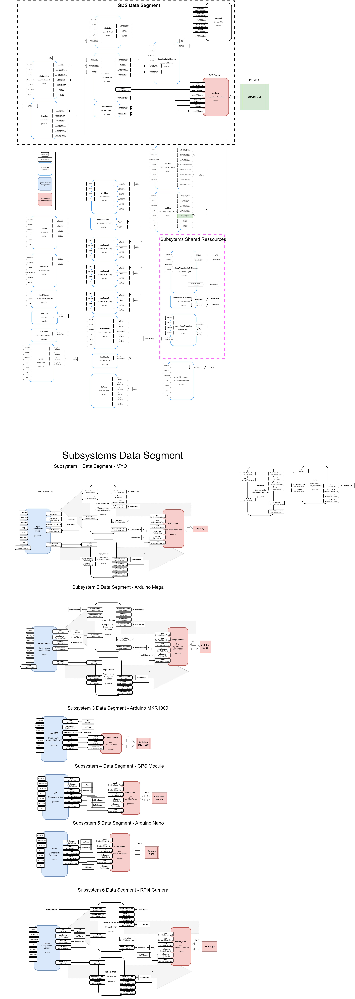
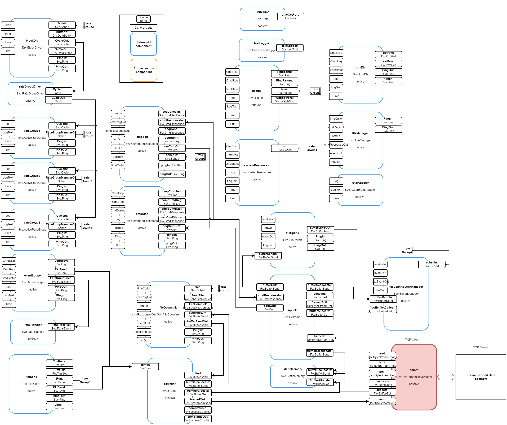

# MESMO 
## Modular Embedded Systems Management and Orchestration project

In the ever-evolving landscape of aerospace engineering and mission-critical operations, the MESMO (Modular Embedded Systems framework for Mission Operations) project stands as a robust and adaptable solution designed to address the complexities of orchestrating a multitude of subsystems. In the pursuit of streamlined communication, MESMO leverages the *F’* (pronounced *f prime*) software framework, a modular and scalable framework tailored for the harsh demands of space missions.

The Objective of this project is to study in depth the *F'* framework and assess whether it could be used for real time embedded systems orchestration and management for ground applications. To do so, the MESMO project combines a diverse array of hardware components collaborates coherently, creating an integrated ecosystem. Arduino-based microcontrollers, GPS modules, imaging systems, and other specialized devices work in unison, forming a network orchestrated by a Raspberry Pi 4. This central processing unit serves as the nucleus, communicating with each subsystem through a combination of UART, I2C, and TCP protocols.

To comprehensively assess the MESMO project's performance and communication efficiency, a meticulously crafted testbench has been implemented. This testbench analysis various scenarios and subsystem configurations, particularly focusing on the time elapsed from message reception to command execution. 

[Functional Video](https://www.youtube.com/watch?v=4ISu5jYeB7Q&ab_channel=JoaquimSilveira)

[Research Paper](https://drive.google.com/file/d/1KU-fd9dzQs_Eaz5O2uu-f7RJc5SqWHSU/view?usp=drive_link)

<table>
  <tr>
    <td align="center"></td>
    <td align="center"></td>
  </tr>
  <tr>
    <td align="center"></td>
    <td align="center"></td>
  </tr>
</table>

## Subsystems 
### Robotic Arm and MYO Armband

### Arduino Nano and LEDs

### Arduino MKR1000 and distance sensor

### Raspberry Pi Camera

## Topologies
### RPi4 Topology

### Ref Topology

